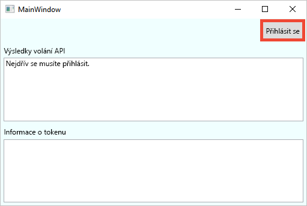
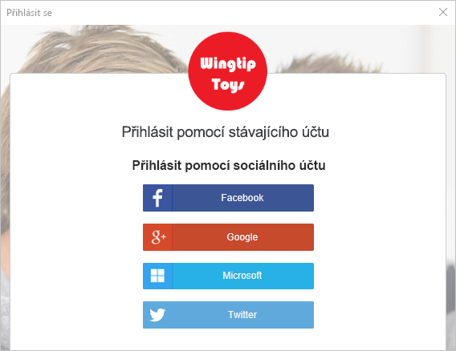
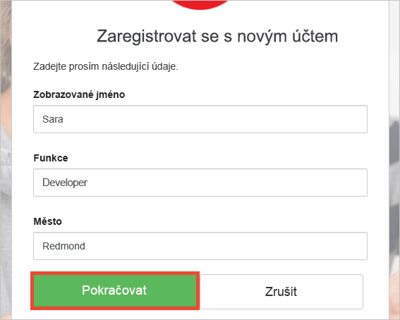
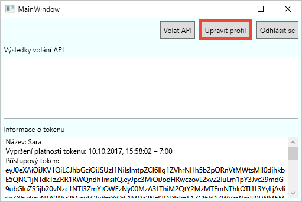
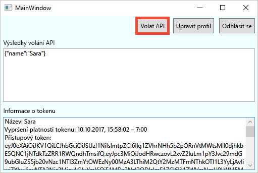

# <a name="quickstart-test-drive-an-azure-ad-b2c-enabled-desktop-app"></a>Rychlý start: Testovací verze desktopové aplikace s povolenou službou Azure AD B2C

Azure Active Directory (Azure AD) B2C poskytuje správu cloudových identit pro zajištění ochrany vašich aplikací, firmy a zákazníků. Azure AD B2C umožňuje aplikacím provádět ověřování účtů na sociálních sítích a podnikových účtů s využitím protokolů s otevřenými standardy.

V tomto rychlém startu použijete ukázkovou desktopovou aplikaci WPF (Windows Presentation Foundation) s povolenou službou Azure AD B2C k přihlášení pomocí zprostředkovatele sociální identity a zavolání webového rozhraní API chráněného službou Azure AD B2C.

[!INCLUDE [quickstarts-free-trial-note](../../includes/quickstarts-free-trial-note.md)]

## <a name="prerequisites"></a>Požadavky

* Sada [Visual Studio 2017](https://www.visualstudio.com/downloads/) se sadou funkcí **Vývoj pro ASP.NET a web**. 
* Účet na sociální síti Facebook, Google, Microsoft nebo Twitter.

## <a name="download-the-sample"></a>Stažení ukázky

[Stáhněte soubor .zip](https://github.com/Azure-Samples/active-directory-b2c-dotnet-desktop/archive/master.zip) nebo naklonujte ukázkovou webovou aplikaci z GitHubu.

```
git clone https://github.com/Azure-Samples/active-directory-b2c-dotnet-desktop.git
```

## <a name="run-the-app-in-visual-studio"></a>Spuštění aplikace v sadě Visual Studio

V sadě Visual Studio otevřete řešení `active-directory-b2c-wpf.sln` ze složky projektu ukázkové aplikace.

Stisknutím klávesy **F5** spusťte ladění aplikace.

## <a name="create-an-account"></a>Vytvoření účtu

Kliknutím na **Sign in** (Přihlásit se) spusťte pracovní postup **Registrace nebo přihlášení** na základě zásady Azure AD B2C.



Ukázka podporuje několik možností registrace, včetně použití zprostředkovatele sociální identity nebo vytvoření místního účtu pomocí e-mailové adresy. Pro účely tohoto rychlého startu použijte účet zprostředkovatele sociální identity Facebook, Google, Microsoft nebo Twitter. 

### <a name="sign-up-using-a-social-identity-provider"></a>Registrace pomocí zprostředkovatele sociální identity

Azure AD B2C zobrazí v ukázkové webové aplikaci vlastní přihlašovací stránku pro fiktivní značku Wingtip Toys. 

1. Pokud se chcete přihlásit pomocí zprostředkovatele sociální identity, klikněte na tlačítko zprostředkovatele sociální identity, kterého chcete použít. 

    

    Ověříte (přihlásíte) se pomocí přihlašovacích údajů ke svému účtu na sociální síti a autorizujete aplikaci ke čtení informací z tohoto účtu. Díky udělení přístupu může aplikace z účtu na sociální síti načíst informace o profilu, jako je vaše jméno a město. 

2. Dokončete proces přihlašování příslušného zprostředkovatele identity. Pokud jste například zvolili Twitter, zadejte své přihlašovací údaje k Twitteru a klikněte na **Přihlásit se**.

    

    Podrobnosti o vašem novém profilu účtu se předvyplní informacemi z vašeho účtu na sociální síti. 

3. Pokud chcete, upravte podrobnosti, a klikněte na **Pokračovat**. Hodnoty, které zadáte, se použijí pro váš profil uživatelského účtu Azure AD B2C.

    

    Úspěšně jste vytvořili nový uživatelský účet Azure AD B2C, který využívá zprostředkovatele identity. Po přihlášení se v textovém poli *Token info* (Informace o tokenu) zobrazí přístupový token. Přístupový token se používá pro přístup k prostředku rozhraní API.

## <a name="edit-your-profile"></a>Úprava profilu

Azure Active Directory B2C poskytuje funkci, která uživatelům umožňuje aktualizovat své profily.  Ukázková webová aplikace pro tento pracovní postup využívá zásady úprav profilu Azure AD B2C. 

1. Klikněte na **Edit profile** (Upravit profil) a upravte profil, který jste vytvořili.

    

2. Zvolte zprostředkovatele identity přidruženého k účtu, který jste vytvořili. Pokud jste například při vytváření účtu jako zprostředkovatele identity použili Twitter, zvolte Twitter a upravte podrobnosti o přidruženém profilu.

3. Změňte své **Zobrazované jméno** nebo **Město** a klikněte na **Pokračovat**.

    V textovém poli *Token info* (Informace o tokenu) se zobrazí nový přístupový token. Pokud chcete ověřit změny profilu, zkopírujte přístupový token a vložte ho do dekodéru tokenů na adrese https://jwt.ms.

## <a name="access-a-protected-web-api-resource"></a>Přístup k chráněnému prostředku webového rozhraní API

Kliknutím na **Call API** (Zavolat rozhraní API) vytvořte požadavek na prostředek https://fabrikamb2chello.azurewebsites.net/hello chráněný službou Azure AD B2C. 



Aplikace do požadavku na chráněný prostředek webového rozhraní API zahrne přístupový token Azure AD. Webové rozhraní API odešle zpět zobrazované jméno obsažené v přístupovém tokenu.

Úspěšně jste pomocí svého uživatelského účtu Azure AD B2C provedli autorizované zavolání webového rozhraní API chráněného službou Azure AD B2C.

## <a name="clean-up-resources"></a>Vyčištění prostředků

Svého tenanta Azure AD B2C můžete použít i k vyzkoušení dalších kurzů nebo rychlých startů pro Azure AD B2C. Jakmile už ho nebudete potřebovat, můžete [svého tenanta Azure AD B2C odstranit](active-directory-b2c-faqs.md#how-do-i-delete-my-azure-ad-b2c-tenant).

## <a name="next-steps"></a>Další kroky

Dalším krokem je vytvoření vlastního tenanta Azure AD B2C a konfigurace ukázky tak, aby se spouštěla s použitím tohoto tenanta. 

> [!div class="nextstepaction"]
> [Vytvoření tenanta Azure Active Directory B2C na webu Azure Portal](active-directory-b2c-get-started.md)
