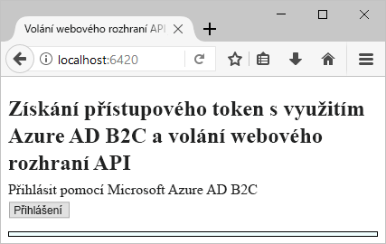
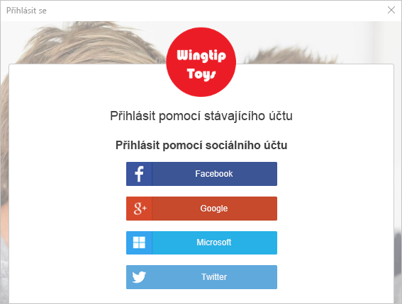
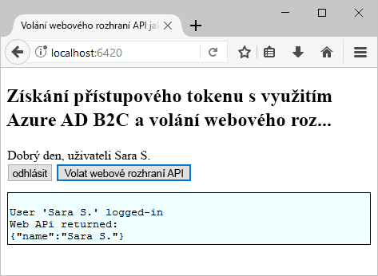

# <a name="quickstart-set-up-sign-in-for-a-single-page-app-using-azure-active-directory-b2c"></a>Rychlý úvod: Nastavení přihlášení pro jednostránkové aplikace pomocí Azure Active Directory B2C

Azure Active Directory (Azure AD) B2C poskytuje správu cloudových identit pro zajištění ochrany vašich aplikací, firmy a zákazníků. Azure AD B2C umožňuje aplikacím provádět ověřování účtů na sociálních sítích a podnikových účtů s využitím protokolů s otevřenými standardy.

V tomto rychlém startu použijete ukázkovou jednostránkovou aplikaci s povolenou službou Azure AD B2C k přihlášení pomocí zprostředkovatele sociální identity a zavolání webového rozhraní API chráněného službou Azure AD B2C.

[!INCLUDE [quickstarts-free-trial-note](../../includes/quickstarts-free-trial-note.md)]

## <a name="prerequisites"></a>Požadavky

* Sada [Visual Studio 2017](https://www.visualstudio.com/downloads/) se sadou funkcí **Vývoj pro ASP.NET a web**.
* Instalovat [Node.js](https://nodejs.org/en/download/)
* Účet na sociální síti Facebook, Google, Microsoft nebo Twitter.

## <a name="download-the-sample"></a>Stažení ukázky

[Stáhněte soubor .zip](https://github.com/Azure-Samples/active-directory-b2c-javascript-msal-singlepageapp/archive/master.zip) nebo naklonujte ukázkovou webovou aplikaci z GitHubu.

```
git clone https://github.com/Azure-Samples/active-directory-b2c-javascript-msal-singlepageapp.git
```

## <a name="run-the-sample-application"></a>Spuštění ukázkové aplikace

Spusťte tuto ukázku z příkazového řádku Node.js: 

```
cd active-directory-b2c-javascript-msal-singlepageapp
npm install && npm update
node server.js
```

Aplikace Node.js vrátí číslo portu, na kterém naslouchá na místním hostiteli.

```
Listening on port 6420...
```

Ve webovém prohlížeči přejděte na adresu URL aplikace `http://localhost:6420`.



## <a name="create-an-account"></a>Vytvoření účtu

Kliknutím na tlačítko **Login** (Přihlášení) spusťte pracovní postup Azure AD B2C **Registrace nebo přihlášení** na základě zásady Azure AD B2C. 

Ukázka podporuje několik možností registrace, včetně použití zprostředkovatele sociální identity nebo vytvoření místního účtu pomocí e-mailové adresy. Pro účely tohoto rychlého startu použijte účet zprostředkovatele sociální identity Facebook, Google, Microsoft nebo Twitter. 

### <a name="sign-up-using-a-social-identity-provider"></a>Registrace pomocí zprostředkovatele sociální identity

Azure AD B2C zobrazí v ukázkové webové aplikaci vlastní přihlašovací stránku pro fiktivní značku Wingtip Toys. 

1. Pokud se chcete přihlásit pomocí zprostředkovatele sociální identity, klikněte na tlačítko zprostředkovatele sociální identity, kterého chcete použít.

    

    Ověříte (přihlásíte) se pomocí přihlašovacích údajů ke svému účtu na sociální síti a autorizujete aplikaci ke čtení informací z tohoto účtu. Díky udělení přístupu může aplikace z účtu na sociální síti načíst informace o profilu, jako je vaše jméno a město. 

2. Dokončete proces přihlašování příslušného zprostředkovatele identity. Pokud jste například zvolili Twitter, zadejte své přihlašovací údaje k Twitteru a klikněte na **Přihlásit se**.

    

    Podrobnosti o vašem novém profilu účtu se předvyplní informacemi z vašeho účtu na sociální síti. 

3. Aktualizujte pole Zobrazované jméno, Pozice a Město a klikněte na **Pokračovat**.  Hodnoty, které zadáte, se použijí pro váš profil uživatelského účtu Azure AD B2C.

    Úspěšně jste vytvořili nový uživatelský účet Azure AD B2C, který využívá zprostředkovatele identity. 

## <a name="access-a-protected-web-api-resource"></a>Přístup k chráněnému prostředku webového rozhraní API

Klikněte na tlačítko **Call Web API** (Zavolat webové rozhraní API), aby se ze zavolání webového rozhraní API vrátilo vaše zobrazované jméno jako objekt JSON. 



Ukázková jednostránková aplikace do požadavku na chráněný prostředek webového rozhraní API, aby provedl operaci vrácení objektu JSON, zahrne přístupový token Azure AD.

## <a name="clean-up-resources"></a>Vyčištění prostředků

Svého tenanta Azure AD B2C můžete použít i k vyzkoušení dalších kurzů nebo rychlých startů pro Azure AD B2C. Jakmile už ho nebudete potřebovat, můžete [svého tenanta Azure AD B2C odstranit](active-directory-b2c-faqs.md#how-do-i-delete-my-azure-ad-b2c-tenant).

## <a name="next-steps"></a>Další postup

V tomto rychlém startu jste použili ukázkovou aplikaci ASP.NET s povolenou službou Azure AD B2C k přihlášení pomocí vlastní přihlašovací stránky, přihlášení pomocí zprostředkovatele sociální identity, vytvoření účtu Azure AD B2C a zavolání webového rozhraní API chráněného službou Azure AD B2C. 

Dalším krokem je vytvoření vlastního tenanta Azure AD B2C a konfigurace ukázky tak, aby se spouštěla s použitím tohoto tenanta. 

> [!div class="nextstepaction"]
> [Vytvoření tenanta Azure Active Directory B2C na webu Azure Portal](active-directory-b2c-get-started.md)