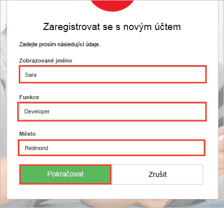

# <a name="quickstart-test-drive-an-azure-ad-b2c-enabled-web-app"></a>Rychlý start: Testovací verze webové aplikace s povolenou službou Azure AD B2C

Azure Active Directory (Azure AD) B2C poskytuje správu cloudových identit pro zajištění ochrany vašich aplikací, firmy a zákazníků. Azure AD B2C umožňuje aplikacím provádět ověřování účtů na sociálních sítích a podnikových účtů s využitím protokolů s otevřenými standardy.

V tomto rychlém startu použijete ukázkovou aplikaci ASP.NET s povolenou službou Azure AD B2C k přihlášení pomocí zprostředkovatele sociální identity a zavolání webového rozhraní API chráněného službou Azure AD B2C.

[!INCLUDE [quickstarts-free-trial-note](../../includes/quickstarts-free-trial-note.md)]

## <a name="prerequisites"></a>Požadavky

* Sada [Visual Studio 2017](https://www.visualstudio.com/downloads/) se sadou funkcí **Vývoj pro ASP.NET a web**. 
* Účet na sociální síti Facebook, Google, Microsoft nebo Twitter.

## <a name="download-the-sample"></a>Stažení ukázky

[Stáhněte soubor .zip](https://github.com/Azure-Samples/active-directory-b2c-dotnet-webapp-and-webapi/archive/master.zip) nebo naklonujte ukázkovou webovou aplikaci z GitHubu.

```
git clone https://github.com/Azure-Samples/active-directory-b2c-dotnet-webapp-and-webapi.git
```

## <a name="run-the-app-in-visual-studio"></a>Spuštění aplikace v sadě Visual Studio

V sadě Visual Studio otevřete řešení `B2C-WebAPI-DotNet.sln` ze složky projektu ukázkové aplikace.

Ukázkové řešení obsahuje dva projekty:

**Ukázková webová aplikace (TaskWebApp):** Webová aplikace umožňující vytvoření a úpravy seznamu úkolů. Tato webová aplikace používá k registraci nebo přihlašování uživatelů zásady **registrace nebo přihlašování**.

**Ukázková aplikace webového rozhraní API (TaskService):** Webové rozhraní API, které podporuje funkce vytvoření, čtení, aktualizace a odstranění seznamu úkolů. Toto webové rozhraní API je chráněné službou Azure AD B2C a volané webovou aplikací.

Pro účely tohoto rychlého startu spustíte oba projekty `TaskWebApp` a `TaskService` najednou. 

1. V Průzkumníku řešení vyberte řešení `B2C-WebAPI-DotNet`.
2. V nabídce sady Visual Studio vyberte **Projekt > Nastavit projekty po spuštění**. 
3. Vyberte přepínač **Více projektů po spuštění**.
4. U obou projektů změňte hodnotu **Akce** na **Spustit**. Klikněte na **OK**.

Stisknutím klávesy **F5** spusťte ladění obou aplikací. Obě aplikace se otevřou na samostatné kartě prohlížeče:

`https://localhost:44316/` – Tato stránka je webová aplikace ASP.NET. V tomto rychlém startu pracujete přímo s touto aplikací.
`https://localhost:44332/` – Tato stránka je webové rozhraní API volané webovou aplikací ASP.NET.

## <a name="create-an-account"></a>Vytvoření účtu

Kliknutím na odkaz **Sign up / Sign in** (Registrace / Přihlášení) ve webové aplikaci ASP.NET spusťte pracovní postup **Registrace nebo přihlášení** na základě zásady Azure AD B2C.


Ukázka podporuje několik možností registrace, včetně použití zprostředkovatele sociální identity nebo vytvoření místního účtu pomocí e-mailové adresy. Pro účely tohoto rychlého startu použijte účet zprostředkovatele sociální identity Facebook, Google, Microsoft nebo Twitter. 

### <a name="sign-up-using-a-social-identity-provider"></a>Registrace pomocí zprostředkovatele sociální identity

Azure AD B2C zobrazí v ukázkové webové aplikaci vlastní přihlašovací stránku pro fiktivní značku Wingtip Toys. 

1. Pokud se chcete přihlásit pomocí zprostředkovatele sociální identity, klikněte na tlačítko zprostředkovatele sociální identity, kterého chcete použít.

    

    Ověříte (přihlásíte) se pomocí přihlašovacích údajů ke svému účtu na sociální síti a autorizujete aplikaci ke čtení informací z tohoto účtu. Díky udělení přístupu může aplikace z účtu na sociální síti načíst informace o profilu, jako je vaše jméno a město. 

2. Dokončete proces přihlašování příslušného zprostředkovatele identity. Pokud jste například zvolili Twitter, zadejte své přihlašovací údaje k Twitteru a klikněte na **Přihlásit se**.

    

    Podrobnosti o vašem novém profilu účtu Azure AD B2C se předvyplní informacemi z vašeho účtu na sociální síti.

3. Aktualizujte pole Zobrazované jméno, Pozice a Město a klikněte na **Pokračovat**.  Hodnoty, které zadáte, se použijí pro váš profil uživatelského účtu Azure AD B2C.

    

    Úspěšně jste použili ukázkovou webovou aplikaci, která využívá zásadu Azure AD B2C, k ověření pomocí zprostředkovatele identity a vytvoření uživatelského účtu Azure AD B2C. 

## <a name="edit-your-profile"></a>Úprava profilu

Azure Active Directory B2C poskytuje funkci, která uživatelům umožňuje aktualizovat své profily. Ukázková webová aplikace pro tento pracovní postup využívá zásady úprav profilu Azure AD B2C. 

1. Na řádku nabídek webové aplikace klikněte na název vašeho profilu a vyberte **Edit profile** (Upravit profil), abyste mohli upravit svůj vytvořený profil.

    

2. Změňte své **Zobrazované jméno** a **Město**.  
3. Kliknutím na **Pokračovat** aktualizujte svůj profil. Nové zobrazované jméno se zobrazí v pravé horní části domovské stránky webové aplikace.

## <a name="access-a-protected-web-api-resource"></a>Přístup k chráněnému prostředku webového rozhraní API

1. Klikněte na **To-Do List** (Seznam úkolů), abyste mohli zadat a upravit položky vašeho seznamu úkolů. 

2. Zadejte text do textového pole **New Item** (Nová položka). Klikněte na **Add** (Přidat). Zavolá se webové rozhraní API chráněné službou Azure AD B2C, které přidá položku seznamu úkolů.

    

    Webová aplikace ASP.NET do požadavku na chráněný prostředek webového rozhraní API, aby provedl operace s položkami seznamu úkolů uživatele, zahrne přístupový token Azure AD.

Úspěšně jste pomocí svého uživatelského účtu Azure AD B2C provedli autorizované zavolání webového rozhraní API chráněného službou Azure AD B2C.

## <a name="clean-up-resources"></a>Vyčištění prostředků

Svého tenanta Azure AD B2C můžete použít i k vyzkoušení dalších kurzů nebo rychlých startů pro Azure AD B2C. Jakmile už ho nebudete potřebovat, můžete [svého tenanta Azure AD B2C odstranit](active-directory-b2c-faqs.md#how-do-i-delete-my-azure-ad-b2c-tenant).

## <a name="next-steps"></a>Další kroky

V tomto rychlém startu jste použili ukázkovou aplikaci ASP.NET s povolenou službou Azure AD B2C k přihlášení pomocí vlastní přihlašovací stránky, přihlášení pomocí zprostředkovatele sociální identity, vytvoření účtu Azure AD B2C a zavolání webového rozhraní API chráněného službou Azure AD B2C. 

Pokračujte k dalšímu kurzu, kde se dozvíte, jak ukázku v ASP.NET nakonfigurovat tak, aby používala vašeho vlastního tenanta Azure AD B2C.

> [!div class="nextstepaction"]
> [Kurz: Ověřování uživatelů pomocí Azure Active Directory B2C ve webové aplikaci ASP.NET](active-directory-b2c-tutorials-web-app.md)