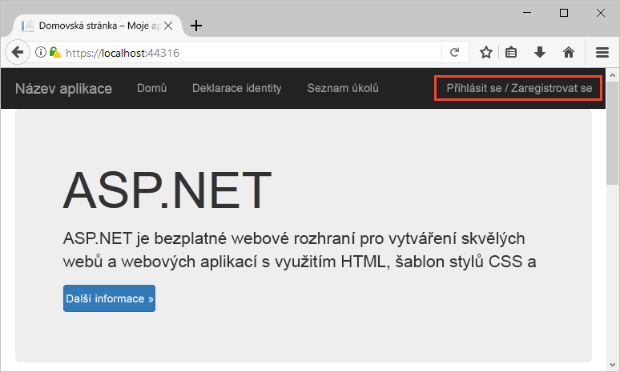
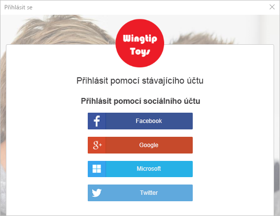
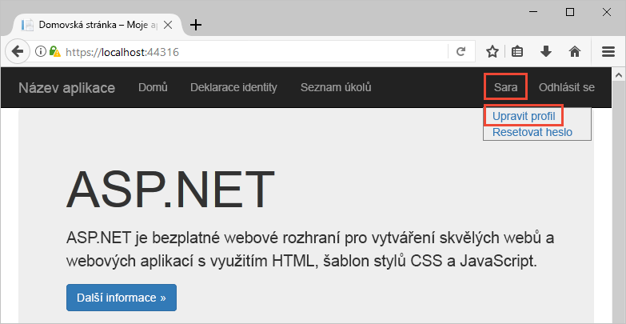
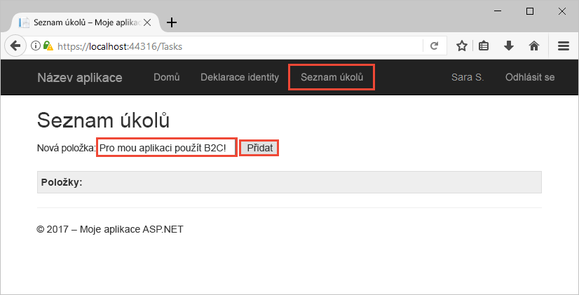

# <a name="quickstart-set-up-sign-in-for-an-aspnet-application-using-azure-active-directory-b2c"></a>Rychlý start: Nastavení přihlášení pro aplikaci ASP.NET pomocí služby Azure Active Directory B2C

Azure Active Directory (Azure AD) B2C poskytuje správu cloudových identit pro zajištění ochrany vašich aplikací, firmy a zákazníků. Azure AD B2C umožňuje aplikacím provádět ověřování účtů na sociálních sítích a podnikových účtů s využitím protokolů s otevřenými standardy. V tomto rychlém startu použijete aplikaci ASP.NET k přihlášení pomocí zprostředkovatele sociální identity a zavolání webového rozhraní API chráněného službou Azure AD B2C.

[!INCLUDE [quickstarts-free-trial-note](../../includes/quickstarts-free-trial-note.md)]

## <a name="prerequisites"></a>Požadavky

- Sada [Visual Studio 2017](https://www.visualstudio.com/downloads/) se sadou funkcí **Vývoj pro ASP.NET a web**. 
- Účet na sociální síti Facebook, Google, Microsoft nebo Twitter.
- [Stáhněte soubor .zip](https://github.com/Azure-Samples/active-directory-b2c-dotnet-webapp-and-webapi/archive/master.zip) nebo naklonujte ukázkovou webovou aplikaci z GitHubu.

    ```
    git clone https://github.com/Azure-Samples/active-directory-b2c-dotnet-webapp-and-webapi.git
    ```

    Ukázkové řešení obsahuje tyto dva projekty:

    - **TaskWebApp** – Webová aplikace pro vytvoření a úpravy seznamu úkolů. Tato webová aplikace používá k registraci nebo přihlašování uživatelů zásady **registrace nebo přihlašování**.
    - **TaskService** – Webové rozhraní API, které podporuje funkce vytvoření, čtení, aktualizace a odstranění seznamu úkolů. Toto webové rozhraní API je chráněné službou Azure AD B2C a volané webovou aplikací.

## <a name="run-the-application-in-visual-studio"></a>Spuštění aplikace v sadě Visual Studio

1. V sadě Visual Studio otevřete řešení **B2C-WebAPI-DotNet.sln** ze složky projektu ukázkové aplikace.
2. Pro účely tohoto rychlého startu spustíte oba projekty **TaskWebApp** a **TaskService** najednou. V Průzkumníku řešení klikněte pravým tlačítkem na řešení **B2C-WebAPI-DotNet** a vyberte **Nastavit projekty po spuštění**. 
3. Vyberte **Více projektů po spuštění** a u obou projektů změňte **akci** na **Spuštění**. 
4. Klikněte na **OK**.
5. Stisknutím klávesy **F5** spusťte ladění obou aplikací. Obě aplikace se otevřou na samostatné kartě prohlížeče:

    - `https://localhost:44316/` – Webová aplikace ASP.NET. V tomto rychlém startu pracujete přímo s touto aplikací.
    - `https://localhost:44332/` – Webové rozhraní API volané webovou aplikací ASP.NET.

## <a name="sign-in-using-your-account"></a>Přihlášení pomocí vašeho účtu

1. Kliknutím na **Sign up / Sign in** (Registrace / Přihlášení) ve webové aplikaci ASP.NET spusťte pracovní postup.

    

    Ukázka podporuje několik možností registrace, včetně použití zprostředkovatele sociální identity nebo vytvoření místního účtu pomocí e-mailové adresy. Pro účely tohoto rychlého startu použijte účet zprostředkovatele sociální identity Facebook, Google, Microsoft nebo Twitter.

2. Azure AD B2C zobrazí v ukázkové webové aplikaci vlastní přihlašovací stránku pro fiktivní značku Wingtip Toys. Pokud se chcete přihlásit pomocí zprostředkovatele sociální identity, klikněte na tlačítko zprostředkovatele sociální identity, kterého chcete použít.

    

    Ověříte (přihlásíte) se pomocí přihlašovacích údajů ke svému účtu na sociální síti a autorizujete aplikaci ke čtení informací z tohoto účtu. Díky udělení přístupu může aplikace z účtu na sociální síti načíst informace o profilu, jako je vaše jméno a město. 

3. Dokončete proces přihlašování příslušného zprostředkovatele identity.

## <a name="edit-your-profile"></a>Úprava profilu

Azure Active Directory B2C poskytuje funkci, která uživatelům umožňuje aktualizovat své profily. Ukázková webová aplikace pro tento pracovní postup využívá zásady úprav profilu Azure AD B2C. 

1. Na řádku nabídek aplikace klikněte na název vašeho profilu a vyberte **Edit profile** (Upravit profil), abyste mohli upravit svůj vytvořený profil.

    

2. Změňte **Display name** (Zobrazované jméno) nebo **City** (Město) a pak kliknutím na **Continue** (Pokračovat) svůj profil aktualizujte. 

    Změny se zobrazí v pravé horní části domovské stránky webové aplikace.

## <a name="access-a-protected-api-resource"></a>Přístup k chráněnému prostředku rozhraní API

1. Klikněte na **To-Do List** (Seznam úkolů), abyste mohli zadat a upravit položky vašeho seznamu úkolů. 

2. Zadejte text do textového pole **New Item** (Nová položka). Klikněte na **Add** (Přidat). Zavolá se webové rozhraní API chráněné službou Azure AD B2C, které přidá položku seznamu úkolů.

    

    Webová aplikace ASP.NET do požadavku na chráněný prostředek webového rozhraní API, aby provedl operace s položkami seznamu úkolů uživatele, zahrne přístupový token Azure AD.

Úspěšně jste pomocí svého uživatelského účtu Azure AD B2C provedli autorizované zavolání webového rozhraní API chráněného službou Azure AD B2C.

## <a name="clean-up-resources"></a>Vyčištění prostředků

Svého tenanta Azure AD B2C můžete použít i k vyzkoušení dalších kurzů nebo rychlých startů pro Azure AD B2C. Jakmile už ho nebudete potřebovat, můžete [svého tenanta Azure AD B2C odstranit](active-directory-b2c-faqs.md#how-do-i-delete-my-azure-ad-b2c-tenant).

## <a name="next-steps"></a>Další kroky

V tomto rychlém startu jste použili ukázkovou aplikaci ASP.NET k přihlášení pomocí vlastní přihlašovací stránky, přihlášení pomocí zprostředkovatele sociální identity, vytvoření účtu Azure AD B2C a zavolání webového rozhraní API chráněného službou Azure AD B2C. 

Začněte s vytvářením vlastního tenanta Azure AD B2C.

> [!div class="nextstepaction"]
> [Vytvoření tenanta Azure Active Directory B2C na webu Azure Portal](tutorial-create-tenant.md)