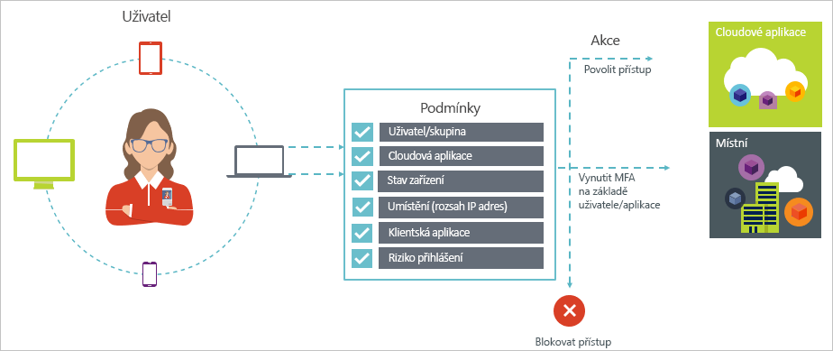
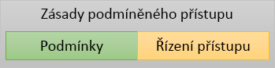

# Co je podmíněný přístup v Azure Active Directory?

Zabezpečení je největší starostí organizací, které využívají cloud. Při správě cloudových prostředků jsou klíčovým aspektem zabezpečení cloudu identita a přístup. Ve světě orientovaném na mobilní zařízení a cloud můžou uživatelé přistupovat k prostředkům vaší organizace odkudkoli pomocí různých zařízení a aplikací. Proto už nestačí soustředit se na to, kdo má přístup k prostředku. Pokud chcete zajistit optimální rovnováhu mezi zabezpečením a produktivitou, musíte při rozhodování o udělení přístupu zohlednit také způsob přístupu k prostředku. Tento požadavek můžete vyřešit pomocí podmíněného přístupu služby Azure AD. Podmíněný přístup je funkce služby Azure Active Directory. S využitím podmíněného přístupu můžete implementovat automatizované rozhodování ohledně řízení přístupu k vašim cloudovým aplikacím na základě podmínek. 

Tento článek poskytuje koncepční přehled podmíněného přístupu ve službě Azure AD.

## Obvyklé scénáře

Ve světě orientovaném na mobilní zařízení a cloud umožňuje Azure Active Directory jednotné přihlašování odkudkoli k zařízením, aplikacím a službám. S čím dál větším rozšířením zařízení (včetně používání vlastních zařízení), práce mimo podnikové sítě a aplikací SaaS třetích stran před vámi stojí dva protikladné cíle:

- Umožnit uživatelům být produktivní kdykoli a kdekoli
- Zajistit nepřetržitou ochranu podnikových prostředků

S využitím zásad podmíněného přístupu můžete implementovat správné řízení přístupu v závislosti na požadovaných podmínkách. Podmíněný přístup služby Azure AD poskytuje v případě potřeby dodatečné zabezpečení a neplete se uživatelům do cesty, když to není potřeba. 

Následuje několik běžných problémů s přístupem, se kterými vám podmíněný přístup může pomoct:

- **[Riziko přihlášení:](conditional-access/conditions.md#sign-in-risk)** Azure AD Identity Protection rozpoznává rizika přihlášení. Jak omezit přístup, pokud zjištěné riziko přihlášení značí pochybného aktéra? Co kdybyste chtěli získat přesvědčivější důkazy o tom, že přihlášení provedl legitimní uživatel? Co když jsou vaše pochybnosti dostatečně silné na to, abyste určitým uživatelům chtěli dokonce zablokovat přístup k aplikaci? Můžete nakonfigurovat 

- **[Síťové umístění:](conditional-access/location-condition.md)** Služba Azure AD je přístupná odkudkoli. Co když k pokusu o získání přístupu dojde ze síťového umístění, které není pod kontrolou vašeho oddělení IT? Kombinace uživatelského jména a hesla může být dostatečným dokladem identity pro pokusy o získání přístupu k vašim prostředkům z vaší podnikové sítě. Co když požadujete silnější doklad identity pro pokusy o získání přístupu, ke kterým dojde z neočekávaných zemí nebo oblastí světa? Co když dokonce chcete zablokovat pokusy o získání přístupu z určitých oblastí?  

- **[Správa zařízení:](conditional-access/conditions.md#device-platforms)** Ve službě Azure AD můžou uživatelé přistupovat ke cloudovým aplikacím z široké škály zařízení, včetně mobilních a také osobních zařízení. Co když požadujete, aby se pokusy o získání přístupu mohly provádět pouze na zařízeních, která spravuje vaše oddělení IT? Co když chcete určitým zařízením dokonce zablokovat přístup ke cloudovým aplikacím ve vašem prostředí? 

- **[Klientská aplikace:](conditional-access/conditions.md#client-apps)** V současné době můžete přistupovat k mnoha cloudovým aplikacím různých typů, jako jsou například webové aplikace, mobilní aplikace nebo desktopové aplikace. Co když dojde k pokusu o získání přístupu pomocí typu klientské aplikace, který způsobuje známé problémy? Co když u určitých typů aplikací požadujete použití zařízení, které spravuje vaše oddělení IT? 

Tyto otázky a související odpovědi představují běžné scénáře přístupu pro podmíněný přístup služby Azure AD. Podmíněný přístup je funkce služby Azure Active Directory, která umožňuje zpracovávat scénáře přístupu na základě zásad.

## Zásady podmíněného přístupu

Zásada podmíněného přístupu představuje definici scénáře přístupu pomocí následujícího vzoru:

**Then do this** (Pak se provede toto) definuje reakci vaší zásady. Je důležité si uvědomit, že cílem zásady podmíněného přístupu není udělit přístup ke cloudové aplikaci. Ve službě Azure AD se udělování přístupu ke cloudovým aplikacím provádí prostřednictvím přiřazení uživatelů. Pomocí zásady podmíněného přístupu řídíte, jakým způsobem můžou autorizovaní uživatelé (uživatelé s uděleným přístupem ke cloudové aplikaci) přistupovat ke cloudovým aplikacím za určitých podmínek. V rámci reakce vynucujete další požadavky, jako je vícefaktorové ověřování, použití spravovaného zařízení a další. V kontextu podmíněného přístupu služby Azure AD se požadavky, které vaše zásady vynucují, označují jako řízení přístupu. V té nejvíce omezující podobě můžou vaše zásady blokovat přístup. Další informace najdete v tématu [Řízení přístupu v rámci podmíněného přístupu služby Azure Active Directory](conditional-access/controls.md).
     

**When this happens** (Když se stane toto) definuje důvod aktivace vaší zásady. Tento důvod je charakterizování skupinou splněných podmínek. V podmíněném přístupu služby Azure AD mají dvě podmínky přiřazení zvláštní roli:

- **[Uživatelé:](conditional-access/conditions.md#users-and-groups)** Uživatelé, kteří se pokoušejí o získání přístupu (**Kdo**). 

- **[Cloudové aplikace:](conditional-access/conditions.md#cloud-apps)** Cíle pokusů o získání přístupu (**Co**).    

Tyto dvě podmínky musí obsahovat každá zásada podmíněného přístupu. Kromě těchto dvou povinných podmínek můžete použít také další podmínky, které popisují způsob provedení pokusu o získání přístupu. Mezi běžné příklady patří použití mobilních zařízení nebo oblastí mimo vaši podnikovou síť. Další informace najdete v tématu [Podmínky v rámci podmíněného přístupu služby Azure Active Directory](conditional-access/conditions.md).   

Kombinace podmínek a řízení přístupu představuje zásadu podmíněného přístupu. 

Pomocí podmíněného přístupu služby Azure AD můžete řídit způsob, jakým můžou autorizovaní uživatelé přistupovat k vašim cloudovým aplikacím. Cílem zásady podmíněného přístupu je vynucovat u pokusů o získání přístupu ke cloudové aplikaci další řízení přístupu na základě způsobu provedení pokusu o získání přístupu.

Jednou z výhod využívání přístupu založeného na zásadách k ochraně přístupu ke cloudovým aplikacím je, že můžete začít navrhovat požadavky zásad pro vaše prostředí s využitím struktury popsané v tomto článku, aniž byste se museli starat o technickou implementaci. 

## Licenční požadavky pro využívání podmíněného přístupu

K využívání podmíněného přístupu se vyžaduje licence Azure AD Premium. Pokud chcete najít správnou licenci pro vaše požadavky, přečtěte si [porovnání obecně dostupných funkcí edic Free, Basic a Premium](https://azure.microsoft.com/pricing/details/active-directory/).

## Další kroky

- Tady najdete další informace:
    - Podmínky: viz [Podmínky v rámci podmíněného přístupu služby Azure Active Directory](conditional-access/conditions.md).

    - Řízení přístupu: viz [Řízení přístupu v rámci podmíněného přístupu služby Azure Active Directory](conditional-access/controls.md).

- Pokud se chcete seznámit s konfigurací zásad podmíněného přístupu, přečtěte si téma [Vyžadování MFA pro specifické aplikace pomocí podmíněného přístupu služby Azure Active Directory](conditional-access/app-based-mfa.md).

- Pokud jste připraveni nakonfigurovat zásady podmíněného přístupu pro vaše prostředí, přečtěte si [osvědčené postupy pro podmíněný přístup v Azure Active Directory](conditional-access/best-practices.md). 

- Pokud chcete podrobný plán nasazení s doporučenými zásadami, přečtěte si o [plánu nasazení podmíněného přístupu](http://aka.ms/conditionalaccessdeploymentplan).
