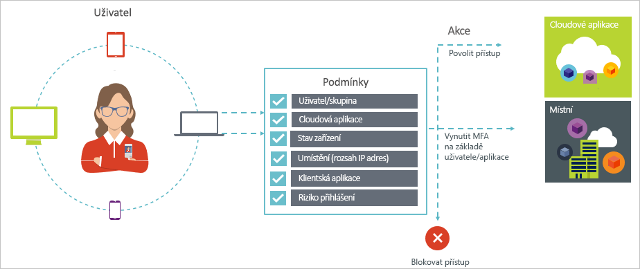
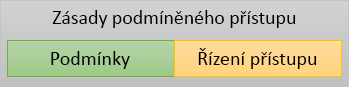

# Co je podmíněný přístup v Azure Active Directory?

Zabezpečení je největší starostí organizací, které využívají cloud. Při správě cloudových prostředků jsou klíčovým aspektem zabezpečení cloudu identita a přístup. Ve světě orientovaném na mobilní zařízení a cloud můžou uživatelé přistupovat k prostředkům vaší organizace odkudkoli pomocí různých zařízení a aplikací. Proto už nestačí soustředit se na to, kdo má přístup k prostředku. Pokud chcete zajistit optimální rovnováhu mezi zabezpečením a produktivitou, musíte při rozhodování o udělení přístupu zohlednit také způsob přístupu k prostředku. Tento požadavek můžete vyřešit pomocí podmíněného přístupu služby Azure Active Directory (Azure AD). Podmíněný přístup je funkce služby Azure Active Directory. S využitím podmíněného přístupu můžete implementovat automatizované rozhodování ohledně řízení přístupu k vašim cloudovým aplikacím na základě podmínek. 

Po dokončení první dvojúrovňové ověřování se vynucují zásady podmíněného přístupu. Proto podmíněného přístupu není určen jako první linií obrany řádku pro scénáře, jako jsou útoky s cílem odepření služeb (DoS), ale můžete využít signály z těchto událostí (například úroveň rizika přihlášení, umístění žádosti a tak dále) a zjistí přístup k.  

Tento článek poskytuje koncepční přehled podmíněného přístupu ve službě Azure AD.

## Obvyklé scénáře

Ve světě orientovaném na mobilní zařízení a cloud umožňuje Azure Active Directory jednotné přihlašování odkudkoli k zařízením, aplikacím a službám. S čím dál větším rozšířením zařízení (včetně používání vlastních zařízení), práce mimo podnikové sítě a aplikací SaaS třetích stran před vámi stojí dva protikladné cíle:

- Umožnit uživatelům být produktivní kdykoli a kdekoli
- Zajistit nepřetržitou ochranu podnikových prostředků

S využitím zásad podmíněného přístupu můžete implementovat správné řízení přístupu v závislosti na požadovaných podmínkách. Podmíněný přístup služby Azure AD poskytuje v případě potřeby dodatečné zabezpečení a neplete se uživatelům do cesty, když to není potřeba. 

Následuje několik běžných problémů s přístupem, se kterými vám podmíněný přístup může pomoct:

- **[Riziko přihlášení](conditions.md#sign-in-risk)**: Azure AD Identity Protection zjistí rizika přihlášení. Jak omezit přístup, pokud zjištěné riziko přihlášení značí pochybného aktéra? Co kdybyste chtěli získat přesvědčivější důkazy o tom, že přihlášení provedl legitimní uživatel? Co když jsou vaše pochybnosti dostatečně silné na to, abyste určitým uživatelům chtěli dokonce zablokovat přístup k aplikaci?  

- **[Síťové umístění](location-condition.md)**: Azure AD je přístupná odkudkoli. Co když k pokusu o získání přístupu dojde ze síťového umístění, které není pod kontrolou vašeho oddělení IT? Kombinace uživatelského jména a hesla může být dostatečným dokladem identity pro pokusy o získání přístupu z vaší podnikové sítě. Co když požadujete silnější doklad identity pro pokusy o získání přístupu, ke kterým dojde z neočekávaných zemí nebo oblastí světa? Co když dokonce chcete zablokovat pokusy o získání přístupu z určitých oblastí?  

- **[Správa zařízení](conditions.md#device-platforms)**: Ve službě Azure AD uživatelé můžou používat cloudové aplikace z širokou škálu zařízení včetně mobilních a také osobní zařízení. Co když požadujete, aby se pokusy o získání přístupu mohly provádět pouze na zařízeních, která spravuje vaše oddělení IT? Co když chcete určitým zařízením dokonce zablokovat přístup ke cloudovým aplikacím ve vašem prostředí? 

- **[Klientská aplikace](conditions.md#client-apps)**: V současné době můžete přistupovat mnoho cloudových aplikací s využitím různých typů aplikací jako jsou webové aplikace, mobilní aplikace nebo aplikace klasické pracovní plochy. Co když dojde k pokusu o získání přístupu pomocí typu klientské aplikace, který způsobuje známé problémy? Co když u určitých typů aplikací požadujete použití zařízení, které spravuje vaše oddělení IT? 

Tyto otázky a související odpovědi představují běžné scénáře přístupu pro podmíněný přístup služby Azure AD. Podmíněný přístup je funkce služby Azure Active Directory, která umožňuje zpracovávat scénáře přístupu na základě zásad.

  

> [!VIDEO https://www.youtube.com/embed/eLAYBwjCGoA]

## Zásady podmíněného přístupu

Zásada podmíněného přístupu představuje definici scénáře přístupu pomocí následujícího vzoru:

**Then do this** (Pak se provede toto) určuje reakci vaší zásady. Je důležité si uvědomit, že cílem zásady podmíněného přístupu není udělit přístup ke cloudové aplikaci. Ve službě Azure AD se udělování přístupu ke cloudovým aplikacím provádí prostřednictvím přiřazení uživatelů. Pomocí zásady podmíněného přístupu řídíte, jakým způsobem můžou autorizovaní uživatelé (uživatelé s uděleným přístupem ke cloudové aplikaci) přistupovat ke cloudovým aplikacím za určitých podmínek. V rámci reakce vynucujete další požadavky, jako je vícefaktorové ověřování, použití spravovaného zařízení a další. V kontextu podmíněného přístupu služby Azure AD se požadavky, které vaše zásady vynucují, označují jako řízení přístupu. V té nejvíce omezující podobě můžou vaše zásady blokovat přístup. Další informace najdete v tématu [Řízení přístupu v rámci podmíněného přístupu služby Azure Active Directory](controls.md).
     

**When this happens** (Když se stane toto) definuje důvod aktivace vaší zásady. Tento důvod je charakterizování skupinou splněných podmínek. V podmíněném přístupu služby Azure AD mají dvě podmínky přiřazení zvláštní roli:

- **[Uživatelé](conditions.md#users-and-groups)**: Uživatelé, provádí se pokus o přístup (**kdo**). 

- **[Cloudové aplikace](conditions.md#cloud-apps)**: Cíle pokus o přístup (**co**).    

Tyto dvě podmínky musí obsahovat každá zásada podmíněného přístupu. Kromě těchto dvou povinných podmínek můžete použít také další podmínky, které popisují způsob provedení pokusu o získání přístupu. Mezi běžné příklady patří použití mobilních zařízení nebo oblastí mimo vaši podnikovou síť. Další informace najdete v tématu [Podmínky v rámci podmíněného přístupu služby Azure Active Directory](conditions.md).   

Kombinace podmínek a řízení přístupu představuje zásadu podmíněného přístupu. 

Pomocí podmíněného přístupu služby Azure AD můžete řídit způsob, jakým můžou autorizovaní uživatelé přistupovat k vašim cloudovým aplikacím. Cílem zásady podmíněného přístupu je vynucovat u pokusů o získání přístupu ke cloudové aplikaci další řízení přístupu na základě způsobu provedení pokusu o získání přístupu.

Ochrana přístupu ke cloudovým aplikacím na základě zásad vám umožní začít navrhovat požadavky zásad pro vaše prostředí s využitím struktury popsané v tomto článku, aniž byste se museli starat o technickou implementaci. 

## Podmíněný přístup služby Azure AD a federované ověřování

Zásady podmíněného přístupu bez problémů fungují s [federovaným ověřováním](../../security/azure-ad-choose-authn.md#federated-authentication). Tato podpora zahrnuje všechny podporované podmínky a ovládací prvky a prostřednictvím [generování sestav Azure AD](../reports-monitoring/concept-sign-ins.md) poskytuje přehled o používání zásad na přihlášení aktivních uživatelů.

*Federované ověřování pomocí Azure AD* znamená, že ověřování uživatelů v Azure AD zpracovává důvěryhodná ověřovací služba. Důvěryhodná ověřovací služba je například Active Directory Federation Services (AD FS) nebo jakákoli jiná federační služba. V této konfiguraci se ve službě provádí primární ověřování uživatelů a Azure AD pak slouží k přihlašování k jednotlivým aplikacím. Podmíněný přístup služby Azure AD se uplatňuje před udělením přístupu k aplikaci, ke které uživatel přistupuje. 

Pokud nakonfigurovaná zásada podmíněného přístupu vyžaduje vícefaktorové ověřování, Azure AD ve výchozím nastavení využívá Azure MFA. Pokud k vícefaktorovému ověřování využíváte federační službu, můžete v Azure AD nakonfigurovat přesměrování do této federační služby v případě, že je potřeba vícefaktorové ověřování, a to nastavením parametru `-SupportsMFA` na hodnotu `$true` v [PowerShellu](https://docs.microsoft.com/powershell/module/msonline/set-msoldomainfederationsettings). Toto nastavení funguje pro služby federovaného ověřování, které podporují požadavky na ověřovací testy MFA vydané službou Azure AD pomocí `wauth= http://schemas.microsoft.com/claims/multipleauthn`.

Po přihlášení uživatele ke službě federovaného ověřování zpracuje Azure AD ostatní požadavky zásad, jako je dodržování předpisů u zařízení nebo schválená aplikace.

## Licenční požadavky pro využívání podmíněného přístupu

K využívání podmíněného přístupu se vyžaduje licence Azure AD Premium. Pokud chcete najít správnou licenci pro vaše požadavky, přečtěte si [porovnání obecně dostupných funkcí edic Free, Basic a Premium](https://azure.microsoft.com/pricing/details/active-directory/).

## Další postup

Zjistěte, jak implementovat podmíněný přístup ve vašem prostředí, najdete v článku [plánování nasazení podmíněného přístupu v Azure Active Directory](plan-conditional-access.md).

