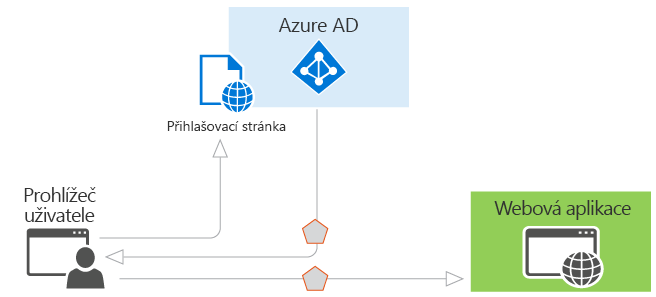
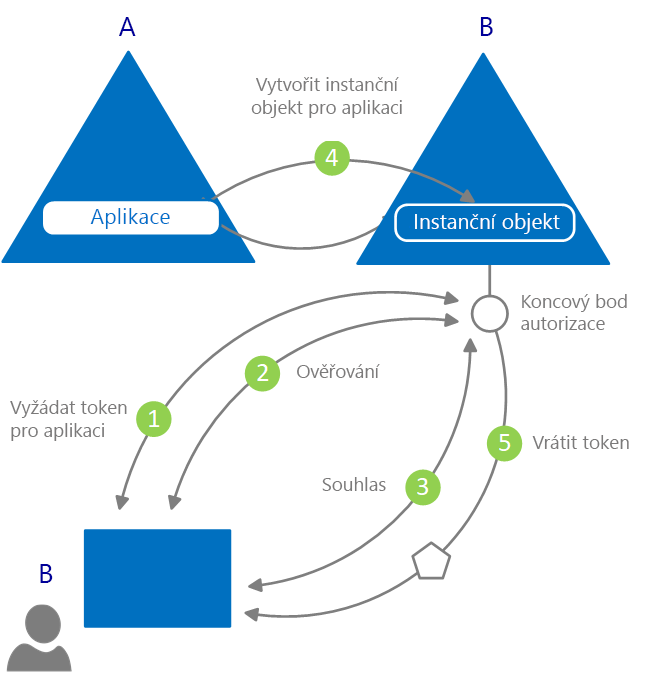

# Co je ověřování?

*Ověřování* je vyzvání jedné strany k dodání legitimních přihlašovacích údajů, čímž vzniká základ pro vytvoření objektu zabezpečení sloužícího k řízení identity a přístupu. Jednodušeji řečeno jde o proces prokázání, že jste skutečně tím, kým tvrdíte, že jste. V angličtině se pro ověřování někdy používá zkrácené slovo AuthN.

*Autorizace* je udělení oprávnění ověřenému objektu zabezpečení, aby mohl něco provést. Určuje, ke kterým datům máte povolený přístup a co s nimi můžete dělat. V angličtině se pro autorizaci někdy používá zkrácené slovo AuthZ.

Azure Active Directory (Azure AD) ověřování vývojářům aplikací zjednodušuje tím, že poskytuje identitu jako službu s podporou standardních protokolů, jako jsou OAuth 2.0 a OpenID Connect, a také opensourcových knihoven pro různé platformy. To vám pomůže rychle začít psát kód.

V modelu programování Azure AD existují dva hlavní případy použití:

* Během toku udělení autorizace OAuth 2.0 – když vlastník prostředku udělí autorizaci klientské aplikaci, čímž klientovi umožní přístup k prostředkům vlastníka prostředku.
* Během přístupu k prostředkům ze strany klienta – podle implementace serverem prostředků, využívání hodnot deklarace identity přítomných v přístupovém tokenu k rozhodování o řízení přístupu na jejich základě.

## Základy ověřování v Azure Active Directory

Představme si nejzákladnější scénář, ve kterém se vyžaduje identita: uživatel ve webovém prohlížeči se musí ověřit pro webovou aplikaci. Tento scénář je znázorněný na následujícím diagramu:

O různých komponentách na obrázku potřebujete vědět tohle:

* Azure AD je zprostředkovatelem identity. Zprostředkovatel identity je zodpovědný za ověření identity uživatelů a aplikací existujících v adresáři organizace a při úspěšném ověření těchto uživatelů a aplikací vydává tokeny zabezpečení.
* Aplikace, která chce ověřování provádět prostřednictvím Azure AD, musí být v Azure AD zaregistrovaná. Azure AD aplikaci zaregistruje a jednoznačně identifikuje v adresáři.
* Vývojáři můžou využívat opensourcové knihovny ověřování Azure AD, které ověřování usnadňují tím, že podrobnosti protokolu zpracují za vás. Další informace najdete v tématu Azure AD [knihovny pro ověřování v2.0](reference-v2-libraries.md) a [knihovny ověřování v1.0](active-directory-authentication-libraries.md).
* Po ověření uživatele musí aplikace ověřit uživatelův token zabezpečení, aby bylo celé ověření úspěšné. K dispozici jsou rychlé starty, kurzy a ukázky kódu v různých jazycích a architekturách, které ukazují, co musí aplikace dělat.
  * Pokud chcete rychle vytvořit aplikaci a přidat funkce, jako jsou získání tokenů, aktualizace tokenů, přihlášení uživatele, zobrazení některých informací o uživateli a další, projděte si v dokumentaci sekci **Rychlé starty**.
  * Pokud chcete získat podrobné postupy založené na scénářích pro hlavní ověřovací úkoly pro vývojáře, jako jsou získání přístupových tokenů a jejich používání ve volání rozhraní API Microsoft Graph a dalších rozhraní API, implementace přihlášení s Microsoftem v tradiční aplikaci založené na webovém prohlížeči pomocí OpenID Connect a další úkoly, projděte si v dokumentaci sekci **Kurzy**.
  * Pokud si chcete stáhnout ukázky kódu, přejděte na [GitHub](https://github.com/Azure-Samples?q=active-directory).
* Tok požadavků a odpovědí pro proces ověřování závisí na použitém ověřovacím protokolu, jako je OAuth 2.0, OpenID Connect, WS-Federation nebo SAML 2.0. Další informace o protokolech najdete v sekci dokumentace **Koncepty > Protokoly**.

Ve výše popsaném příkladu scénáře můžete aplikace klasifikovat podle těchto dvou rolí:

* Aplikace, které potřebují zabezpečený přístup k prostředkům
* Aplikace, které hrají roli samotného prostředku

Když teď máte přehled o základech, pokračujte ve čtení, abyste se seznámili s aplikačním modelem identity a rozhraním API, fungováním zřizování v Azure AD a odkazy na podrobné informace o běžných scénářích, které Azure AD podporuje.

## Aplikační model

Azure AD zastupuje aplikace podle konkrétního modelu, který je navržený k plnění dvou hlavních funkcí:

* **Identifikovat aplikaci podle ověřovacího protokolu, který podporuje** – to zahrnuje vytvoření výčtu všech identifikátorů, adres URL, tajných kódů a souvisejících informací, které jsou potřeba během ověřování. Azure AD tady:

    * Obsahuje všechna data potřebná pro podporu ověřování v době běhu.
    * Obsahuje všechna data pro rozhodování o tom, k jakým prostředkům může aplikace potřebovat přístup a jestli by se měl daný požadavek splnit a za jakých okolností.
    * Poskytuje infrastrukturu pro implementaci zřizování aplikace v rámci tenanta vývojáře aplikace a do jakéhokoli jiného tenanta Azure AD.

* **Zpracovat souhlas uživatele během žádosti o token a usnadnit dynamické zřizování aplikací mezi tenanty** – tady Azure AD:

    * Umožňuje uživatelům a správcům dynamicky udělovat nebo odepírat souhlas s tím, aby aplikace jejich jménem měla přístup k prostředkům.
    * Umožňuje správcům nakonec rozhodnout, co můžou aplikace provádět a kteří uživatelé můžou konkrétní aplikace používat a jak se přistupuje k prostředkům adresáře.

**Objekt aplikace** v Azure AD popisuje aplikaci jako abstraktní entitu. Vývojáři pracují s aplikacemi. Azure AD v době nasazení používá daný objekt aplikace jako podrobný plán k vytvoření **instančního objektu**, který představuje konkrétní instanci aplikace v rámci adresáře a tenanta. Právě instanční objekt definuje, co aplikace v konkrétním cílovém adresáři ve skutečnosti může dělat, kdo ji může používat, k jakým prostředkům má přístup a tak dále. Azure AD vytváří instanční objekt z objektu aplikace prostřednictvím **souhlasu**.

Následující diagram znázorňuje zjednodušený tok zřizování v Azure AD s využitím souhlasu.

V tomto toku zřizování:

|   |   |
|---|---|
| 1 | Uživatel z B se snaží přihlásit do aplikace. |
| 2 | Jsou získány a ověřeny přihlašovací údaje uživatele. |
| 3 | Uživatel je vyzván k vyjádření souhlasu, aby aplikace získala přístup k tenantovi B. |
| 4 | Azure AD použije objekt aplikace v A jako podrobný plán pro vytvoření instančního objektu v B. |
| 5 | Uživatel obdrží požadovaný token. |
|   |   |

Tento proces můžete libovolně opakovat pro další klienty (C, D a tak dále). Adresář A zachová podrobný plán pro aplikaci (objekt aplikace). Uživatelé a správci všech ostatních tenantů, kde aplikace obdrží souhlas, si zachovají kontrolu nad tím, co aplikace může dělat, prostřednictvím odpovídajícího instančního objektu v každém tenantovi. Další informace najdete v článku o [aplikaci a instančních objektech v Azure AD](app-objects-and-service-principals.md).

## Deklarace identity v tokenech zabezpečení Azure AD

Tokeny zabezpečení (přístupové a ID tokeny) vydané službou Azure AD obsahují deklarace identity neboli tvrzení informací o subjektu, který byl ověřen. Aplikace můžou deklarace identity používat pro různé úkoly, včetně:

* Ověření tokenu
* Identifikace tenanta adresáře subjektu
* Zobrazení informací o uživateli
* Určení autorizace subjektu

Deklarace identity přítomné v jakémkoli tokenu zabezpečení jsou závislé na typu tokenu, typu přihlašovacích údajů pro ověření uživatele a konfiguraci aplikace.

Stručný popis každého typu deklarace identity vygenerovaného službou Azure AD najdete v následující tabulce. Podrobnější informace najdete v článcích o [přístupových tokenech](access-tokens.md) a [ID tokenech](id-tokens.md) vydávaných službou Azure AD.

| Deklarovat | Popis |
| --- | --- |
| ID aplikace | Identifikuje aplikaci, která token používá. |
| Cílová skupina | Identifikuje přijímající prostředek, pro který je token určený. |
| Reference třídy kontextu ověřování aplikace | Určuje, jak byl klient ověřen (veřejný klient nebo důvěrný klient). |
| Okamžik ověření | Zaznamenává datum a čas, kdy k ověření došlo. |
| Metoda ověřování | Určuje, jak byl subjekt tokenu ověřen (heslo, certifikát atd.). |
| Jméno | Poskytuje křestní jméno uživatele, jak je nastavené v Azure AD. |
| Skupiny | Obsahuje ID objektů skupin Azure AD, kterých je uživatel členem. |
| Zprostředkovatel identity | Zaznamenává zprostředkovatele identity, který ověřil subjekt tokenu. |
| Vystaveno | Zaznamená čas, kdy byl token vystaven, což se často používá pro aktuálnost tokenu. |
| Vystavitel | Identifikuje službu tokenů zabezpečení, která token vygenerovala, a také tenanta Azure AD. |
| Příjmení | Poskytuje příjmení uživatele, jak je nastavené v Azure AD. |
| Název | Poskytuje lidsky čitelnou hodnotu, která identifikuje subjekt tokenu. |
| ID objektu | Obsahuje neměnný a jedinečný identifikátor subjektu v Azure AD. |
| Role | Obsahuje popisné názvy aplikačních rolí Azure AD, které byly uživateli uděleny. |
| Rozsah | Určuje oprávnění udělená klientské aplikaci. |
| Subjekt | Určuje objekt zabezpečení, o kterém token prosazuje informace. |
| ID tenanta | Obsahuje neměnný a jedinečný identifikátor tenanta adresáře, který token vydal. |
| Živostnost tokenu | Definuje časový interval, ve kterém je token platný. |
| Hlavní název uživatele | Obsahuje hlavní název uživatele subjektu. |
| Verze | Obsahuje číslo verze tokenu. |

## Další postup

* Přečtěte si další informace o [typech aplikací a scénářích podporovaných v Azure Active Directory](app-types.md).
