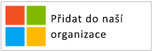
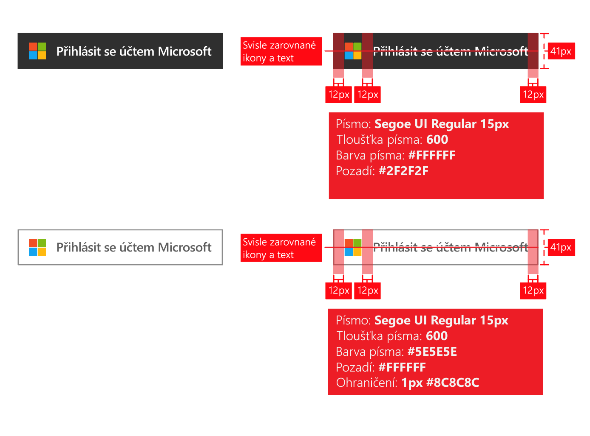
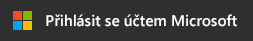
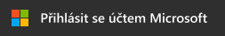
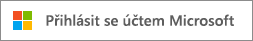
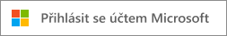
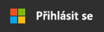
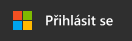

# Pokyny pro branding aplikací

Tento článek popisuje pokyny pro branding, kterými byste se měli řídit při vývoji aplikací s využitím Azure Active Directory (Azure AD). Tyto pokyny pomůžou s vedením uživatelů v případě, že se pomocí svého pracovního nebo školního účtu spravovaného v Azure AD nebo osobního účtu budou chtít zaregistrovat nebo přihlásit k vaší aplikaci.

## Osobní účty vs. pracovní nebo školní účty od Microsoftu

Microsoft spravuje dva druhy uživatelských účtů:

* **Osobní účty** (dříve označované jako Windows Live ID). Tyto účty představují vztah mezi *jednotlivými* uživateli a Microsoftem a používají se k přístupu k uživatelským zařízením a službám od Microsoftu. Tyto účty jsou určené k osobnímu použití.
* **Pracovní nebo školní účty**. Tyto účty spravuje Microsoft jménem organizace využívající Azure Active Directory. Tyto účty se používají k přihlašování k Office 365 a dalším obchodním službám Microsoftu.

Pracovní nebo školní účty Microsoft obvykle přiřazují koncovým uživatelům (zaměstnanci, studenti, federální zaměstnanci) jejich organizace (společnost, škola, orgán státní správy). Tyto účty se spravují přímo v cloudu (na platformě Azure AD) nebo se synchronizují do Azure AD z místního adresáře, jako je například Windows Server Active Directory. Microsoft je *správcem* pracovních nebo školních účtů, ale organizace tyto účty vlastní a řídí.

## Odkazování na účty Azure AD v aplikaci

Microsoft nevystavuje koncové uživatele názvům značek Azure ani Active Directory a vy byste to také neměli dělat.

* Jakmile se uživatelé přihlásí, snažte se co nejvíce používat název a logo organizace. Je to lepší než používat obecné termíny jako „vaše organizace“.
* Když vaši uživatelé nejsou přihlášeni, odkazujte na jejich účty jako na „pracovní nebo školní účty“ a použitím loga Microsoftu dejte najevo, že tyto účty spravuje Microsoft. Nepoužívejte termíny jako „podnikový účet“, „obchodní účet“ nebo „firemní účet“ – pro uživatele jsou matoucí.

## Piktogram uživatelského účtu

Ve starší verzi těchto pokynů jsme doporučovali používat piktogram modrého odznáčku. Na základě zpětné vazby od uživatelů a vývojářů teď místo toho doporučujeme používat logo Microsoftu. Logo Microsoftu pomůže uživatelům pochopit, že můžou k přihlášení k vaší aplikaci použít účet, který používají s Office 365 nebo jinými obchodními službami Microsoftu.

## Registrace a přihlášení pomocí Azure AD

Vaše aplikace může nabízet jiné prostředí pro registraci i přihlášení a v následujících částech najdete vizuální pokyny pro oba scénáře.

**Pokud vaše aplikace podporuje registrace koncových uživatelů (např. při přechodu z bezplatné na zkušební verzi nebo v rámci modelu freemium):** Můžete zobrazit tlačítko pro **přihlášení**, které uživatelům umožní získat přístup k vaší aplikaci pomocí pracovního nebo osobního účtu. Při prvním přístupu k vaší aplikaci jim Azure AD zobrazí dialogové okno pro vyjádření souhlasu.

**Pokud vaše aplikace vyžaduje oprávnění, která můžou odsouhlasit pouze správci, nebo pokud vaše aplikace vyžaduje licencování organizace:** Oddělte získávání správců od přihlašování uživatelů. **Tlačítko pro získání aplikace** přesměruje správce na přihlášení a pak se jim zobrazí výzva k udělení souhlasu jménem uživatelů v jejich organizaci. Další výhodou tohoto přístupu je potlačení dialogových oken pro vyjádření souhlasu koncového uživatele ve vaší aplikaci.

## Vizuální pokyny pro pořizování aplikace

Váš odkaz na získání aplikace musí uživatele přesměrovat na stránku Azure AD pro udělení přístupu (autorizaci), abyste správcům organizací umožnili autorizovat přístup vaší aplikace k datům jejich organizací, která hostuje Microsoft. Postup požádání o přístup je podrobně popsaný v článku [Integrace aplikací se službou Azure Active Directory](quickstart-v1-integrate-apps-with-azure-ad.md).

Jakmile správce vyjádří souhlas s vaší aplikací, může ji uživatelům přidat do spouštěče aplikací Office 365 (ten je přístupný z dlaždice a na adrese [https://portal.office.com/myapps](https://portal.office.com/myapps)). Pokud chcete tuto možnost inzerovat, můžete použít termíny jako „Přidejte si tuto aplikaci do vaší organizace“ a zobrazit tlačítko jako v následujícím příkladu:

Doporučujeme však nespoléhat na tlačítka a napsat vysvětlující text. Příklad:

> *Pokud již používáte Office 365 nebo jinou obchodní službu od Microsoftu, můžete <název_vaší_aplikace> udělit přístup k datům vaší organizace. Tím umožníte uživatelům přístup k <název_vaší_aplikace> pomocí jejich stávajících pracovních účtů.*

Pokud si pro použití ve vaší aplikaci chcete stáhnout oficiální logo Microsoftu, klikněte pravým tlačítkem na logo, které chcete použít, a uložte si ho do počítače.

| Prostředek                                | Formát PNG | Formát SVG |
| ------------------------------------ | ---------- | ---------- |
| Logo Microsoftu  |  |  |

## Vizuální pokyny pro přihlášení

Ve vaší aplikaci by se mělo zobrazit tlačítko pro přihlášení, které uživatele přesměruje na koncový bod přihlášení odpovídající protokolu, který používáte k integraci s Azure AD. Následující část obsahuje podrobnosti o tom, jak by toto tlačítko mělo vypadat.

### Piktogram a termín „Přihlásit se účtem Microsoft“

Spojení loga Microsoftu s termínem „Přihlásit se účtem Microsoft“ jednoznačně reprezentuje Azure AD mezi jinými zprostředkovateli identity, které vaše aplikace může podporovat. Pokud nemáte dostatek místa na zobrazení textu „Přihlásit se účtem Microsoft“, můžete ho zkrátit na „Přihlásit se“. U tlačítek můžete použít světlé nebo tmavé barevné schéma.

Následující diagram ukazuje ochranná pásma, která Microsoft doporučuje dodržovat při používání těchto prostředků v aplikaci. Ochranná pásma platí pro text „Přihlásit se účtem Microsoft“ i zkrácenou verzi „Přihlásit se“.

Pokud si pro použití ve vaší aplikaci chcete stáhnout oficiální obrázky, klikněte pravým tlačítkem na obrázek, který chcete použít, a uložte si ho do počítače.

| Prostředek                                | Formát PNG | Formát SVG |
| ------------------------------------ | ---------- | ---------- |
| Přihlásit se účtem Microsoft (tmavý motiv)  |  |  |
| Přihlásit se účtem Microsoft (světlý motiv) |  |  |
| Přihlásit se (tmavý motiv)                 |  |  |
| Přihlásit se (světlý motiv)                |  |  |

## Branding – Co dělat a nedělat

**POUŽÍVEJTE** v kombinaci s tlačítkem Přihlásit se účtem Microsoft text „pracovní nebo školní účet“. Poskytnete tím další vysvětlení, které koncovým uživatelům pomůže poznat, jestli tuto možnost můžou využít. **NEPOUŽÍVEJTE** jiné termíny jako „podnikový účet“, „obchodní účet“ nebo „firemní účet“.

**NEPOUŽÍVEJTE** termíny „ID Office 365“ ani „ID Azure“. Office 365 je také název nabídky Microsoftu pro zákazníky, ve které se k ověřování nepoužívání Azure AD.

**NEUPRAVUJTE** logo Microsoftu.

**NEVYSTAVUJTE** koncové uživatele značkám Azure ani Active Directory. Před vývojáři, odborníky na IT a správci však tyto termíny používat můžete.

## Navigace – Co dělat a nedělat

**POSKYTNĚTE** uživatelům možnost odhlásit se a přepnout na jiný uživatelský účet. Přestože má většina lidí jeden osobní účet od Microsoftu, Facebooku, Googlu nebo Twitteru, často jsou tito lidé spojeni s více organizacemi. Brzy bude k dispozici podpora více přihlášených uživatelů.
