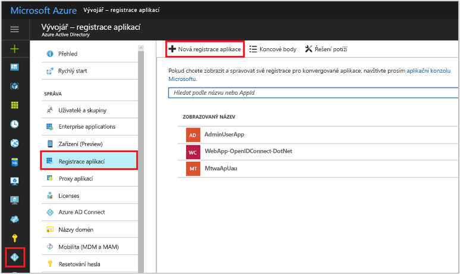
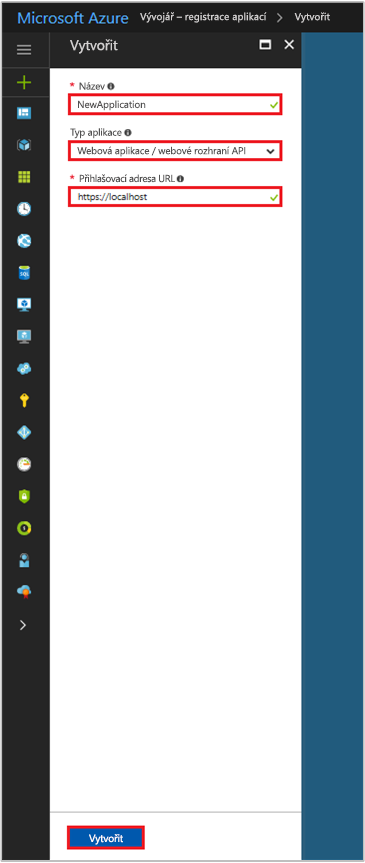

# Rychlý start: Registrace aplikace pomocí koncového bodu Azure Active Directory verze 1.0

[!INCLUDE [active-directory-develop-applies-v1](../../../includes/active-directory-develop-applies-v1.md)]

Podnikoví vývojáři a poskytovatelé SaaS (software jako služba) můžou vyvíjet komerční cloudové služby nebo podnikové aplikace s možností integrace s Azure Active Directory (AD) za účelem zajištění zabezpečeného přihlašování a autorizace pro služby. K integraci aplikace nebo služby pomocí Azure AD musí vývojář nejdřív aplikaci zaregistrovat v Azure AD.

Všechny aplikace, které chtějí využívat možnosti Azure AD, musí být nejdřív zaregistrované v tenantovi Azure AD. Tento proces registrace zahrnuje to, že službě Azure AD poskytnete podrobnosti o vaší aplikaci, například adresu URL, kde se nachází, adresu URL pro odesílání odpovědí po ověření uživatele, identifikátor URI, který identifikuje aplikaci, a podobně.

V tomto rychlém startu se dozvíte, jak pomocí prostředí **Registrace aplikací** na webu Azure Portal přidat a zaregistrovat aplikaci v Azure AD.

> [!NOTE]
> Registrujete novou aplikaci? Vyzkoušejte nové prostředí **Registrace aplikací (Preview)** na webu Azure Portal. Začněte tím, že si přečtete téma [Registrace aplikace (Preview)](quickstart-register-app.md).

## Požadavky

Abyste mohli začít, ujistěte se, že máte tenanta Azure AD, kterého můžete použít k registraci aplikací. Pokud ještě tenanta nemáte, [zjistěte, jako ho získat](quickstart-create-new-tenant.md).

## Registrace nové aplikace pomocí portálu Azure Portal

1. Přihlaste se k webu [Azure Portal](https://portal.azure.com).
1. Pokud váš účet umožňuje přístup k více účtům, vyberte požadovaný účet v pravém horním rohu a nastavte relaci portálu na požadovaného tenanta Azure AD.
1. V levém navigačním podokně vyberte službu **Azure Active Directory**.
1. Vyberte **Registrace aplikací** a pak vyberte **Registrace nové aplikace**.

    

1. Když se zobrazí stránky **Vytvořit**, zadejte registrační informace vaší aplikace: 

    - **Jméno:** Zadejte název smysluplné aplikace
    - **Typ aplikace:**
      - Vyberte **Nativní** pro [klientské aplikace](developer-glossary.md#client-application), které jsou nainstalované místně na zařízení. Toto nastavení se používá pro veřejné [nativní klienty](developer-glossary.md#native-client) OAuth.
      - Vyberte **Webová aplikace / webové rozhraní API** pro [klientské aplikace](developer-glossary.md#client-application) a [aplikace prostředků / rozhraní API](developer-glossary.md#resource-server), které jsou nainstalované na zabezpečeném serveru. Toto nastavení se používá pro důvěrné [webové klienty](developer-glossary.md#web-client) OAuth a veřejné [klienty na základě uživatelského agenta](developer-glossary.md#user-agent-based-client). Stejná aplikace může také zpřístupnit klienta i prostředek / rozhraní API.
    - **Přihlašovací adresa URL:** Pro "webové aplikace a rozhraní API" aplikace, zadejte základní adresu URL vaší aplikace. Například `http://localhost:31544` může být adresa URL pro webovou aplikaci spuštěnou na místním počítači. Uživatelé by se pomocí této adresy URL přihlašovali k webové klientské aplikaci. 
    - **Identifikátor URI pro přesměrování:** U aplikací "Nativní" Zadejte identifikátor URI, které používají Azure AD k vracení odpovědí na tokeny. Zadejte konkrétní hodnotu pro vaši aplikaci, například `http://MyFirstAADApp`.

      

    Pokud chcete konkrétní příklady webových nebo nativních aplikací, podívejte se na **Rychlé starty** v naší dokumentaci.

1. Po dokončení vyberte **Vytvořit**.

    Azure AD vaší aplikaci přiřadí jedinečné ID aplikace a přesměruje vás na hlavní stránku registrace vaší aplikace. V závislosti na tom, jestli je vaše aplikace webová nebo nativní, jsou k dispozici různé volby pro přidání dalších možností do vaší aplikace.

      > [!NOTE]
      > Ve výchozím nastavení je nově zaregistrovaná webová aplikace nakonfigurovaná tak, aby přihlášení do vaší aplikace umožňovala **jenom** uživatelům ze stejného tenanta.

## Další postup

- Podívejte se na [rámec pro udělení souhlasu Azure AD](consent-framework.md), kde najdete přehled o souhlasu.
- Pokud chcete povolit další funkce konfigurace v registraci aplikace – například přihlašovací údaje, oprávnění, povolení přihlášení pro uživatele z jiných tenantů – přečtěte si článek o [aktualizaci aplikace v Azure AD](quickstart-v1-update-azure-ad-app.md).
- Další informace o dvou objektech Azure AD, které představují zaregistrovanou aplikaci, a vztahu mezi nimi, najdete v článku o [objektech aplikací a instančních objektech](app-objects-and-service-principals.md).
- Další informace o pokynech pro branding, kterými byste se měli řídit při vývoji aplikací s využitím Azure Active Directory, najdete v článku [Pokyny pro branding aplikací](howto-add-branding-in-azure-ad-apps.md).
