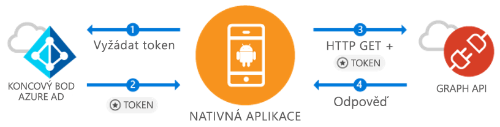

# <a name="azure-ad-android-getting-started"></a>Začínáme se službou Azure AD Android
[!INCLUDE [active-directory-devquickstarts-switcher](../../../includes/active-directory-devquickstarts-switcher.md)]

Pokud vyvíjíte aplikace pro Android, Microsoft umožňuje jednoduché a nekomplikované k přihlášení uživatelů Azure Active Directory (Azure AD). Azure AD umožňuje vaší aplikaci přístup k datům uživatele prostřednictvím Microsoft Graphu nebo vlastní chráněné webové rozhraní API. 

Knihovna pro Android Azure AD Authentication Library (ADAL) dává aplikaci možnost začít používat [cloudu Microsoft Azure](https://cloud.microsoft.com) & [Microsoft Graph API](https://graph.microsoft.io) díky podpoře [ Účty Microsoft Azure Active Directory](https://azure.microsoft.com/services/active-directory/) pomocí standardní OAuth2 nebo OpenID Connect. V této ukázce normální životních, které vaše aplikace by měla prostředí, včetně:

* Získání tokenu pro Microsoft Graph
* Aktualizovat token
* Volání Microsoft Graphu
* Neodhlásí uživatele

Abyste mohli začít, budete potřebovat tenanta služby Azure AD, kde můžete vytvářet uživatele a zaregistrovat aplikaci. Pokud ještě nemáte tenanta, [zjistěte, jak získat](quickstart-create-new-tenant.md).

## <a name="scenario-sign-in-users-and-call-the-microsoft-graph"></a>Scénář: Přihlášení uživatelů a volání Microsoft Graphu



Tato aplikace je možné pro všechny účty služby Azure AD. Podporuje scénáře jednu i více organizace (viz popis v krocích). Ukazuje, jak může vývojář vytvářet aplikace a spojení s podnikovými uživateli přístup k jejich Azure + O365 dat prostřednictvím Microsoft Graphu. Během ověřování toku koncoví uživatelé budou muset přihlásit a vyjadřujete souhlas s oprávnění aplikace a v některých případech může vyžadovat souhlas pro aplikaci správce. Většina logiku v této ukázce ukazuje, jak do ověřování koncového uživatele a změňte základní volat u Microsoft Graphu.

## <a name="example-code"></a>Příklad kódu

Úplnou ukázku kódu lze najít [na Githubu](https://github.com/Azure-Samples/active-directory-android). 

```Java
// Initialize your app with MSAL
AuthenticationContext mAuthContext = new AuthenticationContext(
        MainActivity.this, 
        AUTHORITY, 
        false);


// Perform authentication requests
mAuthContext.acquireToken(
    getActivity(), 
    RESOURCE_ID, 
    CLIENT_ID, 
    REDIRECT_URI,  
    PromptBehavior.Auto, 
    getAuthInteractiveCallback());

// ...

// Get tokens to call APIs like the Microsoft Graph
mAuthResult.getAccessToken()
```

## <a name="steps-to-run"></a>Postup spuštění

### <a name="register-and-configure-your-app"></a>Registrace a konfigurace aplikace 
Budete muset mít nativní klientské aplikace zaregistrované pomocí Microsoft [webu Azure portal](https://portal.azure.com). 

1. Abyste se registrace aplikace
    - Přejděte na [Azure Portal](https://aad.portal.azure.com). 
    - Vyberte ***Azure Active Directory*** > ***registrace aplikací***. 

2. Vytvoření aplikace
    - Vyberte **Registrace nové aplikace**. 
    - Zadejte název aplikace v **název** pole. 
    - V **typ aplikace** vyberte **nativní**. 
    - V **identifikátor URI pro přesměrování**, zadejte `http://localhost`. 

3. Konfigurace Microsoft Graphu
    - Vyberte **Nastavení > požadovaná oprávnění**.
    - Vyberte **přidat**uvnitř **vyberte rozhraní API** vyberte ***Microsoft Graphu***. 
    - Vyberte oprávnění **přihlášení a čtení profilu uživatele**, pak klikněte na tlačítko **vyberte** uložte. 
        - Toto oprávnění se mapuje `User.Read` oboru. 
    - Volitelné: Vnitřní **požadovaná oprávnění > Windows Azure Active Directory**, odeberte vybrané oprávnění **přihlášení a čtení profilu uživatele**. Tím se vyhnete stránka pro odsouhlasení podmínek uživatele výpis oprávnění dvakrát. 

4. Blahopřejeme! Vaše aplikace je úspěšně nakonfigurovaný. V další části budete potřebovat:
    - `Application ID`
    - `Redirect URI`

### <a name="get-the-sample-code"></a>Získání ukázkového kódu

1. Klonování kódu.
    ```
    git clone https://github.com/Azure-Samples/active-directory-android
    ```
2. Otevřete ukázku v nástroji Android Studio.
    - Vyberte **otevřete existující projekt Android Studio**.

### <a name="configure-your-code"></a>Konfigurace kódu

Můžete najít všechny konfigurace pro tento vzorový kód ***src/main/java/com/azuresamples/azuresampleapp/MainActivity.java*** souboru. 

1. Nahraďte konstanty `CLIENT_ID` s `ApplicationID`.
2. Nahraďte konstanty `REDIRECT URI` s `Redirect URI` jste nakonfigurovali dříve (`http://localhost`). 

### <a name="run-the-sample"></a>Spuštění ukázky

1. Vyberte **sestavení > Vyčistit projekt**. 
2. Vyberte **spuštění > spustit aplikaci**. 
3. Aplikace by měla sestavení a ukazují některé základní uživatelské prostředí Když kliknete `Call Graph API` tlačítko, bude výzva pro přihlášení v a pak tiše volání rozhraní Microsoft Graph API s nový token. 

## <a name="important-info"></a>Důležité informace

1. Rezervace [ADAL Android Wiki](https://github.com/AzureAD/azure-activedirectory-library-for-android/wiki) pro další informace o mechanismu knihovny a postupu při konfiguraci nové scénáře a funkce. 
2. V nativním scénáře aplikace bude používat vložené Webview a neopustí aplikace. `Redirect URI` Může být libovolná. 
3. Najít všechny problémy nebo mají požadavky? Můžete vytvořit problém nebo odeslat na Stackoverflow se značkou `azure-active-directory`. 

### <a name="cross-app-sso"></a>Jednotné přihlašování napříč aplikacemi
Přečtěte si [postup povolení jednotného přihlašování napříč aplikacemi v Androidu pomocí knihovny ADAL](active-directory-sso-android.md). 

### <a name="auth-telemetry"></a>Telemetrii ověřování
Knihovna ADAL zpřístupňuje telemetrii ověřování pomáhá vývojářům aplikací pochopit, jak se chová svoje aplikace a začít vytvářet lepší prostředí. To umožňuje zachytit přihlášení úspěšné, aktivních uživatelů a několik dalších zajímavé informace. Použití telemetrii ověřování vyžadovat vývojáři aplikací k navázání telemetrické službě můžete agregovat a uložení událostí.

Další informace o telemetrii ověřování checkout [ADAL Android telemetrii ověřování](https://github.com/AzureAD/azure-activedirectory-library-for-android/wiki/Telemetry). 

[!INCLUDE [active-directory-devquickstarts-additional-resources](../../../includes/active-directory-devquickstarts-additional-resources.md)]
