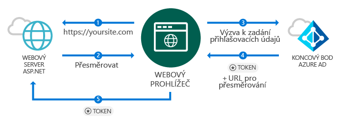
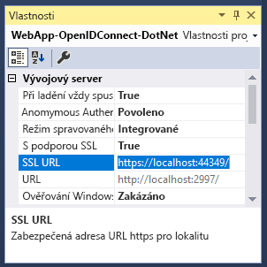
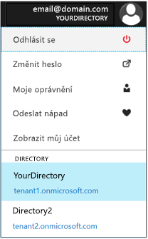
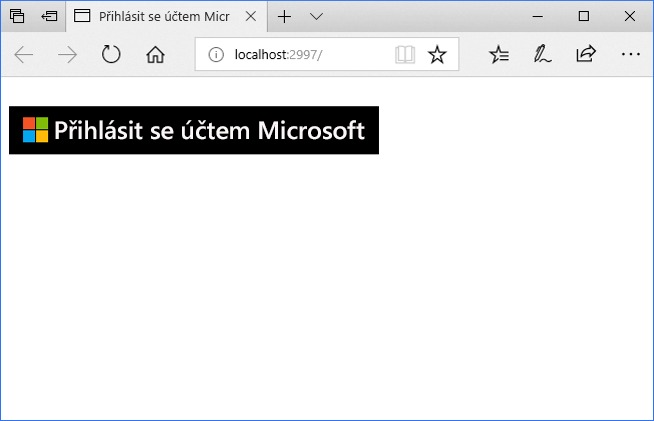
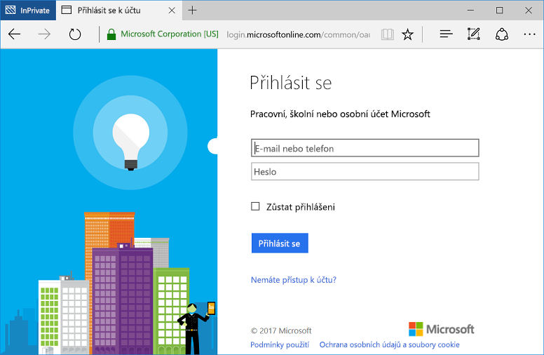

<!--start-intro-->
# <a name="add-sign-in-with-microsoft-to-an-aspnet-web-app"></a>Přidání přihlašování s Microsoftem do webové aplikace ASP.NET

Tato příručka ukazuje, jak implementovat přihlášení u Microsoftu pomocí řešení ASP.NET MVC s tradiční webové aplikace založené na prohlížeči pomocí OpenID Connect. 

Na konci tohoto průvodce, bude vaše aplikace akceptovat přihlášení pracovní a školní účty z organizace, které integrovaly s Azure Active Directory.

> [!NOTE]
> Tento instalační program s asistencí vám umožní povolit přihlášení z pracovním a školním účtům v aplikaci ASP.NET. Pokud vás zajímá umožňující přihlášení pro osobní účty kromě pracovním a školním účtům, můžete použít [koncového bodu v2](azure-ad-endpoint-comparison.md). V tématu [ASP.NET na základě nastavení pro koncový bod v2](tutorial-v2-asp-webapp.md) stejně jako [tento dokument](active-directory-v2-limitations.md) s vysvětlením, aktuální omezení koncového bodu v2.
<br/><br/>

<!--separator-->

> Tato příručka vyžaduje Visual Studio 2015 Update 3 nebo Visual Studio 2017.  Nemáte ho?  [Stáhněte si Visual Studio 2017 zdarma](https://www.visualstudio.com/downloads/)

## <a name="how-this-guide-works"></a>Jak funguje tato příručka



Tato příručka je založená na scénář, kde prohlížeči přejde na web ASP.NET, žádosti o uživateli se přihlásit přes přihlašovací tlačítko. V tomto scénáři vyvolá se většina práce k vykreslení stránky webové na straně serveru.

> [!NOTE]
> Tento instalační program s asistencí ukazuje, jak se přihlásit uživatele na spuštění z prázdné šablony webové aplikace ASP.NET a zahrnout kroky, jako je například přidávání znaménko tlačítko a každý kontroler a metod, současně také vám vysvětlíme některé pojmy. Alternativně můžete také vytvořit projekt, který přihlášení Azure Active Directory uživatelům (pracovní a školní účty) s použitím [šablony webové aplikace Visual Studio](https://docs.microsoft.com/aspnet/visual-studio/overview/2013/creating-web-projects-in-visual-studio#organizational-account-authentication-options) a vyberete *účty organizace* a pak jedna z možností cloudu – tato možnost používá šablonu bohatší s další řadiče, metody a zobrazení.

## <a name="libraries"></a>Knihovny

Tato příručka používá následující balíčky:

|Knihovna|Popis|
|---|---|
|[Microsoft.Owin.Security.OpenIdConnect](https://www.nuget.org/packages/Microsoft.Owin.Security.OpenIdConnect/)|Middleware, který umožňuje aplikaci k ověřování používají OpenIdConnect|
|[Microsoft.Owin.Security.Cookies](https://www.nuget.org/packages/Microsoft.Owin.Security.Cookies)|Middleware, který umožňuje aplikaci spravovat pomocí souborů cookie relace uživatele|
|[Microsoft.Owin.Host.SystemWeb](https://www.nuget.org/packages/Microsoft.Owin.Host.SystemWeb)|Umožňuje aplikacím na základě OWIN pro spuštění ve službě IIS pomocí kanálu požadavku ASP.NET|


<!--end-intro-->

<!--start-setup-->

## <a name="set-up-your-project"></a>Nastavení projektu

Tato část popisuje postup instalace a konfigurace ověřovacího kanálu prostřednictvím middlewaru OWIN v projektu aplikace ASP.NET pomocí OpenID Connect. 

> Stáhněte si tento ukázkový projekt sady Visual Studio místo toho raději? [Stáhnete projekt](https://github.com/AzureADQuickStarts/WebApp-OpenIdConnect-DotNet/archive/GuidedSetup.zip) a pokračujte [potřeba provádět krok konfigurace](#configure-your-webconfig-and-register-an-application) konfigurace ukázkového kódu před spuštěním.

## <a name="create-your-aspnet-project"></a>Vytvoření projektu ASP.NET
1. V sadě Visual Studio: `File` > `New` > `Project`<br/>
2. V části *Visual C# \Web*vyberte `ASP.NET Web Application (.NET Framework)`.
3. Pojmenujte svoji aplikaci a klikněte na tlačítko *OK*
4. Vyberte `Empty` a poté vyberte zaškrtávací políčko a přidáním `MVC` odkazy

## <a name="add-authentication-components"></a>Přidání součástí ověřování

1. V sadě Visual Studio: `Tools` > `Nuget Package Manager` > `Package Manager Console`
2. Přidat *balíčky NuGet middleware OWIN* pomocí následujícího příkazu v okně konzoly Správce balíčků:

    ```powershell
    Install-Package Microsoft.Owin.Security.OpenIdConnect
    Install-Package Microsoft.Owin.Security.Cookies
    Install-Package Microsoft.Owin.Host.SystemWeb
    ```

<!--start-collapse-->
> ### <a name="about-these-packages"></a>Týkající se těchto balíčků
>Výše uvedené knihovny povolte jednotné přihlašování (SSO) prostřednictvím ověřování na základě souborů cookie pomocí OpenID Connect. Po dokončení ověření a token představující uživatele je odeslána do vaší aplikace, middlewaru OWIN, který vytvoří soubor cookie relace. Tento soubor cookie v prohlížeči potom použije na následné žádosti, uživatel nebude muset donutit, takže je potřeba žádné další ověření.
<!--end-collapse-->

## <a name="configure-the-authentication-pipeline"></a>Konfigurace ověřovacího kanálu
Následující postup slouží k vytvoření OWIN middleware *třídu pro spuštění* ke konfiguraci ověřování OpenID Connect. Tato třída je provedeno automaticky.

> [!TIP]
> Pokud váš projekt nemá `Startup.cs` soubor v kořenové složce:<br/>
> 1. Klikněte pravým tlačítkem na kořenové složky projektu: >    `Add` > `New Item...` > `OWIN Startup class`<br/>
> 2. Pojmenujte ji `Startup.cs`<br/>
>
>> Ujistěte se, že vybranou třídu třídy pro spuštění OWIN a není standardní třídy C#. To můžete ověřit kontrolou, jestli se zobrazí `[assembly: OwinStartup(typeof({NameSpace}.Startup))]` nad obor názvů.


1. Přidat *OWIN* a *Microsoft.IdentityModel* obory názvů `Startup.cs`:

    [!code-csharp[main](../../../WebApp-OpenIDConnect-DotNet/WebApp-OpenIDConnect-DotNet\Startup.cs?name=AddedNameSpaces "Startup.cs")]

2. Počáteční třída nahraďte následujícím kódem:

    [!code-csharp[main](../../../WebApp-OpenIDConnect-DotNet/WebApp-OpenIDConnect-DotNet\Startup.cs?name=Startup "Startup.cs")]
    
<!--start-collapse-->
> [!NOTE]
> Parametry, které poskytnete v *OpenIDConnectAuthenticationOptions* sloužit jako souřadnice pro aplikaci ke komunikaci s Azure AD. Vzhledem k tomu middleware OpenID Connect používá soubory cookie, musíte také nastavit ověřování souborů cookie, jak ukazuje předchozí kód. *ValidateIssuer* hodnoty pozná OpenIdConnect není omezit přístup k jedné konkrétní organizace.
<!--end-collapse-->

<!--end-setup-->

<!--start-use-->

## <a name="add-a-controller-to-handle-sign-in-and-sign-out-requests"></a>Přidání kontroleru pro zpracování požadavků na přihlášení a odhlášení

Tento krok ukazuje, jak vytvořit nový kontroler zveřejňovat metody přihlašování a odhlašování.

1.  Klikněte pravým tlačítkem myši `Controllers` a pak zvolte položku `Add` > `Controller`
2.  Vyberte `MVC (.NET version) Controller – Empty`.
3.  Klikněte na tlačítko *přidat*
4.  Pojmenujte ji `HomeController` a klikněte na tlačítko *přidat*
5.  Přidat *OWIN* obory názvů pro třídu:

    [!code-csharp[main](../../../WebApp-OpenIDConnect-DotNet/WebApp-OpenIDConnect-DotNet\Controllers\HomeController.cs?name=AddedNameSpaces "HomeController.cs")]

6. Přidejte následující metody pro zpracování přihlašování a odhlašování do vaší kontroleru pomocí inicializace výzvu ověřování prostřednictvím kódu:

    [!code-csharp[main](../../../WebApp-OpenIDConnect-DotNet/WebApp-OpenIDConnect-DotNet\Controllers\HomeController.cs?name=SigInAndSignOut "HomeController.cs")]
    
## <a name="create-the-apps-home-page-to-sign-in-users-via-a-sign-in-button"></a>Vytvoření aplikace domovskou stránku pro přihlášení prostřednictvím tlačítka přihlašování uživatelů

V sadě Visual Studio vytvořte nové zobrazení přidat tlačítko sign in a zobrazit informace o uživateli po ověření:

1.  Klikněte pravým tlačítkem myši `Views\Home` a pak zvolte položku `Add View`
2.  Pojmenujte ji `Index`.
3.  Přidejte následující kód HTML, která obsahuje tlačítko přihlásit, do souboru:

    [!code-html[main](../../../WebApp-OpenIDConnect-DotNet/WebApp-OpenIDConnect-DotNet/Views/Home/Index.cshtml "Index.cshtml")]

<!--start-collapse-->
> [!NOTE]
> Tato stránka přidá tlačítko přihlášení ve formátu SVG s černým pozadím:<br/><br/> Pro tlačítka Další přihlásit, přejděte na [tuto stránku](https://docs.microsoft.com/azure/active-directory/develop/active-directory-branding-guidelines "pokyny pro Branding").
<!--end-collapse-->

## <a name="display-users-claims-by-adding-a-controller"></a>Přidání kontroleru zobrazení deklarací identity uživatele
Tento kontroler ukazuje použití `[Authorize]` atribut k ochraně kontroleru. Tento atribut omezuje přístup k řadiči tím, že pouze ověřeným uživatelům. Následující kód učiní zobrazíte deklarace identity uživatelů, které byly načteny v rámci přihlášení pomocí atributu.

1.  Klikněte pravým tlačítkem myši `Controllers` složky: `Add` > `Controller`
2.  Vyberte `MVC {version} Controller – Empty`.
3.  Klikněte na tlačítko *přidat*
4.  Pojmenujte ji `ClaimsController`
5.  Nahraďte kód třídy kontroleru následující kód – tím se přidá `[Authorize]` atribut pro třídu:

    [!code-csharp[main](../../../WebApp-OpenIDConnect-DotNet/WebApp-OpenIDConnect-DotNet\Controllers\ClaimsController.cs?name=ClaimsController "ClaimsController.cs")]

<!--start-collapse-->
> [!NOTE]
> Protože se používá `[Authorize]` atribut, všechny metody tento řadič lze spustit pouze pokud je uživatel ověřený. Pokud uživatel není ověřen a pokusí o přístup k řadiči, inicializuje výzvu ověřování OWIN a nutí uživatele k ověření. Výše uvedený kód zjistí kolekci deklarací identity uživatele pro konkrétní atributy, které jsou zahrnuté v tokenu uživatele. Tyto atributy zahrnout úplné uživatelské jméno a uživatelské jméno, jakož i globální uživatelské identifikátoru předmětu. Obsahuje taky *ID Tenanta*, která představuje ID organizace uživatele. 
<!--end-collapse-->

## <a name="create-a-view-to-display-the-users-claims"></a>Vytvoření zobrazení pro zobrazení deklarací identity uživatele

V sadě Visual Studio vytvořte nové zobrazení pro zobrazení deklarací identity uživatele na webové stránce:

1.  Klikněte pravým tlačítkem myši `Views\Claims` složky a: `Add View`
2.  Pojmenujte ji `Index`.
3.  Přidejte následující kód HTML do souboru:

    [!code-html[main](../../../WebApp-OpenIDConnect-DotNet/WebApp-OpenIDConnect-DotNet/Views/Claims/Index.cshtml "Index.cshtml")]
    
<!--end-use-->

<!--start-configure-->
## <a name="configure-your-webconfig-and-register-an-application"></a>Konfigurace vašeho *web.config* a zaregistrovat aplikaci

1. V sadě Visual Studio, přidejte následující text do `web.config` (umístěný v kořenové složce) v části `configuration\appSettings`:

    ```xml
    <add key="ClientId" value="Enter_the_Application_Id_here" />
    <add key="RedirectUrl" value="Enter_the_Redirect_Url_here" />
    <add key="Tenant" value="common" />
    <add key="Authority" value="https://login.microsoftonline.com/{0}" /> 
    ```
2. V Průzkumníku řešení vyberte projekt a podívejte se na <i>vlastnosti</i> okna (Pokud se nezobrazí okno Vlastnosti, stisknutím klávesy F4)
3. Změna SSL povoleno <code>True</code>
4. Adresa URL protokolu SSL projektu zkopírujte do schránky:<br/><br/><br />
5. V <code>web.config</code>, nahraďte <code>Enter_the_Redirect_URL_here</code> s adresou URL protokolu SSL vašeho projektu 

### <a name="register-your-application-in-the-azure-portal-then-add-its-information-to-webconfig"></a>Registrace vaší aplikace na webu Azure Portal a pak přidejte informace o jeho *web.config*

1. Přejděte [portálu Microsoft Azure – registrace aplikací](https://portal.azure.com/#blade/Microsoft_AAD_IAM/ActiveDirectoryMenuBlade/RegisteredApps) pro registraci aplikace
2. Vyberte `New application registration`
3. Zadejte název pro vaši aplikaci
4. Vložte projektu sady Visual Studio *adresa URL protokolu SSL* v `Sign-on URL` (Tato adresa URL je také automaticky přidán do seznamu adres URL odpovědí pro aplikaci při registraci)
5. Klikněte na tlačítko `Create` k registraci aplikace. Tato akce přejde zpět do seznamu aplikací
6. Nyní hledat a/nebo vyberte aplikaci, kterou jste právě vytvořili, otevřete jeho vlastnosti
7. Zkopírujte identifikátor guid v rámci `Application ID` do schránky.
8. Vraťte se do sady Visual Studio a v `web.config`, nahraďte `Enter_the_Application_Id_here` s ID aplikace z aplikace, které jste právě zaregistrovali

> [!TIP]
> Pokud váš účet je nakonfigurovaný pro přístup k více adresářů, ujistěte se, že jste vybrali správný adresář pro organizaci chcete, aby aplikace k registraci kliknutím na název účtu v horní části klikněte pravým tlačítkem myši na webu Azure Portal a ověřením, Vybraný adresář podle:<br/>

## <a name="configure-sign-in-options"></a>Konfigurovat možnosti přihlášení

Můžete nakonfigurovat aplikaci povolit pouze uživatele, kteří patří do jedné organizace instanci Azure Active Directory pro přihlášení, ani nebude přijímat přihlášení od uživatele, kteří patří do organizace. Postupujte podle pokynů jednoho z následujících možností:

### <a name="configure-your-application-to-allow-sign-ins-of-work-and-school-accounts-from-any-company-or-organization-multi-tenant"></a>Konfigurace aplikace umožňuje přihlášení k pracovním a školním účtům z jakéhokoli společnosti nebo organizace (s více tenanty)

Postupujte podle následujících kroků, pokud chcete použít přihlášení pracovní a školní účty z jakéhokoli společnosti nebo organizace, která má integrované s Azure Active Directory. Toto je běžným scénářem *aplikací SaaS*:

1. Přejděte zpět na [portálu Microsoft Azure – registrace aplikací](https://portal.azure.com/#blade/Microsoft_AAD_IAM/ActiveDirectoryMenuBlade/RegisteredApps) a vyhledejte právě zaregistrovali aplikaci
2. V části `All Settings` vyberte `Properties`
3. Změna `Multi-tenanted` vlastnost `Yes` a klikněte na tlačítko `Save`

Další informace o tomto nastavení a koncept aplikace s více tenanty najdete v tématu [v tomto článku](howto-convert-app-to-be-multi-tenant.md "víceklientské přehled").

### <a name="restrict-users-from-only-one-organizations-active-directory-instance-to-sign-in-to-your-application-single-tenant"></a>Omezení uživatelů z instance Active Directory pouze jedna organizace k přihlášení do aplikace (jeden tenant)

Tato možnost je běžným scénářem *aplikace LOB*: Pokud chcete, aby vaše aplikace tak, aby přijímal přihlášení pouze z účtů, které patří k určité instanci Azure Active Directory (včetně *účty hostů*dané instance), nahraďte `Tenant` parametr *web.config* z `Common` s názvem tenanta organizace – například *contoso.onmicrosoft.com*. Poté změňte `ValidateIssuer` argumentu ve vaší [ *třída OWIN Startup* ](#configure-the-authentication-pipeline) k `true`.

Chcete-li povolit uživatelům jenom seznam konkrétních organizací, nastavte `ValidateIssuer` na hodnotu true a použít `ValidIssuers` parametr pro zadání seznamu organizací.

Další možností je implementovat vlastní metodu k ověření vystavitele pomocí *IssuerValidator* parametru. Další informace o `TokenValidationParameters`, najdete v [článku na webu MSDN](https://msdn.microsoft.com/library/system.identitymodel.tokens.tokenvalidationparameters.aspx "článku na webu MSDN parametry tokenvalidationparameters").

<!--end-configure-->

<!--start-configure-arp-->
<!--
## Configure your ASP.NET Web App with the application's registration information

In this step, you will configure your project to use SSL, and then use the SSL URL to configure your application’s registration information. After this, add the application’ registration information to your solution via *web.config*.

1.  In Solution Explorer, select the project and look at the `Properties` window (if you don’t see a Properties window, press F4)
2.  Change `SSL Enabled` to `True`
3.  Copy the value from `SSL URL` above and paste it in the `Redirect URL` field on the top of this page, then click *Update*:<br/><br/><br />
4.  Add the following in `web.config` file located in root’s folder, under section `configuration\appSettings`:

```xml
<add key="ClientId" value="[Enter the application Id here]" />
<add key="RedirectUri" value="[Enter the Redirect URL here]" />
<add key="Tenant" value="common" />
<add key="Authority" value="https://login.microsoftonline.com/{0}" /> 
```
-->
<!--end-configure-arp-->
<!--start-test-->
## <a name="test-your-code"></a>Testování kódu

Stisknutím klávesy `F5` ke spuštění projektu v sadě Visual Studio. V prohlížeči se otevře a vás směruje k *http://localhost:{port}* jedinečným *přihlásit se účtem Microsoft* tlačítko. Pokračujte a klepněte na něj a přihlaste se.

Jakmile budete připraveni k testování, přihlaste se pomocí pracovního účtu (Azure Active Directory). 





#### <a name="expected-results"></a>Očekávané výsledky
Po přihlášení se uživatel přesměruje na domovskou stránku vašeho webu, což je adresa URL HTTPS zadaná v informace o registraci vaší aplikace v portálu pro registraci aplikace Microsoft. Tato stránka nyní zobrazuje *Hello {User}* a odkaz Odhlásit se a odkaz zobrazíte deklarací identity uživatele – což je odkaz na kontroler Authorize vytvořili dříve.

### <a name="see-users-claims"></a>Viz deklarace identity uživatele
Vyberte hypertextový odkaz zobrazíte deklarací identity uživatele. Tato akce vás na kontroler a zobrazení, které je k dispozici pro uživatele, kteří se ověřují.

#### <a name="expected-results"></a>Očekávané výsledky
 Měli byste vidět tabulku obsahující základní vlastnosti přihlášeného uživatele:

| Vlastnost | Hodnota | Popis|
|---|---|---|
| Název | {Úplné uživatelské jméno} | Uživatel a příjmení název
|Uživatelské jméno | <span>user@domain.com</span>| Uživatelské jméno používané k identifikaci přihlášeného uživatele
| Předmět| {Subject}|Řetězec k jednoznačné identifikaci uživatele přihlášení na webu|
| ID tenanta| {Guid}| A *guid* jednoznačně vyjádřit organizace uživatele Azure Active Directory.|

Kromě toho uvidíte tabulku včetně všech deklarací identity uživatele zahrnuta v žádosti o ověření. Seznam všech deklarací identity v tokenu ID a jejich vysvětlení najdete v tomto [článku](https://docs.microsoft.com/azure/active-directory/develop/active-directory-token-and-claims "seznam deklarací identity v tokenu ID").


### <a name="test-accessing-a-method-that-has-an-authorize-attribute-optional"></a>Test přístupu k metodě, která má *[Authorize]* atribut (volitelné)
V tomto kroku můžete otestovat přístup k řadiči deklarace identity jako anonymní uživatel:<br/>
Vyberte odkaz pro odhlášení uživatele a dokončit proces odhlašování.<br/>
Teď v prohlížeči zadejte http://localhost:{port}/claims pro přístup k řadiči, který je pak chráněn rozhraním `[Authorize]` atribut

#### <a name="expected-results"></a>Očekávané výsledky
Měli byste obdržet řádku, které vyžadují, abyste k ověření k zobrazení.

## <a name="additional-information"></a>Další informace

<!--start-collapse-->
### <a name="protect-your-entire-web-site"></a>Ochrana celý web
Chcete-li chránit celý web, přidejte `AuthorizeAttribute` k `GlobalFilters` v `Global.asax` `Application_Start` metoda:

```csharp
GlobalFilters.Filters.Add(new AuthorizeAttribute());
```
<!--end-collapse-->

<div></div>
<br/>

<!--end-test-->