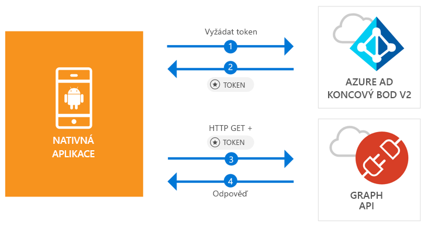

# <a name="quickstart-sign-in-users-and-call-the-microsoft-graph-api-from-an-android-app"></a>Rychlý start: Přihlášení uživatelů a volání rozhraní Microsoft Graph API z aplikace pro Android

[!INCLUDE [active-directory-develop-applies-v2-msal](../../../includes/active-directory-develop-applies-v2-msal.md)]

Tento rychlý start obsahuje vzorek kódu, který demonstruje, jak může aplikace pro Android přihlásit uživatele v rámci osobního nebo pracovního a školního účtu, získat přístupový token a volat rozhraní Microsoft Graph API.



> [!NOTE]
> **Požadavky**
> * Android Studio 3 nebo novější
> * Vyžaduje se Android SDK 21 nebo novější (doporučuje se SDK 27)

> [!div renderon="docs"]
> ## <a name="register-and-download"></a>Registrace a stažení
> ### <a name="register-and-configure-your-application-and-code-sample"></a>Registrace a konfigurace aplikace a vzorový kód
> #### <a name="step-1-register-your-application"></a>Krok 1: Registrace aplikace
> Postup při registraci aplikace a přidání informací o registraci aplikace k řešení:
> 1. Abyste mohli zaregistrovat aplikaci, přejděte na [portál pro registraci aplikací Microsoft](https://apps.dev.microsoft.com/portal/register-app).
> 1. Do pole **Application Name** (Název aplikace) zadejte název vaší aplikace.
> 1. Zkontrolujte, že není zaškrtnuté políčko **Guided Setup** (Instalační program s asistencí) a vyberte **Create** (Vytvořit).
> 1. Vyberte **Add Platform** (Přidat platformu), **Native Application** (Nativní aplikace) a pak **Save** (Uložit).

> [!div renderon="portal" class="sxs-lookup"]
> #### <a name="step-1-configure-your-application"></a>Krok 1: Konfigurace aplikace
> Aby vzorek kódu pro tento rychlý start fungoval, budete muset přidat adresu URL odpovědi jako **msal{AppId}://auth** (kde {AppId} je ID vaší aplikace).
> > [!div renderon="portal" id="makechanges" class="nextstepaction"]
> > [Udělat změnu za mě]()
>
> > [!div id="appconfigured" class="alert alert-info"]
> >  Vaše aplikace je nakonfigurovaná s těmito atributy.

#### <a name="step-2-download-the-project"></a>Krok 2: Stažení projektu

* [Stáhnout projekt pro Android Studio](https://github.com/Azure-Samples/active-directory-android-native-v2/archive/master.zip)

#### <a name="step-3-configure-your-project"></a>Krok 3: Konfigurace projektu

1. Extrahujte a otevřete projekt v nástroji Android Studio.
1. V části **app** > **java** > **<i>{host}.{namespace}</i>**, otevřete **MainActivity**.
1. Nahraďte řádek začínající `final static String CLIENT_ID` tímto kódem:

    > [!div renderon="portal" class="sxs-lookup"]
    > ```java
    > final static String CLIENT_ID = "ENTER_THE_APPLICATION_ID_HERE";
    > ```

    > [!div renderon="docs"]
    > ```java
    > final static String CLIENT_ID = "<ENTER_THE_APPLICATION_ID_HERE>";
    > ```

1. Otevřete: **app** > **manifests** > **AndroidManifest.xml**.
1. Do uzlu **manifest\application** přidejte následující aktivitu. Tento fragment kódu zaregistruje **BrowserTabActivity**, aby operační systém mohl obnovit aplikaci po dokončení ověřování:

    > [!div renderon="docs"]
    > ```xml
    > <!--Intent filter to capture System Browser calling back to our app after Sign In-->
    > <activity
    >     android:name="com.microsoft.identity.client.BrowserTabActivity">
    >     <intent-filter>
    >         <action android:name="android.intent.action.VIEW" />
    >         <category android:name="android.intent.category.DEFAULT" />
    >         <category android:name="android.intent.category.BROWSABLE" />
    > 
    >         <!--Add in your scheme/host from registered redirect URI-->
    >         <!--By default, the scheme should be similar to 'msal[appId]' -->
    >         <data android:scheme="msal<ENTER_THE_APPLICATION_ID_HERE>"
    >             android:host="auth" />
    >     </intent-filter>
    > </activity>
    > ```

    > [!div renderon="portal" class="sxs-lookup"]
    > ```xml
    > <!--Intent filter to capture System Browser calling back to our app after Sign In-->
    > <activity
    >     android:name="com.microsoft.identity.client.BrowserTabActivity">
    >     <intent-filter>
    >         <action android:name="android.intent.action.VIEW" />
    >         <category android:name="android.intent.category.DEFAULT" />
    >         <category android:name="android.intent.category.BROWSABLE" />
    > 
    >         <!--Add in your scheme/host from registered redirect URI-->
    >         <!--By default, the scheme should be similar to 'msal[appId]' -->
    >         <data android:scheme="msalENTER_THE_APPLICATION_ID_HERE"
    >             android:host="auth" />
    >     </intent-filter>
    > </activity>
    > ```

> [!div renderon="docs"]
> <span>6.</span> Místo `<ENTER_THE_APPLICATION_ID_HERE>` zadejte *ID svojí aplikace* . Pokud potřebuje vyhledat *ID aplikace*, přejděte na stránku *Overview* (Přehled).

## <a name="more-information"></a>Další informace

Pročtěte si následující oddíly, které obsahují další informace o tomto rychlém startu.

### <a name="msal"></a>MSAL

MSAL ([com.microsoft.identity.client](https://javadoc.io/doc/com.microsoft.identity.client/msal)) je knihovna, která slouží k přihlašování uživatelů a vyžádání tokenů pro přístup k rozhraní API chráněného službou Microsoft Azure Active Directory (Azure AD). Nainstalovat ji můžete pomocí nástroje Gradle tak, že přidáte následující řetězec v části **Gradle Scripts** (Skripty Gradle)  > **build.gradle (Module: app)** v části **Dependencies** (Závislosti):

```gradle  
implementation 'com.android.volley:volley:1.1.1'
implementation 'com.microsoft.identity.client:msal:0.1.+'
```

### <a name="msal-initialization"></a>Inicializace knihovny MSAL

Odkaz na knihovnu MSAL můžete přidat tak, že přidáte následující kód:

```java
import com.microsoft.identity.client.*;
```

Potom inicializujte knihovnu MSAL pomocí následujícího kódu:

```java
sampleApp = new PublicClientApplication(
        this.getApplicationContext(),
        CLIENT_ID);
```

> |Kde: ||
> |---------|---------|
> |`CLIENT_ID` | ID aplikace z aplikace zaregistrované na webu *portal.azure.com* |

### <a name="requesting-tokens"></a>Žádosti o tokeny

Knihovna MSAL používá k získání tokenů dvě metody: `acquireToken` a `acquireTokenSilentAsync`.

#### <a name="getting-a-user-token-interactively"></a>Interaktivní získání tokenu uživatele

Některá řešení vyžadují, aby uživatelé museli komunikovat s koncovým bodem Azure AD v2.0. Výsledkem je kontextové přepnutí do systémového prohlížeče, aby bylo možné ověřit přihlašovací údaje uživatele nebo získat jeho souhlas. Možné příklady:

* Při prvním přihlášení uživatele k aplikaci
* Když je potřeba, aby uživatelé znovu zadali svoje přihlašovací údaje, protože vypršela platnost hesla
* Když vaše aplikace žádá o přístup k prostředku, ke kterému musí dát uživatel souhlas
* Když je nutné dvoufaktorové ověřování

```java
sampleApp.acquireToken(this, SCOPES, getAuthInteractiveCallback());
```

> |Kde:||
> |---------|---------|
> | `SCOPES` | Obsahuje požadované obory (to znamená `{ "user.read" }` pro Microsoft Graph nebo `{ "<Application ID URL>/scope" }` pro vlastní webová rozhraní API (např. `api://<Application ID>/access_as_user`) |
> | `getAuthInteractiveCallback` | Zpětné volání, když se ovládací prvek předá zpět do aplikace po ověření |

#### <a name="getting-a-user-token-silently"></a>Získání tokenu uživatele bez upozornění

Nechcete vyžadovat, aby uživatel ověřoval přihlašovací údaje pokaždé, když potřebuje přístup k prostředku. Ve většině případů budete chtít tokeny pořizovat a obnovovat bez nutnosti zásahu uživatele. Po počáteční metodě `acquireToken` můžete použít metodu `AcquireTokenSilentAsync` a získat tokeny pro přístup k chráněným prostředkům:

```java
sampleApp.acquireToken(getActivity(), SCOPES, getAuthInteractiveCallback());
```

> |Kde:||
> |---------|---------|
> | `SCOPES` | Obsahuje požadované obory (to znamená `{ "user.read" }` pro Microsoft Graph nebo `{ "<Application ID URL>/scope" }` pro vlastní webová rozhraní API (např. `api://<Application ID>/access_as_user`) |
> | `getAuthInteractiveCallback` | Zpětné volání, když se ovládací prvek předá zpět do aplikace po ověření |

## <a name="next-steps"></a>Další postup

### <a name="learn-the-steps-to-create-the-application-used-in-this-quickstart"></a>Postup vytvoření aplikace použité v tomto rychlém startu

Vyzkoušejte kurz pro Android, kde najdete podrobný návod k vytváření aplikací a nových funkcí, včetně úplného popisu tohoto rychlého startu.

> [!div class="nextstepaction"]
> [Kurz volání Graph API pro Android](https://docs.microsoft.com/azure/active-directory/develop/guidedsetups/active-directory-android)

### <a name="msal-for-android-library-wiki"></a>Wiki knihovny MSAL pro Android

Přečtěte si další informace o knihovně MSAL pro Android:

> [!div class="nextstepaction"]
> [Wiki knihovny MSAL pro Android](https://github.com/AzureAD/microsoft-authentication-library-for-android/wiki)

[!INCLUDE [Help and support](../../../includes/active-directory-develop-help-support-include.md)]