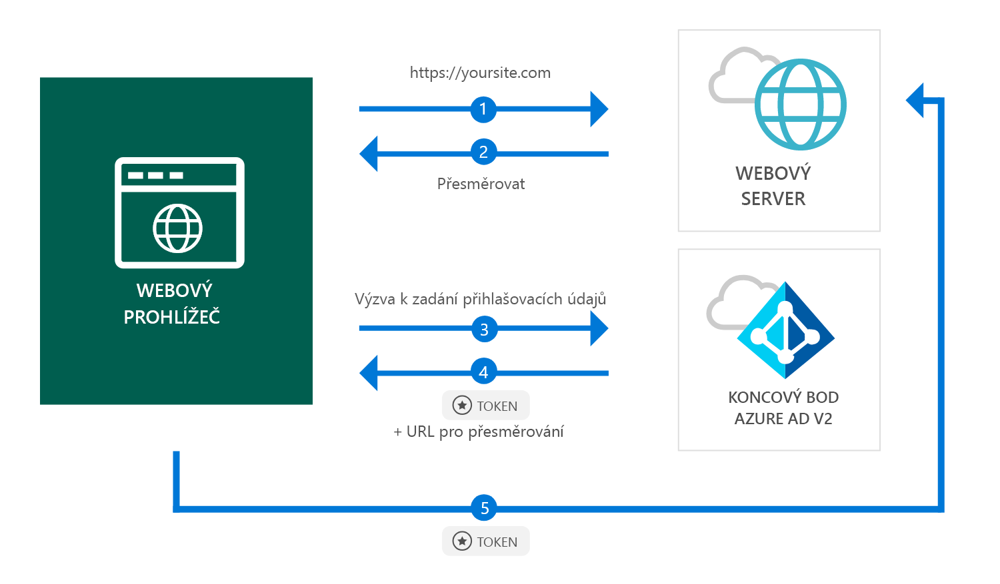

# <a name="quickstart-add-sign-in-with-microsoft-to-an-aspnet-web-app"></a>Rychlý start: Implementace přihlašování přes účet Microsoft do webové aplikace ASP.NET

[!INCLUDE [active-directory-develop-applies-v2](../../../includes/active-directory-develop-applies-v2.md)]

V tomto rychlém startu se dozvíte, jak může webová aplikace ASP.NET přihlašovat osobní účty (hotmail.com, outlook.com a další) i pracovní a školní účty z libovolné instance služby Azure Active Directory (Azure AD).



> [!div renderon="docs"]
> ## <a name="register-your-application-and-download-your-quickstart-app"></a>Registrace aplikace a stažení aplikace pro rychlý start
>
> ### <a name="register-and-configure-your-application-and-code-sample"></a>Zaregistrujte si a nakonfigurujte svoji aplikaci a vzorový kód
> #### <a name="step-1-register-your-application"></a>Krok 1: Zaregistrujte si aplikaci
> 
> 1. Přejděte na portál [Microsoft Application Registration Portal](https://apps.dev.microsoft.com/portal/register-app).
> 1. Zadejte název svojí aplikace, ujistěte se, že políčko **Guided Setup** (Instalace s asistencí) není zaškrtnuté, a klikněte na **Create** (Vytvořit).
> 1. Klikněte na `Add Platform`, pak vyberte `Web`.
> 1. Zajistěte, aby bylo políčko **Allow Implicit Flow** (Povolit implicitní tok) *zaškrtnuté*.
> 1. V části **Redirect URLs** (Adresy URL pro přesměrování) zadejte `https://localhost:44368/`.
> 1. Přejděte do dolní části stránky a klikněte na **Save** (Uložit).

> [!div class="sxs-lookup" renderon="portal"]
> #### <a name="step-1-configure-your-application-in-azure-portal"></a>Krok 1: Nakonfigurujte si aplikaci na portálu Azure Portal
> Aby mohl vzorový kód pro rychlý start fungovat, musíte přidat adresu URL odpovědi ve formě `https://localhost:44368/`.
> > [!div renderon="portal" id="makechanges" class="nextstepaction"]
> > [Udělat změnu za mě]()
>
> > [!div id="appconfigured" class="alert alert-info"]
> >  Vaše aplikace už má tento atribut nakonfigurovaný.

#### <a name="step-2-download-your-project"></a>Krok 2: Stáhněte si projekt

[Stáhněte si řešení Visual Studio 2017.](https://github.com/AzureADQuickStarts/AppModelv2-WebApp-OpenIDConnect-DotNet/archive/master.zip)

#### <a name="step-3-configure-your-visual-studio-project"></a>Krok 3: Nakonfigurujte si projekt sady Visual Studio

1. Extrahujte soubor zip do místní složky (například **C:\Azure-Samples**).
1. Otevřete řešení v sadě Visual Studio (AppModelv2-WebApp-OpenIDConnect-DotNet.sln).
1. Upravte soubor **Web.config** a položku `Enter_the_Application_Id_here` nahraďte ID aplikace, kterou jste právě zaregistrovali:

    ```xml
    <add key="ClientId" value="Enter_the_Application_Id_here" />
    ```
    
> [!div class="sxs-lookup" renderon="portal"]
> [!IMPORTANT]
> Pokud je vaše aplikace určená *pro jednoho tenanta* (tj. cílí na účty jen v tomto adresáři), vyhledejte v souboru **Web.config** hodnotu `Tenant` a nahraďte hodnotu `common` příslušným **ID tenanta** nebo **názvem tenanta** (například contoso.microsoft.com). Název tenanta zjistíte na **stránce s přehledem**.

## <a name="more-information"></a>Další informace

Tato část obsahuje základní informace o kódu, který je nutný pro přihlášení uživatelů. Tyto informace vám pomůžou pochopit způsob fungování kódu a hlavní argumenty a budou užitečné i v případě, že budete chtít implementovat přihlášení do existující aplikace ASP.NET.

### <a name="owin-middleware-nuget-packages"></a>Balíčky NuGet middlewaru OWIN

Můžete nastavit ověřovací kanál využívající ověřování na základě souborů cookie tak, že použijete OpenID Connect v ASP.NET společně s balíčky middlewaru OWIN. Uvedené balíčky je možné nainstalovat spuštěním následujících příkazů v **konzole Správce balíčků** v sadě Visual Studio:

```powershell
Install-Package Microsoft.Owin.Security.OpenIdConnect
Install-Package Microsoft.Owin.Security.Cookies
Install-Package Microsoft.Owin.Host.SystemWeb
```

### <a name="owin-startup-class"></a>Třída OWIN Startup

Middleware OWIN používá *třídu Startup*, která se spustí při inicializaci hostitelského procesu (v případě tohoto rychlého startu jde o soubor *startup.cs* v kořenové složce). Následující kód obsahuje parametr použitý v rámci tohoto rychlého startu:

```csharp
public void Configuration(IAppBuilder app)
{
    app.SetDefaultSignInAsAuthenticationType(CookieAuthenticationDefaults.AuthenticationType);

    app.UseCookieAuthentication(new CookieAuthenticationOptions());
    app.UseOpenIdConnectAuthentication(
        new OpenIdConnectAuthenticationOptions
        {
            // Sets the ClientId, authority, RedirectUri as obtained from web.config
            ClientId = clientId,
            Authority = authority,
            RedirectUri = redirectUri,
            // PostLogoutRedirectUri is the page that users will be redirected to after sign-out. In this case, it is using the home page
            PostLogoutRedirectUri = redirectUri,
            Scope = OpenIdConnectScope.OpenIdProfile,
            // ResponseType is set to request the id_token - which contains basic information about the signed-in user
            ResponseType = OpenIdConnectResponseType.IdToken,
            // ValidateIssuer set to false to allow personal and work accounts from any organization to sign in to your application
            // To only allow users from a single organizations, set ValidateIssuer to true and 'tenant' setting in web.config to the tenant name
            // To allow users from only a list of specific organizations, set ValidateIssuer to true and use ValidIssuers parameter 
            TokenValidationParameters = new TokenValidationParameters()
            {
                ValidateIssuer = false
            },
            // OpenIdConnectAuthenticationNotifications configures OWIN to send notification of failed authentications to OnAuthenticationFailed method
            Notifications = new OpenIdConnectAuthenticationNotifications
            {
                AuthenticationFailed = OnAuthenticationFailed
            }
        }
    );
}
```

> |Kde  |  |
> |---------|---------|
> | `ClientId`     | ID aplikace, kterou jste zaregistrovali na portálu Azure Portal |
> | `Authority`    | Koncový bod služby tokenů zabezpečení pro uživatele k ověření, obvykle https://login.microsoftonline.com/{tenant}/v2.0 pro veřejný cloud, kde hodnota {tenant} představuje název tenanta, ID tenanta nebo hodnotu *common* odkazující na společný koncový bod (používaný u multitenantních aplikací) |
> | `RedirectUri`  | Adresa URL, na kterou jsou uživatelé přesměrováni po ověření oproti koncovému bodu Azure AD v2.0 |
> | `PostLogoutRedirectUri`     | Adresa URL, na kterou jsou uživatelé přesměrováni po odhlášení |
> | `Scope`     | Seznam požadovaných oborů oddělených mezerami |
> | `ResponseType`     | Žádost, aby odpověď ověřování obsahovala token ID |
> | `TokenValidationParameters`     | Seznam parametrů pro ověřování tokenů; v tomto případě je parametr `ValidateIssuer` nastavený na hodnotu `false`, což znamená, že může přijímat přihlášení všech typů osobních, pracovních nebo školních účtů |
> | `Notifications`     | Seznam delegátů, které jde spustit u různých zpráv *OpenIdConnect* |

### <a name="initiate-an-authentication-challenge"></a>Iniciace výzvy ověřování

Uživatele můžete k přihlášení přinutit tím, že si v řadiči vyžádáte výzvu ověřování:

```csharp
public void SignIn()
{
    if (!Request.IsAuthenticated)
    {
        HttpContext.GetOwinContext().Authentication.Challenge(
            new AuthenticationProperties{ RedirectUri = "/" },
            OpenIdConnectAuthenticationDefaults.AuthenticationType);
    }
}
```

> [!TIP]
> Vyžádání výzvy ověřování výše uvedeným způsobem je volitelné a obvykle se používá v případě, že chcete zajistit přístup k zobrazení ověřeným i neověřeným uživatelům. Řadiče můžete zároveň chránit způsobem popsaným v další části.

### <a name="protect-a-controller-or-a-controllers-method"></a>Ochrana řadiče nebo akcí řadiče

Řadič a jeho akce můžete chránit pomocí atributu `[Authorize]`. Tento atribut omezuje přístup k řadiči nebo akcím tak, že ho umožňuje pouze ověřeným uživatelům. To znamená, že výzva ověřování se iniciuje automaticky, pokud o přístup k některé z akcí nebo řadiči s nastaveným atributem `[Authorize]` pokusí *neověřený* uživatel.

## <a name="next-steps"></a>Další kroky

Vyzkoušejte kurz pro ASP.NET, který nabízí vyčerpávající podrobný návod k vytváření aplikací a nových funkcí, včetně detailního vysvětlení těchto pokynů pro rychlý start.

### <a name="learn-the-steps-to-create-the-application-used-in-this-quickstart"></a>Postup vytvoření aplikace použité v tomto rychlém startu

> [!div class="nextstepaction"]
> [Kurz týkající se přihlašování](.\tutorial-v2-asp-webapp.md)

[!INCLUDE [Help and support](../../../includes/active-directory-develop-help-support-include.md)]