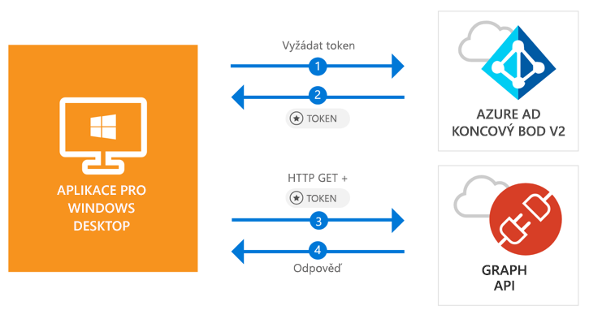

# <a name="quickstart-acquire-a-token-and-call-microsoft-graph-api-from-a-windows-desktop-app"></a>Rychlý start: Získání tokenu a volání rozhraní API Microsoft Graph z desktopové aplikace Windows

[!INCLUDE [active-directory-develop-applies-v2-msal](../../../includes/active-directory-develop-applies-v2-msal.md)]

V tomto rychlém startu se dozvíte, jak napsat desktopovou aplikaci .NET pro Windows (WPF), která podporuje přihlášení osobním, pracovním a školním účtem, jak získat přístupový token a volat rozhraní Microsoft Graph API.



> [!div renderon="docs"]
> ## <a name="register-and-download-your-quickstart-app"></a>Registrace a stažení aplikace pro rychlý start
> Aplikaci pro rychlý start můžete spustit dvěma způsoby:
> * [Expresní] [Možnost 1: Registrace a automatická konfigurace aplikace a následné stažení vzorového kódu](#option-1-register-and-auto-configure-your-app-and-then-download-your-code-sample)
> * [Ruční] [Možnost 2: Registrace a ruční konfigurace aplikace a vzorového kódu](#option-2-register-and-manually-configure-your-application-and-code-sample)
>
> ### <a name="option-1-register-and-auto-configure-your-app-and-then-download-your-code-sample"></a>Možnost 1: Registrace a automatická konfigurace aplikace a následné stažení vzorového kódu
>
> 1. Přejděte na [Azure Portal – Registrace aplikace (Preview)](https://portal.azure.com/?Microsoft_AAD_RegisteredApps=true#blade/Microsoft_AAD_RegisteredApps/applicationsListBlade/quickStartType/WinDesktopQuickstartPage/sourceType/docs).
> 1. Zadejte název vaší aplikace a Vyberte **Zaregistrovat**.
> 1. Postupujte podle pokynů ke stažení a automatické konfiguraci nové aplikace jedním kliknutím.
>
> ### <a name="option-2-register-and-manually-configure-your-application-and-code-sample"></a>Možnost 2: Registrace a ruční konfigurace aplikace a vzorového kódu
>
> #### <a name="step-1-register-your-application"></a>Krok 1: Zaregistrujte si aplikaci
> Pokud chcete zaregistrovat aplikaci a ručně přidat informace o registraci aplikace ke svému řešení, postupujte následovně:
>
> 1. Přihlaste se k webu [Azure Portal](https://portal.azure.com) pomocí pracovního nebo školního účtu nebo osobního účtu Microsoft.
> 1. Pokud váš účet umožňuje přístup k více tenantům, vyberte svůj účet v pravém horním rohu a nastavte relaci portálu na požadovaného tenanta Azure AD.
> 1. V levém navigačním podokně vyberte službu **Azure Active Directory** a pak vyberte **Registrace aplikací (Preview)** > **Nová registrace**.
> 1. Když se zobrazí stránka **Registrace aplikace**, zadejte registrační informace vaší aplikace:
>      - V části **Název** zadejte smysluplný název aplikace, který se zobrazí uživatelům aplikace, například `Win-App-calling-MsGraph`.
>      - V části **Podporované typy účtu** vyberte **Účty v libovolném organizačním adresáři a osobní účty Microsoft (například Skype, Xbox, Outlook.com)**.
>      - Výběrem možnosti **Registrovat** aplikaci vytvořte.
> 1. V seznamu stránek pro aplikaci vyberte **Ověřování**.
> 1. V části **Identifikátory URI pro přesměrování** vyhledejte část **Navrhované identifikátory URI pro přesměrování pro veřejné klienty (mobilní, desktopové)** a vyberte **urn:ietf:wg:oauth:2.0:oob**.
> 1. Vyberte **Uložit**.

> [!div class="sxs-lookup" renderon="portal"]
> #### <a name="step-1-configure-your-application-in-azure-portal"></a>Krok 1: Nakonfigurujte si aplikaci na portálu Azure Portal
> Aby mohl tento rychlý start fungovat, je nutné pro ukázkový kód přidat adresu URL odpovědi, například **urn: ietf:wg:oauth:2.0:oob**.
> > [!div renderon="portal" id="makechanges" class="nextstepaction"]
> > [Udělat změnu za mě]()
>
> > [!div id="appconfigured" class="alert alert-info"]
> >  Vaše aplikace je nakonfigurovaná s těmito atributy.

#### <a name="step-2-download-your-visual-studio-project"></a>Krok 2: Stažení projektu sady Visual Studio

[Stažení projektu sady Visual Studio 2017](https://github.com/Azure-Samples/active-directory-dotnet-desktop-msgraph-v2/archive/master.zip)

#### <a name="step-3-configure-your-visual-studio-project"></a>Krok 3: Nakonfigurujte si projekt sady Visual Studio

1. Extrahujte soubor zip do místní složky blízko ke kořenovému adresáři disku, například **C:\Azure-Samples**.
1. Otevřete projekt v sadě Visual Studio.
1. Upravte soubor **App.Xaml.cs** a nahraďte hodnoty polí `ClientId` a `Tenant` následujícím kódem:

    ```csharp
    private static string ClientId = "Enter_the_Application_Id_here";
    private static string Tenant = "Enter_the_Tenant_Info_Here";
    ```

> [!div renderon="docs"]
> Kde:
> - Hodnota `Enter_the_Application_Id_here` je **ID aplikace (klienta)**, kterou jste zaregistrovali.
> - Hodnota `Enter_the_Tenant_Info_Here` je nastavená na jednu z následujících možností:
>   - Pokud vaše aplikace podporuje režim **Účty jen v tomto organizačním adresáři**, nahraďte tuto hodnotu za **ID tenanta** nebo **Název tenanta** (například contoso.microsoft.com).
>   - Pokud vaše aplikace podporuje režim **Účty v libovolném organizačním adresáři**, nahraďte tuto hodnotu za `organizations`.
>   - Pokud vaše aplikace podporuje režim **Účty v libovolném organizačním adresáři a osobní účty Mircosoft**, nahraďte tuto hodnotu za `common`.
>
> > [!TIP]
> > Hodnoty **ID aplikace (klienta)**, **ID adresáře (tenanta)** a **Podporované typy účtu** najdete na stránce **Přehled** aplikace na webu Azure Portal.

## <a name="more-information"></a>Další informace

### <a name="msalnet"></a>MSAL.NET

MSAL ([Microsoft.Identity.Client](https://www.nuget.org/packages/Microsoft.Identity.Client)) je knihovna, která slouží k přihlašování uživatelů a vyžádání tokenů pro přístup k rozhraní API chráněného službou Microsoft Azure Active Directory (Azure AD). MSAL můžete nainstalovat spuštěním následujícího příkazu v **Konzole Správce balíčků** v sadě Visual Studio:

```powershell
Install-Package Microsoft.Identity.Client -Pre
```

### <a name="msal-initialization"></a>Inicializace knihovny MSAL

Odkaz na knihovnu MSAL můžete přidat tak, že přidáte následující kód:

```csharp
using Microsoft.Identity.Client;
```

Potom inicializujte knihovnu MSAL pomocí následujícího kódu:

```csharp
public static PublicClientApplication PublicClientApp = new PublicClientApplication(ClientId);
```

> |Kde: ||
> |---------|---------|
> | `ClientId` | Je **ID aplikace (klienta)**, kterou jste zaregistrovali na webu Azure Portal. Tuto hodnotu najdete na stránce **Přehled** aplikace na webu Azure Portal. |

### <a name="requesting-tokens"></a>Žádosti o tokeny

Knihovna MSAL používá k získání tokenů dvě metody: `AcquireTokenAsync` a `AcquireTokenSilentAsync`.

#### <a name="get-a-user-token-interactively"></a>Interaktivní získání tokenu uživatele

V některých situacích je nutné, aby uživatelé komunikovali s koncovým bodem Azure AD v2.0 prostřednictvím automaticky otevíraných oken, kde se ověřují jejich přihlašovací údaje nebo kde udělují souhlas. Možné příklady:

- Při prvním přihlášení uživatele k aplikaci
- Když je potřeba, aby uživatelé znovu zadali svoje přihlašovací údaje, protože vypršela platnost hesla
- Když vaše aplikace žádá o přístup k prostředku, ke kterému musí dát uživatel souhlas
- Když je nutné dvoufaktorové ověřování

```csharp
authResult = await App.PublicClientApp.AcquireTokenAsync(_scopes);
```

> |Kde:||
> |---------|---------|
> | `_scopes` | Obsahuje požadované obory, jako například `{ "user.read" }` pro Microsoft Graph nebo `{ "api://<Application ID>/access_as_user" }` pro vlastní webová rozhraní API. |

#### <a name="get-a-user-token-silently"></a>Získání tokenu uživatele bez upozornění

Nechcete vyžadovat, aby uživatel ověřoval přihlašovací údaje pokaždé, když potřebuje přístup k prostředku. Ve většině případů budete chtít tokeny pořizovat a obnovovat bez nutnosti zásahu uživatele. Po počáteční metodě `AcquireTokenAsync` můžete použít metodu `AcquireTokenSilentAsync` a získat tokeny pro přístup k chráněným prostředkům:

```csharp
var accounts = await App.PublicClientApp.GetAccountsAsync();
authResult = await App.PublicClientApp.AcquireTokenSilentAsync(scopes, accounts.FirstOrDefault());
```

> |Kde: ||
> |---------|---------|
> | `scopes` | Obsahuje požadované obory, jako například `{ "user.read" }` pro Microsoft Graph nebo `{ "api://<Application ID>/access_as_user" }` pro vlastní webová rozhraní API. |
> | `accounts.FirstOrDefault()` | Určuje prvního uživatele v mezipaměti (MSAL podporuje více uživatelů v jediné aplikaci). |

[!INCLUDE [Help and support](../../../includes/active-directory-develop-help-support-include.md)]

## <a name="next-steps"></a>Další postup

Vyzkoušejte kurz pro plochu Windows, kde najdete podrobný návod k vytváření aplikací a nových funkcí, včetně úplného popisu tohoto rychlého startu.

> [!div class="nextstepaction"]
> [Kurz volání rozhraní Graph API](https://docs.microsoft.com/azure/active-directory/develop/guidedsetups/active-directory-windesktop)

