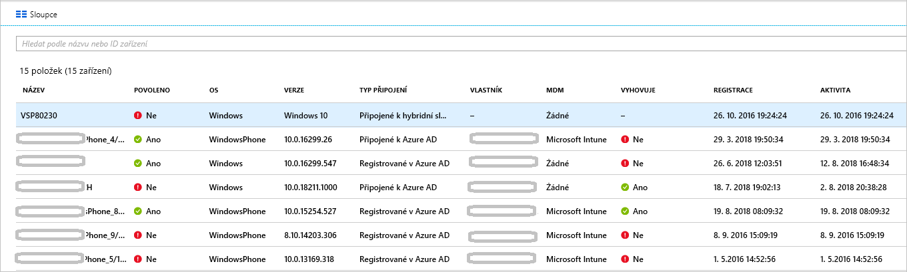

# <a name="how-to-manage-the-stale-devices-in-azure-ad"></a>Návod: Správa zastaralých zařízení ve službě Azure AD

Registrace zařízení, která už nejsou zapotřebí, měla se kvůli dokončení jejich životního cyklu měla v ideálním případě zrušit. Avšak například kvůli ztraceným, odcizeným a poškozeným zařízením nebo přeinstalaci operačního systému zpravidla ve svém prostředí máte zastaralá zařízení. Jako správce IT budete zřejmě potřebovat nějakou metodu pro odebrání zastaralých zařízení, abyste se mohli soustředit na správu zařízení, která to opravdu potřebují.

V tomto článku se dozvíte, jak efektivně spravovat zastaralá zařízení ve vašem prostředí.
  

## <a name="what-is-a-stale-device"></a>Co je zastaralé zařízení?

Zastaralé zařízení je zařízení, které bylo zaregistrováno ve službě Azure AD, ale po určitou dobu se nepoužívá pro přístup ke cloudovým aplikacím. Zastaralá zařízení ovlivňují vaši schopnost spravovat a podporovat zařízení a uživatele v tenantovi, protože: 

- Duplicitní zařízení mohou pracovníkům helpdesku znesnadnit identifikaci, které zařízení je aktuálně aktivní.

- Zvýšený počet zařízení vytváří zbytečné zpětné zápisy zařízení, což prodlužuje dobu synchronizace připojení ke službě AAD.

- Kvůli obecnému udržení pořádku a dodržování předpisů potřebujete znát přesný stav zařízení. 


Zastaralá zařízení ve službě Azure AD mohou kolidovat s obecnými zásadami životního cyklu zařízení ve vaší organizaci.


## <a name="detect-stale-devices"></a>Detekce zastaralých zařízení

Protože se zastaralé zařízení definuje jako registrované zařízení, které se po určitou dobu nepoužívá pro přístup ke cloudovým aplikacím, vyžaduje detekce zastaralých zařízení nějakou vlastnost související s časovým razítkem. Ve službě Azure AD má tato vlastnost název **ApproximateLastLogonTimestamp**, neboli **časové razítko aktivity**. Pokud rozdíl mezi nynějškem a hodnotou **časového razítka aktivity** překročí dobu, kterou jste definovali pro aktivní zařízení, považuje se zařízení za zastaralé. Toto **časové razítko aktivity** je teď ve veřejné verzi Preview.

## <a name="how-is-the-value-of-the-activity-timestamp-managed"></a>Jak se hodnota časového razítka aktivity spravuje?  

Vyhodnocení časového razítka aktivity se aktivuje při pokusu o ověření zařízení. Služba Azure AD časové razítko aktivity vyhodnocuje, když:

- Byly aktivovány zásady podmíněného přístupu, které vyžadují [spravovaná zařízení](../conditional-access/require-managed-devices.md) nebo [schválené klientské aplikace](../conditional-access/app-based-conditional-access.md).

- Jsou v síti aktivní zařízení s Windows 10, která jsou připojená k Azure AD nebo hybridně připojená k Azure AD. 

- Zařízení spravovaná přes Intune se přihlásí k této službě.


Pokud je rozdíl mezi stávající hodnotou časového razítka aktivity a aktuální hodnotou větší než 14 dní, nahradí se existující hodnota novou hodnotou.
    

## <a name="how-do-i-get-the-activity-timestamp"></a>Jak získám časové razítko aktivity?

Ke získání hodnoty časového razítka aktivity máte dvě možnosti:

- Sloupec **Aktivita** na [stránce se zařízeními](https://portal.azure.com/#blade/Microsoft_AAD_IAM/DevicesMenuBlade/Devices) na webu Azure Portal

    


- Rutina [Get-MsolDevice](https://docs.microsoft.com/powershell/module/msonline/get-msoldevice?view=azureadps-1.0)

    


## <a name="plan-the-cleanup-of-your-stale-devices"></a>Plánování úklidu zastaralých zařízení

Pokud chcete ve svém prostředí efektivně uklidit zastaralá zařízení, měli byste definovat související zásady. Tyto zásady vám pomohou zohlednit všechny aspekty, které souvisejí se zastaralými zařízeními. V následujících oddílech najdete příklady častých aspektů při vytváření těchto zásad. 

### <a name="cleanup-account"></a>Úklidový účet

K aktualizaci zařízení ve službě Azure AD potřebujete účet, který má přiřazenu jednu z následujících rolí:

- Globální správce

- Správce cloudových zařízení (nová role, která je právě dostupná)

- Správce služby Intune

V zásadách úklidu vyberte účty, které mají přiřazené požadované role. 


### <a name="timeframe"></a>Časové období

Definujte časové období, které je ukazatelem zastaralého zařízení. Při definování časového období zohledněte 14denní interval aktualizace časového razítka aktivity. Pro ukazatel zastaralého zařízení byste například neměli uvažovat o časovém razítku, které je kratší než 14 dnů. V určitých situacích se zařízení může jevit jako zastaralé, přestože není. Vlastník takového zařízení může být například na dovolené nebo na nemocenské,  která přesahuje časové období pro zastaralá zařízení.

### <a name="disable-devices"></a>Zakázání zařízení

Zařízení, které se jeví jako zastaralé, není vhodné okamžitě odstranit, protože v případě falešně pozitivního výsledku nemůžete odstranění vrátit zpět. Osvědčeným postupem je zakázat zařízení po určité období odkladu předtím, než ho odstraníte. V zásadách definujte časové období, po které bude zařízení před odstraněním zakázané.


### <a name="mdm-controlled-devices"></a>Zařízení pod kontrolou správy mobilních zařízení (MDM)

Pokud je zařízení pod kontrolou Intune nebo jiných řešení MDM, před zakázáním nebo odstraněním vyřaďte zařízení z tohoto systému správy.


### <a name="system-managed-devices"></a>Zařízení spravovaná systémem

Neodstraňujte zařízení spravovaná systémem. Jedná se obecně o zařízení, jako je například autopilot. Po odstranění nelze tato zařízení znovu zřídit. Nová rutina Get-MmsolDevice standardně vylučuje zařízení spravovaná systémem. 


### <a name="hybrid-azure-ad-joined-devices"></a>Zařízení hybridně připojená k Azure AD

Zařízení hybridně připojená k Azure AD by měla dodržovat zásady pro správu místních zastaralých zařízení. 

Službu Azure AD uklidíte takto:

- **Zařízení s Windows 10** – zakažte nebo odstraňte zařízení s Windows 10 v místní službě AD a nechejte nástroj Azure AD Connect synchronizovat stav změněných zařízení se službou Azure AD.

- **Windows 7/8** – zakažte nebo odstraňte zařízení s Windows 10 ve službě Azure AD. K zakázání nebo odstranění zařízení s Windows 7/8 ve službě Azure AD nemůžete použít Azure AD Connect.


### <a name="azure-ad-joined-devices"></a>Zařízení připojená k Azure AD

Zakažte nebo odstraňte zařízení připojená k Azure AD ve službě Azure AD.


### <a name="azure-ad-registered-devices"></a>Zařízení zaregistrovaná v Azure AD

Zakažte nebo odstraňte zařízení zaregistrovaná v Azure AD ve službě Azure AD.


## <a name="cleanup-stale-devices-in-the-azure-portal"></a>Úklid zastaralých zařízení na webu Azure Portal  

I když zastaralá zařízení můžete uklidit na webu Azure Portal, je efektivnější použít k tomuto účelu powershellový skript. Pomocí nejnovějšího modulu PowerShell V1 můžete použít filtr časového razítka a odfiltrovat zařízení spravovaná systémem, například autopilot. V tento okamžik není doporučeno používat PowerShell V2.


Typická rutina se skládá z následujících kroků:

1. Připojení ke službě Azure Active Directory pomocí rutiny [Connect-MsolService](https://docs.microsoft.com/powershell/module/msonline/connect-msolservice?view=azureadps-1.0)

2. Získání seznamu zařízení

3. Zakázání zařízení pomocí rutiny [Disable-MsolDevice](https://docs.microsoft.com/powershell/module/msonline/disable-msoldevice?view=azureadps-1.0) 

4. Odebrání zařízení pomocí rutiny [Remove-MsolDevice](https://docs.microsoft.com/powershell/module/msonline/remove-msoldevice?view=azureadps-1.0)

### <a name="get-the-list-of-devices"></a>Získání seznamu zařízení

Všechna zařízení získáte a vrácená data uložíte do souboru CSV takto:

```powershell
Get-MsolDevice -all | select-object -Property Enabled, DeviceId, DisplayName, DeviceTrustType, Approxi
mateLastLogonTimestamp | export-csv devicelist-summary.csv
```

Pokud máte v adresáři velký počet zařízení, omezte počet vrácených zařízení pomocí filtru časového razítka. Všechna zařízení s časovým razítkem starším než určité datum a vrácená data uložíte do souboru CSV takto: 

```powershell
$dt = [datetime]’2017/01/01’
Get-MsolDevice -all -LogonTimeBefore $dt | select-object -Property Enabled, DeviceId, DisplayName, DeviceTrustType, ApproximateLastLogonTimestamp | export-csv devicelist-olderthan-Jan-1-2017-summary.csv
```


## <a name="what-you-should-know"></a>Co byste měli vědět

### <a name="why-is-the-timestamp-not-updated-more-frequently"></a>Proč se časové razítko neaktualizuje častěji?

Časové razítko se aktualizuje kvůli podpoře životního cyklu zařízení. Nejedná se o audit. Pokud o zařízení potřebujete častější aktualizace, použijte protokoly auditu přihlašování.

### <a name="why-should-i-worry-about-my-bitlocker-keys"></a>Proč si mám dělat starosti o klíče nástroje BitLocker?

Pokud je to nakonfigurováno, jsou klíče nástroje BitLocker pro zařízení s Windows 10 uložené v objektu zařízení služby Azure AD. Když odstraníte zastaralé zařízení, odstraníte také klíče nástroje Bitlocker, které jsou uložené v tomto zařízení. Před odstraněním zastaralého zařízení byste měli určit, jestli jsou zásady úklidu v souladu s životním cyklem zařízení. 

### <a name="how-do-i-know-all-the-type-of-devices-joined"></a>Jak poznám všechny typy připojených zařízení?

Další informace o různých typech najdete v [přehledu správy zařízení](overview.md).

### <a name="what-happens-when-i-disable-a-device"></a>Co se stane, když zařízení zakážu?

Všechna ověřování, kdy se zařízení používá k ověřování vůči službě Azure AD, budou odepřena. Obvyklými příklady jsou:

- **Zařízení hybridně připojená k Azure AD** – uživatelé mohou zařízení používat pro přihlášení k místní doméně. Nemají ale přístup k prostředkům Azure AD, jako je Office 365.

- **Zařízení připojená k Azure AD** – uživatelé nemůžou používat zařízení k přihlášení. 

- **Mobilní zařízení** – uživatel nemá přístup k prostředkům Azure AD, jako je Office 365. 


## <a name="next-steps"></a>Další kroky

Přehled správy zařízení na webu Azure Portal najdete v tématu věnovaném [správě zařízení pomocí webu Azure Portal](device-management-azure-portal.md).


