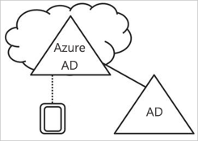
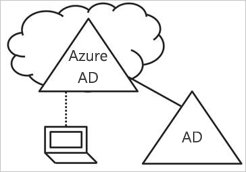
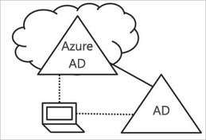

# Úvod do správy zařízení ve službě Azure Active Directory

Ve světě upřednostňujícím mobilní a cloud na prvním Azure Active Directory (Azure AD) umožňuje jednotné přihlašování k zařízení, aplikacím a službám odkudkoli. S čím zařízení – včetně přineste si vlastní zařízení (BYOD) se odborníci v oblasti IT potýkají s dva dosáhnout cíle:

- Poskytněte koncovým uživatelům, aby byli produktivní, kdykoli a kdekoli
- Ochrana podnikových prostředků v čase

Pomocí zařízení jsou vaši uživatelé získají přístup k firemním prostředkům. Pokud chcete chránit vaše podnikové prostředky, jako správce IT, chcete mít kontrolu nad tato zařízení. To umožňuje Ujistěte se, že vaši uživatelé přistupují ze zařízení, která splňují vaše standardy zabezpečení a dodržování předpisů vašich prostředků. 

Správa zařízení je také základem [podmíněného přístupu podle zařízení](../conditional-access/require-managed-devices.md). Pomocí podmíněného přístupu podle zařízení můžete zajistit, že přístup k prostředkům ve vašem prostředí je možné pouze se spravovanými zařízeními.   

Tento článek vysvětluje, jak funguje správa zařízení ve službě Azure Active Directory.

## Zařízení pod kontrolu služby Azure AD

Pokud chcete získat zařízení pod kontrolu služby Azure AD, máte dvě možnosti:

- Registrace 
- Připojení

**Registrace** zařízení do služby Azure AD umožňuje spravovat identitu zařízení. Když je zařízení registrováno, registrace zařízení služby Azure AD nabízí zařízení s identitou, která se používá k ověření zařízení, když se uživatel přihlásí ke službě Azure AD. Identitu můžete použít k povolení nebo zakázání zařízení.

V kombinaci s řešením správy mobilních zařízení, jako je například Microsoft Intune, budou atributy zařízení ve službě Azure AD jsou aktualizovány o další informace o zařízení. To vám umožňuje vytvořit pravidla podmíněného přístupu, která vynucují, aby přístup měla pouze taková zařízení, která splňují vaše standardy zabezpečení a dodržování předpisů.  Další informace o registraci zařízení v Microsoft Intune najdete v tématu registrace zařízení pro správu v Intune.

**Spojování** zařízení je rozšířením k registraci zařízení. To znamená, že poskytuje všechny výhody služby registrace zařízení a kromě toho také změní stav místního zařízení. Změna stavu místní umožňuje uživatelům přihlásit se k zařízení pomocí organizace pracovní nebo školní účet místo osobního účtu.

## Podpora k zařízením Azure AD zaregistrované   

Cílem zařízení registrováno v Azure AD je poskytnout vám podporu pro **přineste si vlastní zařízení (BYOD)** scénář. V tomto scénáři uživatel přistupovat k prostředkům vaší organizace Azure Active Directory řídit použití osobních zařízení.  

Přístup podle pracovní nebo školní účet, který byl zadán v zařízení.  
Například Windows 10 umožní uživatelům přidávat pracovní nebo školní účet pro osobní počítač, tablet nebo telefon.  
Při přidání uživatele pracovního nebo školního účtu, zařízení je zaregistrované v Azure AD a volitelně zaregistrovaná do systému pro správu (MDM) mobilních zařízení, která vaše organizace má nakonfigurovanou. Uživatelé ve vaší organizaci můžete přidat pracovní nebo školní účet k osobním zařízení pohodlně:

- Při přístupu k pracovní aplikace poprvé
- Ručně přes **nastavení** nabídky v případě Windows 10 

Můžete nakonfigurovat zařízení registrováno v Azure AD pro Windows 10, iOS, Android a macOS.

## Zařízení připojená k Azure AD

Pro zjednodušení je cílem zařízení připojených k Azure AD:

- Nasazení Windows zařízení ve vlastnictví firmy práce 
- Přístup k aplikacím a prostředkům organizace z libovolného zařízení s Windows
- Cloudová Správa zařízení ve vlastnictví firmy práce

Připojení k Azure AD je možné nasadit s použitím libovolného z následujících metod: 
 - [Windows Autopilot](https://docs.microsoft.com/windows/deployment/windows-autopilot/windows-10-autopilot)
 - [Hromadné nasazení](https://docs.microsoft.com/intune/windows-bulk-enroll)
 - [Samoobslužné prostředí](azuread-joined-devices-frx.md) 

**Připojení k Azure AD** je určený pro organizace, které mají být upřednostněním cloudu (to znamená, především použití cloudových služeb, s cílem ke snížení využití místní infrastrukturu) nebo cloudového (bez místní infrastruktury). Neexistují žádná omezení velikosti nebo typu organizace, které můžete nasadit připojení ke službě Azure AD. Azure AD Join funguje dobře i v hybridním prostředí, povolení přístupu ke cloudovým i místním aplikacím a prostředkům.

Implementace zařízení připojených k Azure AD poskytuje následující výhody:

- **Jednotného přihlašování (SSO)** Azure spravovaných aplikací SaaS a služeb. Vaši uživatelé nevidíte výzev k další ověření při přístupu k pracovním prostředkům. Funkce jednotného přihlašování je i v případě, že nejste připojeni k doménové síti k dispozici.

- **Enterprise kompatibilní roaming** uživatelská nastavení mezi zařízeními připojené k doméně. Uživatelé nemusíte připojit účet Microsoft (například Hotmail) zobrazíte nastavení mezi zařízeními.

- **Přístup k Windows Store pro firmy** pomocí účtu služby Azure AD. Uživatelům můžete vybrat z inventáře aplikací předem vybraná organizací.

- **Windows Hello** podporu pro zabezpečené a pohodlný přístup k pracovním prostředkům.

- **Omezení přístupu** chcete aplikací jenom zařízení, které splňují zásady dodržování předpisů.

- **Bezproblémový přístup k místním prostředkům** kdy zařízení má dohled místní řadič domény. 

Při připojení ke službě Azure AD je primárně určený pro organizace, které nemají místní infrastrukturu Windows Server Active Directory, určitě můžete ho ve scénářích kde:

- Chcete přejít na cloudové infrastruktury pomocí služby Azure AD a MDM, jako je Intune.

- Připojení k místní doméně nelze použít například, pokud je potřeba získat mobilních zařízení, jako jsou tablety a telefony pod kontrolou.

- Vaši uživatelé primárně potřebují přístup k Office 365 nebo jiným aplikacím SaaS integrované s Azure AD.

- Chcete spravovat skupiny uživatelů ve službě Azure AD ve službě Active Directory místo. To můžete použít, například sezónním zaměstnancům, smluvní pracovníci ani interní studentů.

- Chcete poskytovat spojovacího možnosti zaměstnancům v nasazeních vzdálené větve pobočky s omezenou na místní infrastrukturu.

Můžete nakonfigurovat zařízení připojených k Azure AD pro zařízení s Windows 10.

## Zařízení připojená k hybridní službě Azure AD

Pro více než deset let řada organizací použili umožňující připojení k doméně na svojí místní službě Active Directory:

- Oddělení IT ke správě zařízení ve vlastnictví firmy práce z centrálního umístění.

- Uživatelům umožní přihlásit se svými zařízeními s jejich služby Active Directory pracovní nebo školní účty. 

Obvykle organizace s nároky místní spoléhají imaging metody zřizování zařízení, a často používají **System Center Configuration Manageru (SCCM)** nebo **zásady (zásady skupiny) skupiny** ke správě je.

Pokud má místní prostředí AD nároky na místo a chcete také výhody poskytované službou Azure Active Directory, můžete implementovat hybridních zařízení připojených k Azure AD. Jde o zařízení, která jsou obě, připojené k vaší místní služby Active Directory a Azure Active Directory.

Pokud byste měli používat zařízení připojená k hybridní službě Azure AD:

- Máte Win32 aplikace nasazené do těchto zařízení, které využívají ověřování počítače služby Active Directory.

- Vyžadujete, aby zásady skupiny pro správu zařízení.

- Chcete pokračovat v používání řešení pro zpracování obrázků můžete nakonfigurovat zařízení pro svoje zaměstnance.

Můžete nakonfigurovat hybridní Azure AD pro Windows 10 a zařízení nižší úrovně, jako jsou Windows 8 a Windows 7 připojených k zařízení.

## Souhrn

Se správou zařízení ve službě Azure AD můžete: 

- Zjednodušte proces načtení zařízení pod kontrolu služby Azure AD

- Uživatelům poskytnout snadno použitelný přístup k prostředkům vaší organizace založené na cloudu

Jako pravidlo jezdce měli byste použít:

- Azure AD registrované zařízení:

    - Pro osobní zařízení 

    - K ruční registraci zařízení pomocí služby Azure AD

- Zařízení připojená k Azure AD: 

    - Pro zařízení, která vlastní vaše organizace

    - Pro zařízení, která jsou **není** připojené k místní AD

    - K ruční registraci zařízení pomocí služby Azure AD

    - Chcete-li změnit místní stav zařízení

- Zařízení pro zařízení, které jsou připojené k místní připojená k hybridní službě Azure AD AD     

    - Pro zařízení, která vlastní vaše organizace

    - Pro zařízení, které jsou připojené k místní AD

    - Automaticky zaregistrovat zařízení s Azure AD

    - Chcete-li změnit místní stav zařízení

## Další postup

- Pokud chcete získat přehled o tom, jak spravovat zařízení na portálu Azure portal, najdete v článku [Správa zařízení pomocí webu Azure portal](device-management-azure-portal.md)

- Další informace o podmíněném přístupu na základě zařízení, najdete v článku [nakonfigurovat zásady podmíněného přístupu podle zařízení Azure Active Directory](../conditional-access/require-managed-devices.md).

- K instalaci:
    - Azure Active Directory zaregistrované zařízení s Windows 10, najdete v článku [konfigurace Azure Active Directory zaregistrované zařízení s Windows 10](../user-help/device-management-azuread-registered-devices-windows10-setup.md)
    - Zařízení připojená k Azure Active Directory najdete v tématu [zařízení připojená k tom, jak nakonfigurovat služby Azure Active Directory](../user-help/device-management-azuread-joined-devices-setup.md)
    - Hybridních zařízení připojených k Azure AD, najdete v článku [jak k naplánování vaší implementace připojení k hybridní službě Azure Active Directory](hybrid-azuread-join-plan.md).

