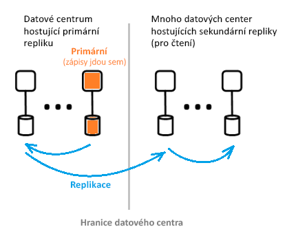

# Co je architektura služby Azure Active Directory?
Azure Active Directory (Azure AD) umožňuje zabezpečeně spravovat přístup k prostředkům a službám Azure pro vaše uživatele. Součástí Azure AD je kompletní sada funkcí pro správu identit. Informace o funkcích služby Azure AD najdete v tématu [Co je Azure Active Directory?](active-directory-whatis.md)

Pomocí Azure AD můžete vytvářet a spravovat uživatele a skupiny a používat sady oprávnění k povolení nebo zamítnutí přístupu k podnikovým prostředkům. Informace o správě identit najdete v tématu věnovaném [základům správy identit Azure](active-directory-whatis.md).

## Architektura Azure AD
Geograficky distribuovaná architektura služby Azure AD kombinuje rozsáhlé monitorování, automatizované přesměrování, převzetí služeb při selhání a možnosti obnovení, které zákazníkům poskytovat pořádaného microsoftem dostupnost a výkon.

Tento článek se zabývá následujícími prvky návrhu:
 *  Návrh architektury služeb
 *  Použitelnosti 
 *  Nepřetržitá dostupnost
 *  Datová centra

### Návrh architektury služeb
Nejběžnější způsob sestavení k dispozici přístup a použitelný systém bohatý na data, je prostřednictvím nezávislých stavebních bloků nebo jednotek škálování. Pro datovou vrstvu služby Azure AD, se nazývají jednotky škálování *oddíly*. 

Datová vrstva obsahuje několik front-endových služeb, které poskytují funkce pro čtení a zápis. Následující diagram znázorňuje, jak jsou součástí oddílu jedním adresářem poskytována v rámci geograficky distribuovaných Datacenter. 

  

Komponenty architektury služby Azure AD zahrnují primární repliku a sekundární repliky.

**Primární replika**

*Primární replika* obdrží všechny *zápisy* pro oddíl, do kterého patří. Všechny operace zápisu se okamžitě replikují do sekundární repliky v jiném datovém centru. Teprve potom se volající informuje o úspěchu, aby se zajistila geograficky redundantní odolnost zápisů.

**Sekundární repliky**

Všechna *čtení* adresáře se obsluhují ze *sekundárních replik* v datových centrech, které jsou fyzicky umístěné v různých zeměpisných oblastech. Protože data se replikují asynchronně, existuje mnoho sekundárních replik. Čtení adresáře, jako jsou žádosti o ověření, se obsluhují z datových center, která jsou blízko zákazníkům. Sekundární repliky zodpovídají za škálovatelnost čtení.

### Škálovatelnost

Škálovatelnost je schopnost služby rozšířit se a plnit rostoucí požadavky na výkon. Škálovatelnosti zápisu se dosahuje dělením dat. Škálovatelnost čtení se zajišťuje replikací dat z jednoho oddílu do několika sekundárních replik distribuovaných po celém světě.

Požadavky z aplikací adresáře aplikace jsou směrovány do datového centra, ke kterému jsou fyzicky nejblíž. Zápisy se transparentně přesměrují na primární repliku, aby se zajistila konzistence čtení a zápisu. Sekundární repliky výrazně rozšiřují rozsah oddílů, protože adresáře obvykle většinu doby obsluhují čtení.

Aplikace adresáře se připojují k nejbližším datovým centrům. Toto připojení zvyšuje výkon, a proto horizontální navýšení kapacity je možné. Vzhledem k tomu, že oddíl adresáře může mít mnoho sekundárních replik, sekundární repliky mohou být umístěné blíž ke klientům adresáře. Jenom interní komponenty služby adresáře, které jsou náročné na zápis, přímo cílí na aktivní primární repliku.

### Nepřetržitá dostupnost

Dostupnost (nebo doba provozuschopnosti) definuje schopnost systému pracovat bez přerušení. Klíčem k vysoké dostupnosti služby Azure AD je, že služby mohou rychle přesouvat provoz napříč několika geograficky distribuovaných datových centrech. Každé datové centrum je nezávislé, což umožňuje, aby režimy selhání spolu vzájemně nesouvisely.

Návrh oddílů Azure AD je zjednodušená ve srovnání s návrhem podnikové služby AD, pomocí návrhu jedinou předlohou, který obsahuje primární repliky pečlivě orchestrovaný a deterministický proces převzetí služeb při selhání.

**Odolnost proti chybám**

Systém je dostupnější, pokud je odolný vůči selháním hardwaru, sítě a softwaru. Pro každý oddíl v adresáři existuje hlavní replika s vysokou dostupností: Primární repliku. V této replice se provádějí jenom zápisy do oddílu. Tato replika se průběžně a pečlivě monitoruje a pokud se zjistí selhání, zápisy je možné okamžitě přesunout do jiné repliky (která se stane novou primární replikou). Během převzetí služeb při selhání může dojít ke ztrátě dostupnosti zápisu, obvykle na 1 až 2 minuty. Dostupnost čtení to během této doby neovlivní.

Operace čtení (jejichž počet mnohonásobně převyšuje počet zápisů) jdou jenom do sekundárních replik. Vzhledem k tomu, že sekundární repliky jsou idempotentní, ztráta libovolné repliky v daném oddílu se dá snadno vykompenzovat přesměrováním čtení do jiné repliky, obvykle ve stejném datovém centru.

**Odolnost dat**

Zápis je před potvrzením bezpečně uložený nejméně do dvou datových center. Nejdřív se zápis potvrdí v primární replice a potom se okamžitě replikuje nejméně do jednoho dalšího datového centra. Tato akce zápisu zajišťuje, že při potenciální katastrofické ztrátě datového centra, který je hostitelem primární nemá za následek ztrátu dat.

Azure AD udržuje nulu [cíl času obnovení (RTO)](https://en.wikipedia.org/wiki/Recovery_time_objective) aby nedošlo ke ztrátě dat na převzetí služeb při selhání. To zahrnuje:
-  Čtení adresáře a vydávání tokenů
-  Povolení přibližně 5 minut RTO pro zápisy adresáře

### Datová centra

Repliky Azure AD jsou uložené v datových centrech rozmístěných po celém světě. Další informace najdete v tématu věnovaném [datovým centrům Azure](https://azure.microsoft.com/overview/datacenters).

Azure AD funguje napříč datovými centry s následujícími charakteristikami:

 * Ověřování, Graph a další služby AD se nacházejí za službou Gateway. Gateway spravuje vyrovnávání zatížení těchto služeb. To se převzetí služeb při selhání automaticky Pokud žádné není v pořádku, servery jsou zjištěny pomocí transakčních sond stavu. Na základě těchto sond stavu služba Gateway dynamicky směruje provoz na datová centra, která jsou v pořádku.
 * Pro *čtení* má adresář sekundární repliky a odpovídající front-endové služby v konfiguraci typu aktivní-aktivní, které se provozují v několika datových centrech. V případě selhání celého datového centra se provoz automaticky přesměruje do jiného datového centra.
 *  Pro *zapíše*, adresář se převzetí služeb při selhání primární (hlavní) repliky napříč datovými centry prostřednictvím plánovaných (nový primární se synchronizuje s původního primárního) nebo nouzových postupů převzetí. Odolnosti dat se dosahuje tím, že se každé potvrzení replikuje nejméně do dvou datových center.

**Konzistence dat**

Adresářový model zajišťuje jednu konečnou už. Jedním z typických problémů distribuovaných systémech asynchronní replikaci je, že data vrácená z "konkrétní" repliky nemusí být aktuální. 

Azure AD poskytuje konzistenci čtení a zápisu pro aplikace cílením na sekundární repliku. Směřuje svoje zápisy do primární repliky a synchronně stahuje zápisy zpátky do sekundární repliky.

Aplikace, které zapisují pomocí rozhraní Graph API služby Azure AD, nezachovávají vztahy spřažení k replice adresáře pro zajištění konzistence čtení a zápisu. Služba Azure AD Graph udržuje logickou relaci, která je spřažená se sekundární replikou používanou pro čtení. Tento vztah spřažení zachycuje „token repliky“, který služba Graph ukládá do mezipaměti pomocí distribuované mezipaměti. Tento token se potom využívá pro následné operace ve stejné logické relaci. 

 >[!NOTE]
 >Zápisy se okamžitě replikují do sekundární repliky, pro kterou byla provedena čtení logické relace.
 >

**Ochrana záloh**

Adresář místo trvalého odstranění implementuje obnovitelné odstranění. Uživatelům a tenantům to umožňuje snadné obnovení v případě náhodných odstranění ze strany zákazníka. Pokud vaše nechtěnému správce klienta odstraní uživatele, mohou snadno vrátit zpět a odstraněné uživatele obnovit. 

Azure AD implementuje denní zálohy všech dat, a proto může autoritativně obnovit data v případě jakýchkoli logických odstranění nebo poškození. Datová vrstva využívá kódy, opravu, takže můžete vyhledávat chyby a automaticky opravovat určité typy diskových chyb.

**Metriky a monitorování**

Spouštění služby s vysokou dostupností vyžaduje špičkové metriky a možnosti monitorování. Azure AD průběžně analyzuje a reportuje metriky stavu klíčových služeb a kritéria úspěchu pro každou ze svých služeb. Existuje také kontinuální vývoj a ladění metrik a monitorování a upozorňování pro jednotlivé scénáře, v rámci jednotlivých služeb Azure AD a napříč všemi službami.

Pokud libovolnou službu Azure AD nefunguje podle očekávání, okamžitě akci na co nejrychlejší obnovení funkce. Nejdůležitější metrika Azure AD sleduje je rychlost živého webu, problémy mohou být zjištěna a zmírnit pro zákazníky, kteří. Intenzivně investujeme do monitorování a výstrah, abychom minimalizovali dobu detekce (cílová hodnota TTD: < 5 minut) a provozní připravenosti s cílem minimalizovat dobu zmírnění problému (cílová hodnota TTM: < 30 minut).

**Bezpečný provoz**

Pomocí provozní kontrolní mechanismy, jako je například vícefaktorové ověřování (MFA) pro jakoukoli operaci, jakož i auditování všech operací. Kromě toho používat systém elevací za běhu k udělení nezbytného dočasného přístupu pro všechny provozní úlohy na vyžádání průběžně. Další informace najdete v tématu [Důvěryhodný cloud](https://azure.microsoft.com/support/trust-center).

## Další postup
[Příručka pro vývojáře pro službu Azure Active Directory](https://docs.microsoft.com/azure/active-directory/develop/active-directory-developers-guide)

