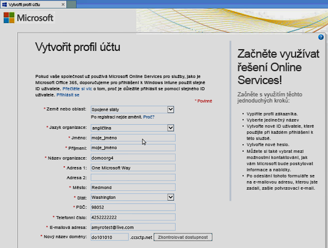
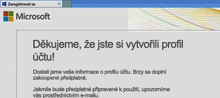
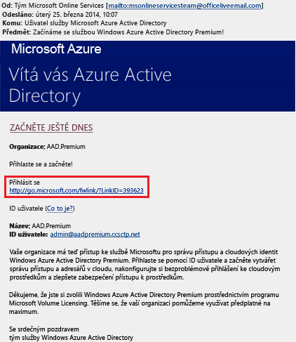
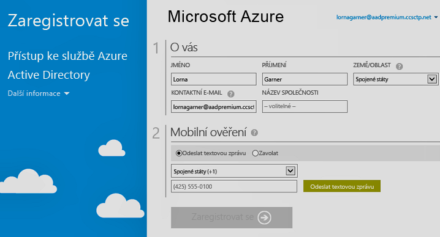

# Zaregistrujte si edice Azure Active Directory Premium
Můžete zakoupit a přidružit edice Azure Active Directory (Azure AD) Premium s předplatným Azure. Pokud potřebujete vytvořit nové předplatné Azure, budete také muset aktivovat svůj licenční plán a přístup ke službě Azure AD.

> [!NOTE]
>Edice Premium a Basic služby Azure AD jsou zákazníkům v Číně dostupné prostřednictvím celosvětové instance služby Azure Active Directory. Edice Premium a Basic služby Azure AD v současnosti nejsou podporované ve službě Azure provozované v Číně společností 21Vianet. Můžete se na nás obrátit na [fóru služby Azure Active Directory](https://feedback.azure.com/forums/169401-azure-active-directory/), kde se dozvíte další informace.

Než si zaregistrujete edice Active Directory Premium 1 nebo Premium 2, musíte napřed určit, jaké stávající předplatné nebo plán chcete použít:

- Stávajíc předplatné Azure nebo Office 365

- Licenční plán Enterprise Mobility + Security

- Plán multilicenčního programu společnosti Microsoft

Pokud k registraci použijete předplatné Azure s dříve zakoupenými a aktivovanými licencemi Azure AD, aktivují se licence automaticky ve stejném adresáři. V ostatních případech musíte aktivovat licenční plán i přístup k Azure AD. Další informace o aktivaci licenčního plánu najdete v části [Aktivace nového licenčního plánu](#activate-your-new-license-plan). Další informace o aktivaci přístupu k Azure AD najdete v části [Aktivace přístupu k Azure AD](#activate-your-azure-ad-access). 

## Registrace s použitím stávajícího předplatného Azure nebo Office 365
Jako předplatitel Azure nebo Office 365 si můžete edice Azure Active Directory Premium koupit online. Podrobný postup naleznete v tématu [Jak zakoupit Azure Active Directory Premium – stávající zákazníci](https://channel9.msdn.com/Series/Azure-Active-Directory-Videos-Demos/How-to-Purchase-Azure-Active-Directory-Premium-Existing-Customer) nebo [Jak zakoupit Azure Active Directory Premium – noví zákazníci](https://channel9.msdn.com/Series/Azure-Active-Directory-Videos-Demos/How-to-Purchase-Azure-Active-Directory-Premium-New-Customers).

## Registrace s použitím licenčního plánu Enterprise Mobility + Security
Enterprise Mobility + Security je sada, která se skládá z Azure AD Premium, Azure Information Protection a Microsoft Intune. Pokud máte licenci EMS, můžete pro Azure AD začít používat některou z následujících možností licencování:

Další informace o EMS najdete na [webu Enterprise Mobility + Security](https://www.microsoft.com/cloud-platform/enterprise-mobility-security).

- Vyzkoušení EMS pomocí bezplatné [zkušební verze předplatného Enterprise Mobility + Security E5](https://signup.microsoft.com/Signup?OfferId=87dd2714-d452-48a0-a809-d2f58c4f68b7&ali=1)

- Nákup [licencí Enterprise Mobility + Security E5](https://signup.microsoft.com/Signup?OfferId=e6de2192-536a-4dc3-afdc-9e2602b6c790&ali=1)

- Nákup [licencí Enterprise Mobility + Security E3](https://signup.microsoft.com/Signup?OfferId=4BBA281F-95E8-4136-8B0F-037D6062F54C&ali=1)

## Registrace s použitím plánu multilicenčního programu společnosti Microsoft
V plánu multilicenčního programu společnosti Microsoft můžete k registraci edice Azure AD Premium použít jeden ze dvou programů (podle toho, kolik licencí chcete získat):

- **250 a více licencí:** [Smlouva Microsoft Enterprise (EA)](https://www.microsoft.com/en-us/licensing/licensing-programs/enterprise.aspx)

- **5 až 250 licencí:** [Open Volume License](https://www.microsoft.com/en-us/licensing/licensing-programs/open-license.aspx)

Další informace o možnostech nákupu s využitím multilicence najdete v tématu o [nákupu prostřednictvím multilicenčního programu](https://www.microsoft.com/en-us/licensing/how-to-buy/how-to-buy.aspx).

## Aktivace nového licenčního plánu
Pokud jste si zaregistrovali nový licenční plán Azure AD, musíte ho pro svou organizaci aktivovat. Použijte k tomu potvrzovací e-mail, který vám přijde po nákupu.

### Aktivace licenčního plánu
- Otevřete potvrzovací e-mail, který vám přišel po registraci od Microsoftu, a klikněte na **přihlášení** nebo **registraci**.
   
    

    - **Přihlášení.** Tento odkaz použijte, pokud máte stávajícího tenanta a chcete se přihlásit pod stávajícím účtem správce. V tenantovi, kde se licence aktivují, musíte být globální správce.

    - **Registrace.** Tento odkaz použijte, pokud chcete otevřít stránku **Vytvoření profilu účtu** a vytvořit nového tenanta Azure AD svého licenčního plánu.

        

Až budete hotovi, zobrazí se potvrzovací pole s poděkováním za aktivaci licenčního plánu vašeho tenanta.

## Aktivace přístupu k Azure AD
Pokud do stávajícího předplatného přidáváte nové licence Azure AD Premium, měl by být přístup do služby Azure AD už aktivovaný. Jinak je potřeba aktivovat přístup do služby Azure AD po obdržení **uvítacího e-mailu**.  

Po zřízení vámi zakoupených licencí ve vašem adresáři vám přijde **uvítací e-mail**. V tomto e-mailu bude potvrzení, že můžete začít spravovat licence a funkce Azure Active Directory Premium nebo Enterprise Mobility + Security. 

> [!TIP]
> K novému tenantovi Azure AD nebudete mít přístup, dokud z uvítacího e-mailu neaktivujete přístup k adresáři Azure AD.

### Aktivace přístupu k Azure AD

1. Otevřete **uvítací e-mail** a klikněte na **Přihlásit se**.
   
    

2. Po úspěšném přihlášení budete muset projít dvoustupňovým ověřením za pomoci mobilního zařízení.
   
    

Aktivace většinou trvá jen pár minut a potom můžete začít tenanta Azure AD používat. 

## Další postup
Teď, když máte Azure AD Premium, můžete [přizpůsobit doménu](add-custom-domain.md), přidat [firemní značku](customize-branding.md), [vytvořit tenanta](active-directory-access-create-new-tenant.md) a [přidat skupiny](active-directory-groups-create-azure-portal.md) a [uživatele](add-users-azure-active-directory.md).
