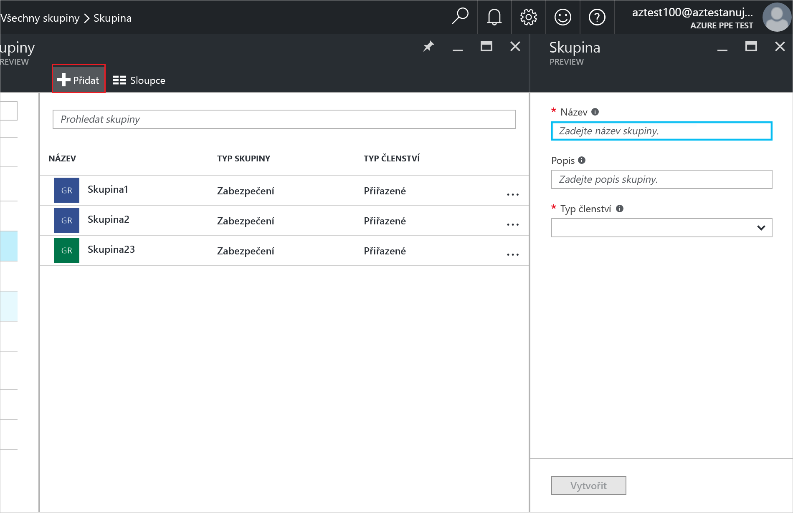
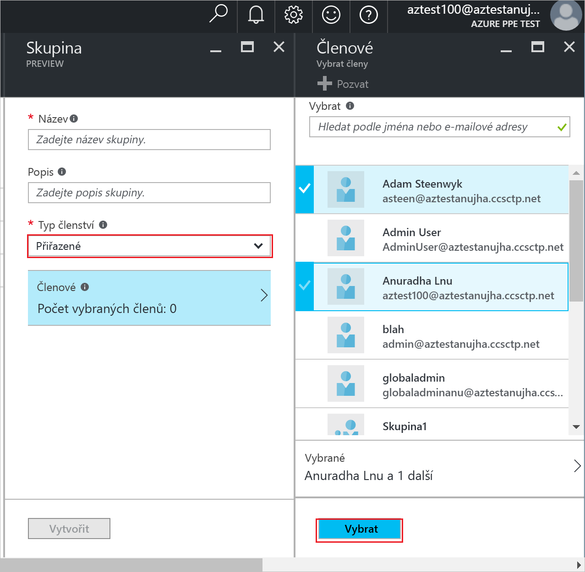
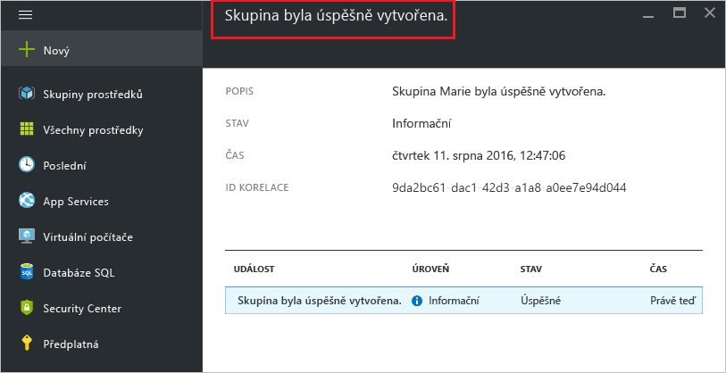

# Vytvoření skupiny a přidání členů ve službě Azure Active Directory
> [!div class="op_single_selector"]
> * [Azure Portal](active-directory-groups-create-azure-portal.md)
> * [PowerShell](../users-groups-roles/groups-settings-v2-cmdlets.md)

Tento článek vysvětluje, jak vytvořit a naplnit novou skupinu ve službě Azure Active Directory. Pomocí skupiny můžete provádět úlohy správy, jako je přiřazení licencí nebo oprávnění více uživatelům nebo zařízením současně.

## Vytvoření skupiny
1. Přihlaste se k portálu [Azure Portal](https://portal.azure.com) prostřednictvím účtu, který má k adresáři oprávnění globálního správce.
2. Vyberte **Všechny služby**, do textového pole zadejte **Uživatelé a skupiny** a potom stiskněte **Enter**.

   
3. V okně **Uživatelé a skupiny** vyberte **Všechny skupiny**.

   
4. V okně **Uživatelé a skupiny – Všechny skupiny** vyberte příkaz **Přidat**.

   
5. V okně **Skupina** přidejte název a popis skupiny.
6. Pokud chcete vybrat členy, kteří se mají přidat do skupiny, vyberte v poli **Typ členství** možnost **Přiřazené** a potom vyberte **Členové**. Další informace o dynamické správě členství ve skupině najdete v článku o [vytvoření rozšířených pravidel pro členství ve skupině pomocí atributů](../active-directory-groups-dynamic-membership-azure-portal.md).

   
7. V okně **Členové** vyberte minimálně jednoho uživatele nebo zařízení, které chcete přidat do skupiny, a v dolní části okna kliknutím na tlačítko **Vybrat** je přidejte do skupiny. Položky v poli **Uživatel** se filtrují podle toho, jak se vaše zadání shoduje s jakoukoli částí jména uživatele nebo názvu zařízení. V tomto poli není možné používat žádné zástupné znaky.
8. Po přidání členů do skupiny vyberte v okně **Skupina** možnost **Vytvořit**.    

   

## Další kroky
Následující články poskytují další informace o službě Azure Active Directory.

* [Zobrazení existujících skupin](active-directory-groups-view-azure-portal.md)
* [Správa nastavení skupiny](active-directory-groups-settings-azure-portal.md)
* [Správa členů skupiny](active-directory-groups-members-azure-portal.md)
* [Správa členství ve skupině](active-directory-groups-membership-azure-portal.md)
* [Správa dynamických pravidel pro uživatele ve skupině](../active-directory-groups-dynamic-membership-azure-portal.md)
