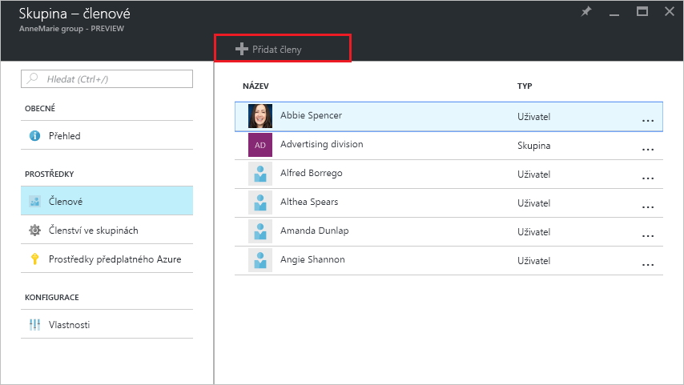
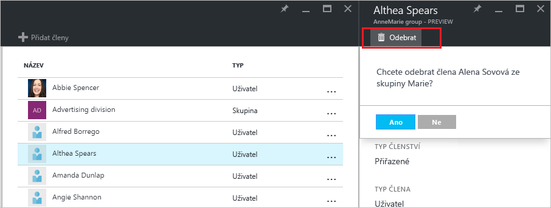

# Správa členství uživatelů ve skupinách v tenantovi Azure Active Directory
Tento článek vysvětluje, jak spravovat členy skupiny v Azure Active Directory (Azure AD).

## Jak zjistím členy a jak je můžu spravovat?
1. Přihlaste se k portálu [Azure Portal](https://portal.azure.com) prostřednictvím účtu, který má k adresáři oprávnění globálního správce.
2. Vyberte **Všechny služby**, do textového pole zadejte **Uživatelé a skupiny** a potom stiskněte **Enter**.

   
3. V okně **Uživatelé a skupiny** vyberte **Všechny skupiny**.

   
4. V okně **Uživatelé a skupiny – Všechny skupiny** vyberte skupinu.
5. V okně **Skupina – *název_skupiny*** vyberte **Členové**.

   
6. Pokud chcete do skupiny přidat členy, v okně **Skupina – Členové** vyberte **Přidat členy**.

   
7. V okně **Členové** vyberte minimálně jednoho uživatele nebo zařízení, které chcete přidat do skupiny, a v dolní části okna kliknutím na tlačítko **Vybrat** je přidejte do skupiny. Položky v poli **Uživatel** se filtrují podle toho, jak se vaše zadání shoduje s jakoukoli částí jména uživatele nebo názvu zařízení. V tomto poli není možné používat žádné zástupné znaky.
8. Pokud chcete ze skupiny odebrat členy, v okně **Skupina – Členové** vyberte daného člena.
9. V okně ***Jméno_člena*** vyberte příkaz **Odebrat** a po zobrazení výzvy tuto volbu potvrďte.

   
10. Po dokončení změn členů skupiny vyberte **Uložit**.

## Další informace
Následující články poskytují další informace o službě Azure Active Directory.

* [Zobrazení existujících skupin](active-directory-groups-view-azure-portal.md)
* [Vytvoření nové skupiny a přidání členů](active-directory-groups-create-azure-portal.md)
* [Správa nastavení skupiny](active-directory-groups-settings-azure-portal.md)
* [Správa členství ve skupině](active-directory-groups-membership-azure-portal.md)
* [Správa dynamických pravidel pro uživatele ve skupině](../users-groups-roles/groups-dynamic-membership.md)
