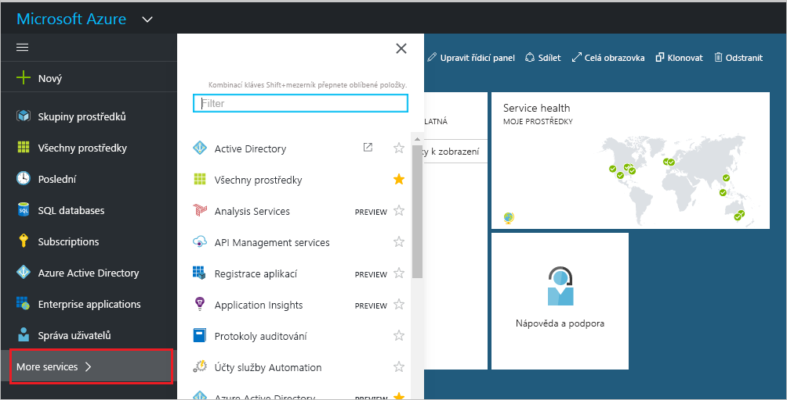
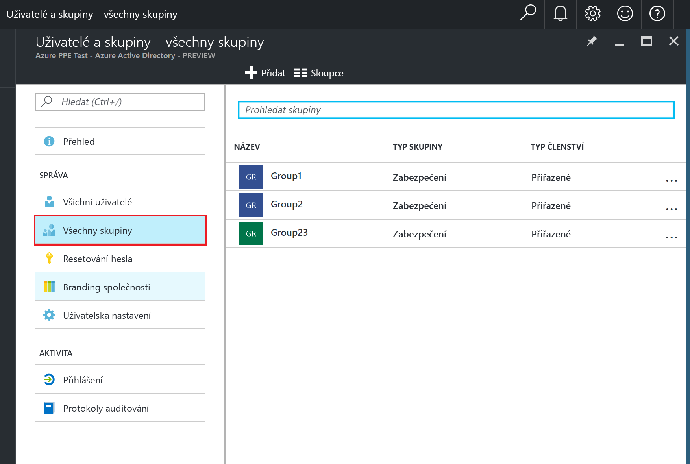
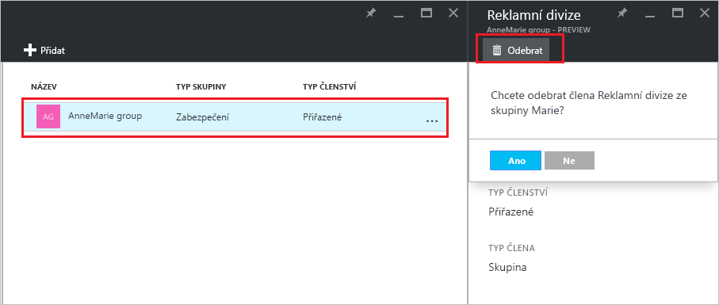

# Správa skupin ve vašem tenantovi Azure Active Directory, do kterých vaše skupina patří
Skupiny v Azure Active Directory můžou obsahovat jiné skupiny. Tady je postup, jak tato členství spravovat.

## Jak zjistím, ve kterých skupinách má moje skupina členství?
1. Přihlaste se k [centru pro správu Azure AD](https://aad.portal.azure.com) pomocí účtu, který má k adresáři oprávnění globálního správce.
2. Vyberte **Uživatelé a skupiny**.

   
1. Vyberte **Všechny skupiny**.

   
1. Vyberte skupinu.
2. Vyberte **Členství ve skupinách**.

   
1. Pokud chcete přidat členství vaší skupiny v jiné skupině, vyberte v okně **Skupina – Členství ve skupinách** příkaz **Přidat**.
2. Vyberte skupinu v okně **Vybrat skupinu** a pak v dolní části okna vyberte tlačítko **Vybrat**. Skupinu nelze přidat do více skupin najednou. Položky v poli **Uživatel** se filtrují podle toho, jak se vaše zadání shoduje s jakoukoli částí jména uživatele nebo názvu zařízení. V tomto poli není možné používat žádné zástupné znaky.

   
8. Pokud chcete odebrat členství vaší skupiny v jiné skupině, vyberte danou skupinu v okně **Skupina – Členství ve skupinách**.
9. Vyberte příkaz **Odebrat** a po zobrazení výzvy tuto volbu potvrďte.

   
10. Až změny členství vaší skupiny v jiných skupinách dokončíte, vyberte **Uložit**.

## Další informace
Následující články poskytují další informace o službě Azure Active Directory.

* [Zobrazení existujících skupin](active-directory-groups-view-azure-portal.md)
* [Vytvoření nové skupiny a přidání členů](active-directory-groups-create-azure-portal.md)
* [Správa nastavení skupiny](active-directory-groups-settings-azure-portal.md)
* [Správa členů skupiny](active-directory-groups-members-azure-portal.md)
* [Správa dynamických pravidel pro uživatele ve skupině](../users-groups-roles/groups-dynamic-membership.md)
