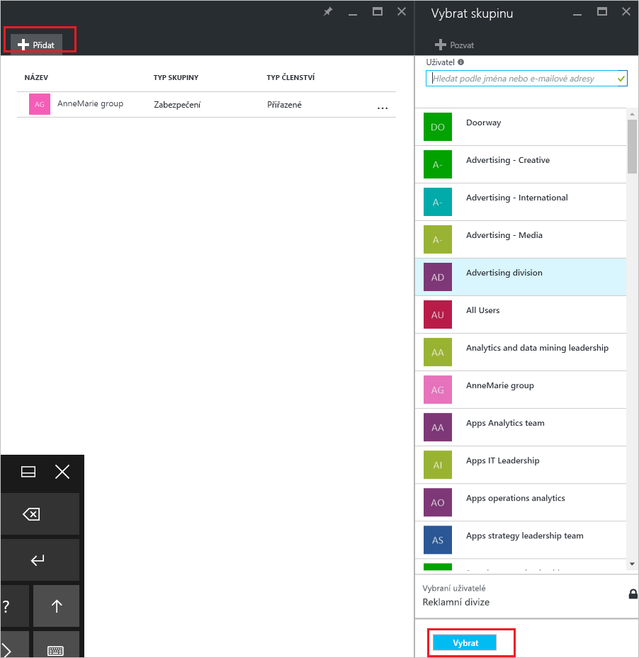
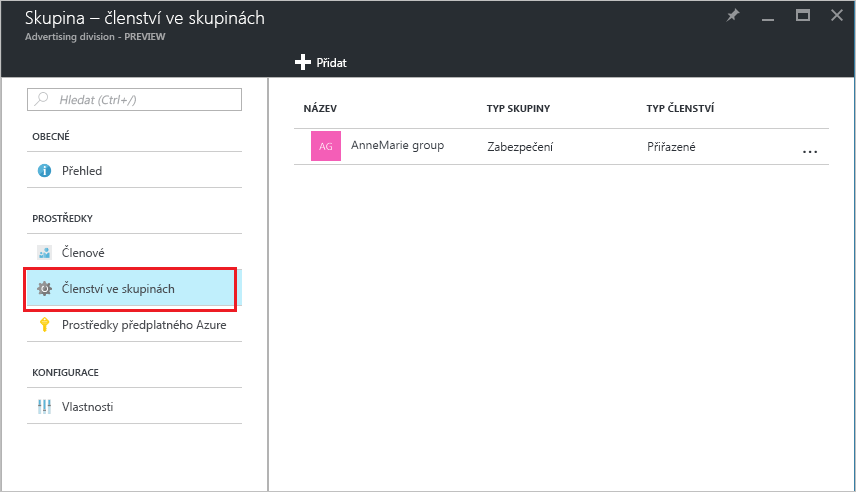

# Přidat nebo odebrat skupiny z jiné skupiny pomocí služby Azure Active Directory
Tento článek vám umožní přidat a odebrat skupiny z jiné skupiny pomocí služby Azure Active Directory.

>[!Note]
>Pokud se snažíte odstranit nadřazené skupiny, přečtěte si téma [aktualizace nebo odstranění skupiny a její členy](active-directory-groups-delete-group.md).

## Přidání skupiny do jiné skupiny
Můžete přidat existující skupinu zabezpečení do jiné existující skupiny zabezpečení (označované také jako vnořené skupiny), vytváření členem skupiny (podskupiny) a nadřazenou skupinu. Vlastnosti atributy a nadřazené skupiny, ušetříte čas konfigurační nastavení převezme skupina člena.

>[!Important]
>Aktuálně nepodporujeme:<ul><li>Přidání skupiny do skupiny synchronizované s místní služby Active Directory</li><li>Přidání skupin zabezpečení pro skupiny Office 365</li><li>Přidání skupin Office 365 do skupiny zabezpečení nebo jiné skupiny Office 365</li><li>Přiřazení aplikací do vnořené skupiny</li><li>Použití licence pro vnořené skupiny</li></ul>

### Přidání skupiny jako člena jiné skupiny

1. Přihlaste se k webu [Azure Portal](https://portal.azure.com) pomocí účtu globálního správce daného adresáře.

2. Vyberte **Azure Active Directory**a pak vyberte **skupiny**.

3. Na **skupiny – všechny skupiny** stránky, vyhledejte a vyberte skupinu, která se stane členem jiné skupiny. Pro toto cvičení používáme **zásady MDM - západní** skupiny.

    >[!Note]
    >Vaši skupinu můžete přidat jako člena pouze do jedné skupiny najednou. Kromě toho **vybrat skupinu** pole filtry pro zobrazení na základě porovnání svou položku do libovolné části názvu uživatele nebo zařízení. Zástupné znaky nejsou podporovány.

    

4. Na **MDM zásad - západ - členství ve skupinách** stránce **členství ve skupinách**vyberte **přidat**, vyhledejte skupinu, kterou chcete, aby vaše skupina členem, a klikněte na tlačítko  **Vyberte**. Pro toto cvičení používáme **zásady MDM – všechny organizace** skupiny.

    **Zásady MDM - západní** skupiny je teď členem **zásady MDM – všechny organizace** skupina dědí všechny vlastnosti a konfigurace zásad MDM – všechny skupiny organizace.

    

5. Zkontrolujte **MDM zásad - západ - členství ve skupinách** stránku, abyste zobrazili skupina a člen relace.

    

6. Podrobnější přehled vztahů skupiny a členů, vyberte název skupiny (**zásady MDM – všechny organizace**) a podívejte se na **zásady MDM - západní** stránce Podrobnosti.

    

## Odebrat skupiny z jiné skupiny
Existující skupiny zabezpečení můžete odebrat z jiné skupiny zabezpečení. Ale odebrání skupině taky odebere všechny zděděné atributy a vlastnosti pro její členy.

### Odebrání člena skupiny z jiné skupiny
1. Na **skupiny – všechny skupiny** stránky, vyhledejte a vyberte skupinu, která se má odebrat jako člena jiné skupiny. Pro toto cvičení znovu používáme **zásady MDM - západní** skupiny.

2. Na **zásady MDM – přehled – západ** stránce **členství ve skupinách**.

    

3. Vyberte **zásady MDM – všechny organizace** skupinu **MDM zásad - západ - členství ve skupinách** stránce a pak vyberte **odebrat** z **zásady MDM - západní** stránce Podrobnosti.

    

## Další informace
Následující články poskytují další informace o službě Azure Active Directory.

- [Zobrazení skupin a členů](active-directory-groups-view-azure-portal.md)

- [Vytvoření základní skupiny a přidání členů](active-directory-groups-create-azure-portal.md)

- [Přidat nebo odebrat členy ze skupiny](active-directory-groups-members-azure-portal.md)

- [Úprava nastavení skupiny](active-directory-groups-settings-azure-portal.md)

- [Použití skupiny ke správě přístupu k aplikacím SaaS](../users-groups-roles/groups-saasapps.md)

- [Scénáře, omezeních a známých problémech použití skupin pro správu licencování v Azure Active Directory](../users-groups-roles/licensing-group-advanced.md#limitations-and-known-issues)
