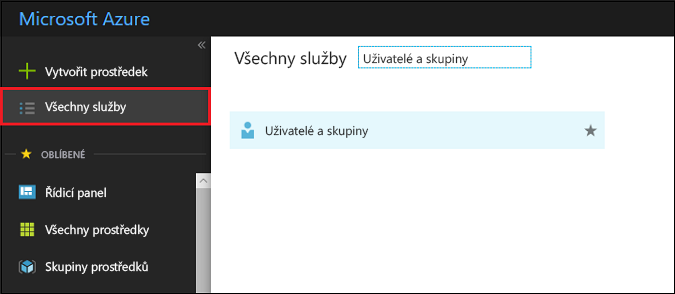
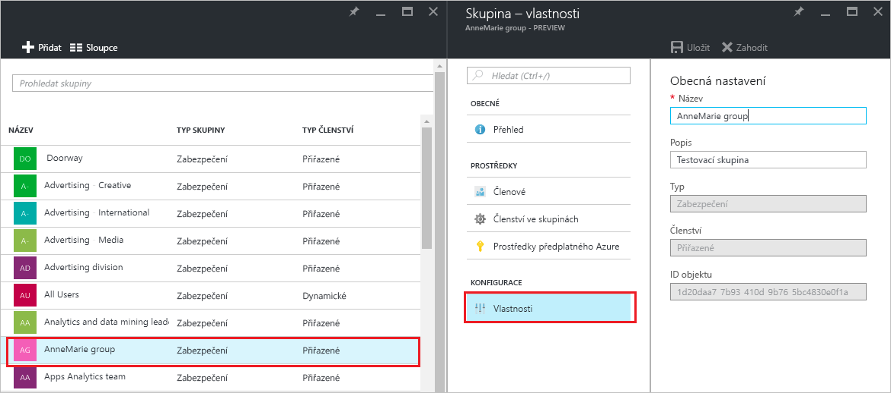
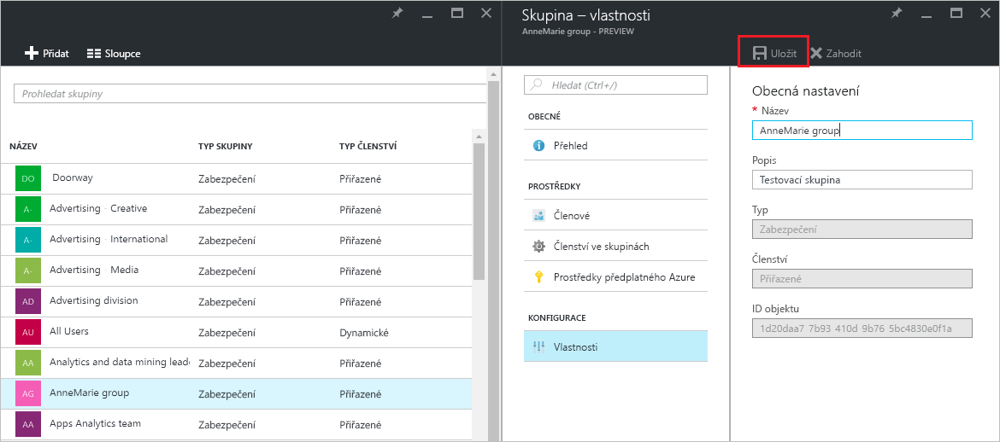

# Správa nastavení pro skupinu v Azure Active Directory
Tento článek vysvětluje, jak změnit nastavení pro skupinu v Azure Active Directory (Azure AD).

## Jak zjistím a změním nastavení?
1. Přihlaste se k [centru pro správu Azure AD](https://aad.portal.azure.com) pomocí účtu, který má k adresáři oprávnění globálního správce.
2. Vyberte **Všechny služby**, do textového pole zadejte **Uživatelé a skupiny** a potom stiskněte **Enter**.

   
3. V okně **Uživatelé a skupiny** vyberte **Všechny skupiny**.

   
4. V okně **Uživatelé a skupiny – Všechny skupiny** vyberte skupinu.
5. V okně **Skupina – *název_skupiny*** vyberte **Vlastnosti**.

   
6. Po dokončení změn vlastností skupiny vyberte **Uložit**.    

   

## Další kroky
Následující články poskytují další informace o službě Azure Active Directory.

* [Zobrazení existujících skupin](active-directory-groups-view-azure-portal.md)
* [Vytvoření nové skupiny a přidání členů](active-directory-groups-create-azure-portal.md)
* [Správa členů skupiny](active-directory-groups-members-azure-portal.md)
* [Správa členství ve skupině](active-directory-groups-membership-azure-portal.md)
* [Správa dynamických pravidel pro uživatele ve skupině](../users-groups-roles/groups-dynamic-membership.md)
