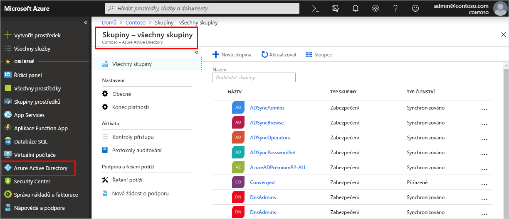

<!--As a brand-new Azure AD administrator, I need to view my organization’s groups along with the assigned members, so I can manage permissions to apps and services for people in my organization-->

# Rychlý start: Zobrazení skupin a členů vaší organizace ve službě Azure Active Directory
Existující skupiny a členy skupin vaší organizace můžete zobrazit pomocí webu Azure Portal. Skupiny se používají ke správě uživatelů (členů), kteří potřebují mít stejný přístup a oprávnění pro potenciálně omezené aplikace a služby.

V tomto rychlém startu zobrazíte všechny existující skupiny vaší organizace a přiřazené členy.

Pokud ještě nemáte předplatné Azure, vytvořte si [bezplatný účet](https://azure.microsoft.com/free/) před tím, než začnete. 

## Požadavky
Než začnete, budete potřebovat:

- Vytvořit tenanta služby Azure Active Directory. Další informace najdete v článku o [přístupu k portálu služby Azure Active Directory a vytvoření nového tenanta](active-directory-access-create-new-tenant.md).

## Přihlášení k webu Azure Portal
K webu [Azure Portal](https://portal.azure.com/) se musíte přihlásit pomocí účtu globálního správce daného adresáře.

## Vytvoření nové skupiny 
Vytvořte novou skupinu s názvem _MDM policy – West_. Další informace o vytvoření skupiny najdete v tématu [Jak vytvořit základní skupinu a přidat členy](active-directory-groups-create-azure-portal.md).

1. Vyberte **Azure Active Directory**, **Skupiny** a pak vyberte **Nová skupina**.

2. Vyplňte stránku **Skupina**:
    
    - **Typ skupiny:** Vyberte **Zabezpečení**.
    
    - **Název skupiny:** Zadejte _MDM policy – West_.
    
    - **Typ členství:** Vyberte **Přiřazené**.

3. Vyberte **Vytvořit**.

## Vytvoření nového uživatele
Vytvořte nového uživatele se jménem _Alain Charon_. Uživatel musí existovat, aby ho bylo možné přidat jako člena skupiny. Další informace o vytvoření uživatele najdete v článku o [přidání nebo odstranění uživatelů](add-users-azure-active-directory.md).

1. Vyberte **Azure Active Directory**, **Uživatelé** a pak vyberte **Nový uživatel**.

2. Vyplňte stránku **Uživatel**:

    - **Jméno:** Zadejte _Alain Charon_.

    - **Uživatelské jméno:** Zadejte *alain@contoso.com*.

3. Zkopírujte automaticky vygenerované heslo v poli **Heslo** a pak vyberte **Vytvořit**.

## Přidání člena skupiny
Teď, když máte skupinu a uživatele, můžete _Alaina Charona_ přidat jako člena do skupiny _MDM policy – West_. Další informace o přidání členů skupiny najdete v článku [Přidání nebo odebrání členů skupin](active-directory-groups-members-azure-portal.md).

1. Vyberte **Azure Active Directory** > **Skupiny**.

2. Na stránce **Skupiny – Všechny skupiny** vyhledejte skupinu **MDM policy – West** a vyberte ji.

3. Na stránce s **přehledem skupiny MDM policy – West** vyberte **Členové** v oblasti **Spravovat**.

4. Vyberte **Přidat členy** a pak vyhledejte a vyberte uživatele **Alain Charon**.

5. Zvolte **Vybrat**.

## Zobrazení všech skupin
Všechny skupiny vaší organizace si můžete prohlédnout na stránce **Skupiny – Všechny skupiny** webu Azure Portal.

- Vyberte **Azure Active Directory** > **Skupiny**.

    Zobrazí se stránka **Skupiny – Všechny skupiny** se všemi aktivními skupinami.

    

## Vyhledání skupiny
Prohledáním stránky **Skupiny – Všechny skupiny** najděte skupinu **MDM policy – West**.

1. Na stránce **Skupiny – Všechny skupiny** zadejte do **vyhledávacího** pole text _MDM_.

    Pod **vyhledávacím** polem se zobrazí výsledky hledání včetně skupiny _MDM policy – West_.

    

3. Vyberte skupinu **MDM policy – West**.

4. Na stránce s **přehledem skupiny MDM policy – West** uvidíte informace o této skupině včetně počtu jejích členů.

    

## Zobrazení členů skupiny
Teď, když jste tuto skupinu našli, můžete zobrazit všechny přiřazené členy.

- V oblasti **Spravovat** vyberte **Členové** a prohlédněte si úplný seznam se jmény členů přiřazených k této konkrétní skupině včetně _Alaina Charona_.

    

## Vyčištění prostředků
Tato skupina se používá v několika návodech, které jsou dostupné v oddílu **Návody** této dokumentace. Pokud ale tuto skupinu nechcete používat, můžete ji a její přiřazené členy odstranit následujícím postupem:

1. Na stránce **Skupiny – Všechny skupiny** vyhledejte skupinu **MDM policy – West**.

2.  Vyberte skupinu **MDM policy – West**.

    Zobrazí se stránka s **přehledem skupiny MDM policy – West**.

3. Vyberte **Odstranit**.

    Tato skupina a její přidružení členové se odstraní.

    

    >[!Important]
    >Tím se neodstraní uživatel Alain Charon, ale jen jeho členství v odstraněné skupině.

## Další kroky
Přejděte k dalšímu článku a zjistěte, jak přidružit předplatné k adresáři služby Azure AD.

> [!div class="nextstepaction"]
> [Přidružení předplatného Azure](active-directory-how-subscriptions-associated-directory.md)