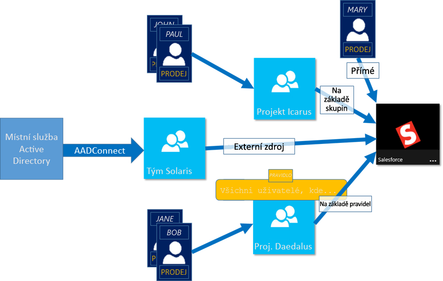
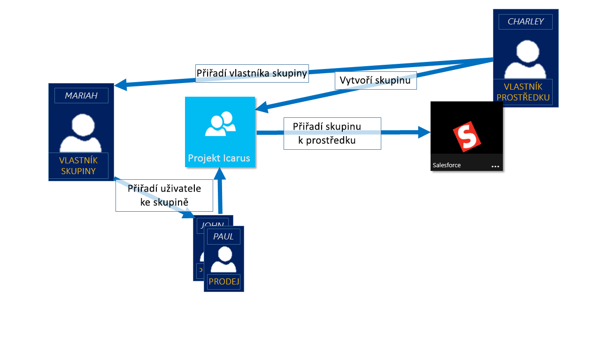

# Správa přístupu k prostředkům pomocí skupin služby Azure Active Directory
Azure Active Directory (Azure AD) je komplexní řešení pro správu identit a přístupu, které poskytuje celou řadu možností pro správu přístupu k místním a cloudovým aplikacím a prostředkům včetně online služeb společnosti Microsoft, jako je Office 365, ale také k celé řadě aplikací SaaS dalších dodavatelů. Tento článek poskytuje přehled, ale pokud chcete začít ihned používat skupiny Azure AD, postupujte podle pokynů v článku o [správě skupin zabezpečení ve službě Azure AD](active-directory-groups-create-azure-portal.md). Pokud chcete zjistit, jak můžete využít PoweShell ke správě skupin ve službě Azure Active Directory, dočtete se další informace v článku o [rutinách služby Azure Active Directory pro správu skupin](../users-groups-roles/groups-settings-v2-cmdlets.md).

> [!NOTE]
> Abyste mohli používat Azure Active Directory, musíte mít účet Azure. Pokud účet Azure nemáte, můžete si [zaregistrovat bezplatný účet Azure](https://azure.microsoft.com/pricing/free-trial/).
>
>

Jednou z hlavních funkcí služby Azure AD je možnost spravovat přístup k prostředkům. Tyto prostředky mohou tvořit součást adresáře jako v případě oprávnění ke správě objektů prostřednictvím rolí v adresáři, nebo prostředků, které jsou pro adresář externí, jako jsou aplikace SaaS, služby Azure a sharepointové weby nebo místní prostředky. Existují čtyři způsoby přiřazení přístupových práv k prostředku uživatelům:

1. Přímé přiřazení

    Vlastník prostředku můžete uživatele přiřadit přímo k danému prostředku.
2. Členství ve skupině

    Vlastník prostředku může přiřadit skupinu k prostředku a tím jejím členům udělit přístup k prostředku. Členství ve skupině pak může spravovat vlastník skupiny. Vlastník prostředku deleguje oprávnění přiřazovat uživatele k jeho prostředku vlastníkovi skupiny.
3. Na základě pravidla

    Vlastník prostředku může pomocí pravidla vyjádřit, kterým uživatelům by měl být přiřazen přístup k prostředku. Výsledek pravidla závisí na atributech použitých v daném pravidle a jejich hodnotách pro konkrétní uživatele. Tím de facto vlastník prostředku deleguje právo spravovat přístup ke svému prostředku autoritativnímu zdroji pro atributy, které jsou v pravidle použity. Vlastník prostředku i nadále spravuje samotné pravidlo a určuje, které atributy a hodnoty poskytují přístup k jeho prostředku.
4. Externí autorita

    Přístup k prostředku se odvozuje z externího zdroje. Příkladem může být skupina synchronizovaná z autoritativního zdroje, jako je místní adresář nebo aplikace SaaS, například WorkDay. Vlastník prostředku přiřadí skupinu, která poskytuje přístup k prostředku, a externí zdroj spravuje členy ve skupině.

   

## Podívejte se na video, které vysvětluje správu přístupu
Můžete se podívat na krátké video, které podrobněji vysvětluje správu přístupu:

**Azure AD: Úvod k dynamickému členství ve skupinách**

> [!VIDEO https://channel9.msdn.com/Series/Azure-Active-Directory-Videos-Demos/Azure-AD--Introduction-to-Dynamic-Memberships-for-Groups/player]
>
>

## Jak funguje správa přístupu ve službě Azure Active Directory?
Centrálním bodem řešení správy přístupu ve službě Azure AD je skupina zabezpečení. Správa přístupu k prostředkům pomocí skupiny zabezpečení je dobře známý postup, který umožňuje flexibilní a srozumitelný způsob poskytování přístupu k prostředku odpovídající skupině uživatelů. Vlastník prostředku (nebo správce adresáře) může přiřadit skupinu poskytující určité přístupové právo k prostředkům, které vlastní. Členům skupiny se poskytne přístup a vlastník prostředku může právo spravovat seznam členů skupiny delegovat na jinou osobu, například na vedoucího oddělení nebo správce helpdesku.

Vlastník skupiny může také danou skupinu zpřístupnit pro žádosti o samoobslužnou službu. Tím koncovým uživatelům umožní vyhledat a najít skupinu a podat žádost o připojení ke skupině a efektivně vyhledávat oprávnění pro přístup k prostředkům spravovaným prostřednictvím skupiny. Vlastník skupiny může skupinu nastavit tak, aby se žádosti o připojení schvalovaly automaticky nebo aby je musel nejprve schválit vlastník skupiny. Když uživatel požádá o připojení ke skupině, předá se jeho žádost vlastníkům skupiny. V případě, že vlastníci žádost schválí, žadateli se zobrazí oznámení a je přijat do skupiny. Pokud vlastníci žádost zamítnou, žadateli se zobrazí oznámení, ale do skupiny přijat není.

## Začínáme se správou přístupu
Chcete začít? Doporučujeme vyzkoušet si některé základní úlohy, které můžete se skupinami Azure AD provádět. Pomocí těchto možností můžete poskytovat specializovaný přístup různým skupinách uživatelů pro různé prostředky ve vaší organizaci. Seznam základních prvních kroků je uveden níže.

* [Vytvoření jednoduchého pravidla ke konfiguraci dynamických členství ve skupině](active-directory-groups-create-azure-portal.md)
* [Použití skupiny ke správě přístupu k aplikacím SaaS](../users-groups-roles/groups-saasapps.md)
* [Zpřístupnění skupiny pro samoobslužné funkce koncových uživatelů](../users-groups-roles/groups-self-service-management.md)
* [Synchronizace místní skupiny do Azure pomocí Azure AD Connect](../connect/active-directory-aadconnect.md)
* [Správa vlastníků skupiny](active-directory-accessmanagement-managing-group-owners.md)

## Další kroky
Nyní, když jste se seznámili se základy správy přístupu, můžete se podívat na některé další rozšířené možnosti správy přístupu k aplikacím a prostředkům, které jsou dostupné ve službě Azure Active Directory.

* [Použití atributů k vytvoření rozšířených pravidel](../active-directory-groups-dynamic-membership-azure-portal.md)
* [Správa skupin zabezpečení v Azure AD](active-directory-groups-create-azure-portal.md)
* [Referenční informace k rozhraní Graph API pro skupiny](https://msdn.microsoft.com/Library/Azure/Ad/Graph/api/groups-operations#GroupFunctions)
* [Rutiny služby Azure Active Directory pro konfiguraci nastavení skupiny](../users-groups-roles/groups-settings-cmdlets.md)
