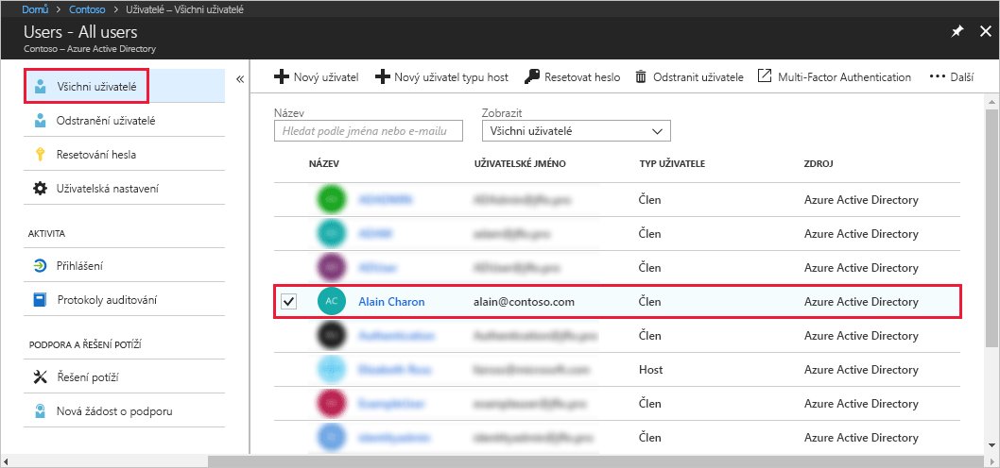
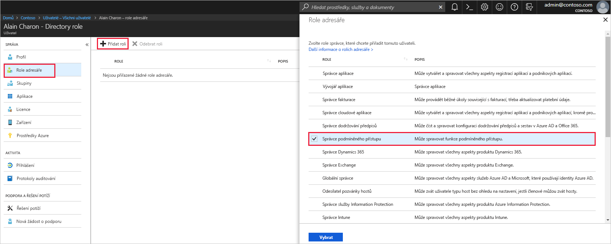

# Přiřazení uživatele k rolím správce v Azure Active Directory
Tento článek vysvětluje, jak uživateli přiřadit roli správce v Azure Active Directory (Azure AD). Informace o přidávání nových uživatelů v organizaci najdete v tématu [Přidávání nových uživatelů do služby Azure Active Directory](../add-users-azure-active-directory.md). Přidaní uživatelé nemají ve výchozím nastavení oprávnění správce, ale příslušné role jim můžete kdykoli přiřadit.

## Přiřazení role uživateli
1. Přihlaste se k webu [Azure Portal](https://portal.azure.com) prostřednictvím účtu, který má k adresáři oprávnění globálního správce nebo správce privilegovaných rolí.

2. Vyberte **Azure Active Directory**, pak **Uživatelé** a pak v seznamu vyberte konkrétního uživatele.

    

3. Pro vybraného uživatele vyberte **Role adresáře**, pak **Přidat roli** a pak v seznamu **Role adresáře** vyberte příslušné role správce, například **Správce podmíněného přístupu**. Další informace o rolích správce najdete v tématu [Přiřazování rolí správce ve službě Azure AD](../users-groups-roles/directory-assign-admin-roles.md). 

    

1. Stisknutím **Vybrat** uložte nastavení.

## Další kroky
* [Rychlý start: Přidání nebo odstranění uživatelů v Azure Active Directory](add-users-azure-active-directory.md)
* [Správa uživatelských profilů](active-directory-users-profile-azure-portal.md)
* [Přidání uživatelů typu host z jiného adresáře](../b2b/what-is-b2b.md) 
* [Přiřazení uživatele k roli ve službě Azure AD](active-directory-users-assign-role-azure-portal.md)
* [Obnovení odstraněného uživatele](active-directory-users-restore.md)
