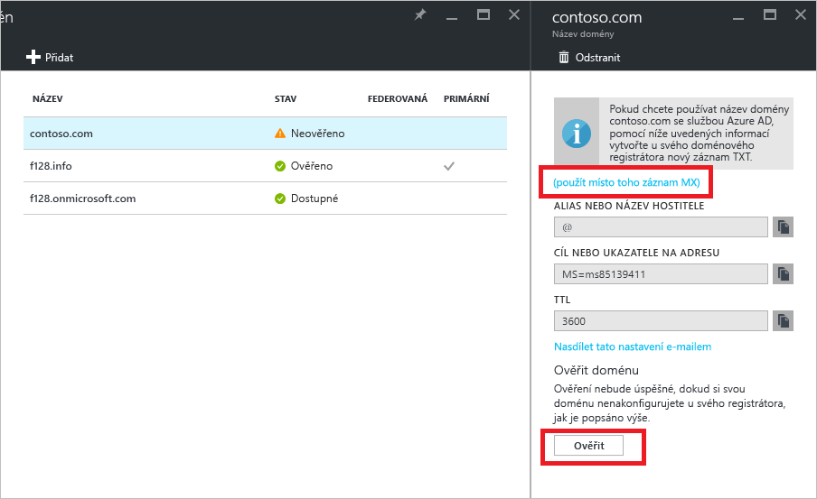

# Rychlý start: Přidání názvu vlastní domény do služby Azure Active Directory

Všechny adresáře služby Azure AD mají počáteční název domény ve formátu *název_domény*.onmicrosoft.com. Počáteční název domény není možné změnit ani odstranit, ale do služby Azure AD si můžete přidat také název firemní domény. Vaše organizace pravděpodobně má například jiné názvy domén pro firemní účely a uživatele, kteří se přihlašují prostřednictvím názvu firemní domény. Přidání názvů vlastních domén do služby Azure AD vám umožní přiřazovat uživatelská jména, která jsou pro uživatele srozumitelná, například alice@contoso.com místo alice@*název_domény*.onmicrosoft.com. Proces je jednoduchý:

1. Přidání vlastního názvu domény do adresáře
2. Přidání položky DNS pro název domény u registrátora názvu domény
3. Ověření vlastního názvu domény v Azure AD

## Přidání vlastního názvu domény do adresáře
1. Přihlaste se k portálu [Azure Portal](https://aad.portal.azure.com/#blade/Microsoft_AAD_IAM/ActiveDirectoryMenuBlade/Overview) prostřednictvím účtu, který má k adresáři oprávnění globálního správce.
2. Nalevo vyberte **Názvy vlastních domén**.
3. Vyberte **Přidat vlastní doménu**.
   
   
5. V části **Názvy vlastních domén** zadejte do pole název vlastní domény, například contoso.com, a potom vyberte **Přidat doménu**. Nezapomeňte napsat i příponu .com, .net nebo jinou příponu nejvyšší úrovně.
6. V části ***název_domény*** (tj. nový název vaší domény tvoří název) shromážděte informace o záznamu DNS, které použijete později k ověření názvu vlastní domény ve službě Azure AD.
   
   

> [!TIP]
> Pokud máte v úmyslu federovat místní službu Windows Server AD pomocí služby Azure AD, musíte při spuštění nástroje Azure AD Connect pro synchronizaci adresářů zaškrtnout políčko **Mám v plánu nakonfigurovat pro tuto doménu jednotné přihlašování se svým místním adresářem Active Directory**. V průvodci v kroku **Doména služby Azure AD** musíte také zaregistrovat stejný název domény, který vyberete, pro federaci pomocí místního adresáře. [V těchto pokynech](./../connect/active-directory-aadconnect-get-started-custom.md#verify-the-azure-ad-domain-selected-for-federation) uvidíte, jak daný krok v průvodci vypadá. Pokud nástroj Azure AD Connect nemáte, můžete [ho stáhnout tady](http://go.microsoft.com/fwlink/?LinkId=615771).

## Přidání položky DNS pro název domény u registrátora názvu domény
Pokud chcete používat vlastní název domény ve službě Azure AD, dalším krokem je aktualizace souboru zóny DNS pro takovou doménu. Azure AD pak může ověřit, že vaše organizace je vlastníkem názvu vlastní domény. Pro záznamy Azure, Office 365 nebo externí záznamy v Azure můžete použít [Azure DNS](https://docs.microsoft.com/azure/dns/dns-getstarted-portal), nebo můžete přidat záznam DNS [u jiného registrátora DNS](https://support.office.com/article/Create-DNS-records-for-Office-365-when-you-manage-your-DNS-records-b0f3fdca-8a80-4e8e-9ef3-61e8a2a9ab23/).

1. Přihlaste se k registrátorovi názvu domény. Pokud k aktualizaci položky DNS nemáte přístup, požádejte osobu nebo tým, kteří přístup mají, aby dokončili krok 2 a dali vám vědět, až bude hotový.
2. Aktualizujte soubor zóny DNS pro doménu tím, že přidáte položku DNS, kterou jste získali od Azure AD. Položka DNS neovlivní žádné chování, například směrování pošty nebo webhosting.

## Ověření vlastního názvu domény v Azure AD
Po přidání položky DNS jste připraveni na ověření názvu domény pomocí Azure AD. Název domény je možné ověřit až po rozšíření záznamů DNS. Šíření často trvá jen několik sekund, ale občas může zabrat i hodinu nebo déle. Pokud ověření na první pokus nefunguje, zkuste to později.

1. Přihlaste se ke službě [Azure AD](https://aad.portal.azure.com/#blade/Microsoft_AAD_IAM/ActiveDirectoryMenuBlade/Overview) pomocí účtu, který má k tenantovi oprávnění globálního správce.
2. Vyberte **Názvy vlastních domén**.
3. Vyberte neověřený název domény, který chcete ověřit.
4. Zkontrolujte záznamy a vyberte **Ověřit**, abyste dokončili ověření.

Teď můžete [přiřazovat uživatelská jména, která obsahují vlastní název domény](../users-groups-roles/domains-manage.md). Pomocí názvu vlastní domény můžete vytvořit cloudové uživatelské účty, nebo aktualizovat dříve synchronizované informace o místních uživatelských účtech. Pomocí [Microsoft PowerShellu](https://msdn.microsoft.com/library/azure/e1ef403f-3347-4409-8f46-d72dafa116e0#BKMK_ManageDomains) nebo rozhraní [Graph API](https://msdn.microsoft.com/Library/Azure/Ad/Graph/api/domains-operations) můžete také změnit informace o příponě domény synchronizovaného uživatelského účtu.

> [!TIP]
> Můžete přidat maximálně 900 názvů spravovaných domén. Pokud konfigurujete všechny domény pro místní federaci pomocí služby Active Directory, můžete přidat maximálně 450 názvů domén v každém adresáři. Další informace najdete v článku o [názvech federovaných a spravovaných doménách](https://docs.microsoft.com/azure/active-directory/active-directory-add-domain-concepts#federated-and-managed-domain-names).

## Řešení potíží
Pokud nemůžete vlastní název domény ověřit, zkuste následující postup řešení potíží:

1. **Počkejte hodinu**. Záznamy DNS se musí nejprve rozšířit a teprve potom může služba Azure AD doménu ověřit. Tento proces může trvat hodinu i déle.
2. **Zkontrolujte, jestli je zadán záznam DNS a jestli je správně**. Tento krok proveďte na webu registrátora názvu domény. Azure AD nemůže ověřit název domény v následujících případech: 
  * Záznam DNS se nenachází v souboru zóny DNS.
  * Položka DNS se přesně neshoduje s položkou DNS, kterou vám poskytla služba Azure AD. 
  
  Pokud nemáte přístup k aktualizaci záznamů DNS domény u registrátora názvu domény, poskytněte položku DNS osobě nebo týmu z vaší organizace, kteří tento přístup mají, a požádejte je, aby položku DNS přidali.
3. **Odstraňte název domény z jiného adresáře ve službě Azure AD**. Název domény můžete ověřit jenom v jediném adresáři. Pokud je název domény aktuálně ověřený v jiném adresáři, není možné ho ověřit v novém adresáři, dokud se z druhého adresáře neodstraní. Další informace o odstraňování názvů domén najdete v článku [Správa vlastních názvů domén](../users-groups-roles/domains-manage.md).    

Všechny názvy domén můžete přidat opakováním postupu popsaného v tomto článku.

## Další informace
[Koncepční přehled názvů vlastních domén ve službě Azure AD](../users-groups-roles/domains-manage.md)

[Správa vlastních názvů domén](../users-groups-roles/domains-manage.md)

## Další kroky
V tomto rychlém startu jste se naučili, jak přidat vlastní doménu do služby Azure AD. 

Po kliknutí na následující odkaz se dozvíte, jak přidat novou vlastní doménu ve službě Azure AD prostřednictvím portálu Azure Portal.

> [!div class="nextstepaction"]
> [Přidání vlastní domény](https://aad.portal.azure.com/#blade/Microsoft_AAD_IAM/ActiveDirectoryMenuBlade/QuickStart) 