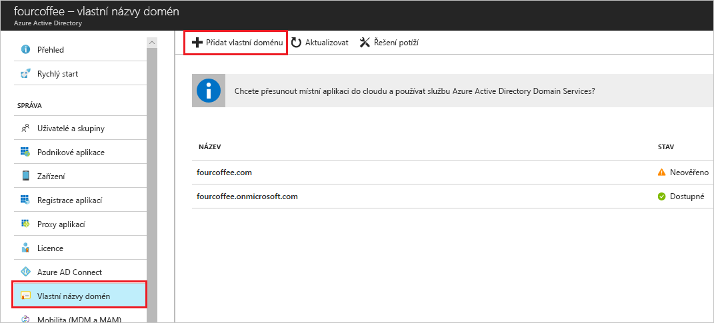

# Přidání vlastního názvu domény pomocí portálu Azure Active Directory
Každý nový Azure AD tenanta se dodává s počáteční název domény, *domainname*. onmicrosoft.com. Nelze změnit ani odstranit název domény, ale vaše organizace názvy můžete přidat do seznamu. Přidání vlastních názvů domén vám pomůže vytvořit uživatelská jména, které jsou vaši uživatelé znají, jako je například *alain@contoso.com*.

## Před zahájením
Před přidáním vlastního názvu domény, musíte vytvořit název domény u registrátora domény. Akreditované doménový registrátor, naleznete v tématu [ICANN-Accredited registrátorů](https://www.icann.org/registrar-reports/accredited-list.html).

## Vytvoření adresáře ve službě Azure AD
Po získání názvu domény, můžete vytvořit první adresář Azure AD.

1. Přihlaste se k [webu Azure portal](https://portal.azure.com/) pro svůj adresář pomocí účtu s **vlastníka** role pro dané předplatné a pak vyberte **Azure Active Directory**. Další informace o rolích předplatného najdete v části [Classic role správců předplatného, role Azure RBAC a rolích správce Azure AD](../../role-based-access-control/rbac-and-directory-admin-roles.md#azure-rbac-roles).

    

    >[!TIP]
    > Pokud máte v úmyslu federovat místní službu Windows Server AD pomocí služby Azure AD, musíte při spuštění nástroje Azure AD Connect pro synchronizaci adresářů zaškrtnout políčko **Mám v plánu nakonfigurovat pro tuto doménu jednotné přihlašování se svým místním adresářem Active Directory**. V průvodci v kroku **Doména služby Azure AD** musíte také zaregistrovat stejný název domény, který vyberete, pro federaci pomocí místního adresáře. [V těchto pokynech](../hybrid/how-to-connect-install-custom.md#verify-the-azure-ad-domain-selected-for-federation) uvidíte, jak daný krok v průvodci vypadá. Pokud nástroj Azure AD Connect nemáte, můžete [ho stáhnout tady](https://go.microsoft.com/fwlink/?LinkId=615771).

2. Vytvořit nový adresář pomocí následujících kroků v [vytvořit nového tenanta pro vaši organizaci](active-directory-access-create-new-tenant.md#create-a-new-tenant-for-your-organization).

    >[!Important]
    >Osoba, která vytvoří klienta je automaticky globálního správce pro tohoto tenanta. Globální správce můžete přidat další správce pro tenanta.

## Přidání vlastního názvu domény do Azure AD
Po vytvoření adresáře, můžete přidat vlastní název domény.

1. Vyberte **vlastní názvy domén**a pak vyberte **přidat vlastní doménu**.

    

2. Zadejte nový název domény vaší organizace do **vlastní název domény** pole (například _contoso.com_) a pak vyberte **přidáním domény**.

    Přidání neověřené domény a **Contoso** se zobrazí stránka zobrazí vaše informace DNS.

    >[!Important]
    >Musí zahrnovat .com, .net nebo jakékoli jinou příponu nejvyšší úrovně pro to správně fungovat.

    

4. Kopírovat informace DNS z **Contoso** stránky. Například MS = ms64983159.

    

## Přidejte své informace o DNS pro registrátora domény
Po přidání vlastního názvu domény do Azure AD, musíte vrátit vašeho registrátora domény a přidejte informace o Azure AD DNS ze zkopírovaného souboru TXT. Vytvoření tohoto TXT záznam pro vaši doménu "ověří" vlastnictví názvu domény.

-  Vraťte se do vašeho registrátora domény, vytvořte nový záznam TXT pro vaši doménu na základě zkopírovaný informací DNS, nastavte **TTL** (hodnota time to live) 3 600 sekund (60 minut) a poté uložit informace.

    >[!Important]
    >Můžete zaregistrovat libovolný počet názvů domén. Každá doména však získá svůj vlastní záznam TXT ze služby Azure AD. Buďte opatrní při zadávání vaše informace o souboru TXT registrátora domény. Pokud zadáte chybnou nebo duplicitní informace omylem, budete muset počkat, dokud hodnota TTL vyprší časový limit (standardně 60 minut) předtím, než můžete to zkusit znovu.

## Ověřte název vaší vlastní domény
Až dokončíte registraci vlastního názvu domény, budete muset Ujistěte se, že je platný v Azure AD. Může být okamžité šíření hodnoty z vašeho registrátora domény do Azure AD nebo může trvat několik dní, v závislosti na doménový Registrátor.

### Chcete-li ověřit vlastní název domény
1. Přihlaste se k webu [Azure Portal](https://portal.azure.com/) pomocí účtu globálního správce daného adresáře.

2. Vyberte **Azure Active Directory**a pak vyberte **vlastní názvy domén**.

3. Na **Fabrikam - vlastní názvy domén** vyberte vlastní název domény, **Contoso**.

    

4. Na **Contoso** stránce **ověřte** zajistit vaší vlastní domény správně zaregistrován a je platný pro službu Azure AD.

    

## Běžné problémy ověření
- Pokud Azure AD nemůže ověřit vlastní název domény, vyzkoušejte následující návrhy:
    - **Počkejte aspoň hodinu a zkuste to znovu**. Záznamy DNS musí rozšířit a teprve potom Azure AD můžete ověřit, že domény a tento proces může trvat hodinu i déle.

    - **Ujistěte se, že záznam DNS je správná.** Přejděte zpět na web registrátora názvu domény a ujistěte se, že položka existuje a zda odpovídá DNS záznam na základě informací poskytnutých Azure AD.

    Pokud nemůžete aktualizovat record na webu registrátora, musejí sdílet ji s někým, který má správná oprávnění k přidání položky a ověřte, zda že je přesné.

- **Ujistěte se, že název domény se už používá v jiném adresáři.** Název domény můžete ověřit jenom v jednom adresáři, což znamená, že pokud je název vaší domény aktuálně ověřený v jiném adresáři, není také možné ho ověřit v novém adresáři. Chcete-li vyřešit tento problém duplikace, je nutné odstranit název domény z původního adresáře. Další informace o odstraňování názvů domén najdete v tématu [Správa vlastních názvů domén](../users-groups-roles/domains-manage.md).

- **Ujistěte se, že nemáte žádné nespravované tenantů Power BI.** Pokud vaši uživatelé si aktivovali Powerbi prostřednictvím samoobslužné registrace a vytvořili nespravovaného tenanta pro vaši organizaci, je nutné provést nad správou jako interní nebo externí správu, pomocí Powershellu. Další informace o tom, jak převzít kontrolu nad nespravovaného adresáře, naleznete v tématu [převzít kontrolu nad nespravovaného adresáře jako správce v Azure Active Directory](../users-groups-roles/domains-admin-takeover.md).

## Další postup

- Přidáte další globální správce adresáře. Další informace najdete v tématu [přiřazení role a správci](active-directory-users-assign-role-azure-portal.md).

- Přidání uživatelů do domény, najdete v článku [postup přidání nebo odstranění uživatelů](add-users-azure-active-directory.md).

- Spravujte vaše informace o názvu domény ve službě Azure AD. Další informace najdete v tématu [Správa vlastních názvů domén](../users-groups-roles/domains-manage.md).

- Pokud máte místní verze systému Windows Server, který chcete použít společně s Azure Active Directory, naleznete v tématu [integrace místních adresářů se službou Azure Active Directory](../connect/active-directory-aadconnect.md).
