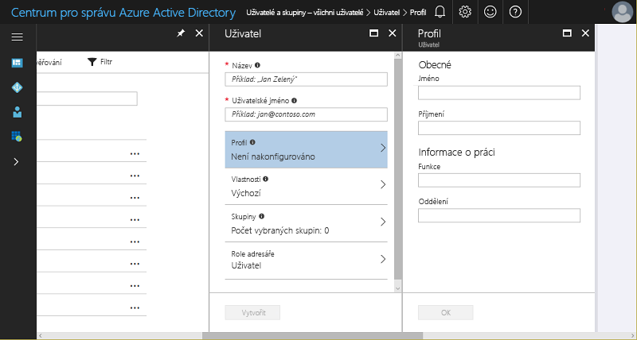
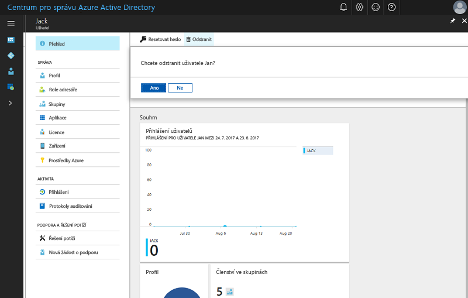

# Rychlý start: Přidání nových uživatelů do služby Azure Active Directory
Tento článek vysvětluje, jak odstranit uživatele ve vaší organizaci z tenanta Azure AD (Azure Active Directory) vaší organizace nebo je do něj přidat pomocí portálu Azure Portal nebo pomocí synchronizace dat uživatelských účtů místní služby Windows Server AD. 

## Přidání cloudových uživatelů
1. Přihlaste se k [centru pro správu služby Azure Active Directory](https://aad.portal.azure.com) prostřednictvím účtu, který má k adresáři oprávnění globálního správce.
2. Vyberte **Azure Active Directory** a potom **Uživatelé a skupiny**.
3. V okně **Uživatelé a skupiny** vyberte **Všichni uživatelé** a potom vyberte **Nový uživatel**.
   
4. Zadejte podrobnosti o uživateli, například **Jméno** a **Uživatelské jméno**. Část názvu domény v uživatelském jméně musí tvořit buď počáteční výchozí název domény [název domény].onmicrosoft.com, nebo ověřený nefederovaný [název vlastní domény](add-custom-domain.md), například contoso.com.
5. Zkopírujte nebo si jiným způsobem poznamenejte vygenerované heslo uživatele, abyste ho mohli po dokončení tohoto procesu poskytnout příslušnému uživateli.
6. Můžete ale také otevřít a vyplnit informace o uživateli v části **Profil**, **Skupiny** nebo **Role adresáře**. Další informace o rolích uživatelů a správců najdete v článku [Přiřazení rolí správce ve službě Azure AD](../users-groups-roles/directory-assign-admin-roles.md).
7. V části **Uživatel** vyberte **Vytvořit**.
8. Bezpečně předejte vygenerované heslo novému uživateli, aby se mohl přihlásit.

> [!TIP]
> Můžete také synchronizovat data uživatelského účtu z místní služby Windows Server AD. Řešení pro správu identit od Microsoftu pokrývá místní i cloudové funkce a vytvářejí jedinou identitu uživatele pro ověřování a autorizaci u všech prostředků bez ohledu na umístění. Tomu se říká hybridní identita. [Azure AD Connect](https://docs.microsoft.com/azure/active-directory/connect/active-directory-aadconnect) může integrovat místní adresáře do služby Azure Active Directory pro scénáře hybridní identity. To umožní poskytovat společnou identitu pro uživatele pro aplikace Office 365, Azure a SaaS integrované s Azure AD. 

## Odstranění uživatelů ze služby Azure AD
1. Přihlaste se k [centru pro správu služby Azure Active Directory](https://aad.portal.azure.com) prostřednictvím účtu, který má k adresáři oprávnění globálního správce.
2. Vyberte **Uživatelé a skupiny**.
3. V okně **Uživatelé a skupiny** vyberte v seznamu uživatele, které chcete odstranit. 
4. V okně vybraného uživatele vyberte **Přehled** a potom na panelu příkazů vyberte **Odstranit**.
   

### Další informace 
* [Přidání uživatelů typu host z jiného adresáře](../b2b/what-is-b2b.md) 
* [Přiřazení uživatele k roli ve službě Azure AD](active-directory-users-assign-role-azure-portal.md)
* [Správa uživatelských profilů](active-directory-users-profile-azure-portal.md)
* [Obnovení odstraněného uživatele](active-directory-users-restore.md)

## Další kroky
V tomto rychlém startu jste se naučili přidávat nové uživatele do služby Azure AD Premium. 

Po kliknutí na následující odkaz se dozvíte, jak vytvořit nového uživatele ve službě Azure AD prostřednictvím portálu Azure Portal.

>[!div class="nextstepaction"]
>[Přidání uživatelů do Azure AD](https://aad.portal.azure.com/#blade/Microsoft_AAD_IAM/UserManagementMenuBlade/)