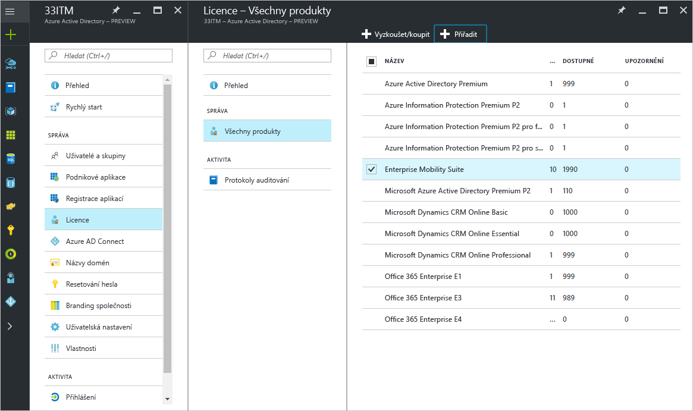
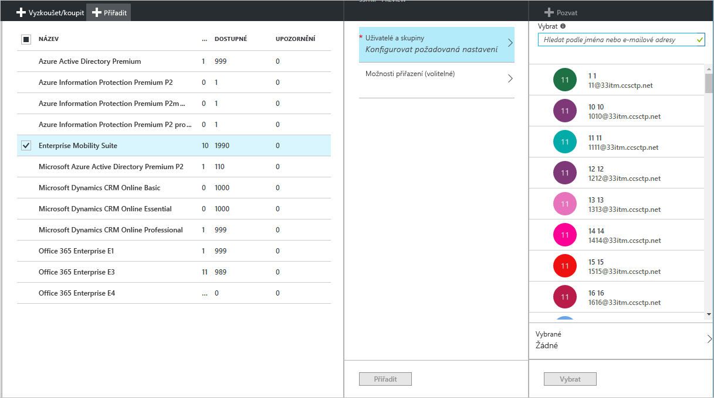
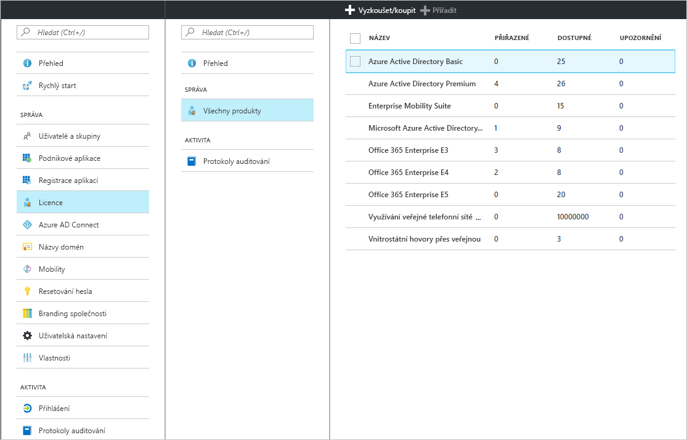
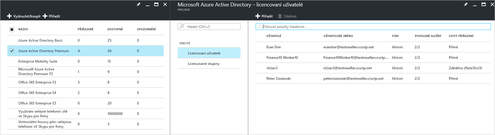
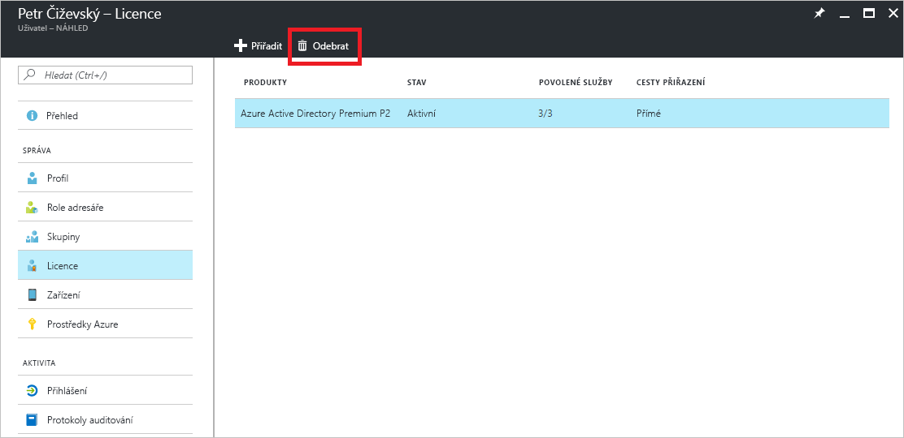

# Rychlý start: Licencování uživatelů ve službě Azure Active Directory
Licencované služby Azure AD fungují na základě aktivace předplatného služby Azure AD (Azure Active Directory) v tenantovi Azure. Po aktivaci předplatného jsou možnosti služeb spravovány správci služby Azure AD a používány licencovanými uživateli. Když si zakoupíte Enterprise Mobility + Security, Azure AD Premium nebo Azure AD Basic, váš tenant se aktualizuje pomocí předplatného, včetně období platnosti a předplacených licencí. Informace o předplatném, včetně počtu přiřazených licencí, jsou dostupné na portálu Azure Portal v části **Azure Active Directory** po otevření dlaždice **Licence**. Okno **Licence** je také nejlepším místem, kde můžete spravovat přiřazení licencí.

Přestože získání předplatného je vše, co potřebujete ke konfiguraci placených funkcí, musíte přiřadit uživatelské licence pro placené funkce Azure AD. Každý uživatel, který má mít přístup k placené funkci Azure AD nebo který je prostřednictvím takové funkce spravován, musí mít přiřazenu licenci. Přiřazení licence je mapování mezi uživatelem a zakoupenou službou, jako je Azure AD Premium, Basic, nebo Enterprise Mobility + Security.

Pomocí [přiřazení skupinové licence](active-directory-licensing-whatis-azure-portal.md) můžete nastavit pravidla, například tato:
* Všichni uživatelé ve vašem adresáři automaticky získají licenci.
* Všichni uživatelé s příslušnou pozicí získají licenci.
* Rozhodnutí můžete delegovat na jiné manažery v organizaci (pomocí [skupin samoobslužných služeb](../users-groups-roles/groups-self-service-management.md)).

> [!TIP]
> Podrobné informace o přiřazení licencí skupinám, včetně pokročilých scénářů a scénářů licencování Office 365, najdete v článku o [přiřazení licencí uživatelům podle členství ve skupině ve službě Azure Active Directory](../active-directory-licensing-group-assignment-azure-portal.md).

## Přiřazení licencí uživatelům a skupinám
V aktivním předplatném byste měli nejprve přiřadit licenci sami sobě a aktualizovat prohlížeč, abyste zajistili, že budete mít přístup ke všem očekávaným funkcím, které jsou součástí vašeho předplatného. Dalším krokem je přiřazení licencí uživatelům, kteří potřebují přístup k placeným funkcím Azure AD. Licence můžete snadno přiřadit tak, že je přiřadíte skupinám uživatelům a ne jednotlivým uživatelům. Při přiřazení licence skupině se licence přiřadí všem členům dané skupiny. Pokud uživatele do skupiny přidáte nebo je z ní odeberete, příslušná licence se automaticky přidá nebo odebere. 

> [!NOTE]
> Některé služby Microsoft nejsou dostupné ve všech umístěních. Než bude možné uživateli přiřadit licenci, musí správce pro příslušného uživatele zadat vlastnost **Místo použití**. Tuto vlastnost můžete nastavit na portálu Azure Portal v části **Uživatel** &gt; **Profil** &gt; **Nastavení**. Při přiřazení skupinové licence všichni uživatelé, jejichž umístění použití není zadáno, zdědí umístění adresáře.

Pokud chcete přiřadit licenci, vyberte v části **Azure Active Directory** &gt; **Licence** &gt; **Všechny produkty** minimálně jeden produkt a pak na panelu příkazů vyberte **Přiřadit**.

V okně **Uživatelé a skupiny** můžete zvolit více uživatelů nebo skupin, případně zakázat plány služeb v produktu. Jména uživatelů a názvy skupin můžete vyhledat pomocí vyhledávacího pole umístěného nahoře.

Při přiřazení licencí skupině může v závislosti na velikosti skupiny chvíli trvat, než všichni uživatelé licenci zdědí. Stav zpracování můžete zkontrolovat v okně **Skupina** na dlaždici **Licence**.

Při přiřazování licencí Azure AD může dojít k chybám, ale při správě produktů Azure AD a Enterprise Mobility + Security jsou chyby relativně vzácné. K potenciálním chybám přiřazení může dojít v těchto případech:
- Konflikt přiřazení: K chybě dojde, pokud byla uživateli dříve přiřazena licence, která není kompatibilní s aktuální licencí. V tomto případě je třeba před přiřazením nové licence odebrat aktuální licenci.
- Překročení počtu dostupných licencí: Když počet uživatelů v přiřazených skupinách překročí počet dostupných licencí, stav přiřazení uživatele zobrazí chybu přiřazení z důvodu chybějících licencí.

### Licencování spolupráce B2B ve službě Azure AD

Spolupráce B2B umožňuje, abyste pozvali uživatele typu host do tenanta Azure AD a poskytli jim přístup ke službám Azure AD a všem prostředkům Azure, které zpřístupníte.  

Za pozvání uživatelů B2B a jejich přiřazení k aplikaci v Azure AD se neúčtují žádné poplatky. Pro uživatele spolupráce B2B je také zdarma až 10 aplikací na jednoho uživatele typu host a 3 základní sestavy. Pokud má uživatel typu host přiřazeny odpovídající licence v partnerském tenantovi Azure AD, bude tento uživatel licencován i ve vašem tenantovi.

Není to nutné, ale pokud chcete uživatelům typu host B2B poskytnout přístup k placeným funkcím Azure AD, musí mít tito uživatelé příslušné licence Azure AD. Zvoucí tenant s placenou licencí Azure AD může přiřadit uživatelská práva ke spolupráci B2B dalším pěti uživatelům typu host pozvaným do tenanta. Scénáře a informace najdete v [doprovodných materiálech k licencování spolupráce B2B](../b2b/licensing-guidance.md).

## Zobrazení přiřazených licencí

Souhrnné zobrazení přiřazených a dostupných licencí najdete v části **Azure Active Directory** &gt; **Licence** &gt; **Všechny produkty**.

Při výběru konkrétního produktu se můžete podívat na podrobný seznam přiřazených uživatelů a skupin. V seznamu **Licencovaní uživatelé** se zobrazují všichni uživatelé, kteří aktuálně využívají licenci, a informace o tom, zda jim byla licence přiřazena přímo nebo zda ji zdědili ze skupiny.

Podokně i v seznamu **Licencované skupiny** se zobrazují všechny skupiny, kterým byly přiřazeny licence. Vyberte uživatele nebo skupinu, abyste otevřeli okno **Licence**, ve kterém se zobrazují všechny licence přiřazené danému objektu.

## Odebrání licence

Pokud chcete odebrat licenci, přejděte na uživatele nebo skupinu a otevřete dlaždici **Licence** tile. Vyberte licenci a klikněte na **Odebrat**.

Licence zděděné uživatelem ze skupiny nelze odebrat přímo. Místo toho musíte uživatele odebrat ze skupiny, ze které dědí licenci.

## Další kroky
V tomto rychlém startu jste se naučili přiřadit licence uživatelům a skupinám v adresáři Azure AD. 

Po kliknutí na následující odkaz můžete nakonfigurovat přiřazení licencí předplatného v Azure AD na portálu Azure Portal.

> [!div class="nextstepaction"]
> [Přiřazení licencí Azure AD](https://aad.portal.azure.com/#blade/Microsoft_AAD_IAM/LicensesMenuBlade/Overview) 