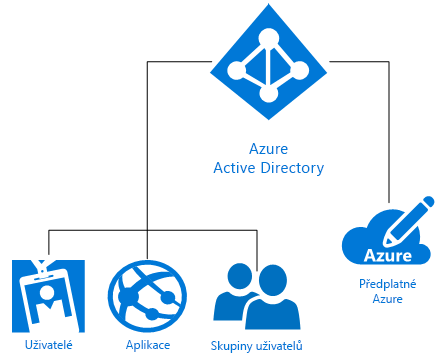

# Co je Microsoft Azure identity?
Microsoft Azure Active Directory (Azure AD) je cloudové řešení správy identit a přístupu, které poskytuje adresářové služby, správu identit a správu přístupu k aplikacím. Azure AD rychle [umožní jednotné přihlašování](https://docs.microsoft.com/azure/active-directory/active-directory-enterprise-apps-manage-sso) k tisícům předem integrovaných komerčních i vlastních aplikací v [galerii aplikací Azure AD](https://azure.microsoft.com/marketplace/active-directory/all/). Řadu těchto aplikací už nejspíš používáte, třeba Office 365, Salesforce.com, Box, ServiceNow a Workday.

Při vytvoření předplatného Azure dojde k automatickému přiřazení jednoho adresáře Azure AD. Azure AD jako služba identit v Azure potom poskytuje všechny funkce správy identit a přístupu pro cloudové prostředky. Mezi tyto prostředky můžou patřit uživatelé, aplikace a skupiny pro jednotlivého tenanta (organizaci), jak ukazuje následující diagram:

Microsoft Azure nabízí několik způsobů, jak využít identitu jako službu (IDaaS) s různými úrovněmi složitosti podle individuálních požadavků vaší organizace. Zbytek tohoto článku vysvětluje základní terminologii a koncepty související s identitou Azure a poskytuje doporučení, jak si z dostupných možností vybrat tu nejvhodnější.

## Základní výrazy

Než pro svoji organizaci vyberete určité řešení identity Azure, je potřeba si osvojit základní výrazy, které se v souvislosti se službami identit Azure běžně používají.

|Základní výraz| Popis|
|-----|-----|
|Předplatné Azure |Předplatná slouží k úhradě cloudových služeb Azure a většinou jsou spojená s platební kartou. Předplatných můžete mít několik, ale sdílení prostředků mezi různými předplatnými prostředky může být obtížné.|
|Tenant Azure | Tenant Azure AD je zástupce jedné organizace. Je to vyhrazená, důvěryhodná instance Azure AD, která se automaticky vytvoří, když si určitá organizace zaregistruje předplatné cloudových služeb Microsoftu, jako je Azure, Intune nebo Office 365. Tenanti můžou získat přístup ke službám buď ve vyhrazené prostředí (jeden tenant), nebo ve sdíleném prostředí s dalšími organizacemi (více tenantů).|
|Adresář Azure AD | Každý tenant Azure má vyhrazený důvěryhodný adresář Azure AD, který obsahuje uživatele, skupiny a aplikace daného tenanta. Slouží k provádění funkcí správy identit a přístupu pro prostředky tenanta. Jakmile si zaregistrujete cloudovou službu Microsoftu, jako je Azure, Microsoft Intune nebo Office 365, automaticky dojde ke zřízení jedinečného adresáře Azure AD, takže se výrazy *tenant*, *Azure AD* a *adresář Azure AD* někdy používají zaměnitelně. |
|Vlastní doména | Při první registraci předplatného cloudové služby Microsoftu používá váš tenant (organizace) název domény *.onmicrosoft.com*. Většina organizací má ale jeden nebo víc názvů domén, které používá při obchodní činnosti a pomocí kterých můžou koncoví uživatelé získat přístup k podnikovým prostředkům. Do Azure AD můžete přidat název vlastní domény, který vaši uživatelé znají, třeba *alice@contoso.com* namísto *alice@contoso.onmicrosoft.com*. |
|Účet Azure AD | Jedná se o identity vytvořené pomocí Azure AD nebo jiné cloudové služby Microsoftu, třeba Office 365. Jsou uložené ve službě Azure AD a přístupné prostřednictvím všech předplatných cloudových služeb dané organizace. |
|Správce předplatného Azure| Správce účtu je osoba, která zaregistrovala nebo zakoupila předplatné Azure. Pomocí [Centra účtů](https://account.azure.com/Subscriptions) můžou provádět různé úlohy správy, jako třeba vytváření předplatných, rušení předplatných, změnu fakturace předplatného nebo změnu správce služeb. |
|Globální správce Azure AD | Globální správci Azure AD mají úplný přístup ke všem funkcím správy Azure AD. Ve výchozím nastavení se globálním správcem automaticky stává osoba, která zaregistruje předplatné cloudových služeb Microsoftu. Globálních správců může být víc, jenom jeden z nich ale může přiřazovat [další role správců](https://docs.microsoft.com/azure/active-directory/active-directory-assign-admin-roles-azure-portal) uživatelům. |
|Účet Microsoft | Účty Microsoft (které si vytvoříte pro osobní účely) poskytují přístup k zákaznickým produktům a cloudovým službám Microsoftu, jako je Outlook (Hotmail), OneDrive, Xbox LIVE nebo Office 365. Tyto identity se vytvářejí a ukládají v systému účtů identit uživatelů, který provozuje Microsoft.|
|Pracovní nebo školní účty | Pracovní nebo školní účty (vytvořené správcem pro pracovní/akademické účely) poskytují přístup ke cloudovým službám Microsoftu na podnikové úrovni, jako je Azure, Intune nebo Office 365.|

## Základní koncepty

Seznámili jste se se základními výrazy, které souvisejí s identitami Azure. Teď byste se měli blíž seznámit s koncepty identit Azure, které vám pomůžou informovaně se rozhodnout o službě identit Azure.

|Základní koncept |Popis|
|-----|-----|
|[Jak je předplatné Azure propojeno se službou Azure Active Directory](https://docs.microsoft.com/azure/active-directory/active-directory-how-subscriptions-associated-directory) |Každé předplatné Azure má s adresářem Azure AD vztah důvěryhodnosti, který slouží k ověřování uživatelů, služeb a zařízení. *Několik předplatných může důvěřovat stejnému adresáři Azure AD, ale jedno předplatné může důvěřovat jenom jednomu adresáři Azure AD*. Tento vztah důvěryhodnosti se liší od vztahu, který má předplatné s jinými prostředky Azure (webové stránky, databáze atd.), což jsou pro předplatné spíš podřízené prostředky. Pokud platnost předplatného vyprší, zastaví se i přístup k prostředkům přidruženým k předplatnému, s výjimkou Azure AD. Adresář Azure AD ale v Azure zůstane a vy k němu můžete přidružit jiné předplatné a pokračovat ve správě prostředků tenanta.|
|[Způsob fungování licencí Azure AD](https://docs.microsoft.com/azure/active-directory/active-directory-licensing-get-started-azure-portal) | Když si zakoupíte nebo aktivujete Enterprise Mobility Suite, Azure AD Premium nebo Azure AD Basic, váš adresář se aktualizuje a příslušné předplatné se do něj přidá, včetně období platnosti a předplacených licencí. Po aktivaci předplatného můžou službu spravovat globální správci Azure AD a můžou ji používat licencovaní uživatelé. Informace o předplatném, včetně počtu přiřazených nebo dostupných licencí, jsou dostupné na webu Azure Portal v okně **Azure Active Directory** > **Licence**. To je zároveň nejlepší místo, kde můžete spravovat přiřazení licencí.|
|[Řízení přístupu na základě role na webu Azure Portal](https://docs.microsoft.com/azure/role-based-access-control/overview)|Řízení přístupu na základě role v Azure (RBAC) umožňuje velice přesnou správu přístupu k prostředkům Azure. Příliš velké množství oprávnění může vystavit účet napadení ze strany útočníků. Pokud je ale oprávnění příliš málo, zaměstnanci nemůžou efektivně odvádět svoji práci. Pomocí RBAC můžete přidělit zaměstnancům přesně ta oprávnění, která potřebují, na základě tří základních rolí platných pro všechny skupiny prostředků: vlastník, přispěvatel a čtenář. Můžete taky vytvořit až 2000 [vlastních rolí RBAC](https://docs.microsoft.com/azure/role-based-access-control/custom-roles) podle svých konkrétních požadavků. |
|[Hybridní identita](https://docs.microsoft.com/azure/active-directory/connect/active-directory-aadconnect)|Hybridní identity se dosahuje integrací místní služby AD DS (Windows Server Active Directory) a služby Azure AD pomocí služby [Azure AD Connect](https://docs.microsoft.com/azure/active-directory/connect/active-directory-aadconnect). To umožní poskytnout uživatelům společnou identitu pro služby Office 365, Azure a místní aplikace nebo aplikace SaaS integrované s Azure AD. Hybridní identita umožňuje účinně rozšířit identity a přístup z místního prostředí do cloudu.|

### Rozdíl mezi službou AD DS Windows Serveru a Azure AD
Azure AD (Azure Active Directory) i místní služba Active Directory (Active Directory Domain Services nebo AD DS) jsou systémy, které ukládají data adresářů a spravují komunikaci mezi uživateli a prostředky, včetně procesů přihlašování uživatelů, ověřování a hledání v adresářích.

Pokud už znáte místní službu AD DS (Windows Server Active Directory Domain Services), která se poprvé objevila v systému Windows Server 2000, potom už vám nejspíš základní koncept služby identit není cizí. Je ale zároveň důležité si uvědomit, že Azure AD není jenom řadič domény v cloudu. Je to také úplně nový způsob poskytování identity jako služby (IDaaS) v Azure, který vyžaduje nový způsob uvažování, abyste mohli plně využít možnosti cloudu a ochránit svoji organizaci před novodobými hrozbami. 

AD DS je role serveru v systému Windows Server, což znamená, že se dá nasadit na fyzické i virtuální počítače. Má hierarchickou strukturu založenou na protokolu X.500. Používá DNS k vyhledávání objektů, umožňuje interakci pomocí protokolu LDAP a k ověřování primárně využívá protokol Kerberos. Služba Active Directory kromě připojování počítačů k doméně umožňuje používat organizační jednotky a objekty zásad skupiny. Mezi doménami se vytváří vztahy důvěryhodnosti.

Oddělení IT už dlouhá léta chrání zabezpečení svých hraničních sítí pomocí AD DS, ale moderní podniky bez hraničních sítí, které chtějí vyhovět požadavkům na identitu ze strany zaměstnanců, zákazníků a partnerů, potřebují novou úroveň řízení. Touto úrovní řízení je Azure AD. Zabezpečení se z podnikové brány firewall přesunulo do cloudu, kde Azure AD chrání podnikové prostředky a přístup tím, že uživatelům poskytuje jednu společnou identitu (v místním prostředí nebo cloudu). Vaši uživatelé tak získají flexibilní možnost zabezpečeného přístupu k aplikacím, které potřebují k práci, skoro z libovolného zařízení. Součástí jsou i ovládací prvky pro ochranu dat na základě rizik podporované funkcemi strojového učení a generování podrobných sestav, které oddělení IT potřebuje k zabezpečení podnikových dat.

Azure AD je veřejná adresářová služba pro více zákazníků, což znamená, že můžete v Azure AD vytvořit tenanta pro své cloudové servery a aplikace, jako je Office 365. Uživatelé a skupiny se vytvářejí v ploché struktuře bez organizačních jednotek a objektů zásad skupiny. Ověřování se provádí prostřednictvím protokolů jako SAML, WS-Federation a OAuth. Azure AD umožňuje dotazování, ale místo protokolu LDAP je potřeba použít rozhraní REST API s názvem AD Graph API. Všechno probíhá přes protokol HTTP a HTTPS.

### Rozšíření možností správy a zabezpečení Office 365
Už používáte Office 365? Svoji digitální transformaci můžete urychlit tím, že pomocí Azure AD rozšíříte integrované možnosti Office 365 a zabezpečíte všechny své prostředky, aby se mohli všichni vaši zaměstnanci věnovat své práci v zabezpečeném prostředí. Když používáte Azure AD, vedle funkcí Office 365 můžete zabezpečit svoje celé portfolio aplikací pomocí jedné identity, která umožňuje jednotné přihlašování ke všem aplikacím. Možnosti podmíněného přístupu můžete rozšířit nejen na základě stavu zařízení, ale taky na základě uživatele, polohy, aplikace a rizika. Ještě vyšší stupeň ochrany poskytují v případě potřeby funkce vícefaktorového ověřování (MFA). Získáte větší přehled o uživatelských oprávněních a budete moct poskytovat přístup pro správu na vyžádání a za běhu. Díky samoobslužným funkcím Azure AD, jako je obnovení zapomenutých hesel, požadavky na přístup k aplikaci a vytváření a správa skupin, budou vaši uživatelé produktivnější a budou vytvářet méně lístků podpory.

> [!TIP]
> Chcete se o používání správy identit Azure AD v Office 365 dozvědět víc? [Stáhněte si elektronickou příručku](https://info.microsoft.com/Extend-Office-365-security-with-EMS.html).

## Řešení identit Microsoft Azure

Microsoft Azure nabízí několik způsobů správy identit uživatelů bez ohledu na to, jestli jejich správa probíhá plně v místním prostředí, jenom v cloudu, nebo dokonce někde na pomezí. Mezi tyto způsoby patří samoobslužné použití AD DS v Azure, Azure Active Directory (Azure AD), hybridní identita a Azure AD Domain Services.

### Samoobslužné použití AD DS
Společnosti, které potřebují cloud využívat jenom omezeně, můžou zvolit **samoobslužné použití AD DS** v Azure. Tato možnost podporuje řadu scénářů služby Windows Server AD DS, které se hodí pro nasazení virtuálních počítačů v Azure. Můžete třeba vytvořit virtuální počítač Azure jako řadič domény běžící ve vzdáleném datovém centru, který je připojený ke vzdálené síti. Odtud by mohl tento virtuální počítač podporovat požadavky na ověřování od vzdálených uživatelů a zlepšit výkon ověřování. Tato možnost je také vhodná jako poměrně nízkonákladová náhrada jinak finančně náročných webů pro zotavení po havárii, která v Azure hostuje malý počet řadičů domény a jednu virtuální síť. Můžete taky potřebovat nasadit v Azure aplikaci, třeba SharePoint, která vyžaduje službu Windows Server AD DS, ale není závislá na místní síti ani podnikové službě Windows Server Active Directory. V takovém případě můžete v Azure nasadit izolovanou doménovou strukturu, která vyhoví požadavkům serverové farmy SharePointu. Tato možnost taky podporuje nasazení síťových aplikací, které vyžadují připojení k místní síti a místní službě Active Directory.

### Azure Active Directory (Azure AD)
**Samostatná služba Azure AD** je plně cloudové řešení správy identit a přístupu jako služby (IDaaS). Azure AD nabízí solidní sadu funkcí pro správu uživatelů a skupin. Pomáhá zabezpečit přístup k místním a cloudovým aplikacím, včetně webových služeb Microsoftu, třeba k Office 365, a řadě dalších aplikací SaaS (software jako služba), které neposkytuje Microsoft. Azure AD je k dispozici ve třech edicích: Free, Basic a Premium. Azure AD zvyšuje efektivitu organizace a rozšiřuje zabezpečení nad rámec hraniční brány firewall na novou úroveň řízení, kterou chrání služba Azure Machine Learning a další rozšířené funkce zabezpečení.

### Hybridní identita
Řada osvícených ředitelů IT a firem, kteří myslí na dlouhodobé směřování své společnosti, se nerozhoduje mezi místním a cloudovým řešením identit, ale rozšiřuje své místní adresáře do cloudu prostřednictvím řešení **hybridní identity**. Hybridní identita představuje opravdu globální řešení správy identit a přístupu poskytující zabezpečený a produktivní přístup k aplikacím, které uživatelé potřebují k práci.

> [!TIP]
> Pokud vás zajímají další informace o tom, jak ředitelé IT zakládají své strategie v oblasti IT na službě Azure Active Directory, stáhněte si [příručku ke službě Azure Active Directory pro ředitele IT](https://aka.ms/AzureADCIOGuide).

### Azure AD Domain Services
**Azure AD Domain Services** nabízí způsob, jak v cloudu využít službu AD DS ke zjednodušené správě konfigurace virtuálních počítačů Azure a zároveň vyhovět požadavkům na místní identity pro vývoj a testování síťových aplikací. Služba Azure AD Domain Services není určená k tomu, aby přenesla vaši místní infrastrukturu AD DS na virtuální počítače Azure spravované službou Azure AD Domain Services. Virtuální počítače Azure ve spravovaných doménách by měly totiž sloužit k podpoře vývoje, testování a přesunům místních aplikací, které vyžadují metody ověřování AD DS, do cloudu.

## Běžné scénáře a doporučení

Tady najdete několik běžných scénářů souvisejících s identitou a přístupem a doporučení, jaká možnost identity Azure by mohla být pro každý z nich nejvhodnější.

|Scénář identity| Doporučení|
|-----|-----|
|Moje organizace vložila značné investice do místní služby Windows Server Active Directory, ale teď chceme rozšířit identitu do cloudu.| Nejčastěji používaným řešením identity Azure je [hybridní identita](https://docs.microsoft.com/azure/active-directory/active-directory-hybrid-identity-design-considerations-overview). Pokud už jste vložili investice do místní služby AD DS, můžete identitu snadno rozšířit do cloudu pomocí služby Azure AD Connect.|
|Celá naše firma vznikla v cloudu a vůbec jsme neinvestovali do místních řešení identity.| Nejlepší volbou pro výhradně cloudové firmy bez investic do místního prostředí je [Azure Active Directory](https://docs.microsoft.com/azure/active-directory/active-directory-whatis).|
|Potřebujeme zjednodušenou konfigurace virtuálních počítačů Azure a možnosti řízení, abychom vyhověli požadavkům identit v místním prostředí pro účely vývoje a testování aplikací.|Pokud potřebujete používat AD DS ke zjednodušenému řízení konfigurace virtuálních počítačů Azure nebo chcete vyvíjet nebo migrovat do cloudu starší místní aplikace využívající adresáře, je pro vás dobrou volbou služba [Azure AD Domain Services](https://docs.microsoft.com/azure/active-directory-domain-services/active-directory-ds-overview).|  
|Potřebuji podporovat několik virtuálních počítačů v Azure, ale moje společnost vložila vysoké investice do místní služby AD DS (Active Directory).|[Samoobslužné použití AD DS](https://docs.microsoft.com/azure/active-directory-domain-services/active-directory-ds-comparison#do-it-yourself-diy-ad-deployment-options) vám umožní podporovat několik virtuálních počítačů, aniž byste přišli o vysoké investice do AD DS v místním prostředí. |

## Kde získám další informace?
Máme spoustu skvělých materiálů online, ze kterých se o Azure AD dozvíte všechno. Pro začátek si můžete projít tyto zajímavé články:

* [Povolení hybridní správy adresáře pomocí služby Azure AD Connect](../hybrid/whatis-hybrid-identity.md)
* [Dodatečné zabezpečení pro dokonale propojený svět](../authentication/multi-factor-authentication.md)
* [Automatizace zřizování uživatelů a jeho rušení pro aplikace SaaS ve službě Azure Active Directory](../manage-apps/user-provisioning.md)
* [Správa hesel odkudkoli](../user-help/active-directory-passwords-update-your-own-password.md)
* [Jak ve službě Azure Active Directory probíhá přístup k aplikacím a jednotné přihlašování?](../manage-apps/what-is-single-sign-on.md)
* [Automatizace zřizování uživatelů a jeho rušení pro aplikace SaaS ve službě Azure Active Directory](../manage-apps/user-provisioning.md)
* [Jak poskytnout zabezpečený vzdálený přístup k místním aplikacím](../manage-apps/application-proxy.md)
* [Správa přístupu k prostředkům pomocí skupin služby Azure Active Directory](active-directory-manage-groups.md)
* [Co je licencování Microsoft Azure Active Directory?](active-directory-licensing-whatis-azure-portal.md)
* [Jak odhalím neschválené cloudové aplikace, které se používají v mé organizaci?](../manage-apps/cloud-app-discovery.md)

## Další postup

Seznámili jste se s koncepty identity Azure a možnostmi, které jsou vám dostupné. Teď můžete pomocí následujících zdrojů začít implementovat vybranou možnost:

[Další informace o řešeních hybridní identity v Azure](https://docs.microsoft.com/azure/active-directory/choose-hybrid-identity-solution)

[Více se dozvíte v prostředí testování konceptu Azure](https://aka.ms/aad-poc)
