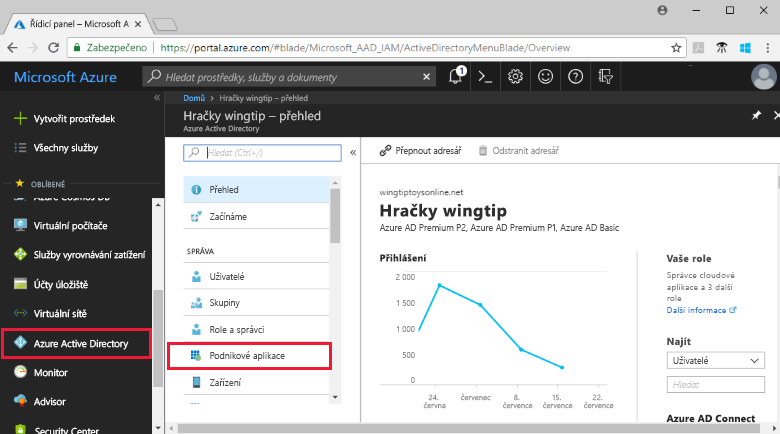
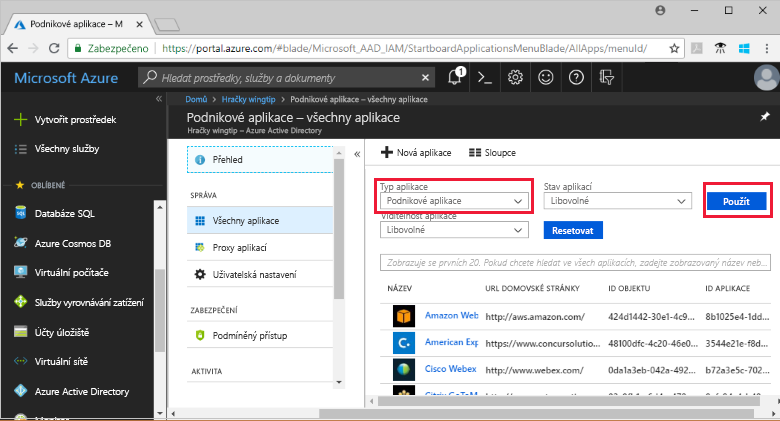
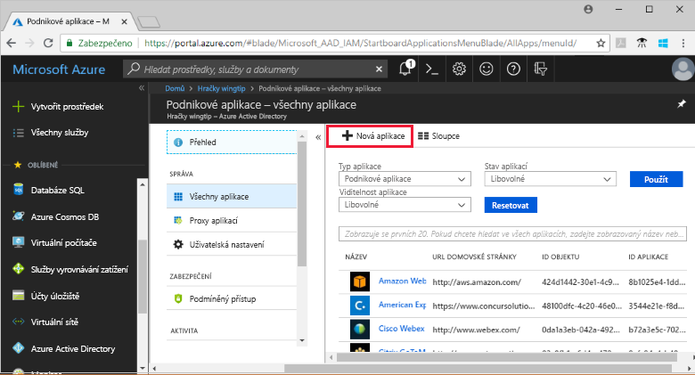
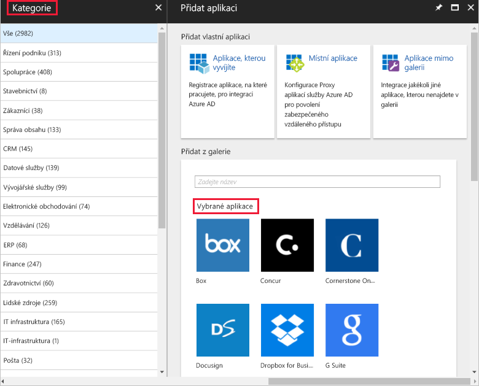
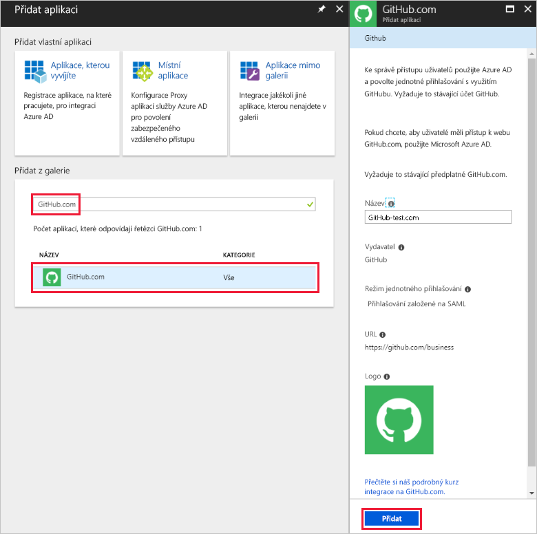
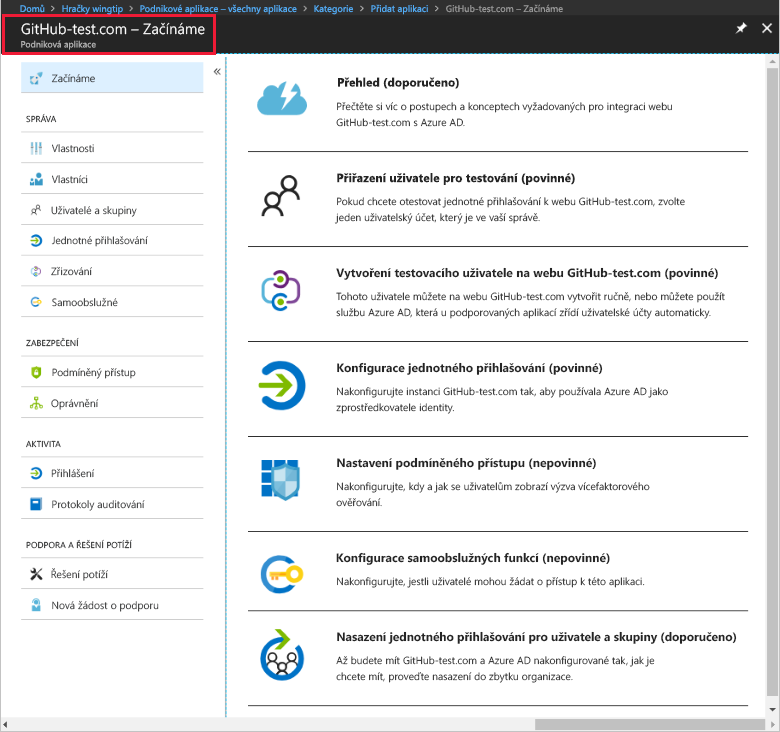
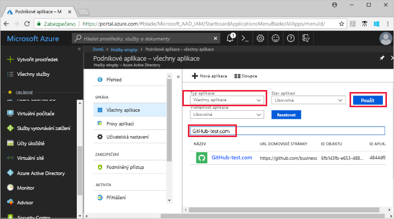
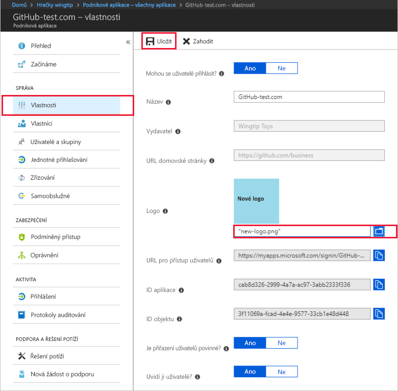

# Rychlý start: Přidání aplikace do svého tenanta Azure Active Directory

Azure Active Directory (Azure AD) nabízí galerii obsahující tisíce předem integrovaných aplikací. Galerie pravděpodobně obsahuje i některé aplikace, které využívá vaše organizace. V tomto rychlém startu se pomocí webu Azure Portal přidá aplikace z galerie do tenanta Azure Active Directory (Azure AD).

Po přidání aplikace do tenanta Azure AD můžete:

- Spravovat přístup uživatelů k aplikaci pomocí zásad podmíněného přístupu.
- Konfigurovat jednotné přihlašování uživatelů k aplikaci pomocí jejich účtů Azure AD.

## Před zahájením

K přidání aplikace do tenanta budete potřebovat:

- Předplatné Azure AD
- Předplatné s povoleným jednotným přihlašováním pro vaši aplikaci

Přihlaste se k webu [Azure Portal](https://portal.azure.com) jako globální správce vašeho tenanta Azure AD, správce cloudové aplikace nebo správce aplikace.

K testování postupů v tomto kurzu doporučujeme použít neprodukční prostředí. Pokud nemáte neprodukční prostředí Azure AD, můžete [získat měsíční zkušební verzi](https://azure.microsoft.com/pricing/free-trial/).

## Přidání aplikace do tenanta Azure AD

Přidání aplikace z galerie do tenanta Azure AD:

1. Na webu [Azure Portal](https://portal.azure.com) klikněte na levém navigačním panelu na **Azure Active Directory**.

2. V okně **Azure Active Directory** klikněte na **Podnikové aplikace**.

    

3. Otevře se okno **Všechny aplikace**, ve kterém se zobrazí náhodný vzorek aplikací ve vašem tenantovi Azure AD.

    

4. V horní části okna **Všechny aplikace** klikněte na **Nová aplikace**.

    

5. Pokud chcete zobrazit seznam aplikací v galerii, je nejjednodušší použít **Kategorie**, protože ikony v části **Vybrané aplikace** představují náhodný vzorek aplikací v galerii.

    

    Další aplikace můžete zobrazit kliknutím na **Zobrazit více**. Hledání tímto způsobem nedoporučujeme, protože galerie obsahuje tisíce aplikací.

6. Pokud chcete vyhledat aplikaci, v části **Přidat z galerie** zadejte název aplikace, kterou chcete přidat. Ve výsledcích vyberte aplikaci a klikněte na **Přidat**. Následující příklad ukazuje **přidat aplikaci** formulář, který se zobrazí po hledání webu github.com.

    

6. Ve formuláři pro konkrétní aplikaci můžete změnit informace o vlastnostech. Například můžete upravit název aplikace, aby odpovídal potřebám vaší organizace. V tomto příkladu se používá název **GitHub-test**.

8. Jakmile budete se změnami vlastností hotovi, klikněte na **Přidat**.

9. Zobrazí se stránka Začínáme s možnostmi konfigurace aplikace pro vaši organizaci.

    

Dokončili jste přidání vaší aplikace. Můžete si udělat pauzu. V následujících částech se dozvíte, jak změnit logo a upravit další vlastnosti aplikace.

## Vyhledání aplikace tenanta Azure AD

Předpokládejme, že jste se museli vzdálit a teď se vracíte dokončit konfiguraci aplikace. První věc, kterou je potřeba udělat, je najít aplikaci.

1. Na webu **[Azure Portal](https://portal.azure.com)** klikněte na levém navigačním panelu na **Azure Active Directory**.

2. V okně Azure Active Directory klikněte na **Podnikové aplikace**.

3. V rozevírací nabídce **Typ aplikace** vyberte **Všechny aplikace** a klikněte na **Použít**. Další informace o možnostech zobrazení najdete v tématu [Zobrazení aplikací tenanta](view-applications-portal.md).

4. Zobrazí se seznam všech aplikací ve vašem tenantovi Azure AD. Tento seznam představuje náhodný vzorek. Pokud chcete zobrazit další aplikace, jednou nebo vícekrát klikněte na **Zobrazit více**.

5. Pokud chcete rychle vyhledat aplikaci ve svém tenantovi, zadejte název aplikace do vyhledávacího pole a klikněte na **Použít**. V tomto příkladu se vyhledá dříve přidaná aplikace GitHub-test.

    

## Konfigurace vlastností přihlašování uživatelů

Teď, když jste našli aplikaci, ji můžete otevřít a nakonfigurovat její vlastnosti.

Úprava vlastností aplikace

1. Kliknutím na aplikaci ji otevřete.
2. Kliknutím na **Vlastnosti** otevřete okno vlastností umožňující úpravy.

    

3. Seznamte se s možnostmi přihlašování. Kombinací možností **Mohou se uživatelé přihlásit?**, **Je přiřazení uživatelů povinné?** a **Uvidí ji uživatelé?** se určuje, jestli se můžou přihlásit uživatelé přiřazení nebo nepřiřazení k aplikaci. Tyto možnosti také určují, jestli se uživateli zobrazí aplikace na přístupovém panelu.

    - Možnost **Mohou se uživatelé přihlásit?** určuje, jestli se můžou přihlásit uživatelé přiřazení k aplikaci.
    - Možnost **Je přiřazení uživatelů povinné?** určuje, jestli se můžou přihlásit uživatelé nepřiřazení k aplikaci.
    - Možnost **Uvidí ji uživatelé?** určuje, jestli se uživatelům přiřazeným k aplikaci zobrazí aplikace na přístupovém panelu a ve spouštěči O365.

4. Následující tabulky vám pomůžou zvolit možnosti, které jsou pro vaše potřeby nejvhodnější.

    - Chování pro **přiřazené** uživatele:

        | Nastavení vlastností aplikace | | | Prostředí pro přiřazené uživatele | |
        |---|---|---|---|---|
        | Mohou se uživatelé přihlásit? | Je přiřazení uživatelů povinné? | Uvidí ji uživatelé? | Mohou se přiřazení uživatelé přihlásit? | Zobrazí se aplikace přiřazeným uživatelům?* |
        | ano | ano | ano | ano | ano  |
        | ano | ano | ne  | ano | ne   |
        | ano | ne  | ano | ano | ano  |
        | ano | ne  | ne  | ano | ne   |
        | ne  | ano | ano | ne  | ne   |
        | ne  | ano | ne  | ne  | ne   |
        | ne  | ne  | ano | ne  | ne   |
        | ne  | ne  | ne  | ne  | ne   |

    - Chování pro **nepřiřazené** uživatele:

        | Nastavení vlastností aplikace | | | Prostředí pro nepřiřazené uživatele | |
        |---|---|---|---|---|
        | Mohou se uživatelé přihlásit? | Je přiřazení uživatelů povinné? | Uvidí ji uživatelé? | Mohou se nepřiřazení uživatelé přihlásit? | Zobrazí se aplikace nepřiřazeným uživatelům?* |
        | ano | ano | ano | ne  | ne   |
        | ano | ano | ne  | ne  | ne   |
        | ano | ne  | ano | ano | ne   |
        | ano | ne  | ne  | ano | ne   |
        | ne  | ano | ano | ne  | ne   |
        | ne  | ano | ne  | ne  | ne   |
        | ne  | ne  | ano | ne  | ne   |
        | ne  | ne  | ne  | ne  | ne   |

    * Zobrazí se aplikace uživateli na přístupovém panelu a ve spouštěči aplikací Office 365?

## Použití vlastního loga

Použití vlastního loga:

1. Vytvořte logo o rozměrech 215 × 215 pixelů a uložte ho ve formátu PNG.
2. Vzhledem k tomu, že jste už aplikaci našli, klikněte na ni.
2. V levém okně klikněte na **Vlastnosti**.
4. Nahrajte logo.
5. Jakmile budete hotovi, klikněte na **Uložit**.

    

## Další postup

V tomto rychlém startu jste se dozvěděli, jak do tenanta Azure AD přidat aplikaci z galerie. Zjistili jste, jak upravit vlastnosti aplikace.

Teď jste připraveni nakonfigurovat pro aplikaci jednotné přihlašování.

> [!div class="nextstepaction"]
> [Konfigurace jednotného přihlašování](configure-single-sign-on-portal.md)

