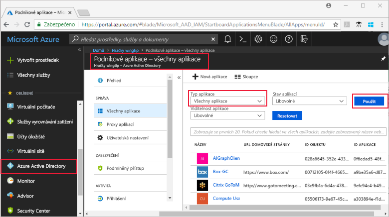

# Zobrazit všechny podnikové aplikace, které můžete spravovat I v Azure Active Directory
Můžete spravovat vaše podnikové aplikace ve službě Azure Active Directory (Azure AD). Můžete zobrazit aplikace, můžete spravovat, přiřaďte uživatele nebo skupiny do aplikace, spravovat vlastnosti pro aplikace, jako je například název aplikace nebo loga a i zakázat aplikaci tak, aby žádní uživatelé se můžete přihlásit k jeho.

## Zobrazení všech Moje aplikace
1. Přihlaste se k [portál Azure](https://portal.azure.com) pomocí účtu, který je globální správce adresáře.
2. Vyberte **všechny služby**, zadejte **Azure Active Directory** v textovém poli a potom vyberte **Enter**.
3. Na **Azure Active Directory -** ***directoryname*** podokno (který je Azure AD pro adresář spravujete), vyberte **podnikové aplikace, které**.

    
4. Na **podnikové aplikace, které** podokně, vyberte **všechny aplikace**. V tomto podokně můžete vybrat aplikace ke správě, Změna zobrazených sloupců nebo filtrování seznamu vyhledejte aplikaci, které chcete (například k zobrazení pouze zakázána aplikace).

## Další postup
* [Přiřazení uživatele nebo skupiny do aplikace enterprise](assign-user-or-group-access-portal.md)
* [Odebrat uživatele nebo skupinu přiřazení z podnikové aplikace.](remove-user-or-group-access-portal.md)
* [Zakázat přihlášení uživatele pro aplikaci, enterprise](disable-user-sign-in-portal.md)
* [Změna názvu nebo logo aplikace enterprise](change-name-or-logo-portal.md)
