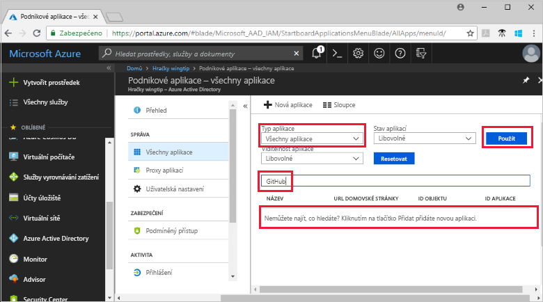
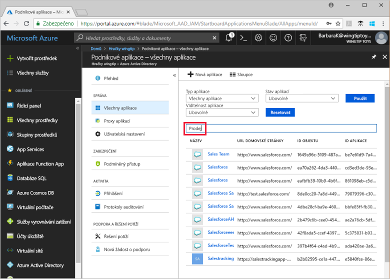

# Zobrazení aplikací tenanta Azure Active Directory

V tomto rychlém startu se pomocí webu Azure Portal zobrazí aplikace v tenantovi Azure Active Directory (Azure AD).

## Před zahájením

Abyste viděli výsledky, musí váš tenant Azure AD obsahovat alespoň jednu aplikaci. Informace o přidání aplikace najdete v rychlém startu [Přidání aplikace](add-application-portal.md).

Přihlaste se k webu [Azure Portal](https://portal.azure.com) jako globální správce vašeho tenanta Azure AD, správce cloudové aplikace nebo správce aplikace.

## Vyhledání seznamu aplikací tenanta

Aplikace vašeho tenanta Azure AD můžete zobrazit na webu Azure Portal v části **Podnikové aplikace**.

Vyhledání aplikací tenanta:

1. Na webu **[Azure Portal](https://portal.azure.com)** klikněte na levém navigačním panelu na **Azure Active Directory**. 

2. V okně Azure Active Directory klikněte na **Podnikové aplikace**. 

3. V rozevírací nabídce **Typ aplikace** vyberte **Všechny aplikace** a klikněte na **Použít**. Zobrazí se náhodný vzorek aplikací vašeho tenanta.

    
   
4. Pokud chcete zobrazit další aplikace, klikněte na **Zobrazit více** v dolní části seznamu. V závislosti na počtu aplikací ve vašem tenantovi může být místo procházení seznamu jednodušší [vyhledat konkrétní aplikaci](#search-for-a-tenant-application).

## Výběr možností zobrazení

V této části vyberete příslušné možnosti podle toho, co hledáte.

1. K zobrazení aplikací můžete použít možnosti **Typ aplikace**, **Stav aplikace** a **Viditelnost aplikace**. 

    

2. V části **Typ aplikace** zvolte jednu z těchto možností:

    - **Podnikové aplikace:** Zobrazí se aplikace jiných výrobců než Microsoftu.
    - **Aplikace Microsoftu:** Zobrazí se aplikace Microsoftu.
    - **Všechny aplikace:** Zobrazí se aplikace Microsoftu i jiných výrobců.

3. V části **Stav aplikace** zvolte **Jakýkoli**, **Zakázáno** nebo **Povoleno**. Možnost **Jakýkoli** zahrnuje zakázané i povolené aplikace.

4. V části **Viditelnost aplikace** zvolte **Jakákoli** nebo **Skrytá**. Možnost **Skrytá** zobrazí aplikace, které se nacházejí v tenantovi, ale nejsou viditelné pro uživatele.

5. Jakmile zvolíte požadované možnosti, klikněte na **Použít**.
 

## Vyhledání aplikace tenanta

Vyhledání konkrétní aplikace:

1. V nabídce **Typ aplikace** vyberte **Všechny aplikace** a klikněte na **Použít**.

2. Zadejte název aplikace, kterou chcete vyhledat. Pokud se aplikace přidala do vašeho tenanta Azure AD, zobrazí se ve výsledcích hledání. Tento příklad ukazuje, že GitHub není mezi přidanými aplikacemi tenanta.

    

3. Zkuste zadat několik počátečních písmen názvu aplikace.  Tento příklad ukazuje všechny aplikace začínající na **Sales**.

    

## Další postup

V tomto rychlém startu jste se dozvěděli, jak zobrazit aplikace ve vašem tenantovi Azure AD a filtrovat seznam aplikací podle typu, stavu a viditelnosti aplikace. Také jste zjistili, jak vyhledat konkrétní aplikaci.

Teď, když jste našli aplikaci, kterou jste hledali, můžete pokračovat [přidáním dalších aplikací do vašeho tenanta](add-application-portal.md) nebo kliknout na aplikaci a zobrazit nebo upravit vlastnosti a možnosti konfigurace. Například můžete nakonfigurovat jednotné přihlašování. 

> [!div class="nextstepaction"]
> [Konfigurace jednotného přihlašování](configure-single-sign-on-portal.md)

