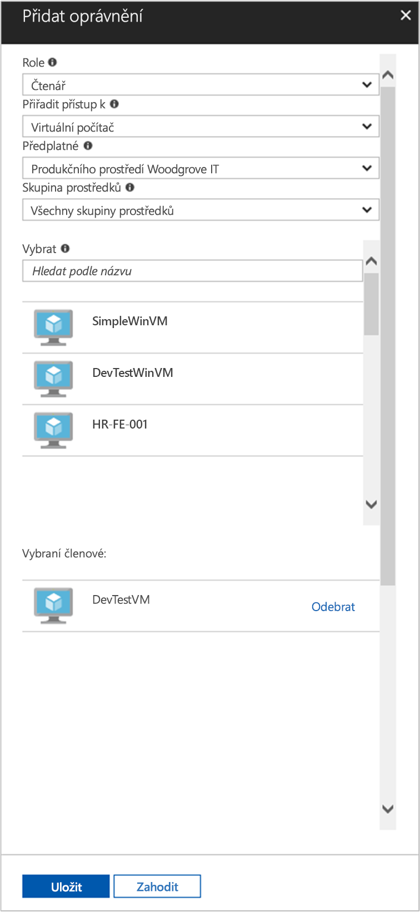

# <a name="use-a-linux-vm-system-assigned-managed-identity-to-access-azure-resource-manager"></a>Použití spravované identity přiřazené systémem na virtuálním počítači s Linuxem pro přístup k Azure Resource Manageru

[!INCLUDE [preview-notice](../../../includes/active-directory-msi-preview-notice.md)]

V tomto rychlém startu se dozvíte, jak pomocí identity přiřazené systémem pro virtuální počítač s Linuxem získat přístup k rozhraní API Azure Resource Manageru. Spravované identity pro prostředky Azure se spravují automaticky v Azure a umožňují vám ověřovat přístup ke službám podporujícím ověřování Azure AD bez nutnosti vložení přihlašovacích údajů do kódu. Získáte informace o těchto tématech:

> [!div class="checklist"]
> * Udělení přístupu virtuálnímu počítači ke skupině prostředků v Azure Resource Manageru 
> * Získání přístupového tokenu pomocí identity virtuálního počítače a jeho použití k volání Azure Resource Manageru 

## <a name="prerequisites"></a>Požadavky

[!INCLUDE [msi-tut-prereqs](../../../includes/active-directory-msi-tut-prereqs.md)]

## <a name="grant-your-vm-access-to-a-resource-group-in-azure-resource-manager"></a>Udělení přístupu virtuálnímu počítači ke skupině prostředků v Azure Resource Manageru 

Když použijete spravované identity pro prostředky Azure, může kód získat přístupové tokeny sloužící k ověření přístupu k prostředkům, které podporují ověřování Azure AD. Rozhraní API Azure Resource Manageru podporuje ověřování Azure AD. Nejdříve potřebujeme udělit identitě virtuálního počítače přístup k prostředku Azure Resource Manageru. V tomto případě se jedná o skupinu prostředků, ve které je virtuální počítač.  

1. Přejděte ke kartě **Skupiny prostředků**.
2. Vyberte konkrétní **skupinu prostředků**, kterou jste vytvořili dříve.
3. Na panelu vlevo přejděte na **Řízení přístupu (IAM)**.
4. Klikněte na **Přidat** a přiřaďte svému virtuálnímu počítači novou roli. V poli **Role** zvolte **Čtenář**.
5. V dalším rozevíracím seznamu **Přiřadit přístup k** vyberte prostředek **Virtuální počítač**.
6. Potom zkontrolujte, že je v rozevíracím seznamu **Předplatné** uvedené správné předplatné. A ve **skupině prostředků** vyberte **Všechny skupiny prostředků**.
7. Nakonec **vyberte** v rozevíracím seznamu svůj linuxový virtuální počítač a klikněte na **Uložit**.

    

## <a name="get-an-access-token-using-the-vms-system-assigned-managed-identity-and-use-it-to-call-resource-manager"></a>Získání přístupového tokenu pomocí spravované identity přiřazené systémem virtuálního počítače a jeho použití k volání Resource Manageru 

K dokončení tohoto postupu budete potřebovat klienta SSH. Pokud používáte Windows, můžete použít klienta SSH v [subsystému Windows pro Linux](https://msdn.microsoft.com/commandline/wsl/about). Pokud potřebujete pomoc při konfiguraci klíčů klienta SSH, přečtěte si, [jak na počítači s Windows v Azure používat klíče SSH](../../virtual-machines/linux/ssh-from-windows.md) nebo [jak na linuxových virtuálních počítačích v Azure vytvářet a používat pár veřejného a privátního klíče SSH](../../virtual-machines/linux/mac-create-ssh-keys.md).

1. Na portálu přejděte ke svému linuxovému virtuálnímu počítači a v části **Přehled** klikněte na **Připojit**.  
2. **Připojte** se vybraným klientem SSH k virtuálnímu počítači. 
3. V okně terminálu pomocí `curl`, vytvořte žádost na místní spravovaných identit pro koncový bod prostředků Azure získat přístupový token pro Azure Resource Manageru.  
 
    `curl` Žádost o přístupový token je níže.  
    
    ```bash
    curl 'http://169.254.169.254/metadata/identity/oauth2/token?api-version=2018-02-01&resource=https://management.azure.com/' -H Metadata:true   
    ```
    
    > [!NOTE]
    > Hodnota parametru „resource“ musí přesně odpovídat hodnotě, kterou očekává Azure AD.  V ID prostředku Resource Manageru musí být v identifikátoru URI koncové lomítko. 
    
    V odpovědi je přístupový token, který potřebujete pro přístup k Azure Resource Manageru. 
    
    Odpověď:  

    ```bash
    {"access_token":"eyJ0eXAiOi...",
    "refresh_token":"",
    "expires_in":"3599",
    "expires_on":"1504130527",
    "not_before":"1504126627",
    "resource":"https://management.azure.com",
    "token_type":"Bearer"} 
    ```
    
    Přístupový token můžete použít pro přístup k Azure Resource Manageru, například ke čtení podrobností o skupině prostředků, ke které jste virtuálnímu počítači udělili přístup. Hodnoty \<SUBSCRIPTION ID\>, \<RESOURCE GROUP\> a \<ACCESS TOKEN\> nahraďte dříve vytvořenými hodnotami. 
    
    > [!NOTE]
    > V adrese URL se rozlišují velká a malá písmena. Proto zkontrolujte, jestli používáte přesně stejná velká a malá písmena jako při pojmenování skupiny prostředků. Zkontrolujte také velké G ve výrazu „resourceGroup“.  
    
    ```bash 
    curl https://management.azure.com/subscriptions/<SUBSCRIPTION ID>/resourceGroups/<RESOURCE GROUP>?api-version=2016-09-01 -H "Authorization: Bearer <ACCESS TOKEN>" 
    ```
    
    Vrácená odpověď s informacemi o konkrétní skupině prostředků:    
    ```bash
    {"id":"/subscriptions/98f51385-2edc-4b79-bed9-7718de4cb861/resourceGroups/DevTest","name":"DevTest","location":"westus","properties":{"provisioningState":"Succeeded"}} 
    ```

## <a name="next-steps"></a>Další postup

V tomto rychlém startu jste se dozvěděli, jak pomocí spravované identity přiřazené systémem získat přístup k rozhraní API Azure Resource Manageru.  Další informace o Azure Resource Manageru:

> [!div class="nextstepaction"]
>[Azure Resource Manager](/azure/azure-resource-manager/resource-group-overview)
