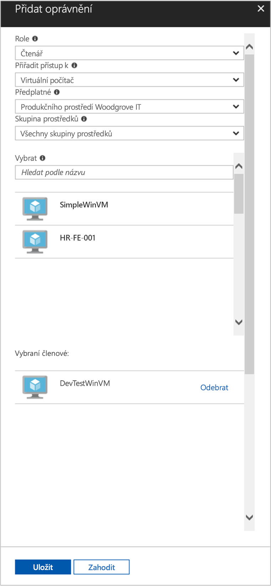

# <a name="use-a-windows-vm-system-assigned-managed-identity-to-access-resource-manager"></a>Použití spravované identity přiřazené systémem ve virtuálním počítači s Windows pro přístup k Resource Manageru

[!INCLUDE [preview-notice](../../../includes/active-directory-msi-preview-notice.md)]

V tomto kurzu se dozvíte, jak získat přístup k rozhraní Azure Resource Manager API pomocí virtuálního počítače s Windows, který má povolenou spravovanou identitu přiřazenou systémem. Spravované identity pro prostředky Azure se spravují automaticky v Azure a umožňují vám ověřovat přístup ke službám podporujícím ověřování Azure AD bez nutnosti vložení přihlašovacích údajů do kódu. Získáte informace o těchto tématech:

> [!div class="checklist"] 
> * Udělení přístupu virtuálnímu počítači ke skupině prostředků v Azure Resource Manageru 
> * Získání přístupového tokenu pomocí identity virtuálního počítače a jeho použití k volání Azure Resource Manageru

## <a name="prerequisites"></a>Požadavky

- Základní porozumění spravovaným identitám. Pokud ještě neznáte funkci spravovaných identit pro prostředky Azure, podívejte se na tento [přehled](overview.md).
- Účet Azure, [Zaregistrujte si bezplatný účet](https://azure.microsoft.com/free/).
- Oprávnění "vlastník" v příslušném oboru (vaše předplatné nebo skupina prostředků) k provedení požadovaných kroků vytváření prostředků a správy rolí. Pokud potřebujete pomoc s přiřazením role, přečtěte si téma [přiřazení rolí Azure ke správě přístupu k prostředkům předplatného Azure](../../role-based-access-control/role-assignments-portal.md).
- Budete také potřebovat virtuální počítač s Windows, který má povolené spravované identity přiřazené systémem.
  - Pokud pro tento kurz potřebujete vytvořit virtuální počítač, můžete postupovat podle článku [s názvem vytvořit virtuální počítač s povolenou identitou přiřazenou systémem](./qs-configure-portal-windows-vm.md#system-assigned-managed-identity) .

## <a name="grant-your-vm-access-to-a-resource-group-in-resource-manager"></a>Udělení přístupu virtuálnímu počítači ke skupině prostředků v Resource Manageru

Když použijete spravované identity pro prostředky Azure, může kód získat přístupové tokeny sloužící k ověření přístupu k prostředkům, které podporují ověřování Azure AD.  Azure Resource Manager podporuje ověřování Azure AD.  Nejdříve potřebujeme udělit spravované identitě přiřazené systémem virtuálního počítače přístup k prostředku v Resource Manageru. V tomto případě se jedná o skupinu prostředků, do které patří virtuální počítač.  

1.  Přejděte ke kartě **Skupiny prostředků**. 
2.  Vyberte **skupinu prostředků**, kterou jste pro **virtuální počítač s Windows** vytvořili. 
3.  Na panelu vlevo přejděte na **Řízení přístupu (IAM)**. 
4.  Pak **přidejte přiřazení role** k novému přiřazení role pro **virtuální počítač s Windows**.  V poli **Role** zvolte **Čtenář**. 
5.  V dalším rozevíracím seznamu **Přiřadit přístup k** vyberte prostředek **Virtuální počítač**. 
6.  Potom zkontrolujte, že je v rozevíracím seznamu **Předplatné** uvedené správné předplatné. A ve **skupině prostředků** vyberte **Všechny skupiny prostředků**. 
7.  Nakonec **vyberte** v rozevíracím seznamu svůj virtuální počítač s Windows a klikněte na **Uložit**.

    

## <a name="get-an-access-token-using-the-vms-system-assigned-managed-identity-and-use-it-to-call-azure-resource-manager"></a>Získání přístupového tokenu pomocí spravované identity přiřazené systémem virtuálního počítače a jeho použití k volání Azure Resource Manageru 

V této části budete muset použít **PowerShell**.  Pokud **PowerShell** nemáte nainstalovaný, stáhněte si ho [odtud](/powershell/azure/). 

1.  Na portálu přejděte na **Virtuální počítače**, přejděte ke svému virtuálnímu počítači s Windows a v části **Přehled** klikněte na **Připojit**. 
2.  Zadejte své **Uživatelské jméno** a **Heslo**, které jste přidali při vytváření virtuálního počítače s Windows. 
3.  Teď, když jste vytvořili **připojení ke vzdálené ploše** s virtuálním počítačem, otevřete **PowerShell** ve vzdálené relaci. 
4.  Pomocí rutiny Invoke-WebRequest vytvořte požadavek na koncový bod místní spravované identity pro prostředky Azure, abyste získali přístupový token pro Azure Resource Manager.

    ```powershell
       $response = Invoke-WebRequest -Uri 'http://169.254.169.254/metadata/identity/oauth2/token?api-version=2018-02-01&resource=https://management.azure.com/' -Method GET -Headers @{Metadata="true"}
    ```
    
    > [!NOTE]
    > Hodnota parametru „resource“ musí přesně odpovídat hodnotě, kterou očekává Azure AD. Při použití ID prostředku Azure Resource Manageru musí být v identifikátoru URI koncové lomítko.
    
    V dalším kroku extrahujte úplnou odpověď, která je uložena jako formátovaný řetězec JSON (JavaScript Object Notation) v objektu $response. 
    
    ```powershell
    $content = $response.Content | ConvertFrom-Json
    ```
    Potom z odpovědi extrahujte přístupový token.
    
    ```powershell
    $ArmToken = $content.access_token
    ```
    
    Nakonec proveďte pomocí přístupového tokenu volání Azure Resource Manageru. V tomto příkladu používáme také rutinu Invoke-WebRequest pro volání Azure Resource Manager a zahrnutí přístupového tokenu do autorizační hlavičky.
    
    ```powershell
    (Invoke-WebRequest -Uri https://management.azure.com/subscriptions/<SUBSCRIPTION ID>/resourceGroups/<RESOURCE GROUP>?api-version=2016-06-01 -Method GET -ContentType "application/json" -Headers @{ Authorization ="Bearer $ArmToken"}).content
    ```
    > [!NOTE] 
    > V adrese URL se rozlišují velká a malá písmena. Proto zkontrolujte, jestli používáte přesně stejná velká a malá písmena, jaká jste použili při pojmenování skupiny prostředků, a zkontrolujte také velké G ve výrazu „resourceGroup“.
        
    Následující příkaz vrátí podrobnosti o skupině prostředků:

    ```powershell
    {"id":"/subscriptions/98f51385-2edc-4b79-bed9-7718de4cb861/resourceGroups/DevTest","name":"DevTest","location":"westus","properties":{"provisioningState":"Succeeded"}}
    ```

## <a name="next-steps"></a>Další kroky

V tomto rychlém startu jste se dozvěděli, jak pomocí spravované identity přiřazené systémem získat přístup k rozhraní API Azure Resource Manageru.  Další informace o Azure Resource Manageru:

> [!div class="nextstepaction"]
>[Azure Resource Manager](../../azure-resource-manager/management/overview.md)