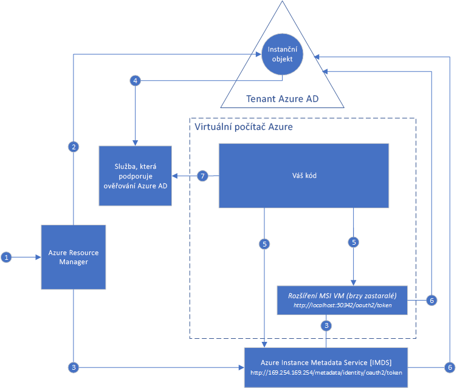

#  Co je Identita spravované služby pro prostředky Azure?

[!INCLUDE[preview-notice](../../../includes/active-directory-msi-preview-notice.md)]

Běžnou výzvou při vytváření cloudových aplikací je, jak spravovat přihlašovací údaje, které je potřeba mít v kódu kvůli ověřování u cloudových služeb. Zajištění zabezpečení těchto přihlašovacích údajů je důležitý úkol. V ideálním případě by se nikdy neměly nacházet na vývojářských pracovních stanicích ani se vracet se změnami do správy zdrojového kódu. Azure Key Vault nabízí možnost bezpečného ukládání přihlašovacích údajů a dalších klíčů a tajných kódů, ale váš kód se musí ověřit ve službě Key Vault, aby je mohl načíst. Identita spravované služby usnadňuje řešení tohoto problému tím, že poskytuje službám Azure automaticky spravovanou identitu v Azure Active Directory (Azure AD). Tuto identitu můžete použít k ověření pro jakoukoli službu, která podporuje ověřování Azure AD, včetně služby Key Vault, aniž byste ve vašem kódu museli mít přihlašovací údaje.

Identita spravované služby je součástí Azure Active Directory Free, což je výchozí možnost pro předplatná Azure. Za Identitu spravované služby se neúčtují žádné další poplatky.

## Jak to funguje?

Existují dva typy Identit spravované služby: **přiřazená systémem** a **přiřazená uživatelem**.

- **Identita přiřazená systémem** se povoluje přímo v instanci služby Azure. Když je povolená, Azure vytvoří identitu pro instanci služby v tenantovi Azure AD důvěryhodném pro předplatné instance služby. Po vytvoření identity se její přihlašovací údaje zřídí do instance služby. Životní cyklus identity přiřazené systémem je přímo svázaný s instancí služby Azure, pro kterou je povolená. Pokud se instance služby odstraní, Azure automaticky vyčistí přihlašovací údaje a identitu ve službě Azure AD.
- **Identita přiřazená uživatelem** se vytváří jako samostatný prostředek Azure. Prostřednictvím procesu vytvoření Azure vytvoří identitu v tenantovi Azure AD důvěryhodném pro použité předplatné. Po vytvoření identity je možné ji přiřadit k jedné nebo několika instancím služeb Azure. Životní cyklus identity přiřazené uživatelem se spravuje nezávisle na životním cyklu instancí služeb Azure, ke kterým je přiřazená.

To znamená, že váš kód může k vyžádání přístupových tokenů pro služby, které podporují ověřování Azure AD, použít identitu přiřazenou systémem nebo identitu přiřazenou uživatelem. Azure přitom zajišťuje vracení přístupových údajů, které instance služby používá.

Tady je příklad toho, jak identity přiřazené systémem fungují s virtuálními počítači Azure:

1. Azure Resource Manager obdrží požadavek na povolení identity přiřazené systémem na virtuálním počítači.
2. Azure Resource Manager vytvoří instanční objekt ve službě Azure AD, který reprezentuje identitu virtuálního počítače. Instanční objekt se vytvoří v tenantovi Azure AD důvěryhodném pro toto předplatné.
3. Azure Resource Manager nakonfiguruje identitu na virtuálním počítači:
    - Aktualizuje koncový bod identity služby Azure Instance Metadata Service s použitím ID klienta a certifikátu instančního objektu.
    - Zřídí rozšíření virtuálního počítače a přidá ID klienta a certifikát instančního objektu. (brzy bude zastaralé)
4. Teď, když má virtuální počítač identitu, s použitím informací o instančním objektu udělíme virtuálnímu počítači přístup k prostředkům Azure. Pokud váš kód například potřebuje volat Azure Resource Manager, přiřadíte instančnímu objektu virtuálního počítače odpovídající roli pomocí řízení přístupu na základě role (RBAC) ve službě Azure AD. Pokud váš kód potřebuje volat službu Key Vault, udělíte kódu přístup ke konkrétnímu tajnému kódu nebo klíči ve službě Key Vault.
5. Váš kód spuštěný na virtuálním počítači si může vyžádat token ze dvou koncových bodů přístupných pouze z daného virtuálního počítače:

    - Koncový bod identity služby Azure Instance Metadata Service (IMDS): http://169.254.169.254/metadata/identity/oauth2/token (doporučeno)
        - Parametr resource (prostředek) určuje službu, do které se token odešle. Pokud například chcete, aby váš kód provedl ověření v Azure Resource Manageru, použijte resource=https://management.azure.com/.
        - Parametr verze rozhraní API určuje verzi IMDS. Použijte api-version=2018-02-01 nebo novější.
    - Koncový bod rozšíření virtuálního počítače: http://localhost:50342/oauth2/token (brzy bude zastaralý)
        - Parametr resource (prostředek) určuje službu, do které se token odešle. Pokud například chcete, aby váš kód provedl ověření v Azure Resource Manageru, použijte resource=https://management.azure.com/.

6. Zavolá se služba Azure AD s požadavkem na přístupový token popsaný v kroku 5 s použitím ID klienta a certifikátu nakonfigurovaných v kroku 3. Azure AD vrátí přístupový token JSON Web Token (JWT).
7. Váš kód odešle přístupový token prostřednictvím volání do služby, která podporuje ověřování Azure AD.

Tady je s použitím stejného diagramu příklad toho, jak s virtuálními počítači Azure funguje Identita spravované služby přiřazená uživatelem.

1. Azure Resource Manager obdrží požadavek na vytvoření identity přiřazené uživatelem.
2. Azure Resource Manager vytvoří instanční objekt ve službě Azure AD, který reprezentuje identitu přiřazenou uživatelem. Instanční objekt se vytvoří v tenantovi Azure AD důvěryhodném pro toto předplatné.
3. Azure Resource Manager obdrží požadavek na konfiguraci identity přiřazené uživatelem na virtuálním počítači:
    - Aktualizuje koncový bod identity služby Azure Instance Metadata Service s použitím ID klienta a certifikátu instančního objektu identity přiřazené uživatelem.
    - Zřídí rozšíření virtuálního počítače a přidá ID klienta a certifikát instančního objektu identity přiřazené uživatelem (brzy bude zastaralé).
4. Teď, po vytvoření identity přiřazené uživatelem, s použitím informací o instančním objektu udělíme virtuálnímu počítači přístup k prostředkům Azure. Pokud váš kód například potřebuje volat Azure Resource Manager, přiřadíte instančnímu objektu identity přiřazené uživatelem odpovídající roli pomocí řízení přístupu na základě role (RBAC) ve službě Azure AD. Pokud váš kód potřebuje volat službu Key Vault, udělíte kódu přístup ke konkrétnímu tajnému kódu nebo klíči ve službě Key Vault. Poznámka: Tento krok můžete provést i před krokem 3.
5. Váš kód spuštěný na virtuálním počítači si může vyžádat token ze dvou koncových bodů přístupných pouze z daného virtuálního počítače:

    - Koncový bod identity služby Azure Instance Metadata Service (IMDS): http://169.254.169.254/metadata/identity/oauth2/token (doporučeno)
        - Parametr resource (prostředek) určuje službu, do které se token odešle. Pokud například chcete, aby váš kód provedl ověření v Azure Resource Manageru, použijte resource=https://management.azure.com/.
        - Parametr ID klienta určuje identitu, pro kterou se token požaduje. To je potřeba k odstranění nejednoznačností v případě, že je na jednom virtuálním počítači více než jedna identita přiřazená uživatelem.
        - Parametr verze rozhraní API určuje verzi IMDS. Použijte api-version=2018-02-01 nebo novější.

    - Koncový bod rozšíření virtuálního počítače: http://localhost:50342/oauth2/token (brzy bude zastaralý)
        - Parametr resource (prostředek) určuje službu, do které se token odešle. Pokud například chcete, aby váš kód provedl ověření v Azure Resource Manageru, použijte resource=https://management.azure.com/.
        - Parametr ID klienta určuje identitu, pro kterou se token požaduje. To je potřeba k odstranění nejednoznačností v případě, že je na jednom virtuálním počítači více než jedna identita přiřazená uživatelem.
6. Zavolá se služba Azure AD s požadavkem na přístupový token popsaný v kroku 5 s použitím ID klienta a certifikátu nakonfigurovaných v kroku 3. Azure AD vrátí přístupový token JSON Web Token (JWT).
7. Váš kód odešle přístupový token prostřednictvím volání do služby, která podporuje ověřování Azure AD.
     
## Vyzkoušení Identity spravované služby

Vyzkoušejte kurz Identity spravované služby a seznamte se s kompletními scénáři pro přístup k různým prostředkům Azure:
  
| Z prostředku s povolenou spravovanou identitou | Postupy |
| ------- | -------- |
| Virtuální počítač Azure (Windows) | [Přístup ke službě Azure Data Lake Store pomocí Identity spravované služby virtuálního počítače s Windows](tutorial-windows-vm-access-datalake.md) |
|                    | [Přístup k Azure Resource Manageru pomocí Identity spravované služby virtuálního počítače s Windows](tutorial-windows-vm-access-arm.md) |
|                    | [Přístup k SQL Azure pomocí Identity spravované služby virtuálního počítače s Windows](tutorial-windows-vm-access-sql.md) |
|                    | [Přístup ke službě Azure Storage přes přístupový klíč pomocí Identity spravované služby virtuálního počítače s Windows](tutorial-windows-vm-access-storage.md) |
|                    | [Přístup ke službě Azure Storage přes SAS pomocí Identity spravované služby virtuálního počítače s Windows](tutorial-windows-vm-access-storage-sas.md) |
|                    | [Přístup k prostředku mimo službu Azure AD pomocí Identity spravované služby virtuálního počítače s Windows a služby Azure Key Vault](tutorial-windows-vm-access-nonaad.md) |
| Virtuální počítač Azure (Linux)   | [Přístup ke službě Azure Data Lake Store pomocí Identity spravované služby virtuálního počítače s Linuxem](tutorial-linux-vm-access-datalake.md) |
|                    | [Přístup k Azure Resource Manageru pomocí Identity spravované služby virtuálního počítače s Linuxem](tutorial-linux-vm-access-arm.md) |
|                    | [Přístup ke službě Azure Storage přes přístupový klíč pomocí Identity spravované služby virtuálního počítače s Linuxem](tutorial-linux-vm-access-storage.md) |
|                    | [Přístup ke službě Azure Storage přes SAS pomocí Identity spravované služby virtuálního počítače s Linuxem](tutorial-linux-vm-access-storage-sas.md) |
|                    | [Přístup k prostředku mimo službu Azure AD pomocí Identity spravované služby virtuálního počítače s Linuxem a služby Azure Key Vault](tutorial-linux-vm-access-nonaad.md) |
| Azure App Service  | [Použití Identity spravované služby se službou Azure App Service nebo Azure Functions](/azure/app-service/app-service-managed-service-identity) |
| Azure Functions    | [Použití Identity spravované služby se službou Azure App Service nebo Azure Functions](/azure/app-service/app-service-managed-service-identity) |
| Azure Service Bus  | [Použití Identity spravované služby se službou Azure Service Bus](../../service-bus-messaging/service-bus-managed-service-identity.md) |
| Azure Event Hubs   | [Použití Identity spravované služby se službou Azure Event Hubs](../../event-hubs/event-hubs-managed-service-identity.md) |
| Azure API Management | [Použití Identity spravované služby se službou Azure API Management](../../api-management/api-management-howto-use-managed-service-identity.md) |

## Které služby Azure podporují Identitu spravované služby?

Spravované identity je možné použít k ověřování ve službách, které podporují ověřování Azure AD. Seznam služeb Azure, které podporují Identitu spravované služby, najdete v následujícím článku:
- [Služby, které podporují Identitu spravované služby](services-support-msi.md)

## Další kroky

Následující rychlé starty vám pomůžou začít s Identitou spravované služby Azure:

* [Použití Identity spravované služby virtuálního počítače s Windows k přístupu k Resource Manageru – Virtuální počítač s Windows](tutorial-windows-vm-access-arm.md)
* [Použití Identity spravované služby virtuálního počítače s Linuxem k přístupu k Azure Resource Manageru – Virtuální počítač s Linuxem](tutorial-linux-vm-access-arm.md)
