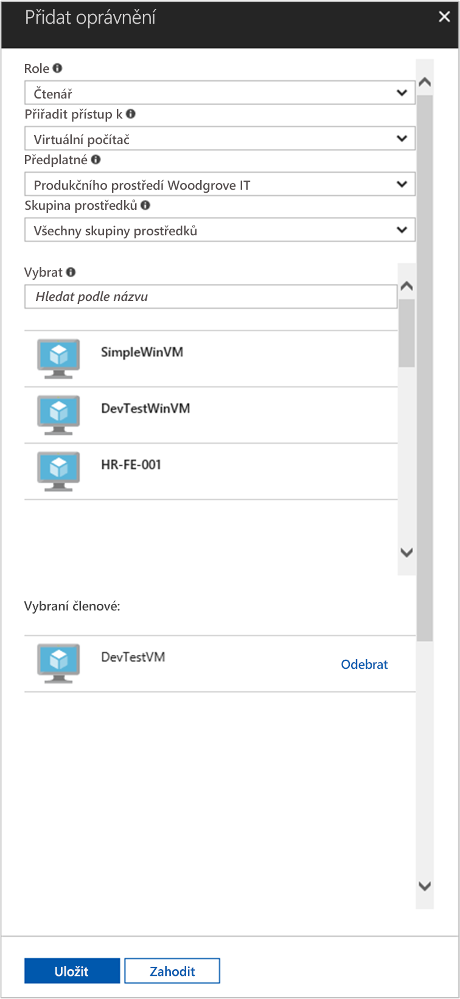

# <a name="use-a-linux-vm-managed-service-identity-to-access-azure-resource-manager"></a>Použití identity spravované služby na virtuálním počítači s Linuxem k přístupu k Azure Resource Manageru

[!INCLUDE[preview-notice](../../../includes/active-directory-msi-preview-notice.md)]

V tomto kurzu si ukážeme, jak povolit identitu spravované služby na virtuálním počítači s Linuxem a potom ji použít k přístupu k rozhraní API Azure Resource Manageru. Identity spravovaných služeb, které se spravují automaticky v Azure, slouží k ověření přístupu ke službám podporujícím ověřování Azure AD bez nutnosti vložení přihlašovacích údajů do kódu. Získáte informace o těchto tématech:

> [!div class="checklist"]
> * Povolení identity spravované služby na virtuálním počítači s Linuxem 
> * Udělení přístupu virtuálnímu počítači ke skupině prostředků v Azure Resource Manageru 
> * Získání přístupového tokenu pomocí identity virtuálního počítače a jeho použití k volání Azure Resource Manageru 

## <a name="prerequisites"></a>Požadavky

[!INCLUDE [msi-qs-configure-prereqs](../../../includes/active-directory-msi-qs-configure-prereqs.md)]

[!INCLUDE [msi-tut-prereqs](../../../includes/active-directory-msi-tut-prereqs.md)]

## <a name="sign-in-to-azure"></a>Přihlášení k Azure

Přihlaste se k webu Azure Portal na adrese [https://portal.azure.com](https://portal.azure.com).

## <a name="create-a-linux-virtual-machine-in-a-new-resource-group"></a>Vytvoření virtuálního počítače s Linuxem v nové skupině prostředků

V tomto kurzu vytvoříme nový virtuální počítač s Linuxem. Identitu spravované služby můžete povolit taky na existujícím virtuálním počítači.

1. Klikněte na tlačítko **Vytvořit prostředek** v levém horním rohu webu Azure Portal.
2. Vyberte **Compute** a potom vyberte **Ubuntu Server 16.04 LTS**.
3. Zadejte informace o virtuálním počítači. V poli **Typ ověřování** vyberte **Veřejný klíč SSH** nebo **Heslo**. Vytvořené přihlašovací údaje umožňují přihlásit se k virtuálnímu počítači.

    

4. U virtuálního počítače v rozevíracím seznamu zvolte **Předplatné**.
5. Pokud chcete vybrat novou **skupinu prostředků**, ve které chcete vytvořit virtuální počítač, zvolte **Vytvořit novou**. Jakmile budete hotovi, klikněte na **OK**.
6. Vyberte velikost virtuálního počítače. Pokud chcete zobrazit další velikosti, vyberte **Zobrazit všechny** nebo změňte filtr Podporovaný typ disku. V okně Nastavení ponechte výchozí nastavení a klikněte na **OK**.

## <a name="enable-managed-service-identity-on-your-vm"></a>Povolení identity spravované služby na virtuálním počítači

Identita spravované služby virtuálního počítače umožňuje získat z Azure AD přístupové tokeny, aniž byste museli vkládat do kódu přihlašovací údaje. Když na virtuálním počítači povolíte MSI, stanou se dvě věci: virtuální počítač se zaregistruje v Azure Active Directory, aby se vytvořila jeho spravovaná identita, a tato identita se nakonfiguruje na virtuálním počítači.

1. V poli **Virtuální počítač** vyberte virtuální počítač, na kterém chcete povolit identitu spravované služby.
2. Na navigačním panelu vlevo klikněte na **Konfigurace**.
3. Zobrazí se **Identita spravované služby**. Pokud chcete identitu spravované služby zaregistrovat a povolit, vyberte **Ano**. Pokud ji chcete zakázat, zvolte Ne.
4. Nezapomeňte konfiguraci uložit kliknutím na **Uložit**.

    

## <a name="grant-your-vm-access-to-a-resource-group-in-azure-resource-manager"></a>Udělení přístupu virtuálnímu počítači ke skupině prostředků v Azure Resource Manageru 

Když použijete identitu spravované služby, může kód získat přístupové tokeny používané při ověření přístupu k prostředkům, které podporují ověřování Azure AD. Rozhraní API Azure Resource Manageru podporuje ověřování Azure AD. Nejdříve potřebujeme udělit identitě virtuálního počítače přístup k prostředku Azure Resource Manageru. V tomto případě se jedná o skupinu prostředků, ve které je virtuální počítač.  

1. Přejděte ke kartě **Skupiny prostředků**.
2. Vyberte konkrétní **skupinu prostředků**, kterou jste vytvořili dříve.
3. Na panelu vlevo přejděte na **Řízení přístupu (IAM)**.
4. Klikněte na **Přidat** a přiřaďte svému virtuálnímu počítači novou roli. V poli **Role** zvolte **Čtenář**.
5. V dalším rozevíracím seznamu **Přiřadit přístup k** vyberte prostředek **Virtuální počítač**.
6. Potom zkontrolujte, že je v rozevíracím seznamu **Předplatné** uvedené správné předplatné. A ve **skupině prostředků** vyberte **Všechny skupiny prostředků**.
7. Nakonec **vyberte** v rozevíracím seznamu svůj linuxový virtuální počítač a klikněte na **Uložit**.

    

## <a name="get-an-access-token-using-the-vms-identity-and-use-it-to-call-resource-manager"></a>Získání přístupového tokenu pomocí identity virtuálního počítače a jeho použití k volání Resource Manageru 

K dokončení tohoto postupu budete potřebovat klienta SSH. Pokud používáte Windows, můžete použít klienta SSH v [subsystému Windows pro Linux](https://msdn.microsoft.com/commandline/wsl/about). Pokud potřebujete pomoc při konfiguraci klíčů klienta SSH, přečtěte si, [jak na počítači s Windows v Azure používat klíče SSH](../../virtual-machines/linux/ssh-from-windows.md) nebo [jak na linuxových virtuálních počítačích v Azure vytvářet a používat pár veřejného a privátního klíče SSH](../../virtual-machines/linux/mac-create-ssh-keys.md).

1. Na portálu přejděte ke svému linuxovému virtuálnímu počítači a v části **Přehled** klikněte na **Připojit**.  
2. **Připojte** se vybraným klientem SSH k virtuálnímu počítači. 
3. V okně terminálu pomocí nástroje CURL odešlete do místního koncového bodu identity spravované služby požadavek na přístupový token pro Azure Resource Manager.  
 
    Žádost CURL o přístupový token je níže.  
    
    ```bash
    curl 'http://169.254.169.254/metadata/identity/oauth2/token?api-version=2018-02-01&resource=https%3A%2F%2Fmanagement.azure.com%2F' -H Metadata:true   
    ```
    
    > [!NOTE]
    > Hodnota parametru „resource“ musí přesně odpovídat hodnotě, kterou očekává Azure AD.  V ID prostředku Resource Manageru musí být v identifikátoru URI koncové lomítko. 
    
    V odpovědi je přístupový token, který potřebujete pro přístup k Azure Resource Manageru. 
    
    Odpověď:  

    ```bash
    {"access_token":"eyJ0eXAiOi...",
    "refresh_token":"",
    "expires_in":"3599",
    "expires_on":"1504130527",
    "not_before":"1504126627",
    "resource":"https://management.azure.com",
    "token_type":"Bearer"} 
    ```
    
    Přístupový token můžete použít pro přístup k Azure Resource Manageru, například ke čtení podrobností o skupině prostředků, ke které jste virtuálnímu počítači udělili přístup. Hodnoty \<SUBSCRIPTION ID\>, \<RESOURCE GROUP\> a \<ACCESS TOKEN\> nahraďte dříve vytvořenými hodnotami. 
    
    > [!NOTE]
    > V adrese URL se rozlišují velká a malá písmena. Proto zkontrolujte, jestli používáte přesně stejná velká a malá písmena jako při pojmenování skupiny prostředků. Zkontrolujte také velké G ve výrazu „resourceGroup“.  
    
    ```bash 
    curl https://management.azure.com/subscriptions/<SUBSCRIPTION ID>/resourceGroups/<RESOURCE GROUP>?api-version=2016-09-01 -H "Authorization: Bearer <ACCESS TOKEN>" 
    ```
    
    Vrácená odpověď s informacemi o konkrétní skupině prostředků: 
     
    ```bash
    {"id":"/subscriptions/98f51385-2edc-4b79-bed9-7718de4cb861/resourceGroups/DevTest","name":"DevTest","location":"westus","properties":{"provisioningState":"Succeeded"}} 
    ```     

## <a name="next-steps"></a>Další kroky

V tomto kurzu jste se dozvěděli, jak vytvořit identitu přiřazenou uživateli a připojit ji k virtuálnímu počítači Azure kvůli přístupu k rozhraní API Azure Resource Manageru.  Další informace o Azure Resource Manageru:

> [!div class="nextstepaction"]
>[Azure Resource Manager](/azure/azure-resource-manager/resource-group-overview)