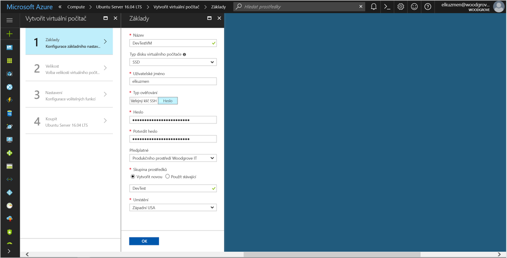
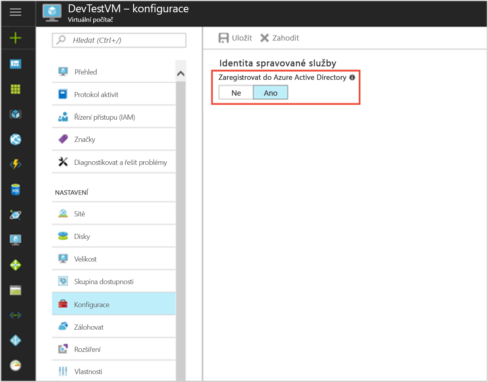

# <a name="tutorial-use-a-linux-vm-managed-service-identity-msi-to-access-azure-key-vault"></a>Kurz: Použití identity spravované služby (MSI) na virtuálním počítači s Linuxem pro přístup k Azure Key Vault 

[!INCLUDE[preview-notice](../../../includes/active-directory-msi-preview-notice.md)]

V tomto kurzu si ukážeme, jak povolit identitu spravované služby (MSI) na virtuálním počítači s Linuxem a pak ji použít pro přístup ke službě Azure Key Vault. Služba Key Vault se používá ke spuštění. Umožňuje klientské aplikaci použít tajný kód pro přístup k prostředkům, které nejsou zabezpečené službou Azure Active Directory (AD). Identity spravovaných služeb, které se spravují automaticky v Azure, slouží k ověření přístupu ke službám podporujícím ověřování Azure AD bez nutnosti vložení přihlašovacích údajů do kódu. 

Získáte informace o těchto tématech:

> [!div class="checklist"]
> * Povolení MSI na virtuálním počítači s Linuxem 
> * Udělení přístupu virtuálnímu počítači k tajnému kódu uloženému ve službě Key Vault 
> * Použití identity virtuálního počítače k získání přístupového tokenu a použití tohoto tokenu k načtení tajného kódu ze služby Key Vault 
 
## <a name="prerequisites"></a>Požadavky

[!INCLUDE [msi-qs-configure-prereqs](../../../includes/active-directory-msi-qs-configure-prereqs.md)]

[!INCLUDE [msi-tut-prereqs](../../../includes/active-directory-msi-tut-prereqs.md)]

## <a name="sign-in-to-azure"></a>Přihlášení k Azure
Přihlaste se k webu Azure Portal na adrese [https://portal.azure.com](https://portal.azure.com). 

## <a name="create-a-linux-virtual-machine-in-a-new-resource-group"></a>Vytvoření virtuálního počítače s Linuxem v nové skupině prostředků

V tomto kurzu vytvoříme nový virtuální počítač s Linuxem. MSI také můžete povolit na stávajícím virtuálním počítači.

1. Klikněte na tlačítko **Vytvořit prostředek** v levém horním rohu webu Azure Portal.
2. Vyberte **Compute** a potom vyberte **Ubuntu Server 16.04 LTS**.
3. Zadejte informace o virtuálním počítači. V poli **Typ ověřování** vyberte **Veřejný klíč SSH** nebo **Heslo**. Vytvořené přihlašovací údaje umožňují přihlásit se k virtuálnímu počítači.

    

4. U virtuálního počítače v rozevíracím seznamu zvolte **Předplatné**.
5. Pokud chcete vybrat novou **skupinu prostředků**, ve které chcete vytvořit virtuální počítač, zvolte **Vytvořit novou**. Jakmile budete hotovi, klikněte na **OK**.
6. Vyberte velikost virtuálního počítače. Pokud chcete zobrazit další velikosti, vyberte **Zobrazit všechny** nebo změňte filtr Podporovaný typ disku. Na stránce Nastavení ponechte výchozí nastavení a klikněte na **OK**.

## <a name="enable-msi-on-your-vm"></a>Povolení MSI na virtuálním počítači

Funkce MSI na virtuálním počítači umožňuje získat z Azure AD přístupové tokeny bez nutnosti vložení přihlašovacích údajů do kódu. Když na virtuálním počítači povolíte MSI, stanou se dvě věci: virtuální počítač se zaregistruje v Azure Active Directory, aby se vytvořila jeho spravovaná identita, a tato identita se nakonfiguruje na virtuálním počítači.

1. Vyberte **virtuální počítač**, na kterém chcete povolit MSI.
2. Na navigačním panelu vlevo klikněte na **Konfigurace**.
3. Zobrazí se **Identita spravované služby**. Pokud chcete MSI zaregistrovat a povolit, vyberte **Ano**. Pokud ji chcete zakázat, zvolte Ne.
4. Nezapomeňte konfiguraci uložit kliknutím na **Uložit**.

    

## <a name="grant-your-vm-access-to-a-secret-stored-in-a-key-vault"></a>Udělení přístupu virtuálnímu počítači k tajnému kódu uloženému ve službě Key Vault  

Když použijete MSI, může kód získat přístupové tokeny používané při ověření přístupu k prostředkům, které podporují ověřování Azure Active Directory. Všechny služby Azure ale nepodporují ověřování Azure AD. Pokud chcete používat MSI s těmito službami, uložte přihlašovací údaje služby do Azure Key Vault a použijte MSI, abyste získali přístup ke službě Key Valut kvůli načtení přihlašovacích údajů. 

Napřed potřebujete vytvořit trezor klíčů a pak k němu udělíte přístup identitě virtuálního počítače.   

1. Na navigačním panelu vlevo nahoře vyberte **Vytvořit prostředek** > **Zabezpečení a identita** > **Key Vault**.  
2. Zadejte **název** nového trezoru klíčů. 
3. Umístěte trezor klíčů do stejného předplatného a stejné skupiny prostředků jako virtuální počítač, který jste vytvořili dříve. 
4. Vyberte **Zásady přístupu** a klikněte na **Přidat novou**. 
5. V nabídce Konfigurace ze šablony vyberte **Správa tajných kódů**. 
6. Zvolte **Výběr objektu zabezpečení** a do vyhledávacího pole zadejte název dříve vytvořeného virtuálního počítače.  V seznamu výsledků vyberte virtuální počítač a klikněte na **Vybrat**. 
7. Kliknutím na **OK** dokončete přidání nové zásady přístupu. Kliknutím na **OK** dokončete výběr zásady přístupu. 
8. Kliknutím na **Vytvořit** dokončete vytvoření trezoru klíčů. 

    

Potom přidejte do trezoru klíčů tajný kód, abyste ho mohli později načíst kódem spuštěným na vašem virtuálním počítači: 

1. Vyberte **Všechny prostředky** a najděte a vyberte trezor klíčů, který jste vytvořili. 
2. Vyberte **Tajné kódy** a klikněte na **Přidat**. 
3. V nabídce **Možnosti nahrání** vyberte **Ručně**. 
4. Zadejte název a hodnotu tajného kódu.  Může jít o libovolnou hodnotu. 
5. Nechte datum aktivace i datum konce platnosti nevyplněné a **Povoleno** nechte nastavené na **Ano**. 
6. Kliknutím na **Vytvořit** vytvořte tajný kód. 
 
## <a name="get-an-access-token-using-the-vms-identity-and-use-it-to-retrieve-the-secret-from-the-key-vault"></a>Použití identity virtuálního počítače k získání přístupového tokenu a použití tohoto tokenu k načtení tajného kódu z Key Vault  

K dokončení tohoto postupu potřebujete klienta SSH.  Pokud používáte Windows, můžete použít klienta SSH v [subsystému Windows pro Linux](https://msdn.microsoft.com/commandline/wsl/about). Pokud potřebujete pomoc při konfiguraci klíčů klienta SSH, přečtěte si, [jak na počítači s Windows v Azure používat klíče SSH](../../virtual-machines/linux/ssh-from-windows.md) nebo [jak na linuxových virtuálních počítačích v Azure vytvářet a používat pár veřejného a privátního klíče SSH](../../virtual-machines/linux/mac-create-ssh-keys.md).
 
1. Na portálu přejděte ke svému linuxovému virtuálnímu počítači a v části **Přehled** klikněte na **Připojit**. 
2. **Připojte** se vybraným klientem SSH k virtuálnímu počítači. 
3. V okně terminálu použijte CURL a požádejte místní koncový bod MSI o přístupový token ke službě Azure Key Vault.  
 
    Žádost CURL o přístupový token je níže.  
    
    ```bash
    curl 'http://169.254.169.254/metadata/identity/oauth2/token?api-version=2018-02-01&resource=https%3A%2F%2Fvault.azure.net' -H Metadata:true  
    ```
    V odpovědi je přístupový token, který potřebujete pro přístup k Resource Manageru. 
    
    Odpověď:  
    
    ```bash
    {"access_token":"eyJ0eXAi...",
    "refresh_token":"",
    "expires_in":"3599",
    "expires_on":"1504130527",
    "not_before":"1504126627",
    "resource":"https://vault.azure.net",
    "token_type":"Bearer"} 
    ```
    
    Tento přístupový token můžete použít k ověření přístupu do služby Azure Key Vault.  V další žádosti CURL je vidět, jak přečíst tajný kód z Key Vault pomocí CURL a rozhraní REST API služby Key Vault.  Budete potřebovat adresu URL své služby Key Vault, kterou najdete na stránce **Přehled** služby Key Vault v části **Základy**.  Budete také potřebovat přístupový token, který jste získali při předchozím volání. 
        
    ```bash
    curl https://<YOUR-KEY-VAULT-URL>/secrets/<secret-name>?api-version=2016-10-01 -H "Authorization: Bearer <ACCESS TOKEN>" 
    ```
    
    Odpověď bude vypadat takto: 
    
    ```bash
    {"value":"p@ssw0rd!","id":"https://mytestkeyvault.vault.azure.net/secrets/MyTestSecret/7c2204c6093c4d859bc5b9eff8f29050","attributes":{"enabled":true,"created":1505088747,"updated":1505088747,"recoveryLevel":"Purgeable"}} 
    ```
    
Jakmile z Key Vault načtete tajný kód, můžete ho použít k ověření přístupu ke službě, která vyžaduje jméno a heslo.

## <a name="next-steps"></a>Další kroky

V tomto kurzu jste se naučili používat identitu spravované služby (MSI) na linuxovém virtuálním počítači pro přístup ke službě Azure Key Vault.  Další informace o Azure Key Vault:

> [!div class="nextstepaction"]
>[Azure Key Vault](/azure/key-vault/key-vault-whatis)


