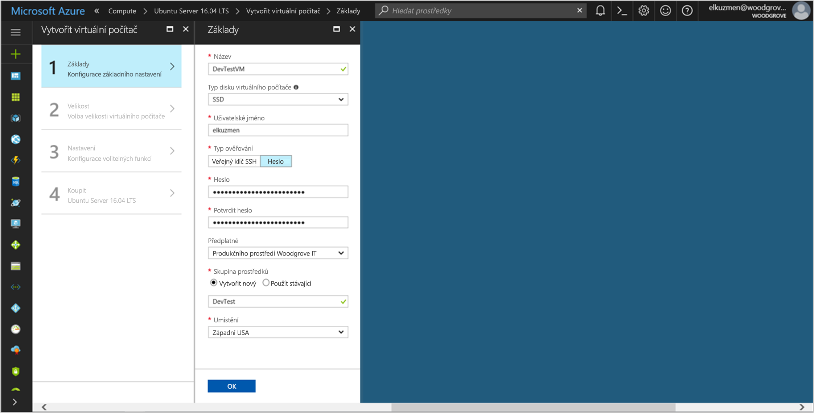

# <a name="tutorial-use-a-linux-vms-managed-identity-to-access-azure-storage"></a>Kurz: Identita spravované Linux Virtuálního počítače použijte pro přístup k Azure Storage 

[!INCLUDE[preview-notice](../../../includes/active-directory-msi-preview-notice.md)]


V tomto kurzu se dozvíte, jak vytvořit a použít identitu spravovaných virtuálních počítačů Linux k přístupu k Azure Storage. Získáte informace o těchto tématech:

> [!div class="checklist"]
> * Vytvořit virtuální počítač s Linuxem do nové skupiny prostředků
> * Povolit spravované Identity na virtuální počítač s Linuxem (VM)
> * Vytvořte kontejner objektů blob v účtu úložiště
> * Udělit přístup virtuálních počítačů Linux spravovat Identity kontejner Azure Storage
> * Získání přístupového tokenu a použít jej k vyvolání Azure Storage

> [!NOTE]
> Ověřování Azure Active Directory pro Azure Storage je ve verzi public preview.

## <a name="prerequisites"></a>Požadavky

Pokud ještě nemáte účet Azure [si zaregistrovat bezplatný účet](https://azure.microsoft.com) než budete pokračovat.

[!INCLUDE [msi-tut-prereqs](~/includes/active-directory-msi-tut-prereqs.md)]

V tomto kurzu spustit příklady skriptu rozhraní příkazového řádku, máte dvě možnosti:

- Použití [prostředí cloudu Azure](~/articles/cloud-shell/overview.md) z portálu Azure nebo prostřednictvím **zkuste ho** tlačítko, které se nachází v pravém horním rohu každé blok kódu.
- [Nainstalujte nejnovější verzi 2.0 rozhraní příkazového řádku](https://docs.microsoft.com/cli/azure/install-azure-cli) (2.0.23 nebo novější) Pokud byste radši chtěli použít místní konzoly rozhraní příkazového řádku.

## <a name="sign-in-to-azure"></a>Přihlášení k Azure

Přihlaste se k webu Azure Portal na adrese [https://portal.azure.com](https://portal.azure.com).

## <a name="create-a-linux-virtual-machine-in-a-new-resource-group"></a>Vytvořit virtuální počítač s Linuxem do nové skupiny prostředků

V této části vytvoříte virtuální počítač s Linuxem později udělenou identitu spravované.

1. Vyberte **nový** tlačítko v levém horním rohu portálu Azure.
2. Vyberte **Compute** a potom vyberte **Ubuntu Server 16.04 LTS**.
3. Zadejte informace o virtuálním počítači. Pro **typ ověřování**, vyberte **veřejný klíč SSH** nebo **heslo**. Vytvořené pověření umožňují přihlášení k virtuálnímu počítači.

   

4. V **předplatné** seznamu, vyberte předplatné, pro virtuální počítač.
5. Chcete-li vybrat novou skupinu prostředků, které chcete virtuální počítač, který má být vytvořen v, vyberte **skupiny prostředků** > **vytvořit nový**. Po dokončení, vyberte **OK**.
6. Vyberte velikost virtuálního počítače. Pokud chcete zobrazit další velikosti, vyberte **Zobrazit všechny** nebo změňte filtr **Podporovaný typ disku**. V podokně nastavení ponechat výchozí nastavení a vyberte **OK**.

## <a name="enable-managed-identity-on-your-vm"></a>Povolit spravované Identity na vašem virtuálním počítači

Spravované identitu virtuálního počítače umožňuje získat přístupové tokeny z Azure AD bez nutnosti převést přihlašovací údaje do vašeho kódu. V pozadí, povolení spravovat Identity na virtuálním počítači prostřednictvím portálu Azure provádí dvě věci: ho zaregistruje virtuální počítač s Azure AD pro vytvoření spravované identity a nakonfiguruje identitu ve virtuálním počítači.

1. Přejděte do skupiny prostředků vašeho nového virtuálního počítače a vyberte virtuální počítač, který jste vytvořili v předchozím kroku.
2. V části **nastavení** kategorii, klikněte na **konfigurace**.
3. Chcete-li spravovat Identity, vyberte **Ano**.
4. Klikněte na tlačítko **Uložit** použít konfiguraci. 

## <a name="create-a-storage-account"></a>vytvořit účet úložiště 

V této části vytvoříte účet úložiště. 

1. Klikněte **+ vytvořit prostředek** nalezeno tlačítko v levém horním rohu portálu Azure.
2. Klikněte na tlačítko **úložiště**, pak **účet úložiště – objekt blob, soubor, tabulka, fronta**.
3. V části **název**, zadejte název pro účet úložiště.  
4. **Model nasazení** a **účet druhu** musí být nastavena na **správce prostředků** a **úložiště (obecné účely v1)**. 
5. Ujistěte se, **předplatné** a **skupiny prostředků** odpovídat jsou zadány při vytvoření virtuálního počítače v předchozím kroku.
6. Klikněte na možnost **Vytvořit**.

    

## <a name="create-a-blob-container-and-upload-a-file-to-the-storage-account"></a>Vytvořte kontejner objektů blob a nahrajte soubor k účtu úložiště

Soubory vyžadují úložiště objektů blob, je nutné vytvořit kontejner objektů blob, ve kterém chcete soubor uložit. Potom nahrání souboru do kontejneru objektů blob v nový účet úložiště.

1. Přejděte zpět na vaše nově vytvořený účet úložiště.
2. V části **služby objektů Blob**, klikněte na tlačítko **kontejnery**.
3. Klikněte na tlačítko **+ kontejner** horní části stránky.
4. V části **nový kontejner**, zadejte název kontejneru a v části **veřejný přístup úroveň** ponechte výchozí hodnotu.

    

5. Pomocí editoru podle vaší volby, vytvořte soubor s názvem *hello world.txt* na místním počítači.  Otevřete soubor a přidejte text (bez uvozovek) "Hello world! :) "a pak ho uložte. 

6. Nahrát soubor do nově vytvořený kontejner pak kliknutím na název kontejneru **nahrát**
7. V **nahrávání blob** podokně v části **soubory**, klikněte na ikonu složky a vyhledejte soubor **hello_world.txt** na místním počítači, vyberte soubor a pak klikněte na **Nahrát**.

    

## <a name="grant-your-vm-access-to-an-azure-storage-container"></a>Udělit přístup virtuálních počítačů s kontejnerem Azure Storage 

Spravované identity Virtuálního počítače můžete použít k načtení dat do objektu BLOB úložiště Azure.   

1. Přejděte zpět na vaše nově vytvořený účet úložiště.  
2. Klikněte **přístup k ovládacímu prvku (IAM)** odkaz na levém panelu.  
3. Klikněte na tlačítko **+ přidat** nad stránku přidáte nové přiřazení role pro virtuální počítač.
4. V části **Role**, z rozevíracího seznamu, vyberte **čtecí modul dat objektů Blob Storage (Preview)**. 
5. V dalším rozevíracím pod **přiřadit přístup**, zvolte **virtuální počítač**.  
6. Dále zkontrolujte správné předplatné, je uvedena ve **předplatné** rozevíracího seznamu a poté nastavte **skupiny prostředků** k **všechny skupiny zdrojů**.  
7. V části **vyberte**, vyberte virtuální počítač a pak klikněte na tlačítko **Uložit**.

    

## <a name="get-an-access-token-and-use-it-to-call-azure-storage"></a>Získání přístupového tokenu a použít jej k vyvolání Azure Storage

Úložiště Azure nativně podporuje Azure AD ověřování, mohl přímo přijímat tokeny přístupu získat pomocí identitu spravované. To je součástí Azure Storage integraci s Azure AD a se liší od zadávání přihlašovacích údajů v připojovacím řetězci.

Pokud chcete provést následující kroky, potřebujete pracovat z virtuálního počítače vytvořený a potřebujete klientem SSH připojit se k němu. Pokud používáte systém Windows, můžete použít klienta SSH v [subsystému Windows pro Linux](https://msdn.microsoft.com/commandline/wsl/about). Pokud potřebujete pomoc konfigurace klíče klient SSH, přečtěte si téma [jak klíče použití SSH se systémem Windows v Azure](~/articles/virtual-machines/linux/ssh-from-windows.md), nebo [jak vytvořit a používat SSH pár veřejného a privátního klíče pro virtuální počítače s Linuxem v Azure](~/articles/virtual-machines/linux/mac-create-ssh-keys.md).

1. Na portálu Azure přejděte do **virtuální počítače**, přejděte na Linux virtuálního počítače, pak z **přehled** klikněte na stránce **Connect**. Zkopírujte řetězce pro připojení k virtuálnímu počítači.
2. **Připojit** na virtuální počítač s klientem SSH podle svého výběru. 
3. V okně terminálu pomocí CURL, vytvořte žádost na místní koncový bod spravovat Identity k získání tokenu přístupu pro Azure Storage.
    
    ```bash
    curl 'http://169.254.169.254/metadata/identity/oauth2/token?api-version=2018-02-01&resource=https%3A%2F%2Fstorage.azure.com%2F' -H Metadata:true
    ```
4. Teď pomocí přístupového tokenu pro přístup k úložišti Azure, například ke čtení obsahu ukázkový soubor, který jste dříve nahráli do kontejneru. Nahraďte hodnoty `<STORAGE ACCOUNT>`, `<CONTAINER NAME>`, a `<FILE NAME>` s hodnotami, které jste zadali dříve, a `<ACCESS TOKEN>` s tokenem, vrátí se v předchozím kroku.

   ```bash
   curl https://<STORAGE ACCOUNT>.blob.core.windows.net/<CONTAINER NAME>/<FILE NAME> -H "x-ms-version: 2017-11-09" -H "Authorization: Bearer <ACCESS TOKEN>"
   ```

   Odpověď obsahuje obsah souboru:

   ```bash
   Hello world! :)
   ```

## <a name="next-steps"></a>Další postup

V tomto kurzu jste se dozvěděli, jak povolit virtuální počítač s Linuxem spravované Identity pro přístup k úložišti Azure.  Další informace o Azure Storage najdete v tématu:

> [!div class="nextstepaction"]
> [Azure Storage](/azure/storage/common/storage-introduction)
