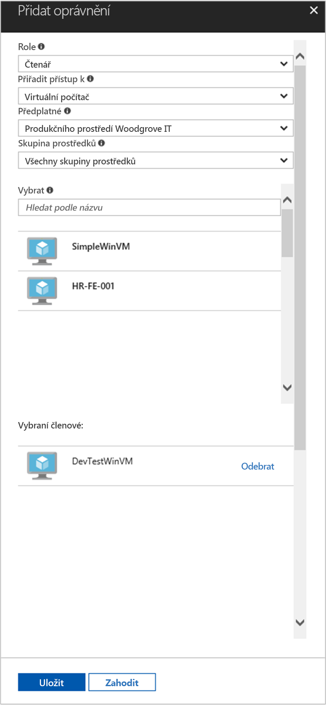

# <a name="use-a-windows-vm-managed-service-identity-msi-to-access-resource-manager"></a>Používat pro přístup k Resource Manageru Windows virtuálního počítače spravované služby Identity (MSI)

[!INCLUDE[preview-notice](../../../includes/active-directory-msi-preview-notice.md)]

V tomto kurzu se dozvíte, jak povolit identita spravované služby (MSI) pro Windows virtuální počítač (VM). Potom můžete tuto identitu pro přístup k rozhraní API služby Azure Resource Manager. Identita spravované služby je automaticky prováděna nástrojem Azure a umožňují ověření pro služby, které podporují ověřování Azure AD bez nutnosti vložení přihlašovací údaje do vašeho kódu. Získáte informace o těchto tématech:

> [!div class="checklist"]
> * Povolit MSI v systému Windows virtuálního počítače 
> * Udělit přístup virtuálních počítačů do skupiny prostředků ve službě Správce prostředků Azure 
> * Získání přístupového tokenu pomocí identity virtuálního počítače a použít jej k vyvolání Azure Resource Manager

## <a name="prerequisites"></a>Požadavky

[!INCLUDE [msi-qs-configure-prereqs](../../../includes/active-directory-msi-qs-configure-prereqs.md)]

[!INCLUDE [msi-tut-prereqs](../../../includes/active-directory-msi-tut-prereqs.md)]

## <a name="sign-in-to-azure"></a>Přihlášení k Azure
Přihlaste se k webu Azure Portal na adrese [https://portal.azure.com](https://portal.azure.com).

## <a name="create-a-windows-virtual-machine-in-a-new-resource-group"></a>Vytvoření virtuálního počítače s Windows v nové skupině prostředků.

V tomto kurzu vytvoříme nový virtuální počítač s Windows.  Můžete také povolit MSI na existující virtuální počítač.

1.  Klikněte na tlačítko **Vytvořit prostředek** v levém horním rohu webu Azure Portal.
2.  Vyberte **Compute** a potom vyberte **Windows Server 2016 Datacenter**. 
3.  Zadejte informace o virtuálním počítači. **Uživatelské jméno** a **heslo** vytvořený, zde je přihlašovací údaje, které používáte k přihlášení k virtuálnímu počítači.
4.  Vyberte správnou **předplatné** pro virtuální počítač v rozevírací nabídce.
5.  Chcete-li vybrat nový **skupiny prostředků** , během které můžete vytvořit virtuální počítač vyberte **vytvořit nový**. Jakmile budete hotovi, klikněte na **OK**.
6.  Vyberte velikost virtuálního počítače. Pokud chcete zobrazit další velikosti, vyberte **Zobrazit všechny** nebo změňte filtr **Podporovaný typ disku**. Na stránce nastavení ponechejte výchozí hodnoty a klikněte na tlačítko **OK**.

    

## <a name="enable-msi-on-your-vm"></a>Povolit MSI na vašem virtuálním počítači 

Virtuální počítač MSI umožňuje získat přístupové tokeny z Azure AD, aniž by bylo třeba uvést přihlašovací údaje do vašeho kódu. Povolení spravovat Identity služby na virtuálním počítači, nemá dvě věci: zaregistruje virtuální počítač s Azure Active Directory k vytvoření jeho spravovanou identitu a nakonfiguruje identitu ve virtuálním počítači.

1.  Vyberte **virtuálního počítače** , které chcete povolit MSI v.  
2.  V levém navigačním panelu klikněte na tlačítko **konfigurace**. 
3.  Zobrazí **identita spravované služby**. Registrovat a povolit soubor MSI, vyberte **Ano**, pokud chcete zakázat, vyberte Ne. 
4.  Ujistěte se, kliknete na tlačítko **Uložit** konfiguraci uložíte.  
    

## <a name="grant-your-vm-access-to-a-resource-group-in-resource-manager"></a>Udělit přístup virtuálních počítačů do skupiny prostředků ve službě Správce prostředků
Pomocí Instalační služby MSI kódu můžete získat přístupové tokeny k ověřování k prostředkům, které podporují ověřování Azure AD.  Azure Resource Manager podporuje ověřování Azure AD.  Nejprve musíme udělení tohoto Virtuálního počítače identitu přístup k prostředku ve službě Správce prostředků, v tomto případě skupině prostředků, ve kterém se nachází virtuální počítač.  

1.  Přejděte na kartu pro **skupiny prostředků**. 
2.  Vyberte konkrétní **skupiny prostředků** jste vytvořili pro vaše **virtuální počítač s Windows**. 
3.  Přejděte na **přístup k ovládacímu prvku (IAM)** na levém panelu. 
4.  Potom **přidat** nové přiřazení role pro vaše **virtuální počítač s Windows**.  Zvolte **Role** jako **čtečky**. 
5.  V dalším rozevíracím **přiřadit přístup** prostředek **virtuální počítač**. 
6.  Dále zkontrolujte správné předplatné, je uvedena ve **předplatné** rozevíracího seznamu. A pro **skupiny prostředků**, vyberte **všechny skupiny zdrojů**. 
7.  Nakonec v **vyberte** vyberte virtuální počítač Windows v rozevírací nabídce a klikněte na **Uložit**.

    

## <a name="get-an-access-token-using-the-vm-identity-and-use-it-to-call-azure-resource-manager"></a>Získání přístupového tokenu pomocí identity virtuálního počítače a použít jej k vyvolání Azure Resource Manager 

Budete muset použít **prostředí PowerShell** v této části.  Pokud jste si nainstalovali, stáhněte si [zde](https://docs.microsoft.com/powershell/azure/overview?view=azurermps-4.3.1). 

1.  Na portálu, přejděte na **virtuální počítače** a přejděte k virtuálnímu počítači Windows a v **přehled**, klikněte na tlačítko **Connect**. 
2.  Zadejte ve vaší **uživatelské jméno** a **heslo** pro které jste přidali při vytváření virtuálního počítače Windows. 
3.  Teď, když jste vytvořili **připojení ke vzdálené ploše** s virtuálním počítačem, otevřete **prostředí PowerShell** ve vzdálené relaci. 
4.  Pomocí Powershellu Invoke-WebRequest, vytvořte žádost na místní koncový bod MSI se získat přístupový token pro Azure Resource Manager.

    ```powershell
       $response = Invoke-WebRequest -Uri 'http://169.254.169.254/metadata/identity/oauth2/token?api-version=2018-02-01&resource=https%3A%2F%2Fmanagement.azure.com%2F' -Method GET -Headers @{Metadata="true"}
    ```
    
    > [!NOTE]
    > Hodnota parametru "prostředek" musí být přesná shoda pro očekávané službou Azure AD. Pokud používáte ID prostředku Azure Resource Manager, je nutné zahrnout do adresy koncové lomítko, v identifikátoru URI.
    
    V dalším kroku extrahujte úplnou odpověď, který je uložený jako řetězec formátu JavaScript objekt Notation (JSON) v objektu $response. 
    
    ```powershell
    $content = $response.Content | ConvertFrom-Json
    ```
    V dalším kroku extrahujte tokenu přístupu z odpovědi.
    
    ```powershell
    $ArmToken = $content.access_token
    ```
    
    Nakonec zavolejte Azure Resource Manager pomocí přístupového tokenu. V tomto příkladu také používáme Powershellu Invoke-WebRequest volání do Azure Resource Manageru, a musí zahrnovat přístupový token v hlavičce autorizace.
    
    ```powershell
    (Invoke-WebRequest -Uri https://management.azure.com/subscriptions/<SUBSCRIPTION ID>/resourceGroups/<RESOURCE GROUP>?api-version=2016-06-01 -Method GET -ContentType "application/json" -Headers @{ Authorization ="Bearer $ArmToken"}).content
    ```
    > [!NOTE] 
    > Adresa URL je malá a velká písmena, zajistěte proto, pokud používáte přesný případ stejné, jako jste použili dříve, když jste s názvem skupiny prostředků a velká písmena "G" v "Skupinyprostředků."
        
    Následující příkaz vrátí podrobnosti o skupině prostředků:

    ```powershell
    {"id":"/subscriptions/98f51385-2edc-4b79-bed9-7718de4cb861/resourceGroups/DevTest","name":"DevTest","location":"westus","properties":{"provisioningState":"Succeeded"}}
    ```

## <a name="related-content"></a>Související obsah

- Přehled MSI najdete v tématu [identita spravované služby přehled](overview.md).

Použijte následující sekci komentáře k poskytnutí zpětné vazby a Pomozte nám vylepšit a utvářejí náš obsah.

