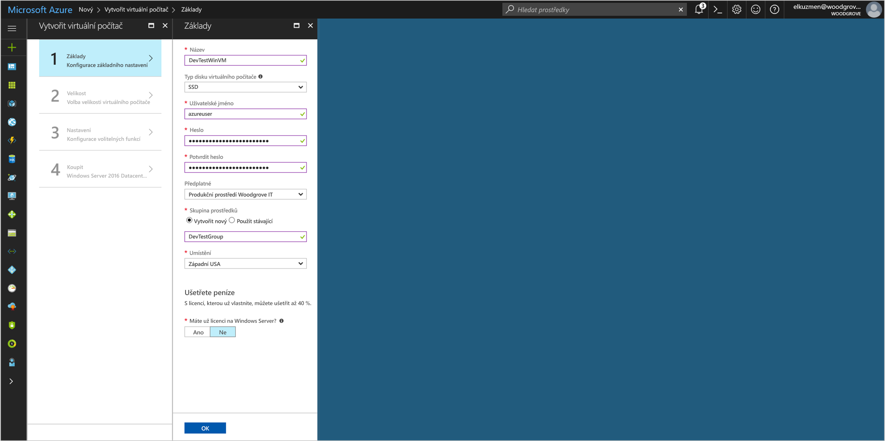
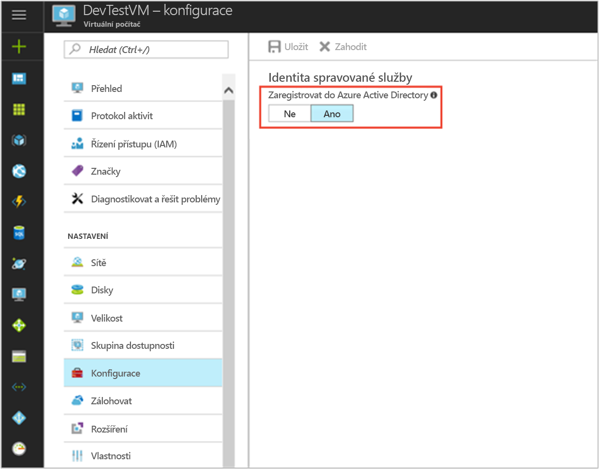

# <a name="use-a-windows-vm-msi-to-access-azure-cosmos-db"></a>Používat pro přístup k databázi Azure Cosmos MSI virtuálních počítačů Windows

[!INCLUDE[preview-notice](../../../includes/active-directory-msi-preview-notice.md)]

V tomto kurzu se dozvíte, jak vytvořit a používat Windows virtuální počítač MSI pro přístup k databázi Cosmos. Získáte informace o těchto tématech:

> [!div class="checklist"]
> * Vytvoření MSI povoleno virtuální počítač s Windows 
> * Vytvoření účtu služby Cosmos DB
> * MSI virtuálních počítačů Windows udělit přístup k přístupové klíče účtu Cosmos DB
> * Získání přístupového tokenu pomocí virtuálních počítačů Windows MSI volat Azure Resource Manager
> * Získat přístupové klíče z Azure Resource Manager volání Cosmos DB

## <a name="prerequisites"></a>Požadavky

[!INCLUDE [msi-qs-configure-prereqs](../../../includes/active-directory-msi-qs-configure-prereqs.md)]

[!INCLUDE [msi-tut-prereqs](../../../includes/active-directory-msi-tut-prereqs.md)]


## <a name="sign-in-to-azure"></a>Přihlášení k Azure

Přihlaste se k webu Azure Portal na adrese [https://portal.azure.com](https://portal.azure.com).

## <a name="create-a-windows-virtual-machine-in-a-new-resource-group"></a>Vytvoření virtuálního počítače s Windows v nové skupině prostředků.

V tomto kurzu vytvoříme nový virtuální počítač s Windows.  Můžete také povolit MSI na existující virtuální počítač.

1. Klikněte na tlačítko **Vytvořit prostředek** v levém horním rohu webu Azure Portal.
2. Vyberte **Compute** a potom vyberte **Windows Server 2016 Datacenter**. 
3. Zadejte informace o virtuálním počítači. **Uživatelské jméno** a **heslo** vytvořený, zde je přihlašovací údaje, které používáte k přihlášení k virtuálnímu počítači.
4. Vyberte správnou **předplatné** pro virtuální počítač v rozevírací nabídce.
5. Chcete-li vybrat nový **skupiny prostředků** , během které můžete vytvořit virtuální počítač vyberte **vytvořit nový**. Jakmile budete hotovi, klikněte na **OK**.
6. Vyberte velikost virtuálního počítače. Pokud chcete zobrazit další velikosti, vyberte **Zobrazit všechny** nebo změňte filtr **Podporovaný typ disku**. Na stránce nastavení ponechejte výchozí hodnoty a klikněte na tlačítko **OK**.

   

## <a name="enable-msi-on-your-vm"></a>Povolit MSI na vašem virtuálním počítači 

Virtuální počítač MSI umožňuje získat přístupové tokeny z Azure AD bez nutnosti převést přihlašovací údaje do vašeho kódu. V pozadí, povolení MSI ve virtuálním počítači prostřednictvím portálu Azure provádí dvě věci: ho zaregistruje virtuální počítač s Azure AD pro vytvoření spravované identity a nakonfiguruje identitu ve virtuálním počítači.

1. Vyberte **virtuálního počítače** , které chcete povolit MSI v.  
2. V levém navigačním panelu klikněte na tlačítko **konfigurace**. 
3. Zobrazí **identita spravované služby**. Registrovat a povolit soubor MSI, vyberte **Ano**, pokud chcete zakázat, vyberte Ne. 
4. Ujistěte se, kliknete na tlačítko **Uložit** konfiguraci uložíte.  
   

## <a name="create-a-cosmos-db-account"></a>Vytvoření účtu služby Cosmos DB 

Pokud jste již nemáte, vytvořte účet Cosmos DB. Můžete tento krok přeskočit a použít existující účet Cosmos DB. 

1. Klikněte **+/ vytvořit novou službu** nalezeno tlačítko v levém horním rohu portálu Azure.
2. Klikněte na tlačítko **databáze**, pak **Azure Cosmos DB**a nové "nový účet" panelu zobrazí.
3. Zadejte **ID** pro Cosmos DB účet, který použijete později.  
4. **Rozhraní API** musí být nastavena na "SQL." Postup popsaný v tomto kurzu lze použít s jinými typy k dispozici rozhraní API, ale kroky v tomto kurzu jsou pro rozhraní SQL API.
5. Ujistěte se, **předplatné** a **skupiny prostředků** odpovídat jsou zadány při vytvoření virtuálního počítače v předchozím kroku.  Vyberte **umístění** kde je k dispozici Cosmos DB.
6. Klikněte na možnost **Vytvořit**.

## <a name="create-a-collection-in-the-cosmos-db-account"></a>Vytvoření kolekce v účtu Cosmos DB

Dál přidejte shromažďování dat v účtu Cosmos DB, který můžete dotazovat v dalších krocích.

1. Přejděte na svůj nově vytvořený účet Cosmos DB.
2. Na **přehled** klikněte na možnost **+/ přidat kolekce** tlačítko a "Přidat"kolekce panelu snímky out.
3. Poskytnout kolekce s výběrem ID, ID kolekce databáze kapacitu úložiště, zadejte klíč oddílu, zadejte hodnotu propustnosti a potom klikněte na tlačítko **OK**.  V tomto kurzu je dostačující použít "Test" jako ID databáze a ID kolekce, vyberte kapacitu dlouhodobého úložiště a nejnižší propustnost (400 RU/s).  

## <a name="grant-windows-vm-msi-access-to-the-cosmos-db-account-access-keys"></a>MSI virtuálních počítačů Windows udělit přístup k přístupové klíče účtu Cosmos DB

Cosmos DB nenabízí nativní podporu ověřování Azure AD. Můžete však použít MSI k načtení přístupový klíč Cosmos databáze ze Správce prostředků a pomocí klíče pro přístup k databázi Cosmos. V tomto kroku udělíte přístup MSI klíče k účtu Cosmos DB.

K udělení přístupu identity MSI k účtu Cosmos DB v správce Azure Resource Manager pomocí prostředí PowerShell, aktualizujte hodnoty pro `<SUBSCRIPTION ID>`, `<RESOURCE GROUP>`, a `<COSMOS DB ACCOUNT NAME>` pro vaše prostředí. Nahraďte `<MSI PRINCIPALID>` s `principalId` vlastnost vrácený `az resource show` v [načíst principalID virtuálních počítačů Linux MSI](#retrieve-the-principalID-of-the-linux-VM's-MSI).  Cosmos DB podporuje dvě úrovně podrobnosti při použití přístupových klíčů: pro čtení a zápis k účtu a přístup jen pro čtení k účtu.  Přiřazení `DocumentDB Account Contributor` role, pokud chcete získat klíče pro čtení a zápis pro účet, nebo přiřadit `Cosmos DB Account Reader Role` role, pokud chcete získat klíče jen pro čtení pro účet:

```azurepowershell
$spID = (Get-AzureRMVM -ResourceGroupName myRG -Name myVM).identity.principalid
New-AzureRmRoleAssignment -ObjectId $spID -RoleDefinitionName "Reader" -Scope "/subscriptions/<mySubscriptionID>/resourceGroups/<myResourceGroup>/providers/Microsoft.Storage/storageAccounts/<myStorageAcct>"
```

## <a name="get-an-access-token-using-the-windows-vms-msi-to-call-azure-resource-manager"></a>Získání přístupového tokenu pomocí virtuálních počítačů Windows MSI volat Azure Resource Manager

Pro zbývající část tohoto kurzu budeme pracovat z virtuálního počítače, které jsme vytvořili předtím. 

Musíte použít rutiny Powershellu pro Azure Resource Manager v této části.  Pokud nemáte nainstalováno, [stáhnout nejnovější verzi](https://docs.microsoft.com/powershell/azure/overview) než budete pokračovat.

Budete také muset nainstalovat nejnovější verzi [Azure CLI 2.0](https://docs.microsoft.com/cli/azure/install-azure-cli) na vašem virtuálním počítači Windows.

1. Na portálu Azure přejděte do **virtuální počítače**, přejděte na virtuálním počítači se systémem Windows, potom ze **přehled** klikněte na stránce **Connect** v horní části. 
2. Zadejte ve vaší **uživatelské jméno** a **heslo** pro které jste přidali při vytváření virtuálního počítače Windows. 
3. Teď, když jste vytvořili **připojení ke vzdálené ploše** s virtuálním počítačem, otevřete v této relaci vzdálené prostředí PowerShell.
4. Pomocí Powershellu Invoke-WebRequest, vytvořte žádost na místní koncový bod MSI se získat přístupový token pro Azure Resource Manager.

    ```powershell
        $response = Invoke-WebRequest -Uri 'http://169.254.169.254/metadata/identity/oauth2/token?api-version=2018-02-01&resource=https%3A%2F%2Fmanagement.azure.com%2F' -Method GET -Headers @{Metadata="true"}
    ```

    > [!NOTE]
    > Hodnota parametru "prostředek" musí být přesná shoda pro očekávané službou Azure AD. Pokud používáte ID prostředku Azure Resource Manager, je nutné zahrnout do adresy koncové lomítko, v identifikátoru URI.
    
    V dalším kroku extrahujte "Obsah" elementu, který je uložený jako řetězec formátu JavaScript objekt Notation (JSON) v objektu $response. 
    
    ```powershell
    $content = $response.Content | ConvertFrom-Json
    ```
    V dalším kroku extrahujte tokenu přístupu z odpovědi.
    
    ```powershell
    $ArmToken = $content.access_token
    ```

## <a name="get-access-keys-from-azure-resource-manager-to-make-cosmos-db-calls"></a>Získat přístupové klíče z Azure Resource Manager volání Cosmos DB

Nyní pomocí prostředí PowerShell volání Resource Manager pomocí přístupového tokenu získali v předchozí části načíst přístupový klíč účtu Cosmos DB. Jakmile jsme přístupový klíč, jsme dotaz Cosmos DB. Nezapomeňte nahradit `<SUBSCRIPTION ID>`, `<RESOURCE GROUP>`, a `<COSMOS DB ACCOUNT NAME>` hodnoty parametrů s vlastními hodnotami. Nahraďte `<ACCESS TOKEN>` hodnotu s tímto tokenem přístupu, který jste získali dříve.  Pokud chcete získat klíče pro čtení a zápis, použijte typ klíče operace `listKeys`.  Pokud chcete načíst klíče jen pro čtení, použijte typ operace klíče `readonlykeys`:

```powershell
Invoke-WebRequest -Uri https://management.azure.com/subscriptions/<SUBSCRIPTION-ID>/resourceGroups/<RESOURCE-GROUP>/providers/Microsoft.DocumentDb/databaseAccounts/<COSMOS DB ACCOUNT NAME>/listKeys/?api-version=2016-12-01 -Method POST -Headers @{Authorization="Bearer $ARMToken"}
```
Odpověď získáte seznam klíčů.  Například, pokud se klíče jen pro čtení:

```powershell
{"primaryReadonlyMasterKey":"bWpDxS...dzQ==",
"secondaryReadonlyMasterKey":"38v5ns...7bA=="}
```
Teď, když máte přístupový klíč pro účet Cosmos DB můžete předat na sadu SDK DB Cosmos a volání přístup k účtu.  Rychlé příklad můžete předat přístupový klíč do příkazového řádku Azure CLI.  Můžete získat <COSMOS DB CONNECTION URL> z **přehled** karty v okně Cosmos DB účtu na portálu Azure.  Nahraďte <ACCESS KEY> s hodnotou jste získali výše:

```bash
az cosmosdb collection show -c <COLLECTION ID> -d <DATABASE ID> --url-connection "<COSMOS DB CONNECTION URL>" --key <ACCESS KEY>
```

Toto rozhraní příkazového řádku příkaz vrátí podrobnosti o kolekci:

```bash
{
  "collection": {
    "_conflicts": "conflicts/",
    "_docs": "docs/",
    "_etag": "\"00006700-0000-0000-0000-5a8271e90000\"",
    "_rid": "Es5SAM2FDwA=",
    "_self": "dbs/Es5SAA==/colls/Es5SAM2FDwA=/",
    "_sprocs": "sprocs/",
    "_triggers": "triggers/",
    "_ts": 1518498281,
    "_udfs": "udfs/",
    "id": "Test",
    "indexingPolicy": {
      "automatic": true,
      "excludedPaths": [],
      "includedPaths": [
        {
          "indexes": [
            {
              "dataType": "Number",
              "kind": "Range",
              "precision": -1
            },
            {
              "dataType": "String",
              "kind": "Range",
              "precision": -1
            },
            {
              "dataType": "Point",
              "kind": "Spatial"
            }
          ],
          "path": "/*"
        }
      ],
      "indexingMode": "consistent"
    }
  },
  "offer": {
    "_etag": "\"00006800-0000-0000-0000-5a8271ea0000\"",
    "_rid": "f4V+",
    "_self": "offers/f4V+/",
    "_ts": 1518498282,
    "content": {
      "offerIsRUPerMinuteThroughputEnabled": false,
      "offerThroughput": 400
    },
    "id": "f4V+",
    "offerResourceId": "Es5SAM2FDwA=",
    "offerType": "Invalid",
    "offerVersion": "V2",
    "resource": "dbs/Es5SAA==/colls/Es5SAM2FDwA=/"
  }
}
```

## <a name="next-steps"></a>Další postup

- Přehled MSI najdete v tématu [identita spravované služby přehled](overview.md).
