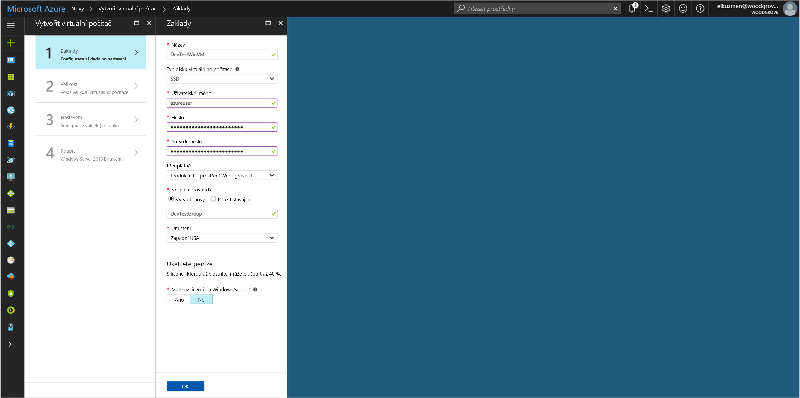

# <a name="use-a-windows-vm-managed-service-identity-msi-to-access-azure-key-vault"></a>Použití Windows virtuální počítač Identity spravované služby (MSI) pro přístup k Azure Key Vault 

[!INCLUDE[preview-notice](~/includes/active-directory-msi-preview-notice-ua.md)]

V tomto kurzu se dozvíte, jak povolit Identity spravované služby (MSI) pro virtuální počítač Windows a pak použít tuto identitu pro přístup k Azure Key Vault. Slouží jako bootstrap, služby Key Vault umožňuje klientské aplikace pomocí tajného klíče pro přístup k prostředkům, které není zabezpečené pomocí Azure Active Directory (AD). Identita spravované služby je automaticky prováděna nástrojem Azure a umožňují ověření do služeb, které podporují ověřování Azure AD, aniž by bylo nutné vložit pověření do kódu. 

Získáte informace o těchto tématech:


> [!div class="checklist"]
> * Povolit identitu spravované služby na virtuálním počítači s Windows 
> * Udělení přístupu vašich virtuálních počítačů k tajného klíče do služby Key Vault 
> * Získání přístupového tokenu pomocí identity virtuálního počítače a použít ho k získání tajného klíče ze služby Key Vault 

## <a name="prerequisites"></a>Požadavky

[!INCLUDE [msi-core-prereqs](~/includes/active-directory-msi-core-prereqs-ua.md)]

[!INCLUDE [msi-tut-prereqs](~/includes/active-directory-msi-tut-prereqs.md)]

## <a name="sign-in-to-azure"></a>Přihlášení k Azure

Přihlaste se k webu Azure Portal na adrese [https://portal.azure.com](https://portal.azure.com).

## <a name="create-a-windows-virtual-machine-in-a-new-resource-group"></a>Vytvoření virtuálního počítače s Windows do nové skupiny prostředků

V tomto kurzu vytvoříme nový virtuální počítač s Windows. Můžete také povolit MSI na existující virtuální počítač.

1.  Klikněte na tlačítko **vytvořit prostředek** v levém horním rohu webu Azure portal.
2.  Vyberte **Compute** a potom vyberte **Windows Server 2016 Datacenter**. 
3.  Zadejte informace o virtuálním počítači. **Uživatelské jméno** a **heslo** vytvořený, tady je přihlašovací údaje použijete k přihlášení k virtuálnímu počítači.
4.  Zvolte správné **předplatné** pro virtuální počítač v rozevírací nabídce.
5.  Chcete-li vybrat nový **skupiny prostředků** chcete virtuální počítač, aby se v aplikaci, zvolte **vytvořit nový**. Jakmile budete hotovi, klikněte na **OK**.
6.  Vyberte velikost virtuálního počítače. Pokud chcete zobrazit další velikosti, vyberte **Zobrazit všechny** nebo změňte filtr **Podporovaný typ disku**. V okně Nastavení ponechte výchozí nastavení a klikněte na **OK**.

    

## <a name="enable-msi-on-your-vm"></a>Povolení MSI ve virtuálním počítači 

MSI virtuálního počítače můžete k získání přístupových tokenů z Azure AD, aniž byste museli vložit pověření do kódu. Povolení MSI Azure zjistí, chcete-li vytvořit spravovanou identitu pro váš virtuální počítač. Pod pokličkou, povolení MSI provede dvě věci: nainstaluje rozšíření MSI virtuálního počítače na virtuálním počítači a umožňuje MSI v Azure Resource Manageru.

1.  Vyberte **virtuální počítač** , že chcete povolit na MSI.  
2.  Na navigačním panelu vlevo klikněte na tlačítko **konfigurace**. 
3.  Zobrazí **identita spravované služby**. Chcete-li zaregistrovat a povolit MSI, vyberte **Ano**, pokud chcete zakázat, vyberte Ne. 
4.  Zajištění kliknutí na **Uložit** uložte konfiguraci.  

    

5. Pokud chcete zkontrolovat a ověřit, jaká rozšíření jsou na tomto virtuálním počítači, klikněte na tlačítko **rozšíření**. Pokud je povolené MSI, pak **ManagedIdentityExtensionforWindows** se zobrazí v seznamu.

    

## <a name="grant-your-vm-access-to-a-secret-stored-in-a-key-vault"></a>Váš přístup k virtuálním počítačům přidělit tajného klíče do služby Key Vault 
 
Použití MSI kódu můžete získat přístupové tokeny k ověření prostředků, které podporují ověřování Azure AD.  Ale ne všechny služby Azure podporuje ověřování Azure AD. Použití MSI pomocí těchto služeb, pověření služeb ukládat ve službě Azure Key Vault a použití MSI pro přístup ke Key Vault načíst přihlašovací údaje. 

Nejprve musíme vytvořit trezor klíčů a udělit přístup identit našich virtuálních počítačů do služby Key Vault.   

1. V horní části levého navigačního panelu vyberte **+ nová** pak **zabezpečení + Identita** pak **služby Key Vault**.  
2. Zadejte **název** pro nové služby Key Vault. 
3. Vyhledejte služby Key Vault stejného předplatného a skupiny prostředků jako virtuální počítač, který jste vytvořili dříve. 
4. Vyberte **zásady přístupu** a klikněte na tlačítko **přidat nový**. 
5. V konfigurace ze šablony, vyberte **správy tajných kódů**. 
6. Zvolte **výběr objektu zabezpečení**a do vyhledávacího pole zadejte název virtuálního počítače, které jste vytvořili dříve.  V seznamu výsledků vyberte virtuální počítač a klikněte na tlačítko **vyberte**. 
7. Klikněte na tlačítko **OK** k dokončení přidání nové zásady přístupu a **OK** dokončete výběr zásad přístupu. 
8. Klikněte na tlačítko **vytvořit** na dokončení vytvoření služby Key Vault. 

    


V dalším kroku přidání tajného klíče do služby Key Vault tak, aby později můžete získat tajný kód pomocí kódu je spuštěný ve virtuálním počítači: 

1. Vyberte **všechny prostředky**a vyhledejte a vyberte trezor klíčů, který jste vytvořili. 
2. Vyberte **tajných kódů**a klikněte na tlačítko **přidat**. 
3. Vyberte **ruční**, z **možnosti nahrání**. 
4. Zadejte název a hodnotu pro tajný kód.  Hodnota může být cokoliv, co chcete. 
5. Datum aktivace a datum vypršení platnosti jasné a dál necháte **povoleno** jako **Ano**. 
6. Klikněte na tlačítko **vytvořit** vytvořit tajný kód. 
 
## <a name="get-an-access-token-using-the-vm-identity-and-use-it-to-retrieve-the-secret-from-the-key-vault"></a>Získání přístupového tokenu pomocí identity virtuálního počítače a použít ho k získání tajného klíče ze služby Key Vault  

Pokud nemáte Powershellu 4.3.1 nebo vyšší, budete muset [stáhnout a nainstalovat nejnovější verzi](https://docs.microsoft.com/powershell/azure/overview).

Nejprve můžeme použít MSI Virtuálního počítače k získání přístupového tokenu pro ověření do služby Key Vault:
 
1. Na portálu přejděte na **virtuálních počítačů** a přejděte ke svému virtuálnímu počítači Windows a v **přehled**, klikněte na tlačítko **připojit**.
2. Zadejte vaše **uživatelské jméno** a **heslo** pro který přidáte, když jste vytvořili **virtuálního počítače Windows**.  
3. Teď, když jste vytvořili **připojení ke vzdálené ploše** s virtuálním počítačem, otevřete prostředí PowerShell ve vzdálené relaci.  
4. V prostředí PowerShell vyvolejte webový požadavek na tenantovi se získat token pro místního hostitele v určitém portu pro virtuální počítač.  

    Žádost o prostředí PowerShell:
    
    ```powershell
    PS C:\> $response = Invoke-WebRequest -Uri http://localhost:50342/oauth2/token -Method GET -Body @{resource="https://vault.azure.net"} -Headers @{Metadata="true"} 
    ```
    
    V dalším kroku extrahujte úplnou odpověď, která je uložena jako řetězec JSON JavaScript Object Notation () ve formátu $response objektu.  
    
    ```powershell
    PS C:\> $content = $response.Content | ConvertFrom-Json 
    ```
    
    V dalším kroku extrahujte přístupový token z odpovědi.  
    
    ```powershell
    PS C:\> $KeyVaultToken = $content.access_token 
    ```
    
    Nakonec pomocí příkazu Powershellu Invoke-WebRequest získat tajný klíč, který jste vytvořili dříve v Key Vault, předávání přístupového tokenu v autorizační hlavičce.  Budete potřebovat adresu URL služby Key Vault, což je v **Essentials** část **přehled** stránky vaší služby Key Vault.  
    
    ```powershell
    PS C:\> (Invoke-WebRequest -Uri https://<your-key-vault-URL>/secrets/<secret-name>?api-version=2016-10-01 -Method GET -Headers @{Authorization="Bearer $KeyVaultToken"}).content 
    ```
    
    Odpověď bude vypadat nějak takto: 
    
    ```powershell
    {"value":"p@ssw0rd!","id":"https://mytestkeyvault.vault.azure.net/secrets/MyTestSecret/7c2204c6093c4d859bc5b9eff8f29050","attributes":{"enabled":true,"created":1505088747,"updated":1505088747,"recoveryLevel":"Purgeable"}} 
    ```
    
Jakmile jste načíst tajného klíče ze služby Key Vault, můžete k ověření služby, který vyžaduje název a heslo. 

## <a name="related-content"></a>Související obsah

- Přehled MSI najdete v tématu [identita spravované služby přehled](msi-overview.md).

Pomocí následujícího oddílu pro komentáře na svůj názor a Pomozte nám vylepšit a obrazce náš obsah.
