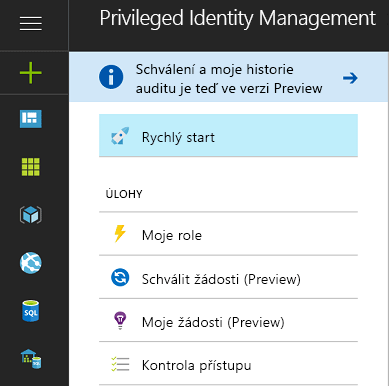
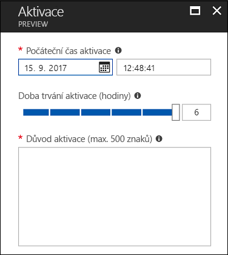
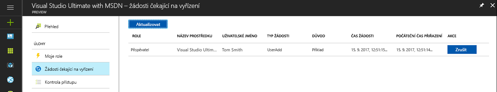
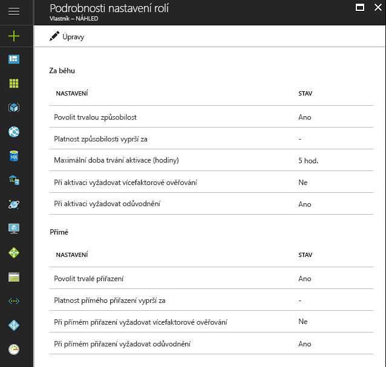

# Co je Azure AD Privileged Identity Management?

Pomocí služby Azure Active Directory (Azure AD) Privileged Identity Management můžete spravovat, řídit a sledovat přístup v rámci organizace. To zahrnuje přístup k prostředkům v Azure AD, prostředkům Azure a dalším online službám Microsoftu jako Office 365 nebo Microsoft Intune.

> [!NOTE]
> Když pro svého tenanta povolíte Privileged Identity Management, každý uživatel, který se službou pracuje nebo kterému služba přináší výhody, potřebuje platnou placenou nebo zkušební licenci Azure AD Premium P2 nebo Enterprise Mobility + Security E5. Příkladem můžou být uživatelé a uživatelé ve skupině, kteří:
>
>- Jsou přiřazeni k roli Správce privilegovaných rolí. 
>- Jsou přiřazeni jako způsobilí k ostatním rolím adresáře umožňujícím správu prostřednictvím PIM. 
>- Mají možnost schvalovat a zamítat žádosti v PIM. 
>- Jsou přiřazeni k roli prostředku Azure pomocí přiřazení za běhu nebo přímého (časově omezeného) přiřazení.  
>- Jsou přiřazeni ke kontrole přístupu.
>
>Další informace najdete v článku [Edice služby Azure Active Directory](../fundamentals/active-directory-whatis.md).

Organizace chtějí minimalizovat počet lidí, kteří mají přístup k zabezpečeným informacím nebo prostředkům, protože se tím snižuje riziko, že přístup získá kyberzločinec nebo že autorizovaný uživatel nevratně ovlivní citlivý prostředek.  Uživatelé však i nadále potřebují provádět privilegované operace v Azure AD, Azure, Office 365 nebo aplikacích SaaS. Organizace můžou uživatelům udělit privilegovaný přístup k prostředkům Azure, jako jsou předplatná a Azure AD. Je potřeba zajistit dohled nad činností těchto uživatelů s oprávněními správce. Azure AD Privileged Identity Management pomáhá zmírnit riziko udělení nadměrných, nepotřebných nebo nesprávně použitých přístupových práv.

Azure AD Privileged Identity Management vaší organizaci pomůže:

- Zjistit, kteří uživatelé mají přiřazené privilegované role pro správu prostředků Azure a kteří uživatelé mají přiřazené role pro správu v Azure AD.
- Povolit za běhu a na vyžádání přístup pro správu k online službám Microsoftu jako Office 365 a Intune a k prostředkům Azure, mezi které patří předplatná, skupiny prostředků a jednotlivé prostředky, jako jsou například virtuální počítače. 
- Zobrazit historii aktivací správcem, včetně změn, které správci provedli s prostředky Azure.
- Dostávat upozornění na změny v přiřazeních správců.
- Vyžadovat schválení k aktivaci privilegovaných rolí správců Azure AD.
- Kontrolovat členství v rolích pro správu a vyžadovat od uživatelů odůvodnění pokračujícího členství.

V Azure AD může Azure AD Privileged Identity Management spravovat uživatele přiřazené k předdefinovaným organizačním rolím Azure AD, jako je globální správce. V Azure může Azure AD Privileged Identity Management spravovat uživatele a skupiny přiřazené prostřednictvím rolí Azure RBAC, včetně vlastníka a přispěvatele.

## Přístup správce za běhu

V minulosti jste mohli uživatele přiřadit k roli správce přes web Azure Portal, portály jiných online služeb Microsoftu nebo rutiny Azure AD ve Windows PowerShellu. Takový uživatel se pak stane **trvalým správcem**, který je v přiřazené roli pořád aktivní. Azure AD Privileged Identity Management zavádí koncept **oprávněného správce**. Oprávnění správci by měli být uživatelé, kteří čas od času potřebují privilegovaný přístup, ale ne každý den po celý den. Dokud uživatel nepotřebuje přístup, je tato role neaktivní. Jakmile uživatel bude přístup potřebovat, dokončí proces aktivace a na předem určenou dobu se stane aktivním správcem. Stále více organizací volí tento přístup za účelem omezení nebo eliminace trvalého přístupu správců u privilegovaných rolí.

## Terminologie

*Oprávněný uživatel role* – Oprávněný uživatel role je uživatel ve vaší organizaci, který se přiřadil jako oprávněný k roli Azure AD (role vyžaduje aktivaci).

*Delegovaný schvalovatel* – Delegovaný schvalovatel je jeden nebo několik uživatelů nebo skupin v Azure AD zodpovědných za schvalování žádostí o aktivaci rolí.

## Scénáře

Privileged Identity Management podporuje následující scénáře:

**Jako správce privilegovaných rolí můžete:**

- Povolit schvalování pro konkrétní role
- Určit schvalovatele (uživatele nebo skupiny) pro schvalování žádostí
- Zobrazit historii žádostí a schválení pro všechny privilegované role

**Jako vyhrazený schvalovatel můžete:**

- Zobrazit žádosti čekající na schválení
- Schvalovat nebo zamítat žádosti o zvýšení oprávnění role (jednotně nebo hromadně)
- Uvést odůvodnění schválení nebo zamítnutí 

**Jako oprávněný uživatel role můžete:**

- Požádat o aktivaci role, která vyžaduje schválení
- Zobrazit stav vaší žádosti o aktivaci
- Dokončit požadovanou úlohu v Azure AD, pokud se aktivace schválí

## Kdo může co dělat v PIM

Pokud jste první, kdo používat PIM, se automaticky přiřazují [správce zabezpečení](../users-groups-roles/directory-assign-admin-roles.md#security-administrator) a [správce privilegovaných rolí](../users-groups-roles/directory-assign-admin-roles.md#privileged-role-administrator) v daném adresáři.

Pro role Azure AD jenom uživatel, který je v roli správce privilegovaných rolí můžou Spravovat přiřazení pro jiní správci v PIM. Je možné [udělit přístup na jiné správce ke správě PIM](pim-how-to-give-access-to-pim.md). Globální správci, správci zabezpečení a čtenáři zabezpečení můžete zobrazit přiřazení role Azure AD PIM.

Pro role prostředků Azure, pouze správce předplatného, vlastník prostředku nebo prostředku správce přístupu uživatelů můžou Spravovat přiřazení pro jiní správci v PIM. Uživatelé, kteří jsou správci privilegovaných rolí, správci zabezpečení nebo čtenáře zabezpečení není ve výchozím nastavení mají přístup k zobrazení přiřazení role prostředků Azure v PIM.

## Přehled služby Privileged Identity Management (vstupní bod)

Azure AD Privileged Identity Management podporuje správu rolí adresáře Azure AD a rolí pro prostředky Azure. Funkce rolí u prostředků Azure se od rolí pro správu v Azure AD liší. Role prostředků Azure poskytují různě odstupňovaná oprávnění k prostředku, ke kterému jsou přiřazené, a všem podřízeným prostředkům v hierarchii prostředků (označuje se jako dědičnost). [Další informace o RBAC, hierarchii prostředků a dědičnosti](../../role-based-access-control/role-assignments-portal.md) PIM pro role adresáře Azure AD i prostředky Azure můžete spravovat tak, že přejdete na odpovídající odkaz v levé navigační nabídce v části Správa vstupního bodu Přehled PIM.

PIM v části Úlohy v levé navigační nabídce poskytuje pohodlný přístup k aktivaci rolí, zobrazení aktivací a žádostí čekajících na vyřízení, schválení čekajících na vyřízení (v případě rolí adresáře Azure AD) a kontrolám čekajícím na vaši odpověď.

Když ze vstupního bodu Přehled přejdete na některou z položek nabídky Úlohy, bude výsledné zobrazení obsahovat výsledky pro role adresáře Azure AD i role prostředků Azure.

Část Moje role obsahuje seznam aktivních a oprávněných přiřazení rolí pro role adresáře Azure AD a role prostředků Azure. [Další informace o aktivaci oprávněných přiřazení rolí](pim-how-to-activate-role.md)

Aktivace rolí pro prostředky Azure představuje nové prostředí, které oprávněným členům role umožňuje plánovat aktivaci na budoucí datum/čas a vybrat konkrétní dobu trvání aktivace v rámci maxima povoleného správci.

V případě, že už naplánovaná aktivace není potřeba, může uživatel svou žádost čekající na vyřízení zrušit tím, že v levé navigační nabídce přejde k čekajícím žádostem a klikne na tlačítko Zrušit na řádku příslušné žádosti.

## Řídicí panel pro správu služby Privileged Identity Management

Privileged Identity Management nabízí řídicí panel pro správu, který poskytuje důležité informace, například:

* Upozornění na příležitosti ke zlepšení zabezpečení
* Počet uživatelů přiřazených k jednotlivým privilegovaným rolím  
* Počet oprávněných a trvalých správců
* Graf aktivací privilegovaných rolí ve vašem adresáři
* Počet přiřazení za běhu, časově omezených a trvalých přiřazení pro role prostředků Azure
* Uživatelé a skupiny s novými přiřazeními rolí za posledních 30 dnů (role prostředků Azure)

## Správa privilegovaných rolí

V případě rolí adresáře Azure AD můžete pomocí služby Azure AD Privileged Identity Management spravovat správce prostřednictvím přidávání nebo odebírání trvalých nebo oprávněných správců k jednotlivým rolím. Pomocí PIM pro prostředky Azure můžou vlastníci, správci uživatelského přístupu a globální správci, kteří v tenantovi povolují správu předplatných, přiřazovat uživatele nebo skupiny k rolím prostředků Azure s oprávněným přístupem (přístup za běhu), časově omezeným přístupem (nevyžaduje se aktivace) s počátečním a koncovým datem a časem nebo trvalým přístupem (pokud je povolený v nastavení role).

## Konfigurace nastavení aktivace role

Prostřednictvím [nastavení role](pim-how-to-change-default-settings.md) můžete nakonfigurovat vlastnosti aktivace oprávněné role pro role adresáře Azure AD, včetně následujících:

* Doba trvání období aktivace role
* Oznámení o aktivaci role
* Informace, které uživatel musí zadat během procesu aktivace role
* Lístek služby nebo číslo incidentu
* [Požadavky na pracovní postup schválení](./azure-ad-pim-approval-workflow.md)

Na obrázku si všimněte neaktivních tlačítek pro službu **Multi-Factor Authentication**. U určitých vysoce privilegovaných rolí vyžadujeme kvůli zvýšené ochraně službu MFA.

Nastavení role pro role prostředků Azure umožňuje správcům konfigurovat nastavení přiřazení za běhu a přímého přiřazení, včetně následujících:

- Možnost přiřadit uživatele nebo skupiny k rolím bez koncového data a času (trvalé přiřazení)
- Výchozí doba trvání přiřazení (pokud není trvalé)
- Maximální doba trvání aktivace (pokud tuto možnost oprávněný člen role aktivuje)
- Informace, které uživatel musí zadat během procesu aktivace role (přiřazení za běhu) nebo přiřazení (přímá přiřazení)

## Aktivace role

Oprávněný správce [aktivuje roli](pim-how-to-activate-role.md) tak, že požádá o časově omezenou aktivaci role. O aktivaci je možné požádat pomocí možnosti **Aktivovat moji roli** ve službě Azure AD Privileged Identity Management.

Správce, který chce aktivovat roli, musí na webu Azure Portal inicializovat službu Azure AD Privileged Identity Management.

Aktivaci role je možné upravit. V nastavení PIM můžete určit délku aktivace a informace, které pro aktivaci role musí správce zadat.

## Kontrola aktivity role

Existují dva způsoby, jak můžete sledovat, jak vaši zaměstnanci a správci používají privilegované role. První možností je použít [historii auditu rolí adresáře](pim-how-to-use-audit-log.md). Protokoly historie auditu sledují změny přiřazení privilegovaných rolí, historii aktivací rolí a změny nastavení pro role prostředků Azure. 

Druhou možností je nastavit pravidelné [kontroly přístupu](pim-how-to-start-security-review.md). Tyto kontroly přístupu může provádět přiřazený revidující (například vedoucí týmu) nebo je můžou provádět sami zaměstnanci. Toto je nejlepší způsob, jak monitorovat, kdo stále požaduje přístup, a kdo už ne.

## Azure AD PIM při vypršení platnosti předplatného

Před použitím Azure AD PIM musí mít tenant zkušební nebo placené předplatné Azure AD Premium P2 (nebo EMS E5).  Správci tenanta navíc musí mít přiřazené licence.  Konkrétně musí mít licence přiřazené správci v rolích Azure AD spravovaných přes Azure AD PIM, správci v rolích Azure RBAC spravovaných přes Azure AD PIM a všichni uživatelé bez oprávnění správce, kteří provádějí kontroly přístupu.
Pokud vaše organizace předplatné Azure AD Premium P2 neprodlouží nebo vyprší platnost vaší zkušební verze, funkce Azure AD PIM přestanou být ve vašem tenantovi dostupné, oprávněná přiřazení rolí se odeberou a uživatelé ztratí možnost aktivovat role. Další informace najdete v tématu [Požadavky na předplatné Azure AD PIM](./subscription-requirements.md).

## Další postup

- [Zahájení práce s PIM](pim-getting-started.md)
- [Požadavky na předplatné pro použití PIM](subscription-requirements.md)
- [Zabezpečení privilegovaného přístupu pro hybridní a cloudová nasazení v Azure AD](../users-groups-roles/directory-admin-roles-secure.md?toc=%2fazure%2factive-directory%2fprivileged-identity-management%2ftoc.json)
