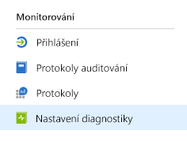
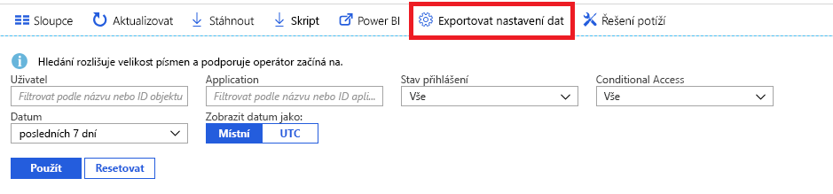

# Co je monitorování Azure Active Directory? (Preview)

S využitím monitorování Azure Active Directory (Azure AD) teď můžete směrovat protokoly aktivit služby Azure AD do různých koncových bodů. Následně je můžete ukládat pro účely dlouhodobého používání nebo integrovat s nástroji pro správu akcí a informací o zabezpečení (SIEM) třetích stran a získat tak přehled o vašem prostředí.

V současné době můžete směrovat protokoly do následujících umístění:

- Účet úložiště Azure.
- Centrum událostí Azure, takže můžete provést integraci s instancemi Splunk a SumoLogic.
- Pracovní prostor Azure Log Analytics, kde můžete analyzovat data a vytvářet řídicí panely a upozornění na určité události.

## Konfigurace nastavení diagnostiky

Pokud chcete spravovat nastavení monitorování pro protokoly aktivit služby Azure AD, nejprve se přihlaste k webu [Azure Portal](https://portal.azure.com) a pak vyberte **Azure Active Directory**. Odtud můžete na stránku konfigurace nastavení diagnostiky přejít dvěma způsoby:

* V části **Monitorování** vyberte **Nastavení diagnostiky**.

    
    
* Vyberte **Protokoly auditu** nebo **Protokoly přihlášení** a pak vyberte **Exportovat nastavení**. 

    

## Směrování protokolů do účtu úložiště

Směrováním protokolů do účtu úložiště Azure můžete zajistit jejich uložení po delší dobu, než je výchozí období uchovávání uvedené v našich [zásadách uchovávání](reference-reports-data-retention.md). Informace o [směrování dat do účtu úložiště](quickstart-azure-monitor-route-logs-to-storage-account.md).

## Streamování protokolů do centra událostí

Směrování protokolů do centra událostí Azure vám umožní provést integraci s nástroji SIEM třetích stran, jako je SumoLogic a Splunk. Tato integrace vám umožní kombinovat data protokolů aktivit služby Azure AD s ostatními daty spravovanými nástrojem SIEM a získat tak podrobnější přehled o vašem prostředí. Informace o [streamování protokolů do centra událostí](tutorial-azure-monitor-stream-logs-to-event-hub.md).

## Odesílání protokolů do Log Analytics

[Log Analytics](https://docs.microsoft.com/azure/log-analytics/log-analytics-overview) je řešení, které konsoliduje data monitorování z různých zdrojů a nabízí dotazovací jazyk a analytický modul poskytující přehled o operacích vašich aplikací a prostředků. Odesílání protokolů aktivit služby Azure AD do Log Analytics vám umožní rychle načítat, monitorovat a upozorňovat na shromážděná data. Informace o [odesílání dat do Log Analytics](howto-integrate-activity-logs-with-log-analytics.md).

Můžete také nainstalovat předem připravená zobrazení, aby protokoly aktivit služby Azure AD monitorovaly běžné scénáře včetně událostí přihlášení a auditu. Informace o [instalaci a používání zobrazení Log Analytics pro protokoly aktivit služby Azure AD](howto-install-use-log-analytics-views.md).

## Další kroky

* [Protokoly aktivit ve službě Azure Monitor](concept-activity-logs-azure-monitor.md)
* [Streamování protokolů do centra událostí](tutorial-azure-monitor-stream-logs-to-event-hub.md)
* [Odesílání protokolů do Log Analytics](howto-integrate-activity-logs-with-log-analytics.md)