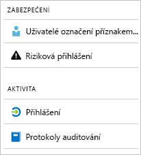

# Co jsou sestavy Azure Active Directory?

Azure Active Directory (Azure AD) sestavy poskytují komplexní přehled aktivit ve vašem prostředí. Poskytnutá data vám umožní:

- Určit, jak uživatelé využívají vaše aplikace a služby.
- Rozpoznat potenciální rizika ovlivňující stav vašeho prostředí.
- Řešit problémy, které brání uživatelům v práci.  

Architektura generování sestav se spoléhá na dva hlavní pilíře:

- [Sestavy zabezpečení](#security-reports)
- [Sestavy aktivit](#activity-reports)

## Sestavy zabezpečení

Zprávy o zabezpečení pomáhají chránit identity vaší organizace. Existují dva typy sestav zabezpečení:

- **Uživatelé označení příznakem rizika** – Ze [sestavy zabezpečení uživatelů označených příznakem rizika](concept-user-at-risk.md) získáte přehled o uživatelských účtech, u kterých mohlo dojít k ohrožení zabezpečení.

- **Riziková přihlášení** – Se [sestavou zabezpečení rizikových přihlášení](concept-risky-sign-ins.md) získáte indikátor pokusů o přihlášení, které mohl provést někdo, kdo není legitimním vlastníkem uživatelského účtu. 

### Jaká licence Azure AD je potřeba pro přístup k sestavě zabezpečení?  

Nabízí všechny edice Azure AD uživatelů označených příznakem rizika a rizikových přihlášení sestavy. Úroveň podrobností sestav se však mezi jednotlivými edicemi liší: 

- V **edice Azure Active Directory Free a Basic**, získat seznam uživatelů označených příznakem rizika a rizikových přihlášení. 

- Edice **Azure Active Directory Premium 1** tento model rozšiřuje tím, že umožňuje také prozkoumávat některé ze základních rizikových událostí, které byly v každé sestavě rozpoznány. 

- Edice **Azure Active Directory Premium 2** poskytuje nejpodrobnější informace o základních rizikových událostech a umožňuje také konfigurovat zásady zabezpečení, které automaticky reagují na nakonfigurované úrovně rizika.

## Sestavy aktivit

Sestavy aktivit vám pomůže porozumět chování uživatelů ve vaší organizaci. Existují dva typy sestav aktivit ve službě Azure AD:

- **Protokoly auditu** – [Sestava aktivit protokolů auditu](concept-audit-logs.md) poskytuje přístup k historii každé úlohy provedené ve vašem tenantovi.

- **Přihlášení** – Se [sestavou aktivit přihlašování](concept-sign-ins.md) můžete určit, kdo provedl úlohy hlášené sestavou protokolů auditu.

### Sestava protokolů auditu 

[Sestava protokolů auditu](concept-audit-logs.md) poskytuje záznamy systémových aktivit pro zajištění dodržování předpisů. Tato data umožňují řešit běžné scénáře tohoto typu:

- Někdo v tenantovi získal přístup ke správcovské skupině. Kdo jim dal přístup? 

- Chcete znát seznam uživatelů, kteří se přihlašují ke konkrétní aplikaci, protože jste aplikaci nedávno zprovoznili a chcete vědět, jestli funguje v pořádku.

- Chcete vědět, ke kolika resetováním hesla ve vašem tenantovi dochází.

#### Jaká licence Azure AD je potřeba pro přístup k sestavě protokolů auditu?  

Sestava protokolů auditu je dostupná pro funkce, ke kterým máte licence. Pokud máte licenci ke konkrétní funkci, máte u ní také přístup k informacím protokolu auditu. Další podrobnosti najdete v tématu [funkce Azure Active Directory a možnosti](https://www.microsoft.com/cloud-platform/azure-active-directory-features).   

### Sestava přihlášení

[Sestavy přihlášení](concept-sign-ins.md) můžete nalézt odpovědi na otázky jako:

- Jaký je vzorec přihlašování uživatele?
- Kolik uživatelů se přihlásilo za týden?
- Jaký je stav těchto přihlášení?

#### Jaká licence Azure AD je potřeba pro přístup k sestavě aktivit přihlašování?  

Pro přístup k sestavě aktivit přihlašování musí mít váš tenant přiřazenou licenci Azure AD Premium.

## Programový přístup

Kromě uživatelského rozhraní služby Azure AD také poskytuje [programový přístup](concept-reporting-api.md) k datům sestav pomocí sady založené na protokolu REST API. Tato rozhraní API můžete volat z nejrůznějších programovacích jazyků a nástrojů. 

## Další postup

- [Sestava rizikových přihlášení](concept-risky-sign-ins.md)
- [Sestava protokolů auditu](concept-audit-logs.md)
- [Sestava protokolů přihlášení](concept-sign-ins.md)