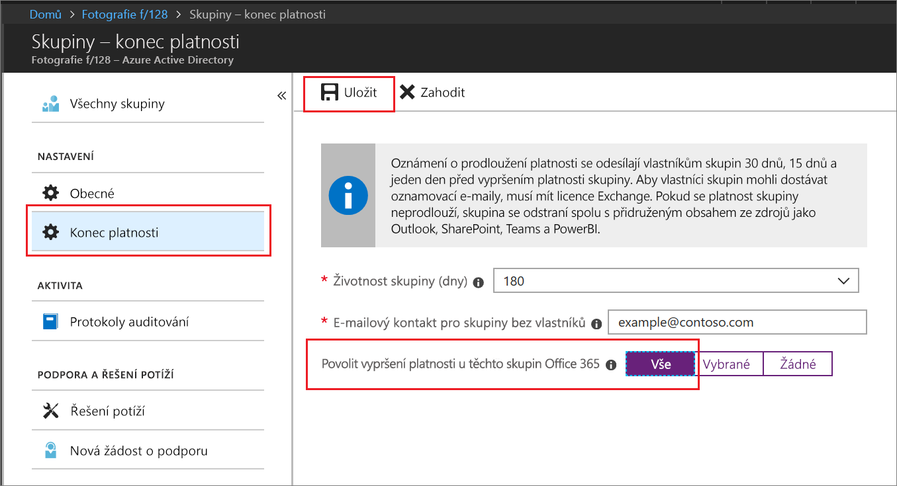

# Rychlý start: Nastavení vypršení platnosti skupin Office 365 v Azure Active Directory

V tomto rychlém startu nastavíte zásadu vypršení platnosti pro skupiny Office 365. Když mají uživatelé možnost nastavovat vlastní skupiny, můžou se začít množit nepoužívané skupiny. Jedním ze způsobů, jak spravovat nepoužívané skupiny, je nastavit vypršení platnosti těchto skupin a tím snížit potřebu údržby související s ručním odstraňováním skupin.

Zásady vypršení platnosti je jednoduchá:

* Vlastníci skupiny obdrží oznámení o potřebě prodloužit platnost skupiny, které vyprší platnost.
* Skupina, které se neprodlouží platnost, se odstraní.
* Odstraněnou skupinu Office 365 může do 30 dnů obnovit vlastník skupiny nebo správce Azure AD.

Pokud ještě nemáte předplatné Azure, [vytvořte si bezplatný účet](https://azure.microsoft.com/free/) před tím, než začnete.

## Požadavek

Pokud chcete nastavit vypršení platnosti skupiny, musíte v tenantovi být globálním správcem nebo správcem uživatelských účtů.

## Zapnutí vytváření uživatelů pro skupiny

1. Přihlaste se k webu [Azure Portal](https://portal.azure.com) pomocí účtu, který má k adresáři oprávnění globálního správce nebo správce uživatelských účtů.

2. Vyberte **Skupiny** a pak vyberte **Obecné**.
  
  

3. Nastavte možnost **Uživatelé můžou vytvářet skupiny Office 365** na **Ano**.

4. Jakmile budete hotovi, výběrem možnosti **Uložit** uložte nastavení skupin.

## Nastavení vypršení platnosti skupiny

1. Na webu [Azure Portal](https://portal.azure.com) vyberte **Azure Active Directory** > **Skupiny** > **Vypršení platnosti** a otevřete nastavení vypršení platnosti.
  
  

2. Nastavte interval vypršení platnosti. Vyberte přednastavenou hodnotu nebo zadejte vlastní hodnotu vyšší než 31 dnů. 

3. Zadejte e-mailovou adresu, kam se mají odesílat oznámení o vypršení platnosti v případě, že skupina nemá žádného vlastníka.

4. Pro účely tohoto rychlého startu nastavte možnost **Povolit vypršení platnosti u těchto skupin Office 365** na **Všechny**.

5. Jakmile budete hotovi, výběrem možnosti **Uložit** uložte nastavení vypršení platnosti.

A to je vše! V tomto rychlém startu jste úspěšně nastavili zásadu vypršení platnosti pro vybrané skupiny Office 365.

## Vyčištění prostředků

**Odebrání zásady vypršení platnosti**

1. Ujistěte se, že jste přihlášeni k webu [Azure Portal](https://portal.azure.com) pomocí účtu, který má k tenantovi oprávnění globálního správce.
2. Vyberte **Azure Active Directory** > **Skupiny** > **Vypršení platnosti**.
3. Nastavte možnost **Povolit vypršení platnosti u těchto skupin Office 365** na **Žádné**.

**Vypnutí vytváření uživatelů pro skupiny**

1. Vyberte **Azure Active Directory** > **Skupiny** > **Obecné**. 
2. Nastavte možnost **Uživatelé můžou vytvářet skupiny Office 365 na webu Azure Portal** na **Ne**.

## Další kroky

Další informace o vypršení platnosti, včetně technických omezení, přidání seznamu vlastních blokovaných slov a prostředí pro koncové uživatele napříč aplikacemi Office 365 najdete v následujícím článku obsahujícím tyto podrobnosti o zásadách vypršení platnosti:

> [!div class="nextstepaction"]
> [Všechny podrobnosti o zásadách vypršení platnosti](groups-lifecycle.md)