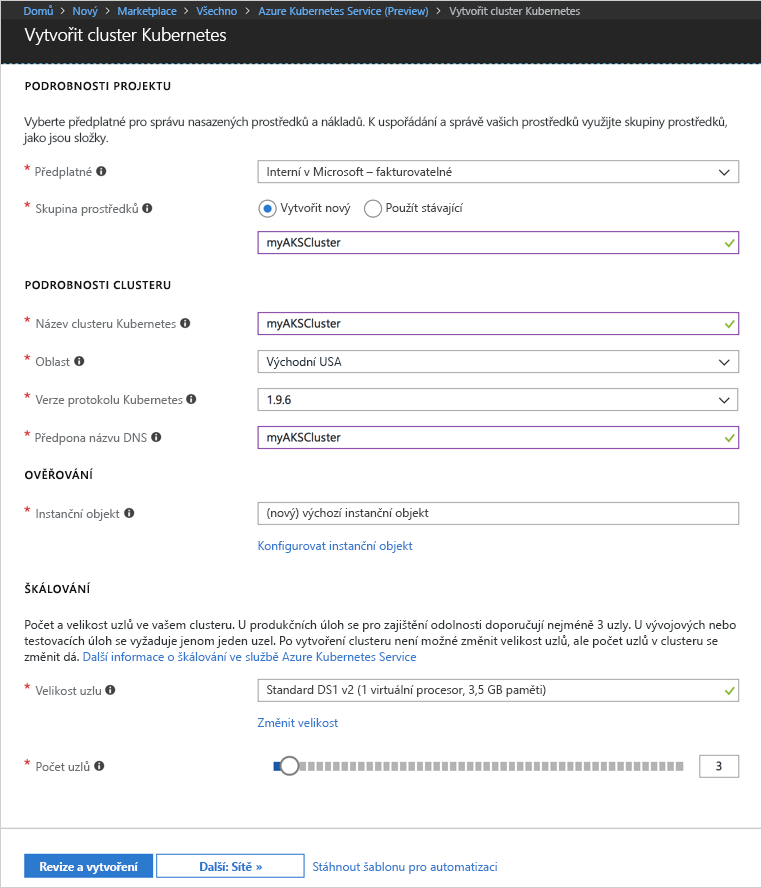
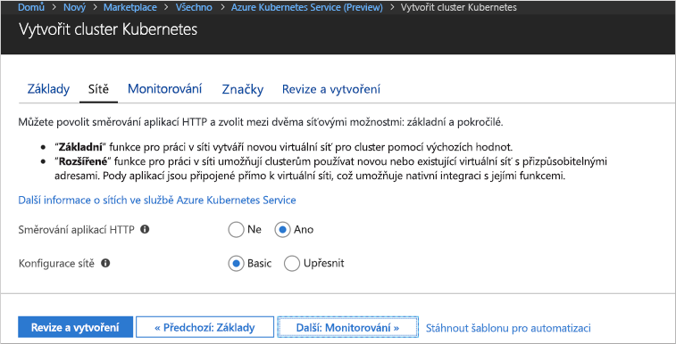
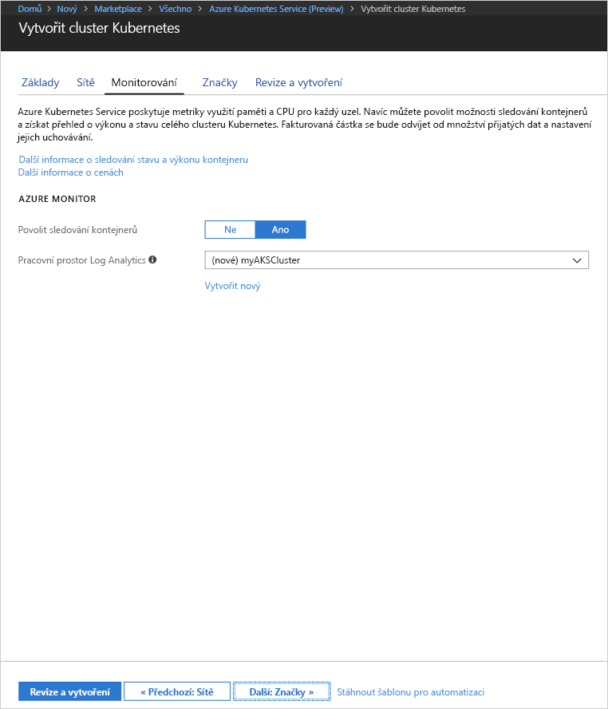
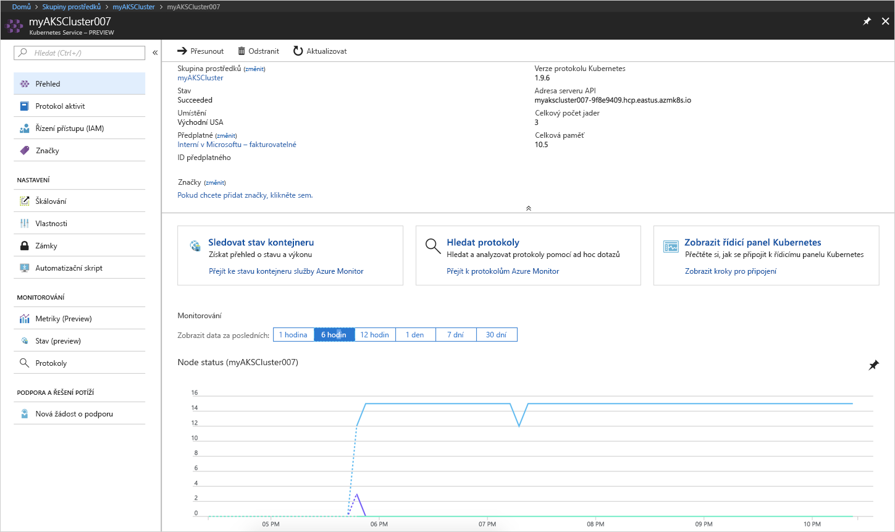
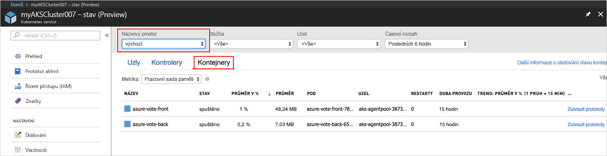
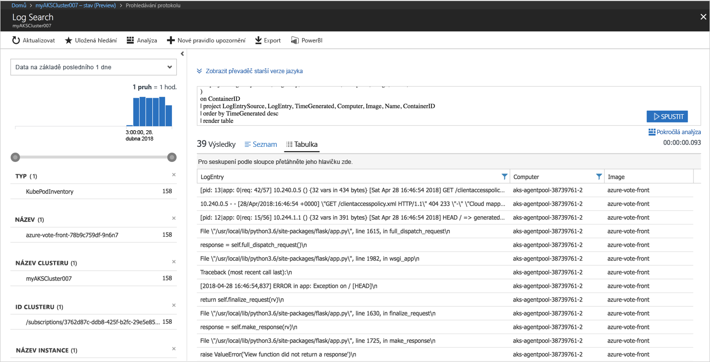

# <a name="quickstart-deploy-an-azure-kubernetes-service-aks-cluster"></a>Rychlý start: Nasazení clusteru Azure Kubernetes Service (AKS)

V tomto rychlém startu nasadíte cluster AKS pomocí portálu Azure. Následně se na tomto clusteru spustí vícekontejnerová aplikace skládající se z front-endu webu a instance Redis. Po dokončení bude aplikace přístupná přes internet.


Tento rychlý start předpokládá základní znalosti konceptů Kubernetes. Podrobné informace o Kubernetes najdete v [dokumentaci ke Kubernetes][kubernetes-documentation].

## <a name="sign-in-to-azure"></a>Přihlášení k Azure

Přihlaste se k webu Azure Portal na adrese http://portal.azure.com.


## <a name="create-aks-cluster"></a>Vytvoření clusteru AKS

Zvolte **Vytvořit prostředek** a vyberte **Služba Kubernetes** > **Vytvořit**.

Pod jednotlivými nadpisy formuláře pro vytvoření clusteru AKS proveďte následující kroky.

- **PODROBNOSTI O PROJEKTU:** Vyberte předplatné Azure a novou nebo existující skupinu prostředků Azure.
- **PODROBNOSTI O CLUSTERU:** Zadejte název, oblast, verzi a předponu názvu DNS pro cluster AKS.
- **OVĚŘOVÁNÍ:** Vytvořte nový instanční objekt nebo použijte existující. Pokud použijete stávající hlavní název služby (SPN), je potřeba zadat ID klienta a tajný klíč SPN.
- **ŠKÁLOVÁNÍ:** Vyberte velikost virtuálního počítače pro uzly AKS. Velikost virtuálního počítače **nejde** změnit po nasazení clusteru AKS. Vyberte také počet uzlů, které se mají do clusteru nasadit. Počet uzlů **jde** upravit po nasazení clusteru.

Jakmile budete hotovi, vyberte **Další: Sítě**.



Nakonfigurujte následující možnosti sítě:

- **Směrování aplikace HTTP** – Nakonfiguruje integrovaný kontroler příchozího přenosu dat tak, aby automaticky vytvořil veřejný název DNS. Další informace o směrování HTTP najdete v tématu [Směrování HTTP a DNS ve službě AKS][http-routing].
- **Konfigurace sítě** – Zvolte základní konfiguraci sítě s využitím pluginu Kubernetes [kubenet][kubenet] nebo pokročilou konfiguraci sítě s využitím [Azure CNI][azure-cni]. Další informace o možnostech sítí najdete v tématu [Přehled sítí AKS][aks-network].

Jakmile budete hotovi, vyberte **Další: Monitorování**.



Při nasazování clusteru AKS můžete nakonfigurovat službu Azure Container Insights tak, monitorovala stav clusteru AKS a podů spuštěných v clusteru. Další informace o monitorování stavu clusteru najdete v tématu [Monitorování stavu služby Azure Kubernetes Service][aks-monitor].

Výběrem možnosti **Ano** povolte monitorování kontejneru a vyberte existující pracovní prostor Log Analytics nebo vytvořte nový.

Vyberte **Zkontrolovat a vytvořit** a po dokončení vyberte **Vytvořit**.



Po krátkém čekání se cluster AKS nasadí a je připravený k použití. Přejděte do skupiny prostředků clusteru AKS, vyberte prostředek AKS a měl by se zobrazit řídicí panel clusteru AKS.



## <a name="connect-to-the-cluster"></a>Připojení ke clusteru

Ke správě clusteru Kubernetes použijte klienta příkazového řádku Kubernetes [kubectl][kubectl]. Ve službě Azure Cloud Shell je předinstalovaný klient kubectl.

Otevřete službu Cloud Shell pomocí tlačítka v pravém horním rohu portálu Azure.


Spusťte příkaz [az aks get-credentials][az-aks-get-credentials], abyste mohli nakonfigurovat klienta kubectl pro připojení k vašemu clusteru Kubernetes.

Zkopírujte následující příkaz a vložte ho do služby Cloud Shell. V případě potřeby změňte název skupiny prostředků a clusteru.

```azurecli-interactive
az aks get-credentials --resource-group myAKSCluster --name myAKSCluster
```

Pokud chcete ověřit připojení ke clusteru, použijte příkaz [kubectl get][kubectl-get], který vrátí seznam uzlů clusteru.

```azurecli-interactive
kubectl get nodes
```

Výstup:

```
NAME                       STATUS    ROLES     AGE       VERSION
aks-agentpool-11482510-0   Ready     agent     9m        v1.9.6
aks-agentpool-11482510-1   Ready     agent     8m        v1.9.6
aks-agentpool-11482510-2   Ready     agent     9m        v1.9.6
```

## <a name="run-the-application"></a>Spuštění aplikace

Soubor manifestu Kubernetes definuje požadovaný stav clusteru, včetně toho, jaké image kontejnerů mají být spuštěné. V tomto příkladu manifest slouží k vytvoření všech objektů potřebných ke spuštění aplikace Azure Vote. Mezi tyto objekty patří dvě [nasazení Kubernetes][kubernetes-deployment], jedno pro front-end aplikace Azure Vote a druhé pro instanci Redis. Vytvoří se také dvě [služby Kubernetes][kubernetes-service], interní služba pro instanci Redis a externí služba pro přístup k aplikaci Azure Vote z internetu.

Vytvořte soubor `azure-vote.yaml` a zkopírujte do něj následující kód YAML. Pokud pracujete ve službě Azure Cloud Shell, vytvořte tento soubor pomocí editoru vi nebo Nano, stejně jako kdybyste pracovali na virtuálním nebo fyzickém systému.

```yaml
apiVersion: apps/v1beta1
kind: Deployment
metadata:
  name: azure-vote-back
spec:
  replicas: 1
  template:
    metadata:
      labels:
        app: azure-vote-back
    spec:
      containers:
      - name: azure-vote-back
        image: redis
        ports:
        - containerPort: 6379
          name: redis
---
apiVersion: v1
kind: Service
metadata:
  name: azure-vote-back
spec:
  ports:
  - port: 6379
  selector:
    app: azure-vote-back
---
apiVersion: apps/v1beta1
kind: Deployment
metadata:
  name: azure-vote-front
spec:
  replicas: 1
  template:
    metadata:
      labels:
        app: azure-vote-front
    spec:
      containers:
      - name: azure-vote-front
        image: microsoft/azure-vote-front:v1
        ports:
        - containerPort: 80
        env:
        - name: REDIS
          value: "azure-vote-back"
---
apiVersion: v1
kind: Service
metadata:
  name: azure-vote-front
spec:
  type: LoadBalancer
  ports:
  - port: 80
  selector:
    app: azure-vote-front
```

Pomocí příkazu [kubectl apply][kubectl-apply] spusťte aplikaci.

```azurecli-interactive
kubectl apply -f azure-vote.yaml
```

Výstup:

```
deployment "azure-vote-back" created
service "azure-vote-back" created
deployment "azure-vote-front" created
service "azure-vote-front" created
```

## <a name="test-the-application"></a>Testování aplikace

Při spuštění aplikace se vytvoří [služba Kubernetes][kubernetes-service], která zveřejní aplikaci na internetu. Dokončení tohoto procesu může trvat několik minut.

Pomocí příkazu [kubectl get service][kubectl-get] s argumentem `--watch` můžete sledovat průběh.

```azurecli-interactive
kubectl get service azure-vote-front --watch
```

Na začátku se bude adresa *EXTERNAL-IP* pro službu *azure-vote-front* zobrazovat ve stavu *Probíhá*.

```
NAME               TYPE           CLUSTER-IP   EXTERNAL-IP   PORT(S)        AGE
azure-vote-front   LoadBalancer   10.0.37.27   <pending>     80:30572/TCP   6s
```

Jakmile se stav adresy *EXTERNAL-IP* změní ze stavu *Probíhá* na hodnotu *IP adresa*, pomocí klávesové zkratky `CTRL-C` zastavte sledovací proces kubectl.

```
azure-vote-front   LoadBalancer   10.0.37.27   52.179.23.131   80:30572/TCP   2m
```

Teď přejděte na externí IP adresu a zobrazte aplikaci Azure Vote.


## <a name="monitor-health-and-logs"></a>Monitorování stavu a protokolů

Pokud jste povolili monitorování Container Insights, na řídicím panelu clusteru AKS jsou k dispozici metriky stavu pro cluster AKS i pody spuštěné v clusteru. Další informace o monitorování stavu clusteru najdete v tématu [Monitorování stavu služby Azure Kubernetes Service][aks-monitor].

Pokud chcete zobrazit aktuální stav, dobu provozu a využití prostředků pro pody Azure Vote, vraťte se k prostředku AKS, vyberte **Monitorovat stav kontejneru**, vyberte **výchozí** obor názvů a pak vyberte **Kontejnery**. Naplnění těchto dat na webu Azure Portal může trvat několik minut.



Pokud chcete zobrazit protokoly pro pod `azure-vote-front`, vyberte odkaz **Zobrazit protokoly**. Tyto protokoly obsahují streamy výstupů stdout a stderr z kontejneru.



## <a name="delete-cluster"></a>Odstranění clusteru

Když už cluster nepotřebujete, odstraňte prostředek clusteru, čímž odstraníte všechny související prostředky. Tuto operaci můžete provést na webu Azure Portal výběrem tlačítka Odstranit na řídicím panelu clusteru AKS. Případně můžete použít příkaz [az aks delete][az-aks-delete] ve službě Cloud Shell.

```azurecli-interactive
az aks delete --resource-group myAKSCluster --name myAKSCluster --no-wait
```

## <a name="get-the-code"></a>Získání kódu

V tomto rychlém startu se k vytvoření nasazení Kubernetes použily předem vytvořené image kontejnerů. Související kód aplikace, soubor Dockerfile a soubor manifestu Kubernetes jsou k dispozici na GitHubu.

[https://github.com/Azure-Samples/azure-voting-app-redis][azure-vote-app]

## <a name="next-steps"></a>Další kroky

V tomto rychlém startu jste nasadili cluster Kubernetes a do něj jste nasadili vícekontejnerovou aplikaci.

Další informace o službě AKS a podrobné vysvětlení kompletního příkladu od kódu až po nasazení najdete v kurzu clusteru Kubernetes.

> [!div class="nextstepaction"]
> [Kurz AKS][aks-tutorial]

<!-- LINKS - external -->
[azure-vote-app]: https://github.com/Azure-Samples/azure-voting-app-redis.git
[azure-cni]: https://github.com/Azure/azure-container-networking/blob/master/docs/cni.md
[kubectl]: https://kubernetes.io/docs/user-guide/kubectl/
[kubectl-apply]: https://kubernetes.io/docs/reference/generated/kubectl/kubectl-commands#apply
[kubectl-get]: https://kubernetes.io/docs/reference/generated/kubectl/kubectl-commands#get
[kubenet]: https://kubernetes.io/docs/concepts/cluster-administration/network-plugins/#kubenet
[kubernetes-deployment]: https://kubernetes.io/docs/concepts/workloads/controllers/deployment/
[kubernetes-documentation]: https://kubernetes.io/docs/home/
[kubernetes-service]: https://kubernetes.io/docs/concepts/services-networking/service/

<!-- LINKS - internal -->
[az-aks-get-credentials]: /cli/azure/aks?view=azure-cli-latest#az_aks_get_credentials
[az-aks-delete]: /cli/azure/aks#az-aks-delete
[aks-monitor]: ../monitoring/monitoring-container-health.md
[aks-network]: ./networking-overview.md
[aks-tutorial]: ./tutorial-kubernetes-prepare-app.md
[http-routing]: ./http-application-routing.md
