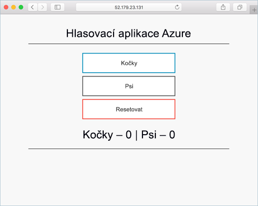
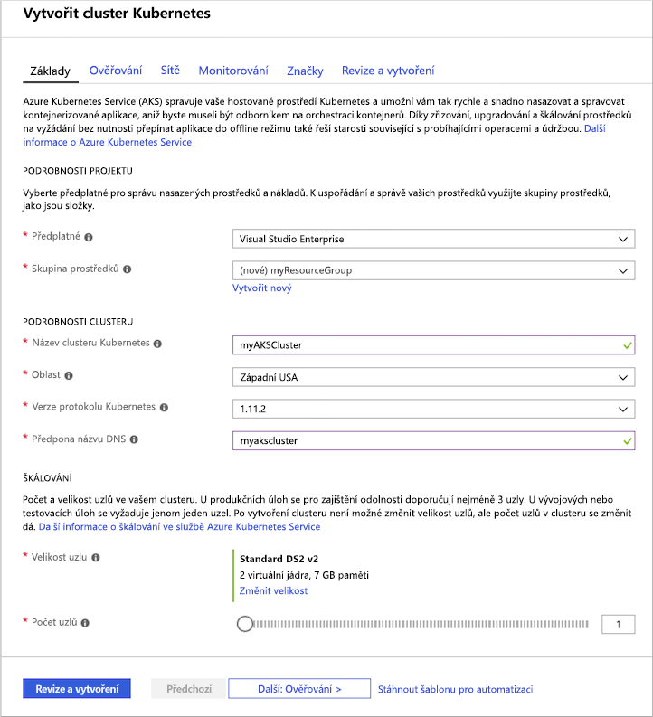
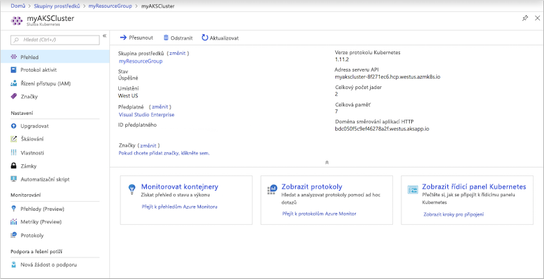
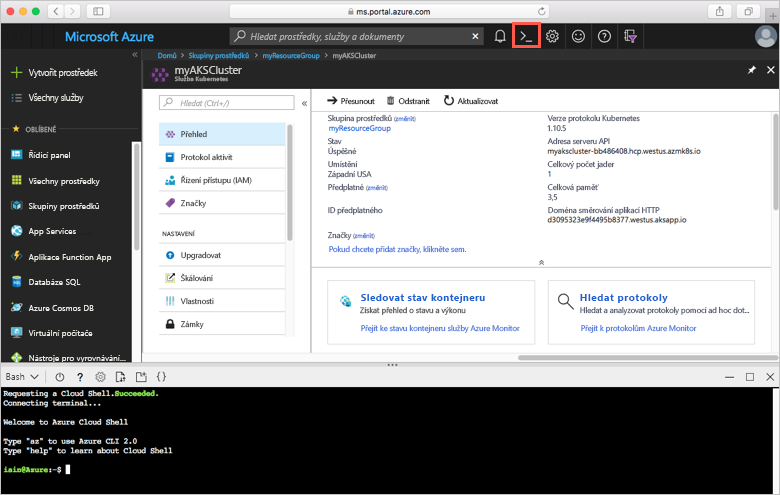
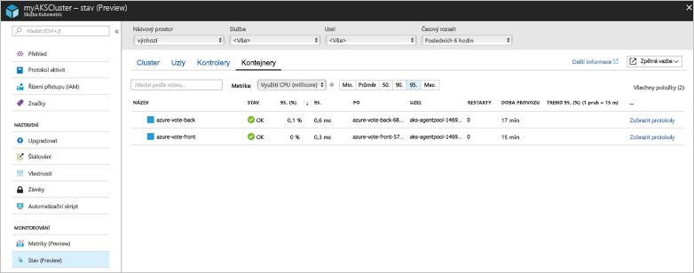
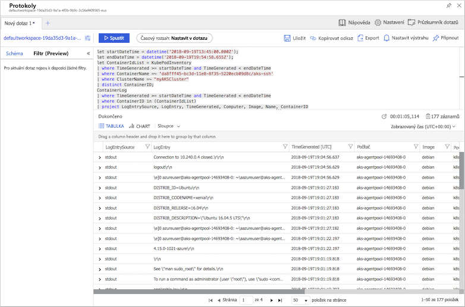

# <a name="quickstart-deploy-an-azure-kubernetes-service-aks-cluster"></a>Rychlý start: Nasaďte cluster Azure Kubernetes Service (AKS)

V tomto rychlém startu nasadíte cluster AKS pomocí portálu Azure. Následně se na tomto clusteru spustí vícekontejnerová aplikace skládající se z front-endu webu a instance Redis. Po dokončení bude aplikace přístupná přes internet.



Tento rychlý start předpokládá základní znalosti konceptů Kubernetes. Podrobné informace o Kubernetes najdete v [dokumentaci ke Kubernetes][kubernetes-documentation].

Pokud ještě nemáte předplatné Azure, vytvořte si [bezplatný účet](https://azure.microsoft.com/free/?WT.mc_id=A261C142F) před tím, než začnete.

## <a name="sign-in-to-azure"></a>Přihlášení k Azure

Přihlaste se k webu Azure Portal na adrese https://portal.azure.com.

## <a name="create-an-aks-cluster"></a>Vytvoření clusteru AKS

V levém horním rohu webu Azure Portal vyberte **Vytvořit prostředek** > **Kubernetes Service**.

Pokud chcete vytvořit cluster AKS, proveďte následující kroky:

1. **Základy:** Nakonfigurujte následující možnosti:
    - *PODROBNOSTI O PROJEKTU*: Vyberte předplatné Azure, pak vyberte nebo vytvořte skupinu prostředků Azure, jako *myResourceGroup*. Zadejte **Název clusteru Kubernetes**, například *myAKSCluster*.
    - *PODROBNOSTI O CLUSTERU*: Vyberte oblast, verze Kubernetes a předpona názvu DNS pro AKS cluster.
    - *ŠKÁLOVÁNÍ*: Vyberte velikost virtuálního počítače pro uzly AKS. Velikost virtuálního počítače **nejde** změnit po nasazení clusteru AKS.
        - Vyberte počet uzlů, které se mají do clusteru nasadit. Pro účely tohoto rychlého startu nastavte **Počet uzlů** na hodnotu *1*. Počet uzlů **jde** upravit po nasazení clusteru.
    
    

    Vyberte **Další: Ověřování** po dokončení.

1. **Ověřování**: Nakonfigurujte následující možnosti:
    - Vytvořte nový instanční objekt nebo *nakonfigurujte* použití existujícího. Pokud použijete stávající hlavní název služby (SPN), je potřeba zadat ID klienta a tajný klíč SPN.
    - Povolte možnost řízení přístupu na základě role (RBAC) v Kubernetes. Tyto ovládací prvky poskytují podrobnější řízení přístupu k prostředkům Kubernetes nasazeným ve vašem clusteru AKS.

    Vyberte **Další: Sítě** po dokončení.

1. **Sítě**: Nakonfigurujte následující možnosti sítě:
    
    - **Směrování aplikace HTTP** – Vyberte **Ano** a nakonfigurujte integrovaný kontroler příchozího přenosu dat tak, aby automaticky vytvořil veřejný název DNS. Další informace o směrování HTTP najdete v tématu [Směrování HTTP a DNS ve službě AKS][http-routing].
    - **Konfigurace sítě** – Vyberte **Základní** konfiguraci sítě s využitím modulu plug-in Kubernetes [kubenet][kubenet] místo pokročilé konfigurace sítě s využitím [Azure CNI][azure-cni]. Další informace o možnostech sítí najdete v tématu [Přehled sítí AKS][aks-network].
    
    Vyberte **Další: Monitorování** po dokončení.

1. Při nasazování clusteru AKS můžete nakonfigurovat službu Azure Monitor pro kontejnery tak, aby monitorovala stav clusteru AKS a podů spuštěných v clusteru. Další informace o monitorování stavu clusteru najdete v tématu [Monitorování stavu služby Azure Kubernetes Service][aks-monitor].

    Výběrem možnosti **Ano** povolte monitorování kontejneru a vyberte existující pracovní prostor Log Analytics nebo vytvořte nový.
    
    Vyberte **Zkontrolovat a vytvořit** a jakmile budete připraveni, vyberte **Vytvořit**.

Vytvoření clusteru AKS a jeho příprava k použití trvá několik minut. Přejděte ke skupině prostředků clusteru AKS, například *myResourceGroup*, a vyberte prostředek AKS, například *myAKSCluster*. Zobrazí se řídicí panel clusteru AKS, podobně jako na následujícím ukázkovém snímku obrazovky:



## <a name="connect-to-the-cluster"></a>Připojení ke clusteru

Ke správě clusteru Kubernetes použijte klienta příkazového řádku Kubernetes [kubectl][kubectl]. Klient `kubectl` je předinstalovaný ve službě Azure Cloud Shell.

Otevřete službu Cloud Shell pomocí tlačítka v pravém horním rohu portálu Azure.



Pomocí příkazu [az aks get-credentials][az-aks-get-credentials] nakonfigurujte klienta `kubectl` pro připojení k vašemu clusteru Kubernetes. Následující příklad získá přihlašovací údaje pro název clusteru *myAKSCluster* ve skupině prostředků *myResourceGroup*:

```azurecli-interactive
az aks get-credentials --resource-group myResourceGroup --name myAKSCluster
```

Pokud chcete ověřit připojení ke clusteru, použijte příkaz [kubectl get][kubectl-get], který vrátí seznam uzlů clusteru.

```azurecli-interactive
kubectl get nodes
```

Následující příklad výstupu ukazuje jeden uzel vytvořený v předchozích krocích. Ujistěte se, že stav uzlu je "Připraveno".

```
NAME                       STATUS    ROLES     AGE       VERSION
aks-agentpool-14693408-0   Ready     agent     10m       v1.11.2
```

## <a name="run-the-application"></a>Spuštění aplikace

Soubor manifestu Kubernetes definuje požadovaný stav clusteru, včetně toho, jaké image kontejnerů mají být spuštěné. V tomto rychlém startu manifest slouží k vytvoření všech objektů potřebných ke spuštění ukázkové aplikace Azure Vote. Mezi tyto objekty patří dvě [nasazení Kubernetes][kubernetes-deployment] – jedno pro front-end aplikace Azure Vote a druhé pro instanci Redis. Vytvoří se také dvě [služby Kubernetes][kubernetes-service] – interní služba pro instanci Redis a externí služba pro přístup k aplikaci Azure Vote z internetu.

> [!TIP]
> V tomto rychlém startu ručně vytvoříte manifest aplikace a nasadíte ho do clusteru AKS. V reálnějších situacích můžete k rychlé iteraci a ladění kódu přímo v clusteru AKS použít [Azure Dev Spaces][azure-dev-spaces]. Dev Spaces můžete používat na různých platformách operačních systémů a v různých vývojových prostředích a spolupracovat s ostatními členy vašeho týmu.

Vytvořte soubor `azure-vote.yaml` a zkopírujte do něj následující kód YAML. Pokud pracujete ve službě Azure Cloud Shell, vytvořte tento soubor pomocí editoru `vi` nebo `Nano`, stejně jako kdybyste pracovali na virtuálním nebo fyzickém systému.

```yaml
apiVersion: apps/v1
kind: Deployment
metadata:
  name: azure-vote-back
spec:
  replicas: 1
  selector:
    matchLabels:
      app: azure-vote-back
  template:
    metadata:
      labels:
        app: azure-vote-back
    spec:
      containers:
      - name: azure-vote-back
        image: redis
        resources:
          requests:
            cpu: 100m
            memory: 128Mi
          limits:
            cpu: 250m
            memory: 256Mi
        ports:
        - containerPort: 6379
          name: redis
---
apiVersion: v1
kind: Service
metadata:
  name: azure-vote-back
spec:
  ports:
  - port: 6379
  selector:
    app: azure-vote-back
---
apiVersion: apps/v1
kind: Deployment
metadata:
  name: azure-vote-front
spec:
  replicas: 1
  selector:
    matchLabels:
      app: azure-vote-front
  template:
    metadata:
      labels:
        app: azure-vote-front
    spec:
      containers:
      - name: azure-vote-front
        image: microsoft/azure-vote-front:v1
        resources:
          requests:
            cpu: 100m
            memory: 128Mi
          limits:
            cpu: 250m
            memory: 256Mi
        ports:
        - containerPort: 80
        env:
        - name: REDIS
          value: "azure-vote-back"
---
apiVersion: v1
kind: Service
metadata:
  name: azure-vote-front
spec:
  type: LoadBalancer
  ports:
  - port: 80
  selector:
    app: azure-vote-front
```

Pomocí příkazu [kubectl apply][kubectl-apply] spusťte aplikaci.

```azurecli-interactive
kubectl apply -f azure-vote.yaml
```

Následující příklad výstupu ukazuje prostředky Kubernetes vytvořené ve vašem clusteru AKS:

```
deployment "azure-vote-back" created
service "azure-vote-back" created
deployment "azure-vote-front" created
service "azure-vote-front" created
```

## <a name="test-the-application"></a>Testování aplikace

Při spuštění aplikace se vytvoří [služba Kubernetes][kubernetes-service], která zveřejní aplikaci na internetu. Dokončení tohoto procesu může trvat několik minut.

Pomocí příkazu [kubectl get service][kubectl-get] s argumentem `--watch` můžete sledovat průběh.

```azurecli-interactive
kubectl get service azure-vote-front --watch
```

Na začátku se bude adresa *EXTERNAL-IP* pro službu *azure-vote-front* zobrazovat ve stavu *Probíhá*.

```
NAME               TYPE           CLUSTER-IP   EXTERNAL-IP   PORT(S)        AGE
azure-vote-front   LoadBalancer   10.0.37.27   <pending>     80:30572/TCP   6s
```

Jakmile se stav adresy *EXTERNAL-IP* změní ze stavu *Probíhá* na hodnotu *IP adresa*, pomocí klávesové zkratky `CTRL-C` zastavte sledovací proces kubectl.

```
azure-vote-front   LoadBalancer   10.0.37.27   52.179.23.131   80:30572/TCP   2m
```

Otevřete webový prohlížeč a přejděte na externí IP adresu vaší služby. Zobrazí se aplikace Azure Vote, jak je znázorněno v následujícím příkladu:


## <a name="monitor-health-and-logs"></a>Monitorování stavu a protokolů

Při vytváření clusteru se povolilo monitorování přehledů o kontejnerech. Tato funkce monitorování poskytuje metriky stavu clusteru AKS i podů spuštěných na tomto clusteru. Další informace o monitorování stavu clusteru najdete v tématu [Monitorování stavu služby Azure Kubernetes Service][aks-monitor].

Naplnění těchto dat na webu Azure Portal může trvat několik minut. Pokud chcete zobrazit aktuální stav, dobu provozu a využití prostředků pro pody Azure Vote, na webu Azure Portal přejděte zpět k prostředku AKS, například *myAKSCluster*. Přístup ke stavu potom získáte následujícím způsobem:

1. V části **Sledování** na levé straně zvolte **Přehledy (Preview)**
1. V horní části zvolte **+ Přidat filtr**
1. Jako vlastnost vyberte *Obor názvů* a potom zvolte *\<Všechny kromě kube-system\>*.
1. Vyberte zobrazení **Kontejnery**.

Zobrazí se kontejnery *azure-vote-back* a *azure-vote-front*, jak ukazuje následující příklad:



Pokud chcete zobrazit protokoly pro pod `azure-vote-front`, vyberte odkaz **Zobrazit protokoly kontejnerů** na pravé straně seznamu kontejnerů. Tyto protokoly obsahují streamy výstupů *stdout* a *stderr* z kontejneru.



## <a name="delete-cluster"></a>Odstranění clusteru

Když už cluster nepotřebujete, odstraňte prostředek clusteru, čímž odstraníte všechny související prostředky. Tuto operaci můžete provést na webu Azure Portal výběrem tlačítka **Odstranit** na řídicím panelu clusteru AKS. Případně můžete použít příkaz [az aks delete][az-aks-delete] ve službě Cloud Shell:

```azurecli-interactive
az aks delete --resource-group myResourceGroup --name myAKSCluster --no-wait
```

> [!NOTE]
> Při odstranění clusteru se neodebere instanční objekt služby Azure Active Directory používaný clusterem AKS. Postup odebrání instančního objektu najdete v tématu věnovaném [aspektům instančního objektu AKS a jeho odstranění][sp-delete].

## <a name="get-the-code"></a>Získání kódu

V tomto rychlém startu se k vytvoření nasazení Kubernetes použily předem vytvořené image kontejnerů. Související kód aplikace, soubor Dockerfile a soubor manifestu Kubernetes jsou k dispozici na GitHubu.

[https://github.com/Azure-Samples/azure-voting-app-redis][azure-vote-app]

## <a name="next-steps"></a>Další postup

V tomto rychlém startu jste nasadili cluster Kubernetes a do něj jste nasadili vícekontejnerovou aplikaci.

Další informace o službě AKS a podrobné vysvětlení kompletního příkladu od kódu až po nasazení najdete v kurzu clusteru Kubernetes.

> [!div class="nextstepaction"]
> [Kurz AKS][aks-tutorial]

<!-- LINKS - external -->
[azure-vote-app]: https://github.com/Azure-Samples/azure-voting-app-redis.git
[azure-cni]: https://github.com/Azure/azure-container-networking/blob/master/docs/cni.md
[kubectl]: https://kubernetes.io/docs/user-guide/kubectl/
[kubectl-apply]: https://kubernetes.io/docs/reference/generated/kubectl/kubectl-commands#apply
[kubectl-get]: https://kubernetes.io/docs/reference/generated/kubectl/kubectl-commands#get
[kubenet]: https://kubernetes.io/docs/concepts/cluster-administration/network-plugins/#kubenet
[kubernetes-deployment]: https://kubernetes.io/docs/concepts/workloads/controllers/deployment/
[kubernetes-documentation]: https://kubernetes.io/docs/home/
[kubernetes-service]: https://kubernetes.io/docs/concepts/services-networking/service/

<!-- LINKS - internal -->
[az-aks-get-credentials]: /cli/azure/aks?view=azure-cli-latest#az-aks-get-credentials
[az-aks-delete]: /cli/azure/aks#az-aks-delete
[aks-monitor]: ../monitoring/monitoring-container-health.md
[aks-network]: ./concepts-network.md
[aks-tutorial]: ./tutorial-kubernetes-prepare-app.md
[http-routing]: ./http-application-routing.md
[sp-delete]: kubernetes-service-principal.md#additional-considerations
[azure-dev-spaces]: https://docs.microsoft.com/azure/dev-spaces/
