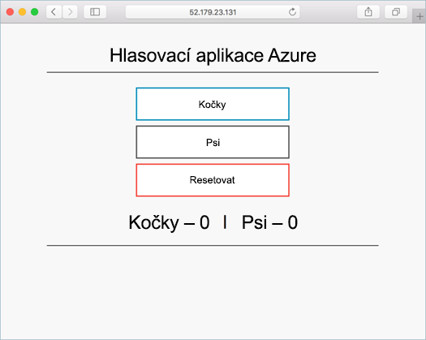

# <a name="tutorial-run-applications-in-azure-kubernetes-service-aks"></a>Kurz: Spouštění aplikací ve službě Azure Kubernetes Service (AKS)

Kubernetes poskytuje distribuovanou platformu pro kontejnerizované aplikace. Můžete sestavovat vlastní aplikace a služby a nasazovat je do clusteru Kubernetes, který zajistí správu jejich dostupnosti a možností připojení. V tomto kurzu, který je čtvrtou částí sedmidílné série, se ukázková aplikace nasadí do clusteru Kubernetes. Získáte informace o těchto tématech:

> [!div class="checklist"]
> * Aktualizace souborů manifestu Kubernetes
> * Spuštění aplikace v Kubernetes
> * Testování aplikace

V následujících kurzech se horizontálně navýší kapacita této aplikace a provede se její aktualizace.

V tomto kurzu se předpokládá základní znalost konceptů Kubernetes. Podrobné informace o Kubernetes najdete v [dokumentaci ke Kubernetes][kubernetes-documentation].

## <a name="before-you-begin"></a>Než začnete

V předchozích kurzech se aplikace zabalila do image kontejneru, tato image se odeslala do Azure Container Registry a vytvořil se cluster Kubernetes.

K dokončení tohoto kurzu potřebujete předem vytvořený soubor manifestu Kubernetes `azure-vote-all-in-one-redis.yaml`. Tento soubor se stáhnul se zdrojovým kódem aplikace v předchozí kurzu. Ověřte, že jste naklonovali úložiště a že jste změnili adresáře na klonované úložiště. Pokud jste tyto kroky neprovedli a chcete si je projít, vraťte se ke [kurzu 1 – Vytváření imagí kontejneru][aks-tutorial-prepare-app].

Tento kurz vyžaduje použití Azure CLI verze 2.0.44 nebo novější. Verzi zjistíte spuštěním příkazu `az --version`. Pokud potřebujete instalaci nebo upgrade, přečtěte si téma [Instalace Azure CLI][azure-cli-install].

## <a name="update-the-manifest-file"></a>Aktualizace souboru manifestu

V těchto kurzech je image kontejneru pro ukázkovou aplikaci uložená v instanci služby Azure Container Registry (ACR). Pokud chcete aplikaci nasadit, musíte v souboru manifestu Kubernetes aktualizovat název image tak, aby zahrnoval název přihlašovacího serveru ACR.

Název přihlašovacího serveru ACR získáte pomocí příkazu [az acr list][az-acr-list] následujícím způsobem:

```azurecli
az acr list --resource-group myResourceGroup --query "[].{acrLoginServer:loginServer}" --output table
```

V ukázkovém souboru manifestu z úložiště git naklonovaného v prvním kurzu se jako název přihlašovacího serveru používá *microsoft*. Otevřete tento soubor manifestu v textovém editoru, jako je například `vi`:

```console
vi azure-vote-all-in-one-redis.yaml
```

Nahraďte *microsoft* názvem vašeho přihlašovacího serveru ACR. Název image najdete na řádku 47 souboru manifestu. Následující příklad ukazuje výchozí název image:

```yaml
containers:
- name: azure-vote-front
  image: microsoft/azure-vote-front:v1
```

Zadejte vlastní název přihlašovacího serveru ACR, aby váš soubor manifestu vypadal jako v následujícím příkladu:

```yaml
containers:
- name: azure-vote-front
  image: <acrName>.azurecr.io/azure-vote-front:v1
```

Uložte soubor a zavřete ho.

## <a name="deploy-the-application"></a>Nasazení aplikace

Aplikaci nasadíte pomocí příkazu [kubectl apply][kubectl-apply]. Tento příkaz analyzuje soubor manifestu a vytvoří definované objekty Kubernetes. Zadejte ukázkový soubor manifestu, jak je znázorněno v následujícím příkladu:

```console
kubectl apply -f azure-vote-all-in-one-redis.yaml
```

V clusteru se vytvoří objekty Kubernetes, jak je znázorněno v následujícím příkladu:

```
$ kubectl apply -f azure-vote-all-in-one-redis.yaml

deployment "azure-vote-back" created
service "azure-vote-back" created
deployment "azure-vote-front" created
service "azure-vote-front" created
```

## <a name="test-the-application"></a>Testování aplikace

Vytvoří se [služba Kubernetes][kubernetes-service], která zveřejní aplikaci na internetu. Tento proces může trvat několik minut. Průběh můžete sledovat pomocí příkazu [kubectl get service][kubectl-get] s argumentem `--watch`:

```console
kubectl get service azure-vote-front --watch
```

Na začátku se bude adresa *EXTERNAL-IP* pro službu *azure-vote-front* zobrazovat ve stavu *Probíhá*, jak je znázorněno v následujícím příkladu:

```
azure-vote-front   10.0.34.242   <pending>     80:30676/TCP   7s
```

Jakmile se stav adresy *EXTERNAL-IP* změní ze stavu *Probíhá* na skutečnou veřejnou IP adresu, pomocí klávesové zkratky `CTRL-C` zastavte sledovací proces kubectl. Následující příklad ukazuje, že je teď přiřazená veřejná IP adresa:

```
azure-vote-front   10.0.34.242   52.179.23.131   80:30676/TCP   2m
```

Pokud chcete zobrazit aplikaci v akci, otevřete webový prohlížeč a přejděte na externí IP adresu.



Pokud se aplikace nenačetla, může být důvodem problém s ověřením v registru imagí. Stav vašich kontejnerů můžete zobrazit pomocí příkazu `kubectl get pods`. Pokud není možné načíst image kontejneru, přečtěte si o [povolení přístupu ke službě Container Registry pomocí tajného klíče Kubernetes](https://docs.microsoft.com/azure/container-registry/container-registry-auth-aks#access-with-kubernetes-secret).

## <a name="next-steps"></a>Další kroky

V tomto kurzu se aplikace Azure Vote nasadila do clusteru Kubernetes ve službě AKS. Naučili jste se tyto postupy:

> [!div class="checklist"]
> * Aktualizace souborů manifestu Kubernetes
> * Spuštění aplikace v Kubernetes
> * Testování aplikace

V dalším kurzu se dozvíte, jak škálovat aplikaci Kubernetes a základní infrastrukturu Kubernetes.

> [!div class="nextstepaction"]
> [Škálování aplikace a infrastruktury Kubernetes][aks-tutorial-scale]

<!-- LINKS - external -->
[kubectl-apply]: https://kubernetes.io/docs/reference/generated/kubectl/kubectl-commands#apply
[kubectl-create]: https://kubernetes.io/docs/reference/generated/kubectl/kubectl-commands#create
[kubectl-get]: https://kubernetes.io/docs/reference/generated/kubectl/kubectl-commands#get
[kubernetes-documentation]: https://kubernetes.io/docs/home/
[kubernetes-service]: https://kubernetes.io/docs/concepts/services-networking/service/

<!-- LINKS - internal -->
[aks-tutorial-prepare-app]: ./tutorial-kubernetes-prepare-app.md
[aks-tutorial-scale]: ./tutorial-kubernetes-scale.md
[az-acr-list]: /cli/azure/acr#list
[azure-cli-install]: /cli/azure/install-azure-cli
